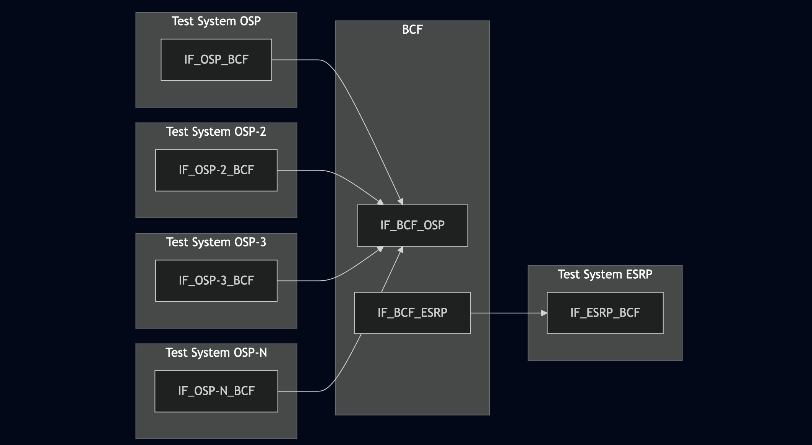

# Test Description: TD_BCF_002
## Overview
### Summary
Calls priority handling


### Description
This test checks handling of call priority by O-BCF. For situation when queue of lower priority calls is waiting for 
service and high priority calls comes, then it should be handled earlier


### SIP transport types
Test can be performed with 2 different SIP transport types. Steps describing actions for specific one are marked as following:
- (TLS transport) - used by default inside ESInet on production environment
- (TCP transport) - used in lab for testing purposes only if default TLS is not possible


### References
* Requirements : RQ_BCF_004
* Test Case    : 

### Requirements
IXIT config file for BCF

## Configuration
### Implementation Under Test Interface Connections
<!-- Identify each of the FEs that are part of the configuration and how they are connected -->
* Test System Sender
  * IF_SENDER_FE - connected to input interface of FE for SIP packets
* Functional Element
  * IF_FE_SENDER - connected to IF_SENDER_FE
  * IF_FE_RECEIVER - connected to IF_RECEIVER_FE (if FE routes SIP packets further)


### Test System Interfaces
<!-- Identify each of the test system interfaces and whether it will be in active or monitor mode -->
* Test System OSP
  * IF_OSP_BCF - Active
* Test System OSP-N
  * IF_OSP-N_BCF - Active
* BCF
  * IF_BCF_OSP-N - Active
  * IF_BCF_ESRP - Active
* Test System ESRP
  * IF_ESRP_BCF - Active

 
### Connectivity Diagram
<!--
https://mermaid.live/edit#pako:eNqVk99PwjAQx_-V5Z43wtauq33wQZTERJEwn8wSUlnZFtlKui6KhP_dlgHyIy7Yp7vv9z7t9ZJbw0ymAhjMF_JzlnOlnadJUjnmPA6nL_F4ejcYet6tSUxghWPTC7pt1G2P_rZt_hBPxq1rIyu1dt28Z4ovc-dV1NqJV7UWpXOAT1tvNVGl3agXnMPt167F0QWO_oOPLvBRF36wjoZ1_v_9AK9p4bduB5_O28DgQqaKFJhWjXChFKrkNoW1LUlA56IUCTATplx9JJBUG8MsefUmZbnHlGyyHNicL2qTNcuUa3FfcNNQeVCVeU2ogWwqDYzi_vYSYGv4Aub7tOf3byhCIaJRiDF2YWXlfi_yI-qTKCARDsONC9_bZ40e0oBQEmKECSbEd4E3WsararZvSqSFluq53YLtMmx-AKwW5NE
-->


## Pre-Test Conditions
### Test System OSP
* Interfaces are connected to network
* Interfaces have IP addresses assigned by DHCP
* Device is active
* No active calls
* (TLS transport) Test System has it's own certificate signed by PCA
* Installed SIPp by following steps from documentation[^1]
* Prepared following XML scenario file:
  > SIP_INVITE_EMERGENCY_SINGLE_USERS_FROM_CSV.xml
  > 50_USERS.csv

### Test System ESRP
* Interfaces are connected to network
* Interfaces have IP addresses assigned by DHCP
* Device is active
* No active calls
* (TLS transport) Test System has it's own certificate signed by PCA
* Installed SIPp by following steps from documentation[^1]
* Preapared SIP TLS certificate and private key files used to encrypt SIP packets within ESInet
* Prepared following XML file:
  > Scenarios/Single_message/SIP_INVITE_RECEIVE.xml
* Installed Wireshark[^2]
* Wireshark configured to decode SIP over TLS packets[^3]

## Test Sequence
### Test Preamble
#### Test System OSP
* Install SIPp by following steps from documentation[^1]
* Copy following XML scenario files to local storage:
  ```
  SIP_INVITE_EMERGENCY_SINGLE_USERS_FROM_CSV.xml
  50_USERS.csv
  49_USERS_AND_1_HIGH_PRIORITY.csv
  ```
* Install Wireshark[^2]
* (TLS transport) Copy to local storage PCA-signed TLS certificate and private key files:
  ```
  cacert.pem
  cakey.pem
  ```
* (TLS transport) Copy to local storage TLS certificate and private key files used by FE:
  ```
  FE-cacert.pem
  FE-cakey.pem
  ```
* (TLS transport) Configure Wireshark to decode SIP over TLS packets from Test System and FE as well[^3]
* Using Wireshark on 'Test System' start packet tracing on IF_SENDER_FE interface - run following filter:
   * (TLS transport)
     > ip.addr == IF_SENDER_FE_IP_ADDRESS and tls
   * (TCP transport)
     > ip.addr == IF_SENDER_FE_IP_ADDRESS and sip

#### Test System ESRP
* Install SIPp by following steps from documentation[^1]
* Copy following XML scenario files to local storage:
  ```
  SIP_INVITE_RECEIVE.xml
  ```
* Install Wireshark[^2]
* (TLS transport) Copy to local storage PCA-signed TLS certificate and private key files:
  ```
  cacert.pem
  cakey.pem
  ```
* (TLS transport) Copy to local storage TLS certificate and private key files used by FE:
  ```
  FE-cacert.pem
  FE-cakey.pem
  ```
* (TLS transport) Configure Wireshark to decode SIP over TLS packets from Test System and FE as well[^3]
* Using Wireshark on 'Test System' start packet tracing on IF_RECEIVER_FE interface - run following filter:
   * (TLS transport)
     > ip.addr == IF_RECEIVER_FE_IP_ADDRESS and tls
   * (TCP transport)
     > ip.addr == IF_RECEIVER_FE_IP_ADDRESS and sip
* Prepare Test System to receive SIP INVITE, run SIPp scenario:
   * (TLS transport)
     > sudo sipp -t l1 -sf SIP_INVITE_RECEIVE.xml -i IF_RECEIVER_FE_IP_ADDRESS:5061
   * (TCP transport)
     > sudo sipp -t t1 -sf SIP_INVITE_RECEIVE.xml -i IF_RECEIVER_FE_IP_ADDRESS:5060


### Test Body
#### Variations
1. 50_USERS.csv
2. 49_USERS_AND_1_HIGH_PRIORITY.csv

#### Stimulus
Send SIP packet to FE using scenario file for tested variation - run following SIPp command on Test System SENDER, example:
* (TCP transport)
 ```
 sudo sipp -t t1 -sf SIP_INVITE_EMERGENCY_SINGLE_USERS_FROM_CSV.xml -inf 50_USERS.csv IF_SENDER_FE_IP_ADDRESS:5060
 ```
* (TLS transport)
 ```
 sudo sipp -t l1 -sf SIP_INVITE_EMERGENCY_SINGLE_USERS_FROM_CSV.xml -inf 50_USERS.csv IF_SENDER_FE_IP_ADDRESS:5060
 ```

#### Response
Variation 1
* verify if SIP INVITE sent from FE to next hop is first from user:
  > 'sender00'

Variation 2
* verify if SIP INVITE sent from FE to next hop is first from user:
  > 'sender49'


VERDICT:
* PASSED - if all checks passed for variation
* FAILED - all other cases

### Test Postamble
#### Test System OSP
* stop Sipp process (if still running)
* archive all logs generated
* stop Wireshark (if still running)
* remove all scenario files
* disconnect interfaces from ESRP
* (TLS transport) remove certificates

#### Test System ESRP
* stop Sipp process (if still running)
* archive all logs generated
* stop Wireshark (if still running)
* remove all scenario files
* disconnect interfaces from ESRP
* (TLS transport) remove certificates


## Post-Test Conditions 
### Test System OSP
* Test tools stopped
* interfaces disconnected from FE

### BCF
* device connected back to default
* device in normal operating state

### Test System ESRP
* Test tools stopped
* interfaces disconnected from FE

## Sequence Diagram
[](https://mermaid.live/edit#pako:eNptkLFqAzEQRH9l2TanH1BhCMSBK2xCzqQIaoS0PgufVs5KChjjf4_unBAX7naWNwMzF3TJE2pUShl2ifdh1IYBYhBJ8uxKkqxhb6dMhhco01cldvQS7Cg2zjDAjnKB4ZwLRRiIPYlarZ6G_g1eK7sSEtsJ1hNF4qJh_vfbj363vrkfc6pF3Oe-k6PwTXLvxw4jSbTBtw6XOc1gOTS7Qd1Ob-Vo0PC1cbaWNJzZoS5SqcN68rb8tUC9VOzwZPkzpX9NPrQJNreRlq06lFTHwy9x_QFAj2xl)
## Comments

Version:  010.3d.5.1.1

Date:     20251013

## Footnotes
[^1]: SIPp - tool for SIP packet simulations. Official documentation: https://sipp.sourceforge.net/doc/reference.html#Getting+SIPp
[^2]: Wireshark - tool for packet tracing and anaylisis. Official website: https://www.wireshark.org/download.html
[^3]: Wireshark configuration to decrypt SIP over TLS packets: https://www.zoiper.com/en/support/home/article/162/How%20to%20decode%20SIP%20over%20TLS%20with%20Wireshark%20and%20Decrypting%20SDES%20Protected%20SRTP%20Stream

