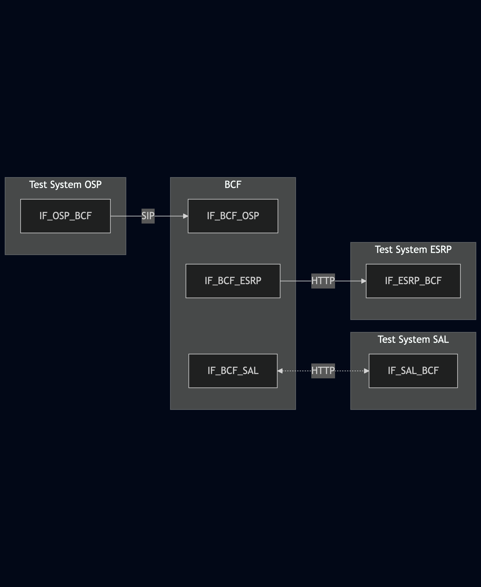

# Test Description: TD_BCF_002
## Overview
### Summary
Discrepancy Reporting by BCF on incorrect SIP message from OSP

### Description
This test checks Discrepancy Report sent by BCF when incorrect SIP message is received from OSP

### SIP and HTTP transport types
Test can be performed with 2 different SIP and HTTP transport types. Steps describing actions for specific one are marked as following:
- (TLS transport) - used by default inside ESInet on production environment
- (TCP transport) - used in lab for testing purposes only if default TLS is not possible

### References
* Requirements : RQ_BCF_009
* Test Case    : TC_BCF_002

### Requirements
IXIT config file for BCF

## Configuration
### Implementation Under Test Interface Connections
<!-- Identify each of the FEs that are part of the configuration and how they are connected -->
* Test System OSP
  * IF_OSP_BCF - connected to BCF IF_BCF_OSP
* BCF
  * IF_BCF_OSP - connected to Test System IF_OSP_BCF
  * IF_BCF_ESRP - connected to Test System IF_ESRP_BCF

* Test System ESRP
  * IF_ESRP_BCF - connected to IF_BCF_ESRP

### Test System Interfaces
<!-- Identify each of the test system interfaces and whether it will be in active or monitor mode -->
* Test System OSP
  * IF_OSP_BCF - Active
* BCF
  * IF_BCF_OSP - Active
  * IF_BCF_ESRP - Monitor
* Test System ESRP
  * IF_ESRP_BCF - Monitor

 
### Connectivity Diagram
<!--
[](https://mermaid.live/edit#pako:eNp9Um1rgzAY_CvyfFbxrb6EMdi6lRU6VqqfhlAyTVVWjcTI1rX970ssujqh-ZS73D13CTlCQlMCCHZ7-pXkmHFltYkrRazlYvsWrreP84Wm3Z_C5fokGIEkOygkfg43ayl5iaJOI7E8GInCh9Wdpl-pBPEnatqPjOE6VyLScCU8NJyUypAzbnPhSJXesIrhI-sobGodjq4K_0_vbzohh6zblSbe8TMJM6iQsSIFxFlLVCgJK7GEcJSSGHhOShIDEtsUs88Y4uosPDWu3iktexujbZYD2uF9I1Bbp5iTpwKLQuXAMpFG2Jy2FQfkBHY3BNARviXUTcN1XN9zZ45he95MhQMg39Y90zYD37cC1w0s86zCTxdr6L5vOELseIFhuV7gqIBbTsNDlfSlSFpwyl4vX637cedfft25qA)
-->




## Pre-Test Conditions

### Test System OSP
* Interfaces are connected to network
* Interfaces have IP addresses assigned by DHCP
* Device is active
* No active calls

### Test System SAL
* Interfaces are connected to network
* Interfaces have IP addresses assigned by DHCP
* Device is active

### BCF
* Interfaces are connected to network
* Interfaces have IP addresses assigned by DHCP
* Default configuration is loaded
* Device is initialized with steps from IXIT config file
* Device is active
* Device is in normal operating state
* No active calls

### Test System ESRP
* Interfaces are connected to network
* Interfaces have IP addresses assigned by DHCP
* Device is active


## Test Sequence
### Test Preamble
#### Test System OSP
* Install SIPp by following steps from documentation[^2]
* Copy following XML scenario files to local storage:
  ```
  SIP_INVITE_from_OSP_incorrect_1.xml
  ```
* (TLS transport) Copy to local storage SIP TLS certificate and private key files used to decrypt SIP packets within ESInet:
  > cacert.pem
  > cakey.pem

#### Test System SAL
* Install Netcat (NC)[^1]
* Copy following JSON files to local storage:
  ```
  SAL_response_DR_server_ESRP_v010.3f.4.0.1.json
  ```
* Edit a JSON file to use addresses of Test System ESRP
* (TLS transport) Copy to local storage SIP TLS certificate and private key files used to decrypt SIP packets within ESInet:
  > cacert.pem
  > cakey.pem

#### BCF
* Configure default Service/Agency Locator server server to 'Test System SAL'
* Reload configuration (or reboot device)

#### Test System ESRP
* Install SIPp by following steps from documentation[^2]
* Install Netcat (NC)[^1]
* Install Wireshark[^3]
* (TLS transport) Copy to local storage SIP TLS certificate and private key files used to decrypt SIP packets within ESInet:
  > cacert.pem
  > cakey.pem
* (TLS transport) Configure Wireshark to decode SIP over TLS packets[^4]
* On 'Test System ESRP' Start simple HTTP server basing on netcat. Used to receive HTTP request and respond with 201 code
   * (TLS transport)
     > echo -e 'HTTP/1.1 201 Discrepancy Resolution successfully created\r\nContent-Length: 0\r\n' | nc -lp 443
   * (TCP transport)
     > echo -e 'HTTP/1.1 201 Discrepancy Resolution successfully created\r\nContent-Length: 0\r\n' | nc -lp 80

* Using Wireshark on 'Test System ESRP' start packet tracing on IF_ESRP_BCF interface - run following filter:
   * (TLS transport)
     > ip.addr == IF_ESRP_BCF_IP_ADDRESS and tls
   * (TCP transport)
     > ip.addr == IF_ESRP_BCF_IP_ADDRESS and http


### Test Body

#### Stimulus
Send SIP packet to BCF - run SIPp command with scenario file on Test System OSP, example:
* (TCP transport)
  ```
  sudo sipp -t t1 -sf SIP_INVITE_from_OSP_incorrect_1.xml IF_OSP_BCF_IPv4:5060
  ```
* (TLS transport)
  ```
  sudo sipp -t l1 -sf SIP_INVITE_from_OSP_incorrect_1.xml IF_OSP_BCF_IPv4:5061
  ```

#### Response
* Using Wireshark open Discrepancy Report (HTTP packet) received from BCF on IF_ESRP_BCF for verification, following header fields and values should be included in JSON message:
  ```
  "resolutionUri": "http://TEST_SYSTEM_OSP_ADDRESS/Resolutions"
  "reportType": "OriginatingService"
  "discrepancyReportSubmittalTimeStamp": "MESSAGE_TIMESTAMP"
  "discrepancyReportId": "REPORT_ID"
  "reportingAgencyName": "TEST_SYSTEM_OSP_FQDN_ADDRESS"
  "reportingContactJcard": "TEST_SYSTEM_OSP_JCARD"
  "problemService": "OriginatingService"
  "problemSeverity": "Moderate"
  "problemComments": "SIP_INVITE_SENT_FROM_TEST_SYSTEM_OSP"
  "problem": "BadSIP"
  "callHeader": "TO_HEADER_OF_SIP_INVITE_SENT"
  ```


VERDICT:
* PASSED - if all checks passed for variation
* INCONCLUSIVE - other cases

**TEST CANNOT BE FAILED !**
**This test is based on requirement which is SHOULD - if any of steps has failed, then final verdict cannot be marked as failed!**


### Test Postamble
#### Test System OSP
* stop all SIPp processes (if still running)
* archive all logs generated
* remove all SIPp scenarios
* disconnect interfaces from BCF
* (TLS transport) remove certificates

#### Test System SAL
* disconnect interfaces from BCF
* (TLS transport) remove certificates

#### BCF
* disconnect IF_BCF_OSP
* disconnect IF_BCF_ESRP
* disconnect IF_BCF_SAL
* reconnect interfaces back to default

#### Test System ESRP
* stop all SIPp processes (if still running)
* stop Wireshark (if still running)
* archive traced packets in Wireshark
* disconnect interfaces from BCF
* (TLS transport) remove certificates


## Post-Test Conditions
### Test System OSP
* Test tools stopped
* interfaces disconnected from BCF

### Test System SAL
* Test tools stopped
* interfaces disconnected from BCF

### BCF
* device connected back to default
* device in normal operating state

### Test System ESRP
* Test tools stopped
* interfaces disconnected from CF

## Sequence Diagram
<!--
[](https://mermaid.live/edit#pako:eNplkV1vgjAUhv_KybnaIhhA5KMXJk7d5j6EWLKLpTcEqpKN1pWSzBn_-wA_tmx37TnPedqcd4-ZzDkSNE2TiUyKVbEmTACUhVJSjTMtVUVglb5XnIkOqvhHzUXGp0W6VmnZwgAJrzTQXaV5CRGNzdGodzO5JUDnMcwXL_NkduSaotk2f_N0_ETgPkliuJsl_3VN27z4OsyxLIgeoQcPNFr8eP9oZ3QZnwbiiCYnHK6mS1jyrVT6mgk0cK2KHIlWNTew5KpM2yvuWy1DveElZ0iaY56qN4ZMHJqZbSpepSzPY0rW6w2SbkkG1ts81eftXKqKi5yriayFRuK4YSdBssdPJG7Yty3P9QLfG7rWwPeHBu6QBIO-bw_sMAic0PNCxz4Y-NU9a_WDwHIb2PVDy_H80DUwrbWkO5GdP8Xzosnu-ZhuF_LhG2RxlDc)
-->


## Comments

Version:  010.3d.4.2.6

Date:     20250828


## Footnotes
[^1]: Netcat for Linux https://linux.die.net/man/1/nc
[^2]: SIPp - tool for SIP packet simulations. Official documentation: https://sipp.sourceforge.net/doc/reference.html#Getting+SIPp
[^3]: Wireshark - tool for packet tracing and anaylisis. Official website: https://www.wireshark.org/download.html
[^4]: Wireshark configuration to decrypt SIP over TLS packets: https://www.zoiper.com/en/support/home/article/162/How%20to%20decode%20SIP%20over%20TLS%20with%20Wireshark%20and%20Decrypting%20SDES%20Protected%20SRTP%20Stream
