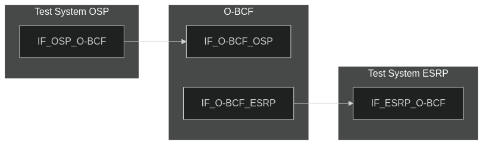
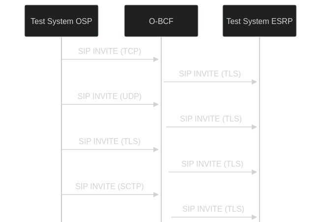

# Test Description: TD_BCF_003
## Overview
### Summary
SIP transport protocols support on O-BCF

### Description
This test checks if O-BCF support following SIP transport protocols for packets incoming from external sources:
* TCP
* UDP
* TLS-over-TCP
* SCTP

Test also includes:
* Check if protocols are selectable for each BCF SBC interface to external systems
* Check if BCF routes SIP packets inside ESInet with TLS transport
* Check if SIP packets sent towards ESInet are TLS with AES-256 or better

### References
* Requirements : RQ_BCF_031, RQ_BCF_032, RQ_BCF_036
* Test Case    : 

### Requirements
IXIT config file for BCF

## Configuration
### Implementation Under Test Interface Connections
<!-- Identify each of the FEs that are part of the configuration and how they are connected -->
* O-BCF
  * IF_O-BCF_OSP - connected to Test System IF_OSP_O-BCF
  * IF_O-BCF_ESRP - connected to Test System IF_ESRP_O-BCF
* Test System (OSP)
  * IF_OSP_O-BCF - connected to O-BCF IF_O-BCF_OSP
* Test System (ESRP)
  * IF_ESRP_O-BCF - connected to IF_O-BCF_ESRP

### Test System Interfaces
<!-- Identify each of the test system interfaces and whether it will be in active or monitor mode -->
* Test System (OSP)
  * IF_OSP_O-BCF - Active
* O-BCF
  * IF_O-BCF_OSP - Active
  * IF_O-BCF_ESRP - Monitor
* Test System (ESRP)
  * IF_ESRP_O-BCF - Monitor


### Connectivity Diagram
<!--
[](https://mermaid.live/edit#pako:eNp1UVtPgzAU_ivkPANpx6WjDz44XWKi2TJ8MiRLhQ6Ig5JSokj47xZQNjH26fTrdzmnp4NYJBwonM7iPc6YVMbjISoNfR62x124P-6s283Wsm6G61AO4IUwIvfhYT8xhmoCJ0rdvKaSVZnxzGtlhG2teGHMBsuUCeVlshBfPf7K_WM0d_Of03UbF963fNm8loMJBZcFyxP9Rd0AR6AyXvAIqC4TJt8iiMpe81ijRNiWMVAlG25CUyVM8buc6eQC6Imda41WrHwRovgh8SRXQj5NKxg3MVKAdvABFGPbXa_wGiGMAxKsnMCEFqiDkL3GAcIOcX0PI9yb8DmaYhs7fkAIIr7nINfzPROkaNJszk_lMMoULvWAXG5EUyotJf0XIL2Y8g)
-->




## Pre-Test Conditions

### Test System OSP
* Interfaces are connected to network
* Interfaces have IP addresses assigned by DHCP
* Device is active
* No active calls

### O-BCF
* Interfaces are connected to network
* Interfaces have IP addresses assigned by DHCP
* Default configuration is loaded
* Device is initialized with steps from IXIT config file
* Device is active
* Device is in normal operating state
* No active calls

### Test System ESRP
* Interfaces are connected to network
* Interfaces have IP addresses assigned by DHCP
* Device is active
* No active calls


## Test Sequence
### Test Preamble
### Test System OSP
<!-- Where FE# is the FE abbreviation (LIS, BCF, ESRP, ECRF, ...) -->
* Install SIPp by following steps from documentation[^1]
* Copy following XML scenario files to local storage:
  ```
  SIP_INVITE_FROM_OSP.xml
  ```
* Copy to local storage SIP TLS certificate and private key files:
  ```
  cacert.pem
  cakey.pem
  ```
* Copy to local storage script for sending example SIP INVITE via SCTP:
```
send_SIP_INVITE_via_SCTP.py
```
* edit script file to configure O-BCF target IP address and port
* install following dependencies for the script:
```
python3
pysctp (python lib)
libsctp-dev
libsctp1
lksctp-tools
```

#### Test System ESRP
* Install SIPp by following steps from documentation[^1]
* Copy following XML scenario file to local storage:
  ```
  SIP_INVITE_RECEIVE.xml
  ```
* Install Wireshark[^2]
* Copy to local storage SIP TLS certificate and private key files:
  ```
  cacert.pem
  cakey.pem
  ```
* Configure Wireshark to decode SIP over TLS packets[^3]
* Using Wireshark on 'Test System ESRP' start packet tracing on IF_ESRP_O-BCF interface - run following filter:
     * (TLS transport)
       > ip.addr == IF_ESRP_O-BCF_IP_ADDRESS and tls
     * (TCP transport)
       > ip.addr == IF_ESRP_O-BCF_IP_ADDRESS and sip
* Prepare 'Test System ESRP' to receive SIP message - run SIPp tool with one of following commands:
     * (TCP transport)
       ```
       sudo sipp -t t1 -sf SIP_INVITE_RECEIVE.xml -i IF_ESRP_O-BCF_IP_ADDRESS:5061 -trace_logs -trace_msg -timeout 10 -max_recv_loops 1
       ```
     * (TLS transport)
       ```
       sudo sipp -t l1 -sf SIP_INVITE_RECEIVE.xml -i IF_ESRP_O-BCF_IPv4:5060 -trace_logs -trace_msg -timeout 10 -max_recv_loops 1
       ```


### Test Body
#### Variations
1. UDP ('-t u1' param for SIPp)
2. TCP ('-t t1' param for SIPp)
3. TLS ('-t l1' param for SIPp + files cacert.pem, cakey.pem)
4. SCTP (use send_SIP_INVITE_via_SCTP.py)

#### Stimulus

Variations 1-2:

Send SIP packet to O-BCF - run following SIPp command on Test System OSP, example for Variation 1:

  ```
  sudo sipp -t u1 -sf SIP_INVITE_from_OSP.xml IF_O-BCF_OSP:5060
  ```

Variation 3:

Send SIP packet to O-BCF - run following SIPp command on Test System OSP, example for Variation 1:

  ```
  sudo sipp -t l1 -tls_cert cacert.pem -tls_key cakey.pem -sf SIP_INVITE_from_OSP.xml IF_O-BCF_OSP:5060
  ```


Variation 4:

Send SIP packet to O-BCF - run python script:
  ```
  sudo python3 send_SIP_INVITE_via_SCTP.py
  ```

#### Response
Variations 1-4
Verify if SIP INVITE from O-BCF to Test System ESRP:
  * have TLS transport configured
  * packets should be encrypted with AES-256 or better
  * matches SIP INVITE sent from OSP to O-BCF (excluding header fields edited/added by O-BCF which are obligatory)

VERDICT:
* PASSED - if all checks passed for variation
* FAILED - all other cases
 
### Test Postamble

#### Test System OSP
* stop all SIPp processes (if still running)
* archive all logs generated
* remove all SIPp scenarios
* remove certificate files
* disconnect interfaces from O-BCF

#### O-BCF
* disconnect IF_O-BCF_OSP
* disconnect IF_O-BCF_ESRP
* reconnect interfaces back to default
* restore default configuration
* reload config (or device reboot)

#### Test System ESRP
* stop all SIPp processes (if still running)
* stop Wireshark (if still running)
* archive traced packets from Wireshark
* remove certificate files
* disconnect interfaces from O-BCF


## Post-Test Conditions

### Test System OSP
* Test tools stopped
* interfaces disconnected from O-BCF

### O-BCF
* device connected back to default
* device has restored default configuration
* device in normal operating state

### Test System ESRP
* Test tools stopped
* interfaces disconnected from O-BCF


## Sequence Diagram
<!--
[](https://mermaid.live/edit#pako:eNq1kk9LAzEQxb_KMCeLmy-QQ6FuKyyoXZrVg-QSkuk2aJKaP4dS-t3d3SoVbwq9zTC_x2N474g6GEKOjDHpdfBb23PpAZyNMcSFziEmDlv1nkj6CUr0UchrWlrVR-VGGKCjlEEcUiYHa9Gy-fx2ze7qew6iaaF5emm6Fdx0dTs789NxpH4KV2LT_hI8iNlfDJ6XVza48FcyEHX3jxewQkfRKWuGKI-jXGLekSOJfBiNim8SpT8NnCo5iIPXyHMsVGHZG5W_w0Q-JV3hXvnXEC47GTs04fHclakyFcZQ-t0XcfoEclmvRA)
-->




## Comments

Version:  010.3d.3.1.5

Date:     20250509

## Footnotes
[^1]: SIPp - tool for SIP packet simulations. Official documentation: https://sipp.sourceforge.net/doc/reference.html#Getting+SIPp
[^2]: Wireshark - tool for packet tracing and anaylisis. Official website: https://www.wireshark.org/download.html
[^3]: Wireshark configuration to decrypt SIP over TLS packets: https://www.zoiper.com/en/support/home/article/162/How%20to%20decode%20SIP%20over%20TLS%20with%20Wireshark%20and%20Decrypting%20SDES%20Protected%20SRTP%20Stream

