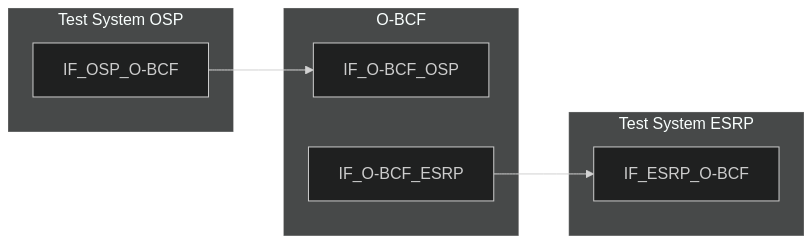
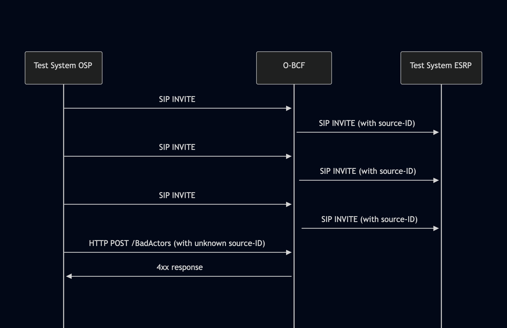

# Test Description: TD_BCF_004
## Overview
### Summary
Ignoring requests with unknown source-id

### Description
This test checks if BCF ignores requests to /BadActors interface with unknown source-id

### References
* Requirements : RQ_BCF_030
* Test Case    : 

### Requirements
IXIT config file for BCF

## Configuration
### Implementation Under Test Interface Connections
<!-- Identify each of the FEs that are part of the configuration and how they are connected -->
* Test System (OSP)
  * IF_OSP_O-BCF - connected to O-BCF IF_O-BCF_OSP
* O-BCF
  * IF_O-BCF_OSP - connected to Test System IF_OSP_O-BCF
  * IF_O-BCF_ESRP - connected to Test System IF_ESRP_O-BCF
* Test System (ESRP)
  * IF_ESRP_O-BCF - connected to IF_O-BCF_ESRP

### Test System Interfaces
<!-- Identify each of the test system interfaces and whether it will be in active or monitor mode -->
* Test System (OSP)
  * IF_OSP_O-BCF - Active
* O-BCF
  * IF_O-BCF_OSP - Active
  * IF_O-BCF_ESRP - Monitor
* Test System (ESRP)
  * IF_ESRP_O-BCF - Monitor


### Connectivity Diagram
<!--
https://mermaid.live/edit#pako:eNp1UV1PgzAU_SvkPrNljFJqH3xwusRE4zJ8MiRLpR0QByWlRJHw321BcFtin-45t-cjuR0kkgugcDzJzyRjSjtP-7h0zHvcHl6i3eFus10sbg0wgyXmpcUP0X43bu1kqXFdN--pYlXmvIpaO1Fba1E4s_jSfeREya-k8-os79pi6vCfx3n8379f8WVlIwYXUpVzoFo1woVCqIJZCJ39EoPORCFioGbkTH3EEJe90VSsfJOymGRKNmkG9MhOtUFNxZkW9zkzhYqZVSZNqI1sSg2UeIMH0A6-gHoeWXqrG-L7gU_CACHkQmvp1TL0QuLhcI1DFAS9C99DquEDssYEB8hHGGFs7FijZdSWydRJ8FxL9Tyeerh4_wMT55S4
-->




## Pre-Test Conditions

### Test System OSP
* Interfaces are connected to network
* Interfaces have IP addresses assigned by DHCP
* Device is active
* No active calls

### O-BCF
* Interfaces are connected to network
* Interfaces have IP addresses assigned by DHCP
* Default configuration is loaded
* Device is initialized with steps from IXIT config file
* Device is active
* Device is in normal operating state
* No active calls

### Test System ESRP
* Interfaces are connected to network
* Interfaces have IP addresses assigned by DHCP
* Device is active
* No active calls


## Test Sequence
### Test Preamble
#### Test System ESRP
* Install SIPp by following steps from documentation[^1]
* Copy following XML scenario file to local storage:
  ```
  SIP_INVITE_RECEIVE.xml
  ```
* Install Wireshark[^2]
* (TLS transport) Copy to local storage SIP TLS certificate and private key files:
  ```
  cacert.pem
  cakey.pem
  ```
* (TLS transport) Configure Wireshark to decode SIP over TLS packets[^3]
* Using Wireshark on 'Test System ESRP' start packet tracing on IF_ESRP_O-BCF interface - run following filter:
     * (TLS transport)
       > ip.addr == IF_ESRP_O-BCF_IP_ADDRESS and tls
     * (TCP transport)
       > ip.addr == IF_ESRP_O-BCF_IP_ADDRESS and sip
* Prepare 'Test System ESRP' to receive SIP message - run SIPp tool with one of following commands:
     * (TCP transport)
       ```
       sudo sipp -t t1 -sf SIP_INVITE_RECEIVE.xml -i IF_ESRP_O-BCF_IP_ADDRESS:5061 -trace_logs -trace_msg -timeout 10 -max_recv_loops 1
       ```
     * (TLS transport)
       ```
       sudo sipp -t l1 -sf SIP_INVITE_RECEIVE.xml -i IF_ESRP_O-BCF_IPv4:5060 -trace_logs -trace_msg -timeout 10 -max_recv_loops 1
       ```

### Test System OSP
<!-- Where FE# is the FE abbreviation (LIS, BCF, ESRP, ECRF, ...) -->
* Install SIPp by following steps from documentation[^1]
* Install Curl [^4]
* Copy following XML scenario files to local storage:
  ```
  SIP_INVITE_FROM_OSP.xml
  ```
* (TLS transport) Copy to local storage SIP TLS certificate and private key files:
  ```
  cacert.pem
  cakey.pem
  ```
* Send 2-3 separate calls to O-BCF - run and stop following SIPp command on Test System OSP 2-3 times, example:
  * (TCP transport)
    ```
    sudo sipp -t t1 -sf SIP_INVITE_FROM_OSP.xml -i IF_OSP_O-BCF -p 5060 -m 1 IF_O-BCF_OSP:5060
    ```
  * (TLS transport)
    ```
    sudo sipp -t l1 -tls_cert cacert.pem -tls_key cakey.pem -sf SIP_INVITE_FROM_OSP.xml -i IF_OSP_O-BCF -p 5060 -m 1 IF_O-BCF_OSP:5061
* After sending, check source-ID's generated for the calls. Find all UNIQUE_SOURCE_ID values in SIP INVITE messages sent 
by O-BCF to ESRP. Use traced packets in Wireshark on Test System ESRP. UNIQUE_SOURCE_ID values can be found in 
Call-Info header fields, example template:
`Call-Info: UNIQUE_SOURCE_ID@BCF_FQDN;purpose=emergency-source`
* Create NEW_UNIQUE_SOURCE_ID value different than all Source-ID's already generated by O-BCF. The value will be used for stimulus

### Test Body
#### Stimulus

From 'Test System OSP' send HTTP POST message with created NEW_UNIQUE_SOURCE_ID different than all generated already, example:
   * (TLS transport)
     > curl -X POST https://O-BCF_FQDN_OR_IP:PORT/BadActors -H "Content-Type: text/plain" -d NEW_UNIQUE_SOURCE_ID@BCF_FQDN
   * (TCP transport)
     > curl -X POST http://O-BCF_FQDN_OR_IP:PORT/BadActors -H "Content-Type: text/plain" -d NEW_UNIQUE_SOURCE_ID@BCF_FQDN

#### Response
O-BCF responds with 4xx error response

VERDICT:
* PASSED - if HTTP POST was ignored
* FAILED - all other cases
 
### Test Postamble

#### Test System OSP
* stop all SIPp processes (if still running)
* archive all logs generated
* remove all SIPp scenarios
* remove certificate files
* disconnect interfaces from O-BCF

#### O-BCF
* disconnect IF_O-BCF_OSP
* disconnect IF_O-BCF_ESRP
* reconnect interfaces back to default
* restore default configuration
* reload config (or device reboot)

#### Test System ESRP
* stop all SIPp processes (if still running)
* stop Wireshark (if still running)
* archive traced packets from Wireshark
* remove certificate files
* disconnect interfaces from O-BCF


## Post-Test Conditions

### Test System OSP
* Test tools stopped
* interfaces disconnected from O-BCF

### O-BCF
* device connected back to default
* device has restored default configuration
* device in normal operating state

### Test System ESRP
* Test tools stopped
* interfaces disconnected from O-BCF


## Sequence Diagram
<!--
https://mermaid.live/edit#pako:eNrlUslOwzAQ_RVrTiCS0qRpFh8q0QWRAzQiEQeUi5VM06jELo4tWqr-O05KUSX4A26eecuMPO8AhSgRKNi2nfNC8FVd0ZwT0tRSCnlXKCFbSlbsrcWc96QW3zXyAuc1qyRrOjIhGbaKpPtWYUOWaWJPJjdLezq7pySNExI_vcTZ4sTs2x1-KVmkz8kllVx91GpNWqFlgXY8v_5PUx6yLCHJMs3I7ZSVpxN8m2i-4eKD_zL7cxHjSom32xGJ7VaYu4EFlaxLoEpqtKBB2bCuhEPnkoNaY4M5UPMsmdzkkPOj0WwZfxWiOcuk0NUaaB8JC_S2ZOqchZ-uRF6inAnNFVDH83sToAfYmdIJBk4UOaPQd4PxMAws2AMN3cHYD5zAdEPXDQP3aMFnP3U4GEeeASI_CEehgTwLmFYi3fPivBOWtfmlx1OU-0QfvwDQm95O
-->




## Comments

Version:  010.3d.5.0.1

Date:     20251014

## Footnotes
[^1]: SIPp - tool for SIP packet simulations. Official documentation: https://sipp.sourceforge.net/doc/reference.html#Getting+SIPp
[^2]: Wireshark - tool for packet tracing and anaylisis. Official website: https://www.wireshark.org/download.html
[^3]: Wireshark configuration to decrypt SIP over TLS packets: https://www.zoiper.com/en/support/home/article/162/How%20to%20decode%20SIP%20over%20TLS%20with%20Wireshark%20and%20Decrypting%20SDES%20Protected%20SRTP%20Stream
[^4]: Curl: https://curl.se/download.html
