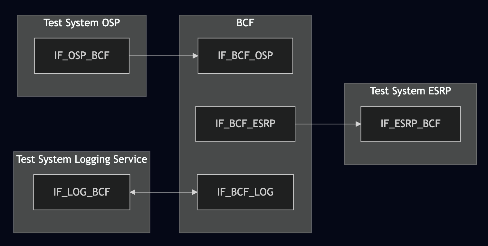
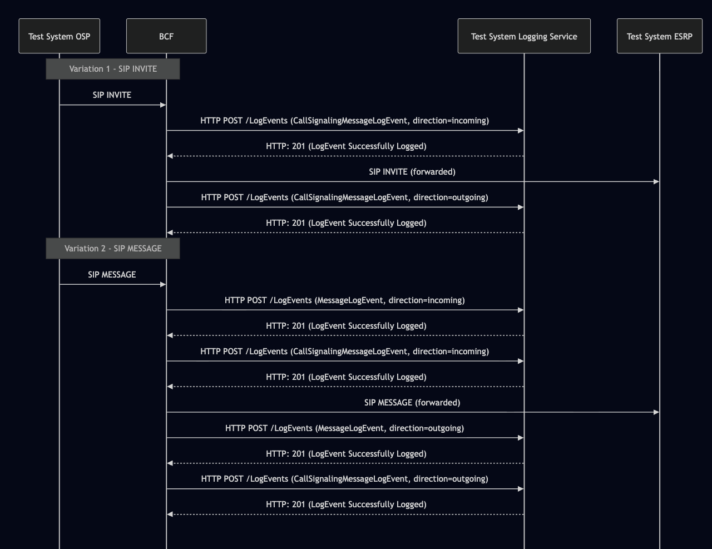

# Test Description: TD_BCF_005
## Overview
### Summary
Validation of the Message Logging mechanism within the BCF
MessageLogEvent and CallSignalingMessageLogEvent

### Description
This test ensures the BCF correctly generates a MessageLogEvent and CallSignallingMessageLogEvent every time it receives and processes a SIP message

### References
* Requirements : RQ_BCF_080, RQ_BCF_081, RQ_BCF_129, RQ_BCF_130, RQ_BCF_160, RQ_BCF_161, RQ_BCF_162
* Test Case    : TC_BCF_005

### Requirements
IXIT config file for BCF

## Configuration
### Implementation Under Test Interface Connections
<!-- Identify each of the FEs that are part of the configuration and how they are connected -->
* Test System (OSP)
  * IF_OSP_BCF - connected to BCF IF_BCF_OSP
* BCF
  * IF_BCF_OSP - connected to Test System IF_OSP_BCF
  * IF_BCF_ESRP - connected to Test System IF_ESRP_BCF
  * IF_BCF_LOG - connected to Test System IF_LOG_BCF
* Test System (ESRP)
  * IF_ESRP_BCF - connected to IF_BCF_ESRP
* Test System Logging Service(LOG)
  * IF_LOG_BCF - connected to Test System IF_BCF_LOG

### Test System Interfaces
<!-- Identify each of the test system interfaces and whether it will be in active or monitor mode -->
* Test System (OSP)
  * IF_OSP_BCF - Active
* BCF
  * IF_BCF_OSP - Active
  * IF_BCF_ESRP - Monitor
  * IF_BCF_LOG - Active
* Test System (ESRP)
  * IF_ESRP_BCF - Monitor
* Test System Logging Service (LOG)
  * IF_LOG_BCF - Active


### Connectivity Diagram
<!--
https://mermaid.live/edit#pako:eNpdklFvgjAUhf8Kuc9oipTOkWUPc3NZ4qKRPc0upIMKZNKaUrY5439fCyoiD-Te7_SeeyDdQyJTDiGsN_InyZnSzmxJxcs0nkeL-GEyHQzuTWMKCxrB1k_RctEqtrKokWbzZ1vfdUOGUEFFVX9mim1z541XOo52lealNXRWFjgtcAz4oMIxT7efCi7SnoWBzsq8uqPndBe9zdUDTZJrr8s4dqKfx5JuS_el1y4zmWWFyOKIq-8i4X2To-gcxdav-1dHN3AhU0UKoVY1d6HkqmS2hb09T0HnvOQUQlOmTH1RoOJgZrZMvEtZnsaUrLMcwjXbVKartynT_LFgJmV5psrs42oia6EhHN02HhDu4RdCD5MhIgRhjMnI97AfuLAzGJHh2CMB8r0xQiTA3sGFv2YtGo6DAGHi33p4fOONPOICq7WMdiI5heJpoaV6ba9Zc9sO_2NAySc
-->




## Pre-Test Conditions

### Test System OSP
* Interfaces are connected to network
* Interfaces have IP addresses assigned by DHCP
* Device is active
* No active calls

### BCF
* Interfaces are connected to network
* Interfaces have IP addresses assigned by DHCP
* Default configuration is loaded
* Device is initialized with steps from IXIT config file
* Device is active
* Device is in normal operating state
* Logging service is enabled
* No active calls

### Test System ESRP
* Interfaces are connected to network
* Interfaces have IP addresses assigned by DHCP
* Device is active
* No active calls


## Test Sequence
### Test Preamble
#### Test System ESRP
* Install SIPp by following steps from documentation[^1]
* Copy following XML scenario file to local storage:
  ```
  SIP_INVITE_RECEIVE.xml
  SIP_MESSAGE_RECEIVE.xml
  ```
* Install Wireshark[^2]
* (TLS transport) Copy to local storage SIP TLS certificate and private key files:
  ```
  cacert.pem
  cakey.pem
  ```
* (TLS transport) Configure Wireshark to decode SIP over TLS packets[^3]
* Using Wireshark on 'Test System ESRP' start packet tracing on IF_ESRP_BCF interface - run following filter:
     * (TLS transport)
       > ip.addr == IF_ESRP_BCF_IP_ADDRESS and tls
     * (TCP transport)
       > ip.addr == IF_ESRP_BCF_IP_ADDRESS and sip
* Prepare 'Test System ESRP' to receive SIP messages - run SIPp tool with one of following commands: (do this for both SIP INVITE and SIP MESSAGE)
     * (TCP transport)
       ```
       sudo sipp -t t1 -sf SIP_INVITE_RECEIVE.xml -i IF_ESRP_BCF_IP_ADDRESS:5061 -trace_logs -trace_msg -timeout 10 -max_recv_loops 1
       ```
     * (TLS transport)
       ```
       sudo sipp -t l1 -sf SIP_INVITE_RECEIVE.xml -i IF_ESRP_BCF_IPv4:5060 -trace_logs -trace_msg -timeout 10 -max_recv_loops 1
       ```

### Test System OSP
<!-- Where FE# is the FE abbreviation (LIS, BCF, ESRP, ECRF, ...) -->
* Install SIPp by following steps from documentation[^1]
* Install Curl [^4]
* Copy following XML scenario files to local storage:
  ```
  SIP_INVITE_FROM_OSP.xml
  SIP_MESSAGE_FROM_OSP.xml
  ```
* (TLS transport) Copy to local storage SIP TLS certificate and private key files:
  ```
  cacert.pem
  cakey.pem
  ```
* Send separate calls to BCF - run following SIPp commands on Test System OSP, example:
  * (TCP transport)
    ```
    sudo sipp -t t1 -sf SIP_INVITE_FROM_OSP.xml -i IF_OSP_BCF -p 5060 -m 1 IF_BCF_OSP:5060
    then:
    sudo sipp -t t1 -sf SIP_MESSAGE_FROM_OSP.xml -i IF_OSP_BCF -p 5060 -m 1 IF_BCF_OSP:5060
    ```
  * (TLS transport)
    ```
    sudo sipp -t l1 -tls_cert cacert.pem -tls_key cakey.pem -sf SIP_INVITE_FROM_OSP.xml -i IF_OSP_BCF -p 5060 -m 1 IF_BCF_OSP:5061
    then:
    sudo sipp -t l1 -tls_cert cacert.pem -tls_key cakey.pem -sf SIP_INVITE_FROM_OSP.xml -i IF_OSP_BCF -p 5060 -m 1 IF_BCF_OSP:5061
    ```

#### Test System Logging Service
* Install Wireshark[^1]
* (TLS v1.2) Configure Wireshark to decode HTTP over TLS, use tests system and PS certificate keys [^2]
* (TLS v1.3) Configure logging of session keys and configure Wireshark to decode HTTP over TLS [^3]
* Using Wireshark on 'Test System' start packet tracing on IF_TS_PS interface - run following filter:
   * (TLS)
     > ip.addr == IF_BCF_LOG_IP_ADDRESS and tls
   * (TCP)
     > ip.addr == IF_BCF_LOG_IP_ADDRESS and http
* The Logging Service must be configured to accept and process HTTP POST requests.
  * To verify this manually, you can simulate a listening HTTP endpoint on port 8080 using command in the terminal:
  * for TLS:
    * `openssl s_server -accept 8080 -cert cert.pem -key key.pem`
    * In another terminal, send a POST request to verify it is working:
      * `curl -k -X POST https://localhost:8080 -d '{"log":"test"}'`
  * non TLS:
    * `while true; do echo -e "HTTP/1.1 200 OK\r\n\r\n" | nc -l -p 8080 -q 1; done`
    * In another terminal, send a POST request to verify it is working:
      * `curl -X POST http://localhost:8080 -d '{"log":"test"}'`

### Test Body
#### Variations

1. SIP INVITE from OSP to BCF
2. SIP MESSAGE from OSP to BCF

#### Stimulus

Send SIP packet to BCF - run following SIPp command on Test System OSP
  ```
  sudo sipp -sf SIP_INVITE_from_OSP.xml -i IF_OSP_BCF -p 5060 IF_BCF_OSP:5060
  sudo sipp -sf SIP_MESSAGE_from_OSP.xml -i IF_OSP_BCF -p 5060 IF_BCF_OSP:5060
  ```

#### Response
For each stimulus SIP INVITE (or any other than SIP MESSAGE) sent or received: BCF generates a corresponding 'MessageLogEvent' record.
For each stimulus SIP MESSAGE sent or received: BCF generates a corresponding 'MessageLogEvent' and 'CallSignalingMessageLogEvent' records.
For each stimulus with 'CallSignalingMessageLogEvent' logEvent, with 'direction: "incoming"', there must be 
    corresponding 'CallSignalingMessageLogEvent' with 'direction: "outgoing"', with the same Call-ID.
Each HTTP POST to /LogEvents must contain a JWS body (JSON payload) conforming to NENA-STA-010.3

Each MessageLogEvent record includes:
 - `logEventType`:`"MessageLogEvent"` --> Identifies this as a message-level logging event
 - `timestamp`: ISO 8601 UTC --> Time of event creation
 - `elementId`: FQDN of element --> Identifier of the logging entity
 - `agencyId`: Agency domain --> Originating agency
 - `direction`: `"incoming"` or `"outgoing"` --> Message direction relative to the element
 - `callId`: `"urn:emergency:uid:callid:<UUID>:<domain>"` --> Call unique identifier
 - `incidentId`: `"urn:emergency:uid:incidentid:<UUID>:<domain>"` --> Incident unique identifier
 - `callIdSIP`: SIP Call-ID header --> e.g. `"f81d4fae-7dec-11d0-a765-00a0c91e6bf6@osp.test"`
 - `ipAddressPort`: `"A.B.C.D:port"` --> Source/destination transport info

Each CallSignalingMessageLogEvent record includes:
 - `logEventType`:`"CallSignalingMessageLogEvent"` --> Identifies this as a call-signaling message event
 - `timestamp`: ISO 8601 UTC --> Time of signaling message capture
 - `elementId`: FQDN of element --> Identifier of the logging entity
 - `agencyId`: Agency domain --> Originating agency
 - `direction`: `"incoming"` or `"outgoing"` --> Message direction
 - `protocol`: (Optional) String from LogEvent Protocol Registry (e.g., "SIP")
 - `callId`: Same value as in MessageLogEvent --> Links both events
 - `incidentId`: Same value as in MessageLogEvent --> Links both events
 - `callIdSIP`: SIP Call-ID header --> Same correlation
 - `ipAddressPort`: `"A.B.C.D:port"` --> Source/destination transport info        
 - `text`: Full SIP message body (INVITE, MESSAGE, etc.) --> Must include all headers and CRLF line endings


VERDICT:
* PASSED:
  - The BCF successfully receives SIP INVITE and/or SIP MESSAGE from OSP.
  - The BCF correctly forwards SIP messages to ESRP using the configured transport (TCP/TLS).
  - The BCF sends corresponding MessageLogEvent and CallSignalingMessageLogEvent via HTTP POST to the Logging Service.
  - The Logging Service responds with "201 LogEvent Successfully Logged", and BCF continues normal operation without retransmission or error.
  - SIP session is maintained end-to-end between OSP and ESRP.
  - CallSignalingMessageLogEvent(incoming) lovEvent is correctly correlated with CallSignalingMessageLogEvent(outgoing) lovEvent.

* FAILED:
  - The BCF fails to forward SIP messages to ESRP, or they are malformed.
  - The BCF omits or misroutes one or both log event types (MessageLogEvent, CallSignalingMessageLogEvent).
  - The BCF receives an error response (4xx/5xx) from the Logging Service and does not recover gracefully.
  - SIP dialog is interrupted or terminated due to logging or routing failure.
 
### Test Postamble

#### Test System OSP
* stop all SIPp processes (if still running)
* archive all logs generated
* remove all SIPp scenarios
* remove certificate files
* disconnect interfaces from BCF

#### BCF
* disconnect IF_BCF_OSP
* disconnect IF_BCF_ESRP
* reconnect interfaces back to default
* restore default configuration
* reload config (or device reboot)

#### Test System ESRP
* stop all SIPp processes (if still running)
* stop Wireshark (if still running)
* archive traced packets from Wireshark
* remove certificate files
* disconnect interfaces from BCF

#### Test System Logging Service
* disconnect interfaces from BCF
* reconnect interfaces back to default

## Post-Test Conditions

### Test System OSP
* Test tools stopped
* interfaces disconnected from BCF

### BCF
* device connected back to default
* device has restored default configuration
* device in normal operating state

### Test System ESRP
* Test tools stopped
* interfaces disconnected from BCF

### Test System Logging Service
* Test tools stopped
* interfaces disconnected from BCF

## Sequence Diagram
<!--
https://mermaid.live/edit#pako:eNrNVW1v2jAQ_isnS5WoFChJIBBLrcQo25B4Ux3xYYpUWYlJrSU2cxw6hvjvc0JhK6Bt6qqq-ZLk7rnnHt9dchsUyZghjOr1eigiKRY8waEAyLhSUvUiLVWOYUHTnIWiAuXsW8FExG45TRTNSjDAxYXmOmUQ3N5_6H-8b3abUIcxy3OasJFMBismNFxBn6Yp4YmgKRfJkXtPBDOqNI_4kgqd74zLXxaYkhnQHAKWayDrXLOsNJ3BGR0l0NxOnSNyzGFUJEYTEKZWPGKnIQNyd5K4tIXiIPz67HVwz3t3w14wnE7ANsUhwxkMJ_NhMPin-InUDOSKqfK0Vnk4DHOqONVcirOEBle_udkhT3zGapwjguFzEMxgNiUBXO07kUPtT42yIOaKRWXia25mJjOQyx3viNQPOUtiDE7ThtphAkgRRYZsUaTpuio5iy-fKSor-rtcqC2keqQqPgb-v3RZ6ES-hvSXTIDz1LDxgJDep9cYgbOMxzPw3Pm3Sr5h39_zJD4V7QWj-BbT976-B2ShRPEYYa0KZqGMqYyWr2hTsoZIP7CMhQibx5iqryEKxdbEmD_sFymzfZiSRfKAcLV1LFQsY6r36-ZgVUzETPVlITTCTqtbkSC8Qd8R7tqNluf5tue7vuf6tmOhNcJ2p93w2u2O53Rdt-PZ7dbWQj-qtM2Gb3dtt92xHddvuk7HtRAttCRrEe1FsZibZTjerctqa25_AqDAOPg
-->




## Comments

Version:  010.3d.5.0.5

Date:     20260122

## Footnotes
[^1]: SIPp - tool for SIP packet simulations. Official documentation: https://sipp.sourceforge.net/doc/reference.html#Getting+SIPp
[^2]: Wireshark - tool for packet tracing and anaylisis. Official website: https://www.wireshark.org/download.html
[^3]: Wireshark configuration to decrypt SIP over TLS packets: https://www.zoiper.com/en/support/home/article/162/How%20to%20decode%20SIP%20over%20TLS%20with%20Wireshark%20and%20Decrypting%20SDES%20Protected%20SRTP%20Stream

