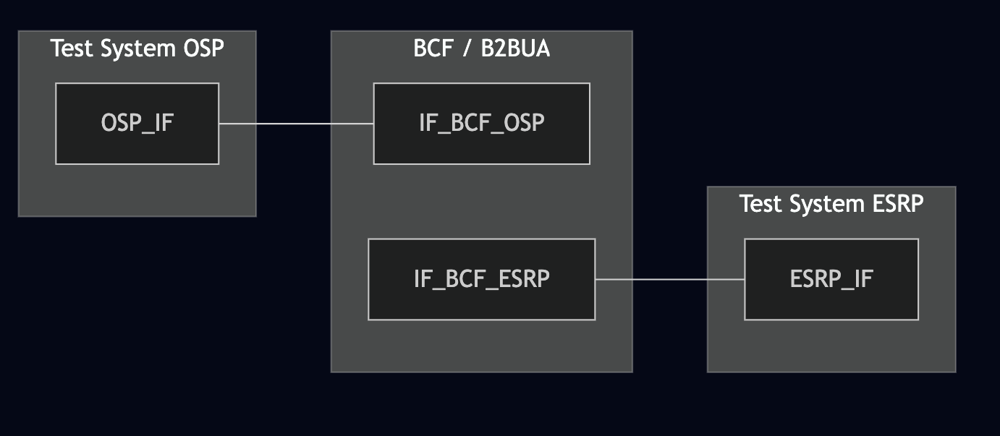
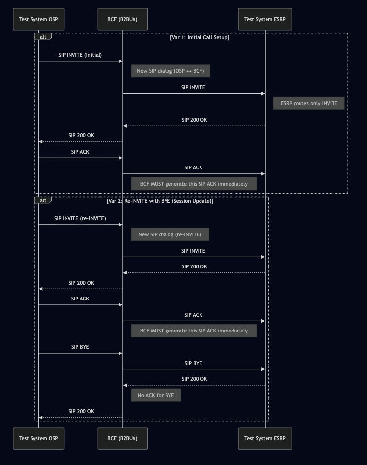

# Test Description: TD_BCF_006
## Overview
### Summary
Verification of ACK Handling by BCF for SIP Dialog Establishment and Termination

### Description
The test ensures that when the BCF receives an incoming call and initiates a new call leg to the downstream element, 
it correctly completes the SIP handshake by sending an ACK request upon receiving a 200 OK final response.

### SIP transport types
Test can be performed with 2 different SIP transport types. Steps describing actions for specific one are marked as following:
- (TLS transport) - used by default inside ESInet on production environment
- (TCP transport) - used in lab for testing purposes only if default TLS is not possible

### References
* Requirements : RQ_BCF_194
* Test Case    : TC_BCF_006

### Requirements
IXIT config file for BCF

## Configuration
### Implementation Under Test Interface Connections
<!-- Identify each of the FEs that are part of the configuration and how they are connected -->
* Test System (OSP)
  * IF_OSP_BCF - connected to BCF IF_BCF_OSP
* BCF
  * IF_BCF_OSP - connected to Test System IF_OSP_BCF
  * IF_BCF_ESRP - connected to Test System IF_ESRP_BCF
* Test System (ESRP)
  * IF_ESRP_BCF - connected to IF_BCF_ESRP

### Test System Interfaces
<!-- Identify each of the test system interfaces and whether it will be in active or monitor mode -->
* Test System (OSP)
  * IF_OSP_BCF - Active
* BCF
  * IF_BCF_OSP - Active
  * IF_BCF_ESRP — Active (Must negotiate SIP Setup)
* Test System (ESRP)
  * IF_ESRP_BCF - Active 

 
### Connectivity Diagram
<!--
https://mermaid.live/edit#pako:eNptUu9PwjAQ_Vea-zxwK7JBvwlKQqJiGHyRmqWyCkTXkq5LRML_7nV1_IqXprn37t71tekeljqXwGBlxHZNHqdcEYyyevfETJY2S3ellUU2SV_IwhHEEwSJN9_vAlE2HnksVc7V1ajBcEQWbrshAzqY351JkUVpNn5e4O7A5eS_8mQ-a-oP6bRp-O-oc9eu9dL2mdiFg9fGPfA3Iq1W6-TQV06O6upxBFcQ4FNucmDWVDKAQppCOAh7p-Rg17KQHBimuTCfHLg6oGYr1KvWRSMzulqtgX2IrxJRtc2FlfcbgbcrjqxBr9IMdaUssDiqZwDbwzewXq_dj2nSSfoRjWjY7QewA0Zp3I663ZDiinsRjZNDAD_1qWE7SahrD8MOpZjeBiAqq9OdWjaeZL6x2jz571L_msMvcX2q6Q
-->




## Pre-Test Conditions

### Test System OSP
* Interfaces are connected to network
* Interfaces have IP addresses assigned by DHCP
* Device is active
* No active calls
* (TLS transport) Test System OSP has it's own certificate signed by PCA

### BCF
* Interfaces are connected to network
* Interfaces have IP addresses assigned by DHCP
* Default configuration is loaded
* Device has configured `Test System ESRP` as a next hop
* Device is initialized with steps from IXIT config file
* Device is active
* Device is in normal operating state
* No active calls

### Test System ESRP
* Interfaces are connected to network
* Interfaces have IP addresses assigned by DHCP
* Device is active
* No active calls
* (TLS transport) Test System ESRP has it's own certificate signed by PCA

## Test Sequence
### Test Preamble
#### Test System OSP
* Install SIPp by following steps from documentation[^1]
* Copy following XML scenario files to local storage:
  ```
    SIP_INVITE_from_OSP.xml
    SIP_BYE_for_ACK.xml
  ```
* (TLS transport) Copy to local storage PCA-signed certificate and private key files:
  > PCA-cacert.pem
  > PCA-cakey.pem
* (TLS transport) Copy to local storage PCA-signed certificate and private key files for BCF:
  > BCF-cacert.pem
  > BCF-cakey.pem


#### Test System ESRP
* Install SIPp by following steps from documentation[^1]
* Install Wireshark[^2]
* (TLS transport) Copy to local storage PCA-signed certificate and private key files:
  > PCA-cacert.pem
  > PCA-cakey.pem
* (TLS transport) Copy to local storage PCA-signed certificate and private key files for BCF:
  > BCF-cacert.pem
  > BCF-cakey.pem
* (TLSv1.2 transport) Configure Wireshark to decode SIP over TLS packets[^3]
* (TLSv1.3 transport) Configure Wireshark to decode SIP over TLS packets[^4]
* Using Wireshark on 'Test System ESRP' start packet tracing on IF_ESRP_BCF interface - run following filter:
     * (TLS transport)
       > ip.addr == IF_ESRP_BCF_IP_ADDRESS and tls
     * (TCP transport)
       > ip.addr == IF_ESRP_BCF_IP_ADDRESS and sip


### Test Body
#### Variations

1. INVITE → 200 OK → ACK — initial dialog
2. re-INVITE → 200 OK → ACK → BYE → 200 OK — dialog termination


#### Stimulus
Send SIP packet to BCF - run following SIPp command on Test System OSP, example:
* (TCP transport)
  ```
  sudo sipp -t t1 -sf SCENARIO_FILE -i IF_OSP_BCF IF_BCF_OSP:5060
  ```
* (TLS transport)
  ```
  sudo sipp -t l1 -tls_cert PCA-cacert.pem -tls_key PCA-cakey.pem -sf SCENARIO_FILE -i IF_OSP_BCF IF_BCF_OSP:5061
  ```

#### Response
BCF sends ACK for each 2xx response for SIP INVITE

ACK is generated by BCF (not forwarded from OSP)
ACK contains correct fields:
    - Via branch
    - CSeq: ACK
    - Call-ID (same as INVITE)
    - Route set
    - Contact

For variation 2 with BYE:
- BCF forwards BYE
- Test System ESRP sends 200 OK
- BCF completes BYE transaction (does not send ACK)
- No errors in logs or signalling

VERDICT:
* PASSED - 
    - BCF generates ACK for all INVITE-related variations
    - ACK is syntactically correct
    - BYE transaction completes properly
    - No retransmissions or malformed messages appear
* FAILED -
    - ACK missing
    - ACK invalid
    - Wrong CSeq or headers
    - BYE flow incomplete


### Test Postamble
#### Test System OSP
* stop all SIPp processes (if still running)
* archive all logs generated
* remove all SIPp scenarios
* disconnect interfaces from BCF
* (TLS transport) remove certificates

#### BCF
* disconnect IF_BCF_OSP
* disconnect IF_BCF_ESRP
* reconnect interfaces back to default

#### Test System ESRP
* stop all SIPp processes (if still running)
* stop Wireshark (if still running)
* archive traced packets in Wireshark
* remove certificate files
* disconnect interfaces from BCF
* (TLS transport) remove certificates


## Post-Test Conditions
### Test System OSP
* Test tools stopped
* interfaces disconnected from BCF

### BCF
* device connected back to default
* device in normal operating state

### Test System ESRP
* Test tools stopped
* interfaces disconnected from BCF


## Sequence Diagram
<!--
https://mermaid.live/edit#pako:eNrNVd2K2kAYfZWPgS0KKjFG4-ZiQa2FsLguRoWW3AxmjKHJjJ1M2LribZ-gT9gn6TeJ2lTd7XbZQudG5_s7h_MdMluyEAEjDknZl4zxBXsf0VDSxOeAZ02lihbRmnIFY-8eaApTlirwNqliiQ6d1_UHH3Sd_qn0zf6sVz2vGXqTs2E65vOi9uoK6q89xwnz3sTtTd3xHTThHbQccHmkIhrDgMYxeExla6i4d3N3Oqy-FSyNFcyphOYltKJEHxSufnODEjngufdQkEAyRUv1IIM-XCgGMgpXCsQS8pY79pC3BVgrQqjozfz49l0nq78a8YYYWtUyyNOji8p8M1JkiqUgeLy50KZL6mX6pmHA-PZ3ZMwjrXIeyjNOBOgNbsvZU-p5-hlBtNdGM28KIeNMUsyrVZQeWiFKEoZaKRZvijGMB__IaaYDoyio5zufrQNNpSJZfb_gh0itoP9xCG_uN8SdnMNUPJamkeB7KtU_GvBI9W8tWG58uQFf6aT_x0jlc8IE9X-aR558gQ7P70DkpJZCnoNdEu3ofFIjoYwC4iiZsRpJmEyovpKtLvKJWrGE-cTBvwGVn33i8x324Jf7kxDJoQ0_EuGKOEsap3jLcoftH49jVCIekwORcUUcs23mQ4izJV_xalmNa9voWhg3u2bHsmtkg2G70WpjtGN0m2bH6Ni7GnnMYY1G17RbtnXdajfbRtPqtGuEZkp4G744kML1KCFHxZOWv2y7nzta0Ts
-->



## Comments

Version:  010.3f.5.0.1

Date:     20260108

## Footnotes
[^1]: SIPp - tool for SIP packet simulations. Official documentation: https://sipp.sourceforge.net/doc/reference.html#Getting+SIPp
[^2]: Wireshark - tool for packet tracing and anaylisis. Official website: https://www.wireshark.org/download.html
[^3]: Wireshark configuration to decrypt SIP over TLS packets: https://www.zoiper.com/en/support/home/article/162/How%20to%20decode%20SIP%20over%20TLS%20with%20Wireshark%20and%20Decrypting%20SDES%20Protected%20SRTP%20Stream
[^4]: TLS v1.3 session keys logging + Wireshark configuration to decrypt traffic: https://my.f5.com/manage/s/article/K50557518
