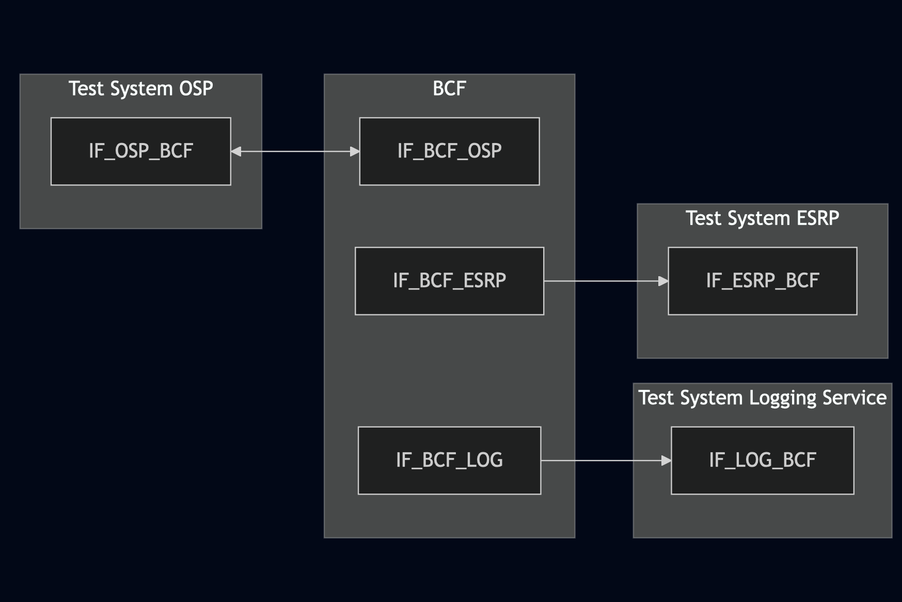
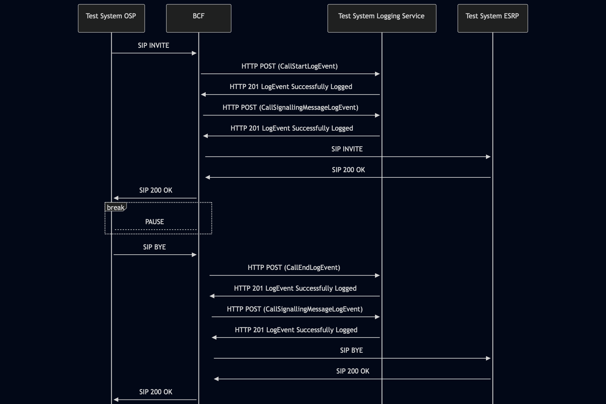

# Test Description: TD_BCF_007
## Overview
### Summary
Logging the call status

### Description
Test covers logging of CallStartLogEvent, CallEndLogEvent and CallSignallingMessageLogEvent

### References
* Requirements : RQ_BCF_128, RQ_BCF_136, RQ_BCF_137, RQ_BCF_138
* Test Case    : 

### Requirements
IXIT config file for IUT

### HTTP transport types
Test can be performed with 2 different HTTP transport types. Steps describing actions for specific one are marked as following:
- (TLS) - used by default inside ESInet on production environment
- (TCP) - used if default TLS is not possible

## Configuration
### Implementation Under Test Interface Connections
<!-- Identify each of the FEs that are part of the configuration and how they are connected -->
* Test System OSP
  * IF_OSP_BCF - connected to IF_BCF_OSP
* BCF
  * IF_BCF_OSP - connected to  IF_OSP_BCF
  * IF_BCF_LOG - connected to IF_LOG_BCF
  * IF_BCF_ESRP - connected to IF_ESRP_BCF
* Test System Logging Service
  * IF_LOG_BCF - connected to IF_BCF_LOG
* Test System ESRP
  * IF_ESRP_BCF - connected to IF_BCF_ESRP

### Test System Interfaces
<!-- Identify each of the test system interfaces and whether it will be in active or monitor mode -->
* Test System OSP
  * IF_OSP_BCF - Active
* BCF
  * IF_BCF_OSP - Active
  * IF_BCF_LOG - Active
* Test System Logging Service
  * IF_LOG_BCF - Active
* Test System ESRP
  * IF_ESRP_BCF - Active
 
### Connectivity Diagram
<!--
https://mermaid.live/edit#pako:eNp9Ul1vgjAU_SvkPiMRKqw0yx7m5rLERSM-LSSmgwpk0pJStjnjf18riuKy9enec3o-IN1BIlIGBNYb8ZnkVCpruoi5pc_zZDWL5qv78eR2MLjTm54M0rFmn86eWlIPBuiRj9Fi3rJmOtN185ZJWuXWktXKira1YqXVOfezW4zx9EraURd51xbHgr8w0-Yv38tKU5FlBc-siMmPImE9n973_m9zjjtq-39Di8GGTBYpECUbZkPJZEnNCjtzJQaVs5LFQPSYUvkeQ8z3WlNR_ipEeZJJ0WQ5kDXd1HprqpQq9lBQXajsUKnTmByLhisggR8cTIDs4AvIKHDcwMU-9rwQDZENWyCuGzojhEMfeZrAAdrb8H3IHDoYhwhh3_dC38Wud2MDbZSItjw5NWJpoYR8aV_Y4aHtfwBXlLdg
-->




## Pre-Test Conditions
### Test System OSP/Test System Logging Service/Test System ESRP
* Interfaces are connected to network
* Interfaces have IP addresses assigned by DHCP
* Device is active
* ng911 repository cloned to local storage
* (TLS) Generated own PCA-signed certificate and private key files (test_system.crt, test_system.key)
* (TLS) Certificate and key used by BCF copied to local storage
* (TLS) PCA certificate copied to local storage

### BCF
* Interfaces are connected to network
* Interfaces have IP addresses assigned by DHCP
* Device configured to use Logging Service Test System as a Logging Service
* IUT is initialized with steps from IXIT config file
* Device is active
* Device is in normal operating state
* IUT is initialized using IXIT config file

## Test Sequence

### Test Preamble

#### Test System OSP
* Install SIPp by following steps from documentation[^1]
* Copy following XML scenario file to local storage:
  `SIP_basic_call.xml`
  `g711ulaw_rtp_stream.pcap`
* Install Wireshark[^2]
* (TLS v1.2) Configure Wireshark to decode SIP over TLS, use tests system and IUT certificate keys [^3]
* (TLS v1.3) Configure logging of session keys and configure Wireshark to decode SIP over TLS [^4]
* Using Wireshark on 'Test System' start packet tracing on IF_OSP_BCF interface - run following filter:
   * (TLS)
     > ip.addr == IF_OSP_BCF_IP_ADDRESS and tls
   * (TCP)
     > ip.addr == IF_OSP_BCF_IP_ADDRESS and sip

#### Test System Logging Service
* Install Wireshark[^2]
* (TLS v1.2) Configure Wireshark to decode HTTP over TLS, use tests system and BCF certificate keys [^3]
* (TLS v1.3) Configure logging of session keys and configure Wireshark to decode HTTP over TLS [^4]
* Using Wireshark on 'Test System' start packet tracing on IF_LOG_BCF interface - run following filter:
   * (TLS)
     > ip.addr == IF_LOG_BCF_IP_ADDRESS and tls
   * (TCP)
     > ip.addr == IF_LOG_BCF_IP_ADDRESS and http

#### Test System ESRP
* Install SIPp by following steps from documentation[^1]
* Copy following XML scenario file to local storage:
  ```
  SIP_RECEIVE_basic_call_and_answer.xml
  ```
* Install Wireshark[^2]
* (TLS transport) Copy to local storage SIP TLS certificate and private key files:
  ```
  cacert.pem
  cakey.pem
  ```
* (TLS transport) Configure Wireshark to decode SIP over TLS packets[^3]
* Prepare 'Test System ESRP' to receive SIP message - run SIPp tool with one of following commands:
     * (TCP transport)
       ```
       sudo sipp -t t1 -sf SIP_RECEIVE_basic_call_and_answer.xml -i IF_ESRP_BCF_IP_ADDRESS:5060 -timeout 10 -max_recv_loops 1
       ```
     * (TLS transport)
       ```
       sudo sipp -t l1 -sf SIP_RECEIVE_basic_call_and_answer.xml -i IF_ESRP_BCF_IP_ADDRESS:5061 -timeout 10 -max_recv_loops 1
       ```

### Test Body

#### Stimulus
Simulate basic call from Test System OSP to BCF - run SIPp scenario by using following command on SIP Test System, example:
* (TCP transport)
  ```
  sudo sipp -t t1 -sf SIP_basic_call.xml IF_BCF_OSP_IPv4:5060
  ```
* (TLS transport)
  ```
  sudo sipp -t l1 -tls_cert test_system.crt -tls_key test_system.key -sf SIP_basic_call.xml IF_BCF_OSP_IPv4:5060
  ```

#### Response
Using traced packets on Wireshark verify:
* If BCF sends HTTP POST to Logging Service Test System with signed JWS body containing:
  * "logEventType": "CallStartLogEvent"
  * "timestamp" with correct date-time format (f.e. 2020-03-10T11:00:01-05:00) and date-time match the time when SIP INVITE message has been received
  * "elementId" which has value with FQDN of BCF
  * "agencyId" which has value with FQDN of an agency
  * "callId" which has value f.e.: `urn:emergency:uid:callid:1234567890:bcf.ng911.example`. Check:
    * if header field contains "urn:emergency:uid:callid:"
    * if "urn:emergency:uid:callid:" is followed by 10 to 32 alphanumeric characters (String ID)
    * if String ID is followed by ":" and domain name
  * "incidentId" which has value f.e.: `urn:emergency:uid:incidentid:1234567890:bcf.ng911.example`. Check:
    * if header field contains "urn:emergency:uid:incidentid:"
    * if "urn:emergency:uid:incidentid:" is followed by 10 to 32 alphanumeric characters (String ID)
    * if String ID is followed by ":" and domain name
  * "callIdSIP" which has value f.e.: `1234567890qwertyuiop@caller.example.com` 
  * "direction" which has value: `incoming`
  * (optionally) zero or one "standardPrimaryCallType" with one of string values:
    - "emergency"
    - "nonEmergency"
    - "silentMonitoring"
    - "intervene"
    - "legacyWireline"
    - "legacyWireless"
    - "legacyVoip"
  * (optionally) zero or one "standardSecondaryCallType" with one of string values mentioned for "standardPrimaryCallType"
  * (optionally) zero or one "localCallType" with string value
  * (optionally) zero or one "localUse" with string value
  * (optionally) zero or one "clientAssignedIdentifier" with string value
  * (optionally) zero or one "extension" with string value
* If BCF sends HTTP POST to Logging Service Test System with signed JWS body containing:
  * "logEventType": "CallSignalingMessageLogEvent"
  * "timestamp" with correct date-time format (f.e. 2020-03-10T11:00:01-05:00) and date-time match the time when SIP INVITE message has been received
  * "elementId" which has value with FQDN of BCF
  * "agencyId" which has value with FQDN of an agency
  * "callId" which has value f.e.: `urn:emergency:uid:callid:1234567890:bcf.ng911.example`. Check:
    * if header field contains "urn:emergency:uid:callid:"
    * if "urn:emergency:uid:callid:" is followed by 10 to 32 alphanumeric characters (String ID)
    * if String ID is followed by ":" and domain name
  * "incidentId" which has value f.e.: `urn:emergency:uid:incidentid:1234567890:bcf.ng911.example`. Check:
    * if header field contains "urn:emergency:uid:incidentid:"
    * if "urn:emergency:uid:incidentid:" is followed by 10 to 32 alphanumeric characters (String ID)
    * if String ID is followed by ":" and domain name
  * "callIdSIP" which has value f.e.: `1234567890qwertyuiop@caller.example.com` 
  * "direction" which has value: `incoming`
  * "text" which has string value containing SIP INVITE message received by BCF from SIP Test System
  * (Optional) "protocol" which has string value: `sip`
* If BCF sends HTTP POST to Logging Service Test System with signed JWS body containing:
  * "logEventType": "CallEndLogEvent"
  * "timestamp" with correct date-time format (f.e. 2020-03-10T11:00:01-05:00) and date-time match SIP BYE message received by BCF from SIP Test System
  * "elementId" which has value with FQDN of BCF
  * "agencyId" which has value with FQDN of an agency
  * "callId" which has value f.e.: `urn:emergency:uid:callid:1234567890:bcf.ng911.example`. Check:
    * if header field contains "urn:emergency:uid:callid:"
    * if "urn:emergency:uid:callid:" is followed by 10 to 32 alphanumeric characters (String ID)
    * if String ID is followed by ":" and domain name
  * "incidentId" which has value f.e.: `urn:emergency:uid:incidentid:1234567890:bcf.ng911.example`. Check:
    * if header field contains "urn:emergency:uid:incidentid:"
    * if "urn:emergency:uid:incidentid:" is followed by 10 to 32 alphanumeric characters (String ID)
    * if String ID is followed by ":" and domain name
  * "callIdSIP" which has value f.e.: `1234567890qwertyuiop@caller.example.com` 
  * "direction" which has value: `incoming`
  * (optionally) zero or one "standardPrimaryCallType" with one of string values:
    - "emergency"
    - "nonEmergency"
    - "silentMonitoring"
    - "intervene"
    - "legacyWireline"
    - "legacyWireless"
    - "legacyVoip"
  * (optionally) zero or one "standardSecondaryCallType" with one of string values mentioned for "standardPrimaryCallType"
  * (optionally) zero or one "localCallType" with string value
  * (optionally) zero or one "localUse" with string value
  * (optionally) zero or one "clientAssignedIdentifier" with string value
  * (optionally) zero or one "extension" with string value
* If BCF sends HTTP POST to Logging Service Test System with signed JWS body containing:
  * "logEventType": "CallSignalingMessageLogEvent"
  * "timestamp" with correct date-time format (f.e. 2020-03-10T11:00:01-05:00) and date-time match SIP BYE message received by BCF from SIP Test System
  * "elementId" which has value with FQDN of BCF
  * "agencyId" which has value with FQDN of an agency
  * "callId" which has value f.e.: `urn:emergency:uid:callid:1234567890:bcf.ng911.example`. Check:
    * if header field contains "urn:emergency:uid:callid:"
    * if "urn:emergency:uid:callid:" is followed by 10 to 32 alphanumeric characters (String ID)
    * if String ID is followed by ":" and domain name
  * "incidentId" which has value f.e.: `urn:emergency:uid:incidentid:1234567890:bcf.ng911.example`. Check:
    * if header field contains "urn:emergency:uid:incidentid:"
    * if "urn:emergency:uid:incidentid:" is followed by 10 to 32 alphanumeric characters (String ID)
    * if String ID is followed by ":" and domain name
  * "callIdSIP" which has value f.e.: `1234567890qwertyuiop@caller.example.com` 
  * "direction" which has value: `incoming`
  * "text" which has string value containing SIP BYE message received by BCF from SIP Test System
  * (Optional) "protocol" which has string value: `sip`

VERDICT:
* PASSED - if Logging Service responded as expected
* FAILED - any other cases


### Test Postamble
#### Test System OSP/Test System ESRP
* stop SIPp (if still running)
* stop Wireshark (if still running)
* archive all logs generated
* disconnect interfaces from IUT
* (TLS) remove certificates

#### Test System Logging Service
* stop Wireshark (if still running)
* archive all logs generated
* disconnect interfaces from IUT
* (TLS) remove certificates

#### BCF
* restore default configuration
* disconnect interfaces from Test Systems
* reconnect interfaces back to default

## Post-Test Conditions
### Test System OSP/Test System Logging Service/Test System ESRP
* Test tools stopped
* interfaces disconnected from IUT

### BCF
* device connected back to default
* device in normal operating state

## Sequence Diagram
<!--
https://mermaid.live/edit#pako:eNrtVFtr2zAY_Svie1qZHWTHuVgPgTbLWNi6mMkrbPhFtb-oprbUyXJZFvLfp7i4t4Wx0UJfqhdb0jlHB-lwtpDrAoGB7_uZyrVal5JlipC6NEab49xq0zCyFlWDmepADf5oUeX4rhTSiHoPvhkpNpbwTWOxJiue-LPZ25P5e0b4MiHLz2fLdHGHdRv7_fuUT1rKUknC0VyXOTLyIU0Tkqx4St7MRVVxK4x1oMU1Knt0-NhHGrcWOqmQBqTnE97mOTbNuq2qTUfD4mnuSqncx0FOnayQ-GJOF_xLcvjSH6MevFBIKVl9_Kuye9TD2HOD4vJu2tP92R_s5Pgrv-cIVfFv-Tn59rTwLFTxGp3_iM6D-3723IAH0pQFMGta9KBGU4v9FLZ7nQzsBdaYAXO_hTCXGWRq5zhXQn3Xuu5pRrfyAljXTR60V4WwfSndrhqXMDRz3SoLLApGnQiwLfwEFoTRIJ4MaTR2g07DYOjBxqHCQTRyy-N4HFE6mobRzoNf3bl0MAmHIxoG8SSexsMocgzRWs03Ku9dYVG6zjy9adWuXHe_AThdoGs
-->




## Comments

Version:  010.3f.5.0.4

Date:     20260402

## Footnotes
[^1]: SIPp - tool for SIP packet simulations. Official documentation: https://sipp.sourceforge.net/doc/reference.html#Getting+SIPp
[^2]: Wireshark - tool for packet tracing and anaylisis. Official website: https://www.wireshark.org/download.html
[^3]: Wireshark configuration to decrypt TLS packets: https://www.zoiper.com/en/support/home/article/162/How%20to%20decode%20SIP%20over%20TLS%20with%20Wireshark%20and%20Decrypting%20SDES%20Protected%20SRTP%20Stream
[^4]: TLS v1.3 session keys logging + Wireshark configuration to decrypt traffic: https://my.f5.com/manage/s/article/K50557518
