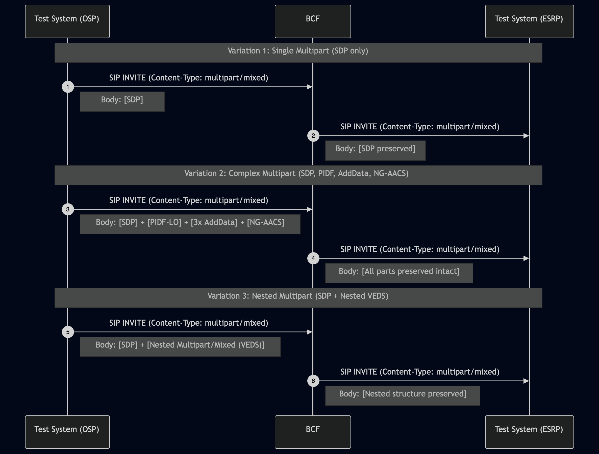

# Test Description: TD_BCF_008
## Overview
### Summary
Validation of Multipart MIME support within the BCF for complex SIP signaling.

### Description
This test ensures the BCF correctly processes and preserves Multipart MIME bodies as defined in RFC 2046. 
The BCF must forward INVITE messages containing nested or multiple body parts (SDP, PIDF-LO, Additional Data, VEDS) 
without loss of integrity.

### SIP transport types
Test can be performed with 2 different SIP transport types. Steps describing actions for specific one are marked as following:
- (TLS transport) - used by default inside ESInet on production environment
- (TCP transport) - used in lab for testing purposes only if default TLS is not possible

### References
* Requirements : RQ_BCF_188
* Test Case    : TC_BCF_xxx

### Requirements
IXIT config file for BCF

## Configuration
### Implementation Under Test Interface Connections
<!-- Identify each of the FEs that are part of the configuration and how they are connected -->
* Test System (OSP)
  * IF_OSP_BCF - connected to BCF IF_BCF_OSP
* BCF
  * IF_BCF_OSP - connected to Test System IF_OSP_BCF
  * IF_BCF_ESRP - connected to Test System IF_ESRP_BCF
* Test System (ESRP)
  * IF_ESRP_BCF - connected to IF_BCF_ESRP

### Test System Interfaces
<!-- Identify each of the test system interfaces and whether it will be in active or monitor mode -->
* Test System (OSP)
  * IF_OSP_BCF - Active
* BCF
  * IF_BCF_OSP - Active
  * IF_BCF_ESRP — Active (Must negotiate SIP Setup)
* Test System (ESRP)
  * IF_ESRP_BCF - Active 

 
### Connectivity Diagram
<!--
https://mermaid.live/edit#pako:eNptUu9PwjAQ_Vea-zxwK7JBvwlKQqJiGHyRmqWyCkTXkq5LRML_7nV1_IqXprn37t71tekeljqXwGBlxHZNHqdcEYyyevfETJY2S3ellUU2SV_IwhHEEwSJN9_vAlE2HnksVc7V1ajBcEQWbrshAzqY351JkUVpNn5e4O7A5eS_8mQ-a-oP6bRp-O-oc9eu9dL2mdiFg9fGPfA3Iq1W6-TQV06O6upxBFcQ4FNucmDWVDKAQppCOAh7p-Rg17KQHBimuTCfHLg6oGYr1KvWRSMzulqtgX2IrxJRtc2FlfcbgbcrjqxBr9IMdaUssDiqZwDbwzewXq_dj2nSSfoRjWjY7QewA0Zp3I663ZDiinsRjZNDAD_1qWE7SahrD8MOpZjeBiAqq9OdWjaeZL6x2jz571L_msMvcX2q6Q
-->


## Pre-Test Conditions

### Test System OSP
* Interfaces are connected to network
* Interfaces have IP addresses assigned by DHCP
* Device is active
* No active calls
* (TLS transport) Test System OSP has it's own certificate signed by PCA

### BCF
* Interfaces are connected to network
* Interfaces have IP addresses assigned by DHCP
* Default configuration is loaded
* Device has configured `Test System ESRP` as a next hop
* Device is initialized with steps from IXIT config file
* Device is active
* Device is in normal operating state
* No active calls

### Test System ESRP
* Interfaces are connected to network
* Interfaces have IP addresses assigned by DHCP
* Device is active
* No active calls
* (TLS transport) Test System ESRP has it's own certificate signed by PCA

## Test Sequence
### Test Preamble
#### Test System OSP
* Install SIPp by following steps from documentation[^1]
* Copy following XML scenario files to local storage:
  ```
    SIP_INVITE_from_OSP_with_multipart_mixed_SDP_only.xml
    SIP_INVITE_from_OSP_with_SDP_PIDF-LO_NG-AACS.xml
    SIP_INVITE_from_OSP_with_nested_multipart_body.xml
  ```
* (TLS transport) Copy to local storage PCA-signed certificate and private key files:
  > PCA-cacert.pem
  > PCA-cakey.pem
* (TLS transport) Copy to local storage PCA-signed certificate and private key files for BCF:
  > BCF-cacert.pem
  > BCF-cakey.pem
  

### Test Body
#### Variations

1. SIP_INVITE_from_OSP_with_multipart_mixed_SDP_only.xml
2. SIP_INVITE_from_OSP_with_SDP_PIDF-LO_NG-AACS.xml
3. SIP_INVITE_from_OSP_with_nested_multipart_body.xml

#### Stimulus
Send SIP packet to BCF - run following SIPp command on Test System OSP, example:
* (TCP transport)
  ```
  sudo sipp -t t1 -sf SCENARIO_FILE -i IF_OSP_BCF IF_BCF_OSP:5060
  ```
* (TLS transport)
  ```
  sudo sipp -t l1 -tls_cert PCA-cacert.pem -tls_key PCA-cakey.pem -sf SCENARIO_FILE -i IF_OSP_BCF IF_BCF_OSP:5061
  ```

#### Response
- The BCF must receive the INVITE and forward it to the ESRP.
- The forwarded INVITE at the ESRP interface must contain the exact same MIME structure and content as the original stimulus.
- Content-Type headers must correctly reflect the boundary strings and multipart subtypes.

VERDICT:
* PASSED - if all checks passed for variation
* FAILED - all other cases


### Test Postamble
#### Test System OSP
* stop all SIPp processes (if still running)
* archive all logs generated
* remove all SIPp scenarios
* disconnect interfaces from BCF
* (TLS transport) remove certificates

#### BCF
* disconnect IF_BCF_OSP
* disconnect IF_BCF_ESRP
* reconnect interfaces back to default

#### Test System ESRP
* stop all SIPp processes (if still running)
* stop Wireshark (if still running)
* archive traced packets in Wireshark
* remove certificate files
* disconnect interfaces from BCF
* (TLS transport) remove certificates


## Post-Test Conditions
### Test System OSP
* Test tools stopped
* interfaces disconnected from BCF

### BCF
* device connected back to default
* device in normal operating state

### Test System ESRP
* Test tools stopped
* interfaces disconnected from BCF


## Sequence Diagram
<!--
https://mermaid.live/edit#pako:eNq9VM9v2jAU_leefKJqoARCAj5UokAnpEHRgjis9ODFr2AtsTPHqcgQ__ucQNYNLpUmlkv8nt_3Q5-styeR4kgoyfBHjjLCsWAbzZK1BPux3CiZJ99QH-uUaSMikTJp4ClcAMtgiZmBsMgMJtCwvZvLyYfRYzlpf5d3k_DLJU3ZtDzH6bkyCOoNdanoVAAKK6YFM0JJcCmEQm5ihFkeG1FyQyMcL0DJuDiZscDm_b3Vt7PTBUznq-lyAo2RkgalaS6LFCkkNfwuETvkN3-oa7HZGlCvJRGFB8ULCs9W4-U4Y4kt_dHYv_FXFt_5IdWYoX5D_vLBNDoURipJY9ydxeHAYjp-dGDI-ZgZ5sD8U3M4HIXXTghu4blUbn5-qs7dXW2hKk8urhrkMI6rJ5e9xwlCGhaZKtUP5dqlMLcv1CLPXtlt3V9Nxv8lzHMbd7MSDo1K_6o5npQzo_PI5Br_ep3EIRstOKH2Fh2SoE5YWZJ9SbsmZosJrgm1R8709zVZy4PF2B3wVamkhmmVb7aEvrI4s1WecmbqhfS7q1Fy1COVS0NoN6g4CN2THaEdt9fy_MGgE_S8Xrvv9bsOKQj1g1bfD1zXH_QHbd91OweH_KxU263Aa3u9TuD7ntv3epatXHlhIaPaEnJhlJ4dl2S1Kw-_ACjeo-Q
-->



## Comments

Version:  010.3f.5.0.2

Date:     20260309

## Footnotes
[^1]: SIPp - tool for SIP packet simulations. Official documentation: https://sipp.sourceforge.net/doc/reference.html#Getting+SIPp
[^2]: Wireshark - tool for packet tracing and anaylisis. Official website: https://www.wireshark.org/download.html
[^3]: Wireshark configuration to decrypt SIP over TLS packets: https://www.zoiper.com/en/support/home/article/162/How%20to%20decode%20SIP%20over%20TLS%20with%20Wireshark%20and%20Decrypting%20SDES%20Protected%20SRTP%20Stream
[^4]: TLS v1.3 session keys logging + Wireshark configuration to decrypt traffic: https://my.f5.com/manage/s/article/K50557518
