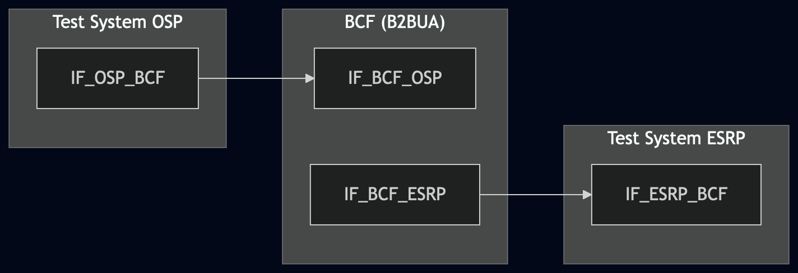
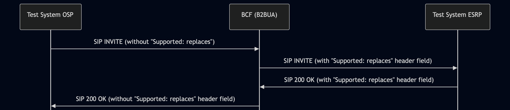

# Test Description: TD_BCF_009
## Overview
### Summary
Adding 'replaces' support as B2BUA

### Description
This test case verifies that the BCF B2BUA adds the "Supported: replaces" header field to an outgoing INVITE sent 
inside the ESInet.

### SIP transport types
Test can be performed with 2 different SIP transport types. Steps describing actions for specific one are marked as following:
- (TLS transport) - used by default inside ESInet on production environment
- (TCP transport) - used in lab for testing purposes only if default TLS is not possible

### References
* Requirements : RQ_BCF_111
* Test Case    : TC_BCF_009

### Requirements
IXIT config file for BCF

## Configuration
### Implementation Under Test Interface Connections
<!-- Identify each of the FEs that are part of the configuration and how they are connected -->
* Test System (OSP)
  * IF_OSP_BCF - connected to BCF IF_BCF_OSP
* BCF
  * IF_BCF_OSP - connected to Test System IF_OSP_BCF
  * IF_BCF_ESRP - connected to Test System IF_ESRP_BCF
* Test System (ESRP)
  * IF_ESRP_BCF - connected to IF_BCF_ESRP

### Test System Interfaces
<!-- Identify each of the test system interfaces and whether it will be in active or monitor mode -->
* Test System (OSP)
  * IF_OSP_BCF - Active
* BCF
  * IF_BCF_OSP - Active
  * IF_BCF_ESRP — Active
* Test System (ESRP)
  * IF_ESRP_BCF - Active 

 
### Connectivity Diagram
<!--
https://mermaid.live/edit#pako:eNp1UVtPgzAU_ivkPANpx6WjDz44XWKi2TJ8MiRLhQ6Ig5JSokj47xZQNjH26fTrdzmnp4NYJBwonM7iPc6YVMbjISoNfR62x124P-6s283Wsm6G61AO4IUwIvfhYT8xhmoCJ0rdvKaSVZnxzGtlhG2teGHMBsuUCeVlshBfPf7K_WM0d_Of03UbF963fNm8loMJBZcFyxP9Rd0AR6AyXvAIqC4TJt8iiMpe81ijRNiWMVAlG25CUyVM8buc6eQC6Imda41WrHwRovgh8SRXQj5NKxg3MVKAdvABFGPbXa_wGiGMAxKsnMCEFqiDkL3GAcIOcX0PI9yb8DmaYhs7fkAIIr7nINfzPROkaNJszk_lMMoULvWAXG5EUyotJf0XIL2Y8g
-->




## Pre-Test Conditions

### Test System OSP
* Interfaces are connected to network
* Interfaces have IP addresses assigned by DHCP
* Device is active
* No active calls
* (TLS transport) Test System OSP has it's own certificate signed by PCA

### BCF
* Interfaces are connected to network
* Interfaces have IP addresses assigned by DHCP
* Default configuration is loaded
* Device has configured `Test System ESRP` as a next hop
* Device is initialized with steps from IXIT config file
* Device is active
* Device is in normal operating state
* No active calls

### Test System ESRP
* Interfaces are connected to network
* Interfaces have IP addresses assigned by DHCP
* Device is active
* No active calls
* (TLS transport) Test System ESRP has it's own certificate signed by PCA

## Test Sequence
### Test Preamble
#### Test System OSP
* Install SIPp by following steps from documentation[^1]
* Copy following XML scenario files to local storage:
  ```
    SIP_INVITE_from_OSP.xml
  ```
* (TLS transport) Copy to local storage PCA-signed certificate and private key files:
  > PCA-cacert.pem
  > PCA-cakey.pem
* (TLS transport) Copy to local storage PCA-signed certificate and private key files for BCF:
  > BCF-cacert.pem
  > BCF-cakey.pem

#### Test System ESRP
* Install SIPp by following steps from documentation[^1]
* Copy following XML scenario file to local storage:
  ```
  SIP_INVITE_RECEIVE.xml
  ```
* Install Wireshark[^2]
* Copy to local storage SIP TLS certificate and private key files:
  ```
  cacert.pem
  cakey.pem
  ```
* Configure Wireshark to decode SIP over TLS packets[^3]
* Using Wireshark on 'Test System ESRP' start packet tracing on IF_ESRP_BCF interface - run following filter:
     * (TLS transport)
       > ip.addr == IF_ESRP_BCF_IP_ADDRESS and tls
     * (TCP transport)
       > ip.addr == IF_ESRP_BCF_IP_ADDRESS and sip
* Prepare 'Test System ESRP' to receive SIP message - run SIPp tool with one of following commands:
     * (TCP transport)
       ```
       sudo sipp -t t1 -sf SIP_INVITE_RECEIVE.xml -i IF_ESRP_BCF -p 5060 -trace_logs -trace_msg -timeout 
       10 -max_recv_loops 1 -m 999
       ```
     * (TLS transport)
       ```
       sudo sipp -t l1 -tls_cert PCA-cacert.pem -tls_key PCA-cakey.pem -sf SIP_INVITE_RECEIVE.xml -i 
       IF_ESRP_BCF -p 5061 -trace_logs -trace_msg -timeout 10 -max_recv_loops 1 -m 999
       ```


### Test Body

#### Stimulus
Send SIP packet to BCF - run following SIPp command on Test System OSP, example:
* (TCP transport)
  ```
  sudo sipp -t t1 -sf SIP_INVITE_from_OSP.xml -i IF_OSP_BCF IF_BCF_OSP:5060
  ```
* (TLS transport)
  ```
  sudo sipp -t l1 -tls_cert PCA-cacert.pem -tls_key PCA-cakey.pem -sf SIP_INVITE_from_OSP.xml -i IF_OSP_BCF IF_BCF_OSP:5061
  ```

#### Response
- The BCF must receive the SIP INVITE and forward it to the ESRP.
- The forwarded SIP INVITE at the ESRP interface must contain "Supported:" header field with "replaces" in its values.

VERDICT:
* PASSED - if all checks passed for variation
* FAILED - all other cases


### Test Postamble
#### Test System OSP
* stop all SIPp processes (if still running)
* stop Wireshark (if still running)
* archive traced packets in Wireshark
* archive all logs generated
* remove all SIPp scenarios
* disconnect interfaces from BCF
* (TLS transport) remove certificates

#### BCF
* disconnect IF_BCF_OSP
* disconnect IF_BCF_ESRP
* reconnect interfaces back to default

#### Test System ESRP
* stop all SIPp processes (if still running)
* stop Wireshark (if still running)
* archive traced packets in Wireshark
* remove certificate files
* disconnect interfaces from BCF
* (TLS transport) remove certificates


## Post-Test Conditions
### Test System OSP
* Test tools stopped
* interfaces disconnected from BCF

### BCF
* device connected back to default
* device in normal operating state

### Test System ESRP
* Test tools stopped
* interfaces disconnected from BCF


## Sequence Diagram
<!--
https://mermaid.live/edit#pako:eNqVkl1PgzAUhv9Kc640gaWAG9CLJTpnshi3RRYvTG8aONuIo8VSonPZf7eAaAzxwpt-nL7Pe07bc4JUZQgMXNflMlVym-8Yl4QUudZKX6dG6YqRrThUyGUrqvC1RpnibS52WhSNmJBSaJOneSmkIatkTURFNlgZkhwrg0UTGupuZneNzk7Ds3nyODBpYp2yG62pO51anJHF8mmxmZOL5Ypw0FgeRIoVB7JHkaG-_AKs1AKNzQ_xlpu9ZZK6LJU2mDEyxDu64fp8yWJNfErJ6v4_Dl1-W_Zvg7-L7m8LDux0ngEzukYHCtSFaLZwahQczB4L5MDsMhP6hQOXZ8vYl3xWqugxrerdHlj7lw7UZSZM_4nfUY3S5p6pWhpgQXBFWxdgJ3gHFvkjz594YRgHURR7gQNHYD6djPw4GAfUD-Jx5AdnBz7arHQUxnTshXFkwzQMqQVEbVRylGlfE2a57bCHrgfbVjx_AvNVyto
-->



## Comments

Version:  010.3f.5.0.1

Date:     20260420

## Footnotes
[^1]: SIPp - tool for SIP packet simulations. Official documentation: https://sipp.sourceforge.net/doc/reference.html#Getting+SIPp
[^2]: Wireshark - tool for packet tracing and anaylisis. Official website: https://www.wireshark.org/download.html
[^3]: Wireshark configuration to decrypt SIP over TLS packets: https://www.zoiper.com/en/support/home/article/162/How%20to%20decode%20SIP%20over%20TLS%20with%20Wireshark%20and%20Decrypting%20SDES%20Protected%20SRTP%20Stream
[^4]: TLS v1.3 session keys logging + Wireshark configuration to decrypt traffic: https://my.f5.com/manage/s/article/K50557518
