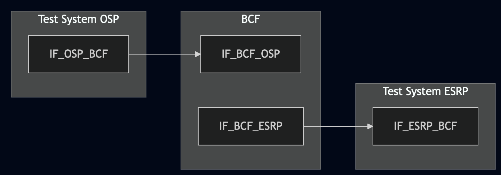
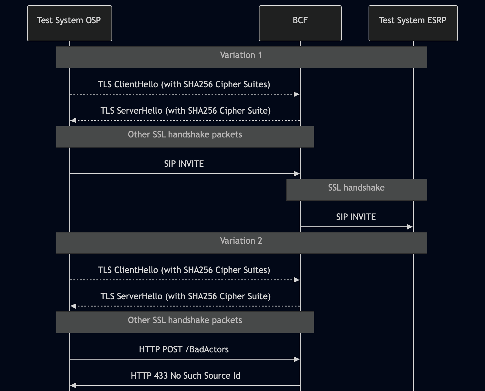

# Test Description: TD_BCF_010
## Overview
### Summary
SHA-256 support

### Description
This test case verifies support of SHA-256 by the BCF 

### References
* Requirements : RQ_BCF_147
* Test Case    : TC_BCF_010

### Requirements
IXIT config file for BCF

## Configuration
### Implementation Under Test Interface Connections
<!-- Identify each of the FEs that are part of the configuration and how they are connected -->
* Test System (OSP)
  * IF_OSP_BCF - connected to BCF IF_BCF_OSP
* BCF
  * IF_BCF_OSP - connected to Test System IF_OSP_BCF
  * IF_BCF_ESRP - connected to Test System IF_ESRP_BCF
* Test System (ESRP)
  * IF_ESRP_BCF - connected to IF_BCF_ESRP

### Test System Interfaces
<!-- Identify each of the test system interfaces and whether it will be in active or monitor mode -->
* Test System (OSP)
  * IF_OSP_BCF - Active
* BCF
  * IF_BCF_OSP - Active
  * IF_BCF_ESRP — Active
* Test System (ESRP)
  * IF_ESRP_BCF - Active 

 
### Connectivity Diagram
<!--
https://mermaid.live/edit#pako:eNp1UU1rhDAQ_SsyZ1c0EaM59NBtFwotXdaeirCkJqvS1UiMtFb8741rdT-gc5o3b957A9NDKrkACoej_EpzprT1vEsqy9TTZv8ab_f3681qdWeAacbBQo74Md5tJ3bsxtFEN-1HplidW2-i0VbcNVqU1iK-dp9mouI30oW6yLu1mG_4z-My_rz3J74-2YjBhkwVHKhWrbChFKpkI4R-XElA56IUCVDTcqY-E0iqwWhqVr1LWc4yJdssB3pgx8agtuZMi4eCmYPOKyZMqLVsKw3UwycLoD18A0XEwR4hYUgwJl6A3cCGDmiEnCAIPeT6BPu-G3mDDT-nUNeJIjdAfhT4CBPkYWQDa7WMuyqd8wQvtFQv06dPDx9-AXsmlF8
-->




## Pre-Test Conditions

### Test System OSP
* Interfaces are connected to network
* Interfaces have IP addresses assigned by DHCP
* Device is active
* No active calls
* Test System OSP has its own certificate signed by PCA
* ng911 repository cloned to local storage

### BCF
* Interfaces are connected to network
* Interfaces have IP addresses assigned by DHCP
* Default configuration is loaded
* Device has configured `Test System ESRP` as a next hop
* Device is initialized with steps from IXIT config file
* Device is active
* Device is in normal operating state
* No active calls

### Test System ESRP
* Interfaces are connected to network
* Interfaces have IP addresses assigned by DHCP
* Device is active
* No active calls
* Test System ESRP has its own certificate signed by PCA
* ng911 repository cloned to local storage

## Test Sequence
### Test Preamble
#### Test System OSP
* Copy following XML scenario files to local storage:
  ```
    SIP_INVITE_from_OSP.xml
    sip_service_ssl_sha256.yaml
    http_service_ssl_sha256.yaml
  ```
* Install Wireshark[^2]
* Copy to local storage PCA-signed certificate and private key files:
```
  OSP-cacert.pem
  OSP-cakey.pem
```
* Copy to local storage PCA-signed certificate and private key files for BCF:
```
  BCF-cacert.pem
  BCF-cakey.pem
```
* Configure Wireshark to decode SIP over TLS packets[^3]

#### Test System ESRP
* Install SIPp by following steps from documentation[^1]
* Copy following XML scenario file to local storage:
  ```
  SIP_INVITE_RECEIVE.xml
  ```
* Install Wireshark[^2]
* Copy to local storage PCA-signed certificate and private key files:
```
  ESRP-cacert.pem
  ESRP-cakey.pem
```
* Configure Wireshark to decode SIP over TLS packets[^3]
* Using Wireshark on 'Test System ESRP' start packet tracing on IF_ESRP_BCF interface - run following filter:
     * (TLS transport)
       > ip.addr == IF_ESRP_BCF_IP_ADDRESS and tls
* Prepare 'Test System ESRP' to receive SIP message - run SIPp tool with following command:
     * (TLS transport)
       ```
       sudo sipp -t l1 -tls_cert ESRP-cacert.pem -tls_key ESRP-cakey.pem -sf SIP_INVITE_RECEIVE.xml -i 
       IF_ESRP_BCF_IP -p 5061 -trace_logs -trace_msg -timeout 10 -max_recv_loops 1 -m 999
       ```


### Test Body
#### Variations

1. SIP_over_TLS
2. HTTPS

#### Stimulus
- Send SIP INVITE to the BCF - run sip_service on Test System OSP, example:
  - Variation 1 (SIP_over_TLS)
    ```
       sudo python3 sip_entry.py --bind-ip IF_OSP_BCF_IP_ADDRESS --bind-port 5061 --remote-ip IF_BCF_OSP_IP_ADDRESS --remote-port 5061 --protocol TLS --scenario SIP_INVITE_from_OSP.xml --message-timeout 5000 --transaction-timeout 5000 --tls-cert OSP-cacert.pem --tls-key OSP-cakey.pem --ssl-config-file test_suite/services/stub_server/sip_service/config/sip_service_ssl_sha256.yaml
    ```
  - Variation 2 (HTTPS)
    ```
       sudo python3 http_entry.py --ip IF_OSP_BCF_IP_ADDRESS --port 8080 --role SENDER --path /BadActors --method POST --body test@ng911.example.com --server_cert OSP-cacert.pem --server_key OSP-cakey.pem --ssl-config-file test_suite/services/stub_server/http/config/http_service_ssl_sha256.yaml
    ```
- using Wireshark verify if Test System OSP starts SSL handshake with TLS ClientHello containing 'Cipher Suites' with SHA-256 only

#### Response
Using Wireshark verify if BCF accepts SHA-256 - TLS ServerHello contains Cipher Suite with SHA-256

VERDICT:
* ERROR - if TLS ClientHello from Test System OSP does not contain Cipher Suites with SHA-256 only
* PASSED - if all checks passed for variation
* FAILED - other cases


### Test Postamble
#### Test System OSP
* stop all SIPp processes (if still running)
* stop Wireshark (if still running)
* archive traced packets in Wireshark
* archive all logs generated
* remove all SIPp scenarios
* disconnect interfaces from BCF
* (TLS transport) remove certificates

#### BCF
* disconnect IF_BCF_OSP
* disconnect IF_BCF_ESRP
* reconnect interfaces back to default

#### Test System ESRP
* stop all SIPp processes (if still running)
* stop Wireshark (if still running)
* archive traced packets in Wireshark
* remove certificate files
* disconnect interfaces from BCF
* (TLS transport) remove certificates


## Post-Test Conditions
### Test System OSP
* Test tools stopped
* interfaces disconnected from BCF

### BCF
* device connected back to default
* device in normal operating state

### Test System ESRP
* Test tools stopped
* interfaces disconnected from BCF


## Sequence Diagram
<!--
https://mermaid.live/edit#pako:eNrVU01v2zAM_SsETytgZ_HH7ESHAG3WIQG6JpiMHgZfBJuNhcRSJsvbsiD_vbLdrN0yYLvuIsvke49PBHnEQpeEDH3fz1Wh1aPcsFwB1NIYba4Lq03D4FHsGspVD2roS0uqoPdSbIyoOzDAXhgrC7kXysKKr0E0kFFjgR8aS3UXusTdzD90OPe5zN3yTxciXWxADue9tgT6K5lO3uvTDB6EkcJKrSAYUC7n-7OZq8Igu-Mw30lSdkG7nYY336StgC-uw3cJzOW-clq8lZaaq4HsWB3ZaQxkTsbV-wv56o_2egMr26P4HVRClU0ltuSeXWzJNi9un83y5RqW9w_L7PZ3PZc-P_cXqRfPs9lz-pXGPzUt_M-btsiyNaxXPIO3N6Icxvd1W3pTPSiOIlfNFS-cH92agmBZnscLPdwYWSKzpiUPazK16H7x2CFydI5qypG5aynMNsdcnRzHje5nreszzeh2UyHrl8fDdl8Ke96an1FDqiQz162yyIIgiHoVZEf8jixMR1GQppNJGkVpkETjxMMDsmk4SpJJEI7jNIrj8TQ4efijrzseTafjJIynSRxGaRhEgYeitZofVHF2RaV0Xfk4rH2__acnTv87Bg-->



## Comments

Version:  010.3f.5.0.1

Date:     20260428

## Footnotes
[^1]: SIPp - tool for SIP packet simulations. Official documentation: https://sipp.sourceforge.net/doc/reference.html#Getting+SIPp
[^2]: Wireshark - tool for packet tracing and anaylisis. Official website: https://www.wireshark.org/download.html
[^3]: Wireshark configuration to decrypt SIP over TLS packets: https://www.zoiper.com/en/support/home/article/162/How%20to%20decode%20SIP%20over%20TLS%20with%20Wireshark%20and%20Decrypting%20SDES%20Protected%20SRTP%20Stream
[^4]: TLS v1.3 session keys logging + Wireshark configuration to decrypt traffic: https://my.f5.com/manage/s/article/K50557518
