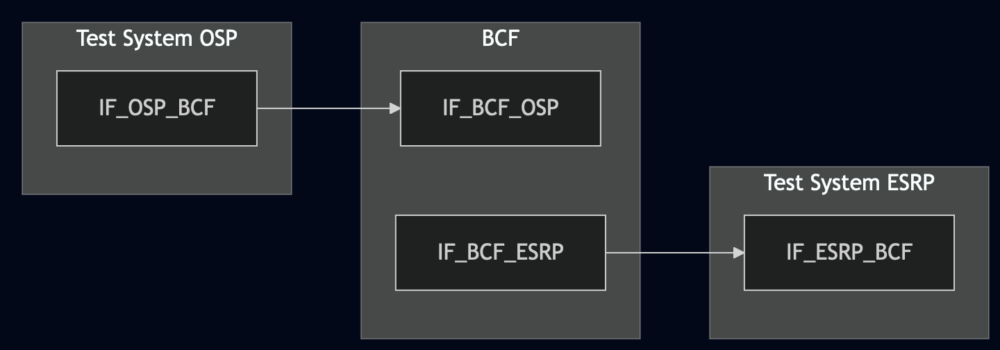
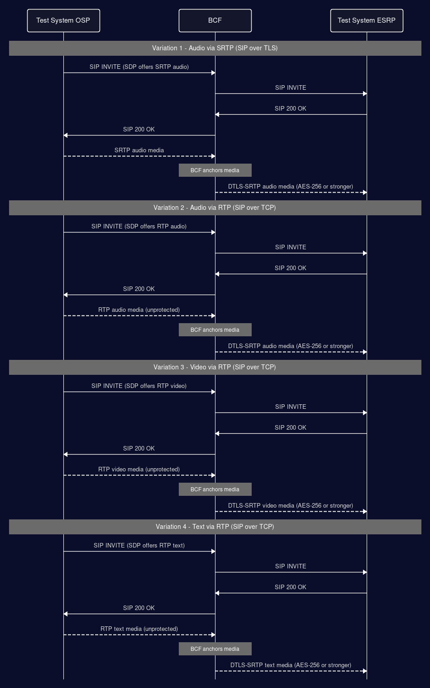

# Test Description: TD_BCF_011
## Overview
### Summary
Forwarding media by media-anchoring BCF

### Description
This test verifies if media-anchoring BCF accepts audio/video/text media sent over RTP/SRTP and forwards inside the ESInet via SRTP (with AES-256 or stronger) using DTLS.

### References
* Requirements : RQ_BCF_022, RQ_BCF_044
* Test Case    : n/a

### Requirements
IXIT config file for BCF

## Configuration
### Implementation Under Test Interface Connections
<!-- Identify each of the FEs that are part of the configuration and how they are connected -->
* Test System (OSP)
  * IF_OSP_BCF - connected to BCF IF_BCF_OSP
* BCF
  * IF_BCF_OSP - connected to Test System IF_OSP_BCF
  * IF_BCF_ESRP - connected to Test System IF_ESRP_BCF
* Test System (ESRP)
  * IF_ESRP_BCF - connected to IF_BCF_ESRP

### Test System Interfaces
<!-- Identify each of the test system interfaces and whether it will be in active or monitor mode -->
* Test System (OSP)
  * IF_OSP_BCF - Active
* BCF
  * IF_BCF_OSP - Active
  * IF_BCF_ESRP — Active
* Test System (ESRP)
  * IF_ESRP_BCF - Active 

 
### Connectivity Diagram
<!--
https://mermaid.live/edit#pako:eNp1UU1rhDAQ_SsyZ1c0EaM59NBtFwotXdaeirCkJqvS1UiMtFb8741rdT-gc5o3b957A9NDKrkACoej_EpzprT1vEsqy9TTZv8ab_f3681qdWeAacbBQo74Md5tJ3bsxtFEN-1HplidW2-i0VbcNVqU1iK-dp9mouI30oW6yLu1mG_4z-My_rz3J74-2YjBhkwVHKhWrbChFKpkI4R-XElA56IUCVDTcqY-E0iqwWhqVr1LWc4yJdssB3pgx8agtuZMi4eCmYPOKyZMqLVsKw3UwycLoD18A0XEwR4hYUgwJl6A3cCGDmiEnCAIPeT6BPu-G3mDDT-nUNeJIjdAfhT4CBPkYWQDa7WMuyqd8wQvtFQv06dPDx9-AXsmlF8
-->




## Pre-Test Conditions

### Test System OSP
* Interfaces are connected to network
* Interfaces have IP addresses assigned by DHCP
* Device is active
* No active calls
* Test System OSP has its own certificate signed by PCA
* ng911 repository cloned to local storage

### BCF
* Interfaces are connected to network
* Interfaces have IP addresses assigned by DHCP
* Default configuration is loaded
* Device has configured `Test System ESRP` as a next hop
* Device is initialized with steps from IXIT config file
* Device is active
* Device is in normal operating state
* No active calls

### Test System ESRP
* Interfaces are connected to network
* Interfaces have IP addresses assigned by DHCP
* Device is active
* No active calls
* Test System ESRP has its own certificate signed by PCA
* ng911 repository cloned to local storage
* Test System ESRP is configured to answer the calls with media using DTLS-SRTP

## Test Sequence
### Test Preamble
#### Test System OSP
* Install SIPp by following steps from documentation[^1]
* Copy following XML scenario files to local storage:
  ```
    SIP_basic_call_with_SRTP.xml
    SIP_basic_call_with_RTP.xml
    SIP_basic_call_from_OSP_Audio_RTP.xml
    SIP_basic_call_from_OSP_Video_RTP.xml
    SIP_basic_call_from_OSP_Text_RTP.xml
  ```
* Copy following media file(s) to local storage, used by SIPp to play back real media during the call (rather than a synthetic/dummy stream):
  ```
    audio_media_srtp_aes256.pcap
    audio_media_rtp.pcap
    video_media_rtp.pcap
    text_media_rtp.pcap
  ```
  <!-- Filenames are placeholders - point these at your actual media-bearing pcap assets, one pre-encrypted with SRTP/AES-256 for Variation 1, one plain RTP for Variation 2, and one each of audio/video/text for the RTP Variations 3-5. -->
* Install Wireshark[^2]
* Copy to local storage PCA-signed certificate and private key files:
```
  OSP-cacert.pem
  OSP-cakey.pem
```
* Copy to local storage PCA-signed certificate and private key files for BCF:
```
  BCF-cacert.pem
  BCF-cakey.pem
```
* Configure Wireshark to decode SIP over TLS packets[^3]
* Using Wireshark on 'Test System OSP' start packet tracing on IF_OSP_BCF interface - run following filter:
     > ip.addr == IF_OSP_BCF_IP_ADDRESS and (tls or udp or tcp)

#### Test System ESRP
* Install SIPp by following steps from documentation[^1]
* Copy following XML scenario files to local storage:
  ```
  SIP_RECEIVE_basic_call_and_answer_with_SRTP_audio.xml
  SIP_RECEIVE_basic_call_and_answer_with_SRTP_video.xml
  SIP_RECEIVE_basic_call_and_answer_with_SRTP_text.xml
  ```
* Install Wireshark[^2]
* Copy to local storage PCA-signed certificate and private key files:
```
  ESRP-cacert.pem
  ESRP-cakey.pem
```
* Configure Wireshark to decode SIP over TLS packets[^3]
* Using Wireshark on 'Test System ESRP' start packet tracing on IF_ESRP_BCF interface - run following filter:
      > ip.addr == IF_ESRP_BCF_IP_ADDRESS and (tls or udp or tcp)

* Prepare 'Test System ESRP' to receive SIP message - run SIPp tool with the scenario matching the variation under test:
     * (TLS)
       ```
       sudo sipp -t l1 -tls_cert ESRP-cacert.pem -tls_key ESRP-cakey.pem -sf SIPP_XML_SCENARIO_FILE -i 
       IF_ESRP_BCF_IP -p 5061 -trace_logs -trace_msg -timeout 10 -max_recv_loops 1 -m 999
       ```
       Variations 1-2 - use SIPp scenario file SIP_RECEIVE_basic_call_and_answer_with_SRTP_audio.xml
       Variation 3 - use SIP_RECEIVE_basic_call_and_answer_with_SRTP_video.xml
       Variation 4 - use SIP_RECEIVE_basic_call_and_answer_with_SRTP_text.xml


### Test Body
#### Variations

1. Call from OSP with SIP signalling over TLS and audio media via SRTP.
   Use XML scenario file: SIP_basic_call_with_SRTP.xml
2. Call from OSP with SIP over TCP and audio media via RTP.
   Use XML scenario file: SIP_basic_call_with_RTP.xml
3. Call from OSP with SIP over TCP and video media via RTP.
   Use XML scenario file: SIP_basic_call_from_OSP_Video_RTP.xml
4. Call from OSP with SIP over TCP and text media via RTP.
   Use XML scenario file: SIP_basic_call_from_OSP_Text_RTP.xml


#### Stimulus
- Send SIP INVITE to the BCF and play back real media using SIPp - example:
  - Variation 1 (SIP signaling over TLS, audio media via SRTP)
    ```
       sudo sipp -t l1 -tls_cert OSP-cacert.pem -tls_key OSP-cakey.pem -sf SIP_basic_call_with_SRTP.xml -i IF_OSP_BCF_IP -p 5061 -rsa IF_BCF_OSP_IP:5061 -trace_logs -trace_msg -timeout 10 -max_recv_loops 1
    ```
    
  - Variation 2-4 (SIP over TCP, media via RTP)
    ```
       sudo sipp -t t1 -sf SIPP_XML_SCENARIO_FILE -i IF_OSP_BCF_IP -p 5060 -rsa IF_BCF_OSP_IP:5060 -trace_logs -trace_msg -timeout 10 -max_recv_loops 1
    ```


#### Response
- Using Wireshark verify if:
  * media stream has started successfully between IF_OSP_BCF and IF_BCF_OSP:
   - Variation 1: SRTP packets are exchanged
   - Variation 2-4: RTP packets are exchanged
   - in all variations the media packets are carried over UDP (RQ_BCF_044) - filter: `ip.addr == IF_OSP_BCF_IP_ADDRESS and udp && !tcp`
  * the SDP body in SIP INVITE from the BCF contains:
   - a=setup and a=fingerprint attributes
   - media ('m=') line uses one of following:
     UDP/TLS/RTP/SAVP
     UDP/TLS/RTP/SAVPF
   - media ('m=') line does NOT advertise a non-UDP transport (e.g. TCP/RTP/SAVP, TCP/RTP/SAVPF, DCCP/TLS/RTP/SAVP, DCCP/TLS/RTP/SAVPF)
  * the forwarded media stream is carried over UDP (RQ_BCF_044) - on IF_BCF_ESRP / IF_ESRP_BCF confirm with filter:
     > ip.addr == IF_ESRP_BCF_IP_ADDRESS and udp && !tcp
   - every media packet of the stream is an IPv4/IPv6 datagram with protocol field UDP (ip.proto == 17 / ipv6.nxt == 17)
   - the UDP source and destination ports match the port advertised in the 'm=' line of the SDP offer/answer
   - no RTP/SRTP or DTLS packet of this stream is observed over TCP or DCCP on either leg
     (Wireshark: `Telephony > RTP > RTP Streams` lists the stream, and `Statistics > Conversations > UDP` shows the media 5-tuple)
  * DTLS handshake was successful between IF_BCF_ESRP and IF_ESRP_BCF. Following example messages are exchanged over DTLSv1.2:
     Client Hello
     Hello Verify Request
     Client Hello
     Server Hello, Certificate
     Server Key Exchange, Certificate Request, Server Hello Done
     Certificate, Client Key Exchange, Certificate Verify
     Change Cipher Spec, Encrypted Handshake Message
  * media stream has started successfully between IF_BCF_ESRP and IF_ESRP_BCF
  * media stream between IF_BCF_ESRP and IF_ESRP_BCF is SRTP with AES-256 or stronger

VERDICT:
* PASSED - if all checks passed for variation
* FAILED - other cases


### Test Postamble
#### Test System OSP
* stop all SIPp processes (if still running)
* stop Wireshark (if still running)
* archive traced packets in Wireshark
* archive all logs generated
* remove all SIPp scenarios
* disconnect interfaces from BCF
* (TLS transport) remove certificates

#### BCF
* disconnect IF_BCF_OSP
* disconnect IF_BCF_ESRP
* reconnect interfaces back to default

#### Test System ESRP
* stop all SIPp processes (if still running)
* stop Wireshark (if still running)
* archive traced packets in Wireshark
* remove certificate files
* disconnect interfaces from BCF
* (TLS transport) remove certificates


## Post-Test Conditions
### Test System OSP
* Test tools stopped
* interfaces disconnected from BCF

### BCF
* device connected back to default
* device in normal operating state

### Test System ESRP
* Test tools stopped
* interfaces disconnected from BCF


## Sequence Diagram
<!--
https://mermaid.live/edit#pako:eNrNlU9rwkAQxb_KsCcFA639c8hBsGpBWjSY4GkvSzLRpc2u3WykIn73zibWqulBqEpPgZn33sz8ctg1i3WCzAfmeR5XsVapnPlcAWTSGG26sdUm9yEV7zlyVYpy_ChQxdiXYmZE5sQAC2GsjOVCKAvjMACRQ4S5hXCVW8xcqa576j07HX3qvUE4qYW4GleVdqQtgl6icdGtsuXDVBgprNQKbsGDbpFIDUspIJxEATTCYVA5otewWaWQ1-t0aAEfXHc4mg6jASn7pExTNHllFS5payExWap5P56q56r7ee2bGxi_7PtoYL3lttjZdvMgw0SK42tLUQlOxXP6NfsqN2K3W5-u9I7ToNEdhF774RG0gdwarWZomicybR8wPULaC05GemWiNQSFWhi6NLaYNP8R3jvCO5UJngPv0uVcD2857kJ4D7L_gPee8Eb4ac9A11LM9eC6aRdiux_9O1rWApahyYRM3COxdnGc2TlmyKnAWSLMG2dcbZxSFFaHKxVTx5oCqVIsEmG_Xwq2fUc2X3IT5Yg
-->



## Comments

Version:  011.3f.5.0.2

Date:     20260729

## Footnotes
[^1]: SIPp - tool for SIP packet simulations. Official documentation: https://sipp.sourceforge.net/doc/reference.html#Getting+SIPp
[^2]: Wireshark - tool for packet tracing and analysis. Official website: https://www.wireshark.org/download.html
[^3]: Wireshark configuration to decrypt SIP over TLS packets: https://www.zoiper.com/en/support/home/article/162/How%20to%20decode%20SIP%20over%20TLS%20with%20Wireshark%20and%20Decrypting%20SDES%20Protected%20SRTP%20Stream
[^4]: TLS v1.3 session keys logging + Wireshark configuration to decrypt traffic: https://my.f5.com/manage/s/article/K50557518
[^5]: RFC 5763 - Framework for Establishing a SRTP Security Context Using DTLS: https://www.rfc-editor.org/rfc/rfc5763
[^6]: RFC 5764 - DTLS Extension to Establish Keys for SRTP: https://www.rfc-editor.org/rfc/rfc5764
