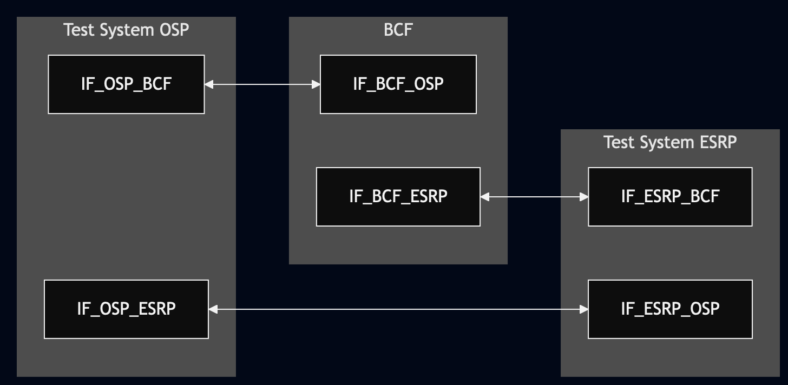
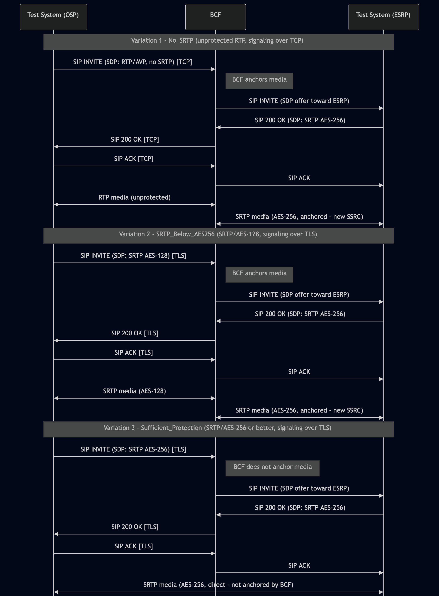

# Test Description: TD_BCF_012
## Overview
### Summary
Unprotected media anchoring and encryption by a non-anchoring BCF.

### Description
This test verifies if non-anchoring BCF makes exception when received unprotected media and forwards inside ESInet as SRTP with AES-256 or stronger

### References
* Requirements : RQ_BCF_023
* Test Case    : n/a

### Requirements
IXIT config file for BCF

## Configuration
### Implementation Under Test Interface Connections
<!-- Identify each of the FEs that are part of the configuration and how they are connected -->
* Test System (OSP)
  * IF_OSP_BCF - connected to BCF IF_BCF_OSP
  * IF_OSP_ESRP - connected to Test System (ESRP) IF_ESRP_OSP (direct media path for Variation 3, where the BCF does not anchor media)
* BCF
  * IF_BCF_OSP - connected to Test System IF_OSP_BCF
  * IF_BCF_ESRP - connected to Test System IF_ESRP_BCF
* Test System (ESRP)
  * IF_ESRP_BCF - connected to IF_BCF_ESRP
  * IF_ESRP_OSP - connected to Test System (OSP) IF_OSP_ESRP (direct media path for Variation 3, where the BCF does not anchor media)

### Test System Interfaces
<!-- Identify each of the test system interfaces and whether it will be in active or monitor mode -->
* Test System (OSP)
  * IF_OSP_BCF - Active
  * IF_OSP_ESRP - Active (Variation 3 only)
* BCF
  * IF_BCF_OSP - Active
  * IF_BCF_ESRP - Active
* Test System (ESRP)
  * IF_ESRP_BCF - Active
  * IF_ESRP_OSP - Active (Variation 3 only)

### Connectivity Diagram
<!--
https://mermaid.live/edit#pako:eNp1U11rpEAQ_CtDH4svZvHb7HDcw-Zu4eDChbjkIQhh1FmV6MwyjiRG_O-ZcRPjmsR-6a6q7i6hp4eUZxQwrFZ9yUqJUW_IgtbUwMhISEMNE52AOyJKklS0MbQmIeljLnjLMi38YRGL2kRrj6KsieiueMXFicp0zKgtFxkVH4KDo2Mm2NNn-RVdlYx-hadV20gqto_5SHiZjjkxLlxwB87kjtRl1WliL2jSpgWV6DoyhmFYrWJ2qPhTWhAh0b_bmCH1_d09_I9uHrZXu58XF79UpTKNTKyu_0S3N2-0TjV21r3kp_6mTXJBjgXa00aiqFPWazSx5_s_YXrUCaQsW8xb6s9cL5x_N2Pu6UP31nz-n3NwWjNOBBNyUWaApWipCTUVNdEl9FoUw3hnMWCV6tOLIWaD6jkSds95_d6mri4vAB9I1aiqPWZE0t8lUT7rCRVqn76xlknATjDOANzDM-DLzdoL7E1oWZ4TerbnmtABdt21u3FdJ7AD27NsNxhMeBmXWutLL_R93wk3oWuHvuWbQFrJo46l75ZoVkourk8vaXxQwyu1k_65
-->




## Pre-Test Conditions

### Test System OSP
* Interfaces are connected to network
* Interfaces have IP addresses assigned by DHCP
* Device is active
* No active calls
* Test System OSP has its own certificate signed by PCA
* ng911 repository cloned to local storage

### BCF
* Interfaces are connected to network
* Interfaces have IP addresses assigned by DHCP
* Default configuration is loaded
* Device has configured `Test System ESRP` as a next hop
* Device is initialized with steps from IXIT config file
* Device is active
* Device is in normal operating state
* Device does not routinely anchor media (default behavior)
* SRTP support with AES-256 is enabled
* No active calls

### Test System ESRP
* Interfaces are connected to network
* Interfaces have IP addresses assigned by DHCP
* Device is active
* No active calls
* Test System ESRP has its own certificate signed by PCA
* ng911 repository cloned to local storage

## Test Sequence
### Test Preamble
#### Test System OSP
* Install SIPp by following steps from documentation[^1]
* Copy following scenario files to local storage:
  ```
    SIP_basic_call_with_RTP.xml
    SIP_call_from_OSP_SRTP_AES128.xml
    SIP_call_from_OSP_SRTP_AES256.xml
  ```

* Copy following audio media file(s) to local storage, used by SIPp to play back real audio media during the call (rather than a synthetic/dummy stream):
  ```
    g711ulaw_rtp_stream.pcap
    g711ulaw_srtp_AES128_stream.pcap
    g711ulaw_srtp_AES256_stream.pcap
  ```
  
* Copy following TLS config files to local storage:
```
    sip_service_srtp_aes128.yaml
    sip_service_srtp_aes256.yaml
```

* Install Wireshark[^2]
* Copy to local storage PCA-signed certificate and private key files:
```
  OSP-cacert.pem
  OSP-cakey.pem
```
* Copy to local storage PCA-signed certificate and private key files for BCF:
```
  BCF-cacert.pem
  BCF-cakey.pem
```
* Configure Wireshark to decode SIP over TLS packets[^3]
* Using Wireshark on 'Test System OSP' start packet tracing on IF_OSP_BCF interface - run following filter:
     > ip.addr == IF_OSP_BCF_IP_ADDRESS and (tls or udp or tcp)
* Using Wireshark on 'Test System OSP' start packet tracing on IF_OSP_ESRP interface (Variation 3 only) - run following filter:
     > ip.addr == IF_OSP_ESRP_IP_ADDRESS and (tls or udp or tcp)

#### Test System ESRP
* Install SIPp by following steps from documentation[^1]
* Copy following XML scenario file to local storage:
  ```
  SIP_RECEIVE_basic_call_and_answer_with_SRTP.xml
  ```
* Install Wireshark[^2]
* Copy to local storage PCA-signed certificate and private key files:
```
  ESRP-cacert.pem
  ESRP-cakey.pem
```
* Configure Wireshark to decode SIP over TLS packets[^3]
* Using Wireshark on 'Test System ESRP' start packet tracing on IF_ESRP_BCF interface - run following filter:
     * (TLS transport)
       > ip.addr == IF_ESRP_BCF_IP_ADDRESS and (tls or udp or tcp)
* Using Wireshark on 'Test System ESRP' start packet tracing on IF_ESRP_OSP interface (Variation 3 only) - run following filter:
     > ip.addr == IF_ESRP_OSP_IP_ADDRESS and (tls or udp or tcp)
* Prepare 'Test System ESRP' to receive SIP message - run SIPp tool with following command:
     * (TLS transport)
       ```
       sudo sipp -t l1 -tls_cert ESRP-cacert.pem -tls_key ESRP-cakey.pem -sf SIP_RECEIVE_basic_call_and_answer_with_SRTP.xml -i 
       IF_ESRP_BCF_IP -p 5061 -trace_logs -trace_msg -timeout 10 -max_recv_loops 1 -m 999
       ```


### Test Body
#### Variations

1. No_SRTP - OSP sends unprotected RTP audio media (no SRTP), signaling over TCP
2. SRTP_Below_AES256 - OSP sends SRTP-protected audio media using a cipher weaker than AES-256 (e.g. AES-128), signaling over TLS
3. Sufficient_Protection - OSP sends SRTP audio media already protected with AES-256 or stronger, signaling over TLS

#### Stimulus
Establish a call with audio media by running SIPp or custom sip_service - example:

Variation 1 (No_SRTP, signaling over TCP)
    ```
       sudo sipp -t t1 -sf SIP_basic_call_with_RTP.xml -i IF_OSP_BCF_IP -p 5060 -rsa IF_BCF_OSP_IP:5060 -trace_logs -trace_msg -timeout 10 -max_recv_loops 1
    ```

Variation 2 (SRTP_Below_AES256, signaling over TLS)
    ```
       sudo python3 sip_entry.py --bind-ip IF_OSP_BCF_IP_ADDRESS --bind-port 5061 --remote-ip IF_BCF_OSP_IP_ADDRESS --remote-port 5061 --protocol TLS --scenario SIP_call_from_OSP_SRTP_AES128.xml --message-timeout 5000 --transaction-timeout 5000 --tls-cert OSP-cacert.pem --tls-key OSP-cakey.pem --ssl-config-file test_suite/services/stub_server/sip_service/config/sip_service_srtp_aes128.yaml
    ```
 
Variation 3 (Sufficient_Protection, signaling over TLS)
    ```
       sudo python3 sip_entry.py --bind-ip IF_OSP_BCF_IP_ADDRESS --bind-port 5061 --remote-ip IF_BCF_OSP_IP_ADDRESS --remote-port 5061 --protocol TLS --scenario SIP_call_from_OSP_SRTP_AES256.xml --message-timeout 5000 --transaction-timeout 5000 --tls-cert OSP-cacert.pem --tls-key OSP-cakey.pem --ssl-config-file test_suite/services/stub_server/sip_service/config/sip_service_srtp_aes256.yaml
    ```
  
#### Response
Using Wireshark verify:

* Variation 1 (No_SRTP):
  * RTP media established successfully between IF_OSP_BCF and IF_BCF_OSP
  * SRTP AES-256 media established between IF_BCF_ESRP and IF_ESRP_BCF
* Variation 2 (SRTP_Below_AES256):
  * SRTP AES-128 media established successfully between IF_OSP_BCF and IF_BCF_OSP
  * SRTP AES-256 media established between IF_BCF_ESRP and IF_ESRP_BCF
* Variation 3 (Sufficient_Protection):
  * SRTP AES-256 media established between IF_OSP_ESRP and IF_ESRP_OSP

VERDICT:
* PASSED - if all checks passed for variation
* FAILED - other cases


### Test Postamble
#### Test System OSP
* stop all SIPp processes (if still running)
* stop Wireshark (if still running)
* archive traced packets in Wireshark
* archive all logs generated
* remove all SIPp scenarios
* disconnect interfaces from BCF
* (TLS transport) remove certificates

#### BCF
* disconnect IF_BCF_OSP
* disconnect IF_BCF_ESRP
* reconnect interfaces back to default

#### Test System ESRP
* stop all SIPp processes (if still running)
* stop Wireshark (if still running)
* archive traced packets in Wireshark
* remove certificate files
* disconnect interfaces from BCF
* (TLS transport) remove certificates


## Post-Test Conditions
### Test System OSP
* Test tools stopped
* interfaces disconnected from BCF

### BCF
* device connected back to default
* device in normal operating state

### Test System ESRP
* Test tools stopped
* interfaces disconnected from BCF


## Sequence Diagram
<!--
[https://mermaid.live/edit#pako:eNrNVVFv2jAQ_iunPIGUaEDVqeKhEqVMqta1CCMe2k3IxJdgldjMccZY1f_es5NSd1HXhz6sCJHw3Xd3390XxfdRqgVGQ4hK_FmhSvFc8tzw4rsC-my5sTKVW64sXLMp8BLmWFpg-9JiAR3Cum3m2fiLY9KlHZuwWbuMA6lOzTaYWjD5qnN8Evtv0-FKWwT9C41TEruUISy4kdxKraAPCTGWbDafQqdSW0Ps1KIAAmIoZa74Rqq8LjAfP8mmUsnpKSkdwsXV4mI-gQ47p8KU9Wm0oEylwdXswi0l_QiUGJmvLegMfLIfWaVrbUooUEheMwmm8rXWoD6lZSTD6h03AprpHd_dPukZ9Hpw_bXR4-caTVgyOP7cDWvTAAdqIDGYazR-EQklUahFd438BC_W2G0ns4DZKIubHdDaE1C4A8Zm4yYVlXifwwOq6Xouz3Cjd0tqSR1pPd4q6t8fnLSNvmRvGH1YLKU7ky_Zhzf5ILFl8iHylsl_e-eG__8OHzmHqyyjdwUqu5zWD5-LPLvsPNcGVmgtmvf47Xb82so-souvPJdCY0kvK9v4Ez6fdYN_WCqk9ysJ8snf1d4VDr2NYogKNAWXgk6M-8iusfBnh-DmLnqgKK-sZnuVEmhNhYRUW8EtToS02hCa8U3pYPTAt-bs8WcQoXRC3GhdPGcT4Dv9pt8e_d-7q2v0p6b1Hx4BrAvu9Q
](https://mermaid.live/edit#pako:eNrdVV2L2kAU_SuXeVJIrInfYVlwXQvS7a4Y8aFNkdlkjEPNjJ1Maq3433snJq6rZREKhfbJOPecc8-9RzM7EsqIEY_Yth2IUIoFj71AACRcKan6oZYq9WBBVykLRA4KRMq-ZUyE7J7TWNHEwAHWVGke8jUVGp78MdAUpizV4G9TzRKo4Fn1Enk3eG-Q-HFZG_qTSxlzWDUmDPpRagbyO1Omo2VKHsyo4lRzKcABGxFzfzIdQyUTa4XoULMI8MCClMeCrriIDwLTQWkPpezbW3TkgT8aw-hxNpoOoeLfozgy3_VnyBYSjG4VPiPxy4kbxeOlBrmAXCAfT4RLXCIkLOL0gMRjbHHwe9YDqQu0o-WGqgiKaQ3HPJ76cut1ePpQ-Mpn7A992221q6c9cJhX8BO7Z3P2B6-q5xaxfKTd3JRE0zaf69WCXxzkyELkBFs4tYrdYCQ2CLYB358MrgzXRYqRnN-xldzMUREFcRt5QijvuN3LjB_8KzI-7hIlTL4P_j-V79Hub_M9Vq_L9zw0s5K_EG7DhJstFvgmYELPx4cflqm8BGzilgqemdZM_WnUZq2n23kj7kiyFP_-uhivjP3_Cf6NRCOuMAeT53F-jPd5a0TRHbFIrHhEPK0yZpGEqYSar2RnOgREL1nCAuLhY0TV14AEYo8cfNl_kjIpaUpm8ZJ4-ZVjkWwdUV3eNMdTxUTE1EBmQhOv023kIsTbkR_Es1231qo3my2nVW_3Oo2GY5Et8Zx2t9Zudlv1rtNzm-2629lb5Gfe16m1Or1u0-l1nAYSer2ORWimpb8VYekKN4FX4cfDZZnfmaW3YV4prO1_AbriHPE)
-->



## Comments

Version:  010.3f.5.0.3

Date:     20260722

## Footnotes
[^1]: SIPp - tool for SIP packet simulations. Official documentation: https://sipp.sourceforge.net/doc/reference.html#Getting+SIPp
[^2]: Wireshark - tool for packet tracing and anaylisis. Official website: https://www.wireshark.org/download.html
[^3]: Wireshark configuration to decrypt SIP over TLS packets: https://www.zoiper.com/en/support/home/article/162/How%20to%20decode%20SIP%20over%20TLS%20with%20Wireshark%20and%20Decrypting%20SDES%20Protected%20SRTP%20Stream
[^4]: TLS v1.3 session keys logging + Wireshark configuration to decrypt traffic: https://my.f5.com/manage/s/article/K50557518
