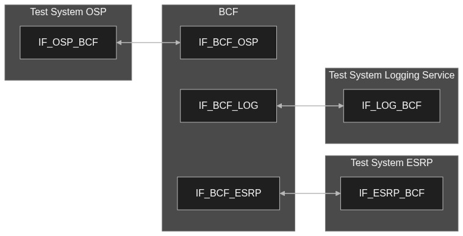
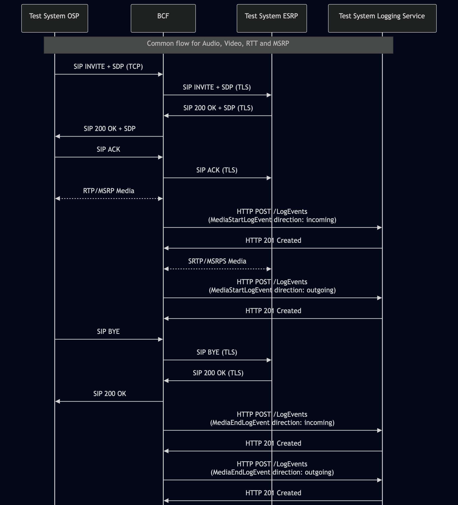

# Test Description: TD_BCF_014

## Overview

### Summary

Logging all types of anchored media

### Description

This test verifies that, when configured to act as a media anchor, the BCF logs the start and end of media by sending `MediaStartLogEvent` and `MediaEndLogEvent` to the Logging Service.

The test covers the following media forms transported over RTP/MSRP or SRTP/MSRPS:

* audio;
* video;
* Real-Time Text;
* Instant Messaging transported using MSRP or MSRPS.

### References

* Requirements : RQ_BCF_075, RQ_BCF_076, RQ_BCF_120, RQ_BCF_124, RQ_BCF_163
* Test Case    : n/a

### Requirements
IXIT config file for IUT

### SIP/HTTP transport types
Test can be performed with 2 different SIP and HTTP transport types. Steps describing actions for specific one are marked as following:
- (TLS) - used by default inside ESInet on production environment
- (TCP) - used if default TLS is not possible

## Configuration

### Implementation Under Test Interface Connections

* Test System OSP
  * IF_OSP_BCF - connected to BCF IF_BCF_OSP
* BCF
  * IF_BCF_OSP - connected to Test System OSP IF_OSP_BCF
  * IF_BCF_ESRP - connected to Test System ESRP IF_ESRP_BCF
  * IF_BCF_LOG - connected to Test System Logging Service IF_LOG_BCF
* Test System ESRP
  * IF_ESRP_BCF - connected to BCF IF_BCF_ESRP
* Test System Logging Service
  * IF_LOG_BCF - connected to BCF IF_BCF_LOG

### Test System Interfaces

* Test System OSP
  * IF_OSP_BCF - Active
* BCF
  * IF_BCF_OSP - Active
  * IF_BCF_ESRP - Active
  * IF_BCF_LOG - Active
* Test System ESRP
  * IF_ESRP_BCF - Active
* Test System Logging Service
  * IF_LOG_BCF - Active

### Connectivity Diagram

<!--
https://mermaid.live/edit#pako:eNqNVFtr2zAU_iuq9hoXMkY3tLGHZGspBFLqMgrzKIp8bAvLkpHltiHLf58uviVNw6SH6JzvO9-5mewwUylggqMoSiRTMuM5SSRCpoAKCNrQBpwplCoJYoI2DWfeQbeqNQSlNNcwBPyimtONgMZrIBvOylyrVqYEJfhD5k-CA1hrXlG9XSqhtIfnmbtH8AO8mpGSfXT3iLJQOgU9kjZf3O1Jgkt4DzMH4nN_eoyJtjGgF2XuwU_U3WPQZ_b4Z38GYW4EvFe2tCM_11YKGW2FWXFZni7cz3oZxwT9DRGXmVAvrKDaRLbdEu2CG6HGaFXaPXbh6IJXtdKGSvP1kBK98NQUBM0vr-rXt7R9-LHTLkGjmppizJFxIf4jwxmKVx9a6L4d1upnG-TWR3Ui_Qc6cNDqPrBur5_W8d3TYnn9LYq-W8u-nGdAnf0zvr_rYPd0vgN8tb7pYPsKaMCbdpNrWhfIKv5O8AM0BsVbu_nKeRL8p29xWogljsbAAZm-UXW5F-tHGzBlTgoLaSddneC4jkaSs06xbGMjyRpn6-okp-2e0u1nGYSHyZ5TDmVMhVcqz7nMUQz6mTM4ztEtJKTot3OQAc9wBbqiPMVkt59h2hoVbyXDxOgWZritU2rgB7d_VLQKzv0_WmqFLg
-->



## Pre-Test Conditions

### Test System OSP

* Interfaces are connected to the network.
* Interfaces have IP addresses assigned.
* ng911 repository cloned to local storage
* SIPp[^1] and/or the custom SIP service required by the selected variation are installed and available.
* Wireshark[^2] is installed.
* (TLS) Generated own PCA-signed certificate and private key files (test_system.crt, test_system.key)
* (TLS) PCA certificate copied to local storage
* The following current repository media stimuli may be reused where applicable:
  * Audio: `SIP_basic_call_with_RTP.xml` with `g711ulaw_rtp_stream.pcap`, or an equivalent SRTP-capable scenario and generator;
  * Video: `SIP_basic_call_from_OSP_Video_RTP.xml` with `video_media_rtp.pcap`, or an equivalent SRTP-capable scenario and generator;
  * Real-Time Text: `SIP_basic_call_from_OSP_Text_RTP.xml` with `text_media_rtp.pcap`, or an equivalent SRTP-capable scenario and generator.
* For MSRP, an MSRP/MSRPS-capable client or scenario is available to establish the negotiated message media stream and send a known test message.

### BCF

* Interfaces are connected to the network.
* Interfaces have IP addresses assigned.
* The IUT is initialized using the IXIT configuration.
* The device is active and in its normal operating state.
* The BCF is configured to anchor all media
* The BCF is configured to use the Test System Logging Service as its default Logging Service.

### Test System ESRP

* Interfaces are connected to the network.
* Interfaces have IP addresses assigned.
* ng911 repository cloned to local storage
* SIPp[^1] and/or the custom SIP service required by the selected variation are installed and available.
* Wireshark[^2] is installed.
* (TLS) Generated own PCA-signed certificate and private key files (test_system.crt, test_system.key)
* (TLS) PCA certificate copied to local storage

### Test System Logging Service

* Interfaces are connected to the network.
* Interfaces have IP addresses assigned.
* ng911 repository cloned to local storage
* Wireshark[^2] is installed.
* (TLS) Generated own PCA-signed certificate and private key files (test_system.crt, test_system.key)
* (TLS) PCA certificate copied to local storage

## Test Sequence

### Test Preamble

#### Test System OSP
* Copy following XML scenario files to local storage:
  ```
  SIP_basic_call_with_RTP.xml
  g711ulaw_rtp_stream.pcap
  SIP_basic_call_from_OSP_Video_RTP.xml
  video_media_rtp.pcap
  SIP_basic_call_from_OSP_Text_RTP.xml
  text_media_rtp.pcap
  SIP_basic_call_from_OSP_Text_MSRP.xml
  ```
* (TLS v1.2) Configure Wireshark to decode SIP over TLS, use tests system and IUT certificate keys [^3]
* (TLS v1.3) Configure logging of session keys and configure Wireshark to decode SIP over TLS [^4]
* Using Wireshark on 'Test System' start packet tracing on IF_OSP_BCF interface - run following filter:
   * (TLS)
     > ip.addr == IF_OSP_BCF_IP_ADDRESS and (tls or rtp or msrp)
   * (TCP)
     > ip.addr == IF_ESRP_CHFE_IP_ADDRESS and (sip or rtp or msrp)

#### Test System ESRP

* Copy following XML scenario files to local storage:
  ```
  SIP_RECEIVE_basic_call_and_answer_with_SRTP_audio.xml
  SIP_RECEIVE_basic_call_and_answer_with_SRTP_video.xml
  SIP_RECEIVE_basic_call_and_answer_with_SRTP_text.xml
  SIP_RECEIVE_basic_call_and_answer_with_MSRPS_text.xml
  ```
* Copy to local storage PCA-signed certificate and private key files:
```
  ESRP-cacert.pem
  ESRP-cakey.pem
```
* Configure Wireshark to decode SIP over TLS packets[^3]
* Using Wireshark on 'Test System ESRP' start packet tracing on IF_ESRP_BCF interface - run following filter:
      > ip.addr == IF_ESRP_BCF_IP_ADDRESS and (tls or udp or tcp or msrp or msrp)

* (Variation1-3) Prepare 'Test System ESRP' to receive a call - run SIPp tool with the scenario matching the variation under test:
     * (TLS)
       ```
       sudo sipp -t l1 -tls_cert ESRP-cacert.pem -tls_key ESRP-cakey.pem -sf SIPP_XML_SCENARIO_FILE -i 
       IF_ESRP_BCF_IP -p 5061 -trace_logs -trace_msg -timeout 10 -max_recv_loops 1 -m 999
       ```
       Use scenario file depending on Variation:
       Variation 1 - SIP_RECEIVE_basic_call_and_answer_with_SRTP_audio.xml
       Variation 2 - SIP_RECEIVE_basic_call_and_answer_with_SRTP_video.xml
       Variation 3 - SIP_RECEIVE_basic_call_and_answer_with_SRTP_text.xml
* (Variation4) Prepare 'Test System ESRP' to receive a call - run SIP Service tool:
     * (TLS)
    >   sudo python3 test_suite/services/stub_server/sip_service/sip_entry.py \
  --scenario test_suite/test_files/SIPp_scenarios/sip_service/CALLS/SIP_RECEIVE_basic_call_and_answer_with_MSRPS_text.xml \
  --scenario-type auto --bind-ip {IF_ESRP_BCF_IP} --bind-port 5061 \
  --remote-ip {IF_CHFE_ESRP_IP} --remote-port 5061 \
  --tls-cert {ESRP_CERT_FILE_PATH} --tls_key {ESRP_KEY_FILE_PATH} \
  --tls-ca {PCA_CERT_FILE_PATH} \
  --set IF_BCF_ESRP {IF_BCF_ESRP_IP} \
  --protocol TLS

#### Test System Logging Service
* (TLS v1.2) Configure Wireshark to decode HTTP over TLS, use tests system and CHFE certificate keys [^3]
* (TLS v1.3) Configure logging of session keys and configure Wireshark to decode HTTP over TLS [^4]
* Using Wireshark on 'Test System' start packet tracing on IF_LOG_BCF interface - run following filter:
   * (TLS)
     > ip.addr == IF_LOG_BCF_IP_ADDRESS and tls
   * (TCP)
     > ip.addr == IF_LOG_BCF_IP_ADDRESS and http
* The Logging Service must be configured to accept and process HTTP POST requests.
  To verify this manually, you can simulate a listening HTTP endpoint on port 8080 using command in the terminal:
    * Step 1 - Prepare logEventId and JSON body
      ```
      ID="urn:emergency:uid:logid:$(date +%s%N):logger.state.pa.us"
      BODY="{\"logEventId\":\"$ID\"}"
      ```
    * Step 2 - Run server:
      * (TLS)
      ```
      python3 http_entry.py --ip IF_LOG_BCF --port 4443 --role RECEIVER --path /LogEvents --method POST --body "$BODY" --content_type application/json --response_code 201 --server_cert /tmp/cert.crt --server_key /tmp/cert.key
      ```
      * (TCP)
      ```
      python3 http_entry.py --ip IF_LOG_BCF --port 8080 --role RECEIVER --path /LogEvents --method POST --body "$BODY" --content_type application/json --response_code 201
      ```
    * Step 3 - In another terminal, send a POST request to verify it is working:
      * (TLS)
      ```
      curl -k -X POST http://localhost:4443 -d '{"log":"test"}'
      ```   
      * (TCP)
      ```
      curl -X POST http://localhost:8080 -d '{"log":"test"}'
      ```   

### Test Body

#### Variations

1. Audio media

Use SIPp XML scenario file: `SIP_basic_call_with_RTP.xml` with media stream PCAP file: `g711ulaw_rtp_stream.pcap`

2. Video media

Use SIPp XML scenario file: `SIP_basic_call_from_OSP_Video_RTP.xml` with media stream PCAP file: `video_media_rtp.pcap`

3. Real_Time_Text media

Use SIPp XML scenario file: `SIP_basic_call_from_OSP_Text_RTP.xml` with media stream PCAP file: `text_media_rtp.pcap`

4. MSRP media

Use SIP Service XML scenario file: `SIP_basic_call_from_OSP_Text_MSRP.xml`

#### Stimulus

Variations 1-3
* Run SIPp scenario by using following command on Test System OSP, example:
  * (TLS transport)
    ``` 
    sudo sipp -t l1 -tls_cert test_system.crt -tls_key test_system.key -sf SIPP_SCENARIO_FILE -i IF_OSP_BCF_IP_ADDRESS -p 5061 IF_BCF_OSP_IP_ADDRESS:5061
    ```
  * (TCP transport)
    ```
    sudo sipp -t t1 -sf SIPP_SCENARIO_FILE -i IF_OSP_BCF_IP_ADDRESS -p 5060 IF_BCF_OSP_IP_ADDRESS:5060
    ```

Variation 4
* Run SIP Service scenario by using following command on Test System OSP, example:
  * (TLS transport)
    ``` 
    sudo python3 sip_entry.py --bind-ip IF_OSP_BCF_IP_ADDRESS --bind-port 5061 --remote-ip IF_BCF_OSP_IP_ADDRESS --remote-port 5061 \
     --protocol TLS --scenario SIP_basic_call_from_OSP_Text_MSRP.xml --message-timeout 5000 --transaction-timeout 5000 \
     --tls-cert OSP-cacert.pem --tls-key OSP-cakey.pem
    ```
  * (TCP transport)
    ```
    sudo python3 sip_entry.py --bind-ip IF_OSP_BCF_IP_ADDRESS --bind-port 5060 --remote-ip IF_BCF_OSP_IP_ADDRESS --remote-port 5060 \
     --protocol TCP --scenario SIP_basic_call_from_OSP_Text_MSRP.xml --message-timeout 5000 --transaction-timeout 5000
    ```

### Response

Using traced packets on Wireshark verify:
1. The media is established successfully from Test System OSP through the BCF to Test System ESRP (BCF anchored media).
2. If BCF sent to Test System Logging Service HTTP POST messages to /LogEvents entrypoint containing JWS bodies
3. Expected log events sent by the BCF:
   * 2x `MediaStartLogEvent` (check in decoded JWS payload) - one logs OSP-BCF media start while another one the BCF-ESRP
   * 2x `MediaEndLogEvent` (check in decoded JWS payload) - one logs BCF-ESRP media end while another one OSP-BCF
4. If `MediaStartLogEvent` decoded JWS payloads contain:
   * "logEventType": "MediaStartLogEvent"
   * "timestamp" with correct date-time format (e.g. 2020-03-10T11:00:01-05:00) and date-time match the time when SIP INVITE message has been received (for OSP-BCF) or sent (for BCF-ESRP media)
   * "elementId" which has value with FQDN of BCF
   * "agencyId" which has value with FQDN of an agency
   * "callId" which has value e.g.: `urn:emergency:uid:callid:1234567890:bcf.ng911.example`. Check:
     * if header field contains "urn:emergency:uid:callid:"
     * if "urn:emergency:uid:callid:" is followed by 10 to 32 alphanumeric characters (String ID)
     * if String ID is followed by ":" and domain name
   * "callId" should have the same value as callId in the stimulus SIP INVITE (Call-Info header field), example:
     for following Call-Info header field in the stimulus SIP INVITE:
     ```
     Call-Info: <urn:emergency:uid:callid:123ABCdefg123ABCdefg123ABCdefg12:test.com>;purpose=CallId
     ```
     "callId" should contain value:
     ```
     urn:emergency:uid:callid:123ABCdefg123ABCdefg123ABCdefg12:test.com
     ```
   * "incidentId" which has value e.g.: `urn:emergency:uid:incidentid:1234567890:bcf.ng911.example`. Check:
     * if header field contains "urn:emergency:uid:incidentid:"
     * if "urn:emergency:uid:incidentid:" is followed by 10 to 32 alphanumeric characters (String ID)
     * if String ID is followed by ":" and domain name
   * "incidentId" should have the same value as incidentId in the stimulus SIP INVITE (Call-Info header field), example:
     for following Call-Info header field in the stimulus SIP INVITE:
     ```
     Call-Info: <urn:emergency:uid:incidentid:123ABCdefg123ABCdefg123ABCdefg12:test.com>;purpose=IncidentId
     ```
     "callId" should contain value:
     ```
     urn:emergency:uid:incidentid:123ABCdefg123ABCdefg123ABCdefg12:test.com
     ```
   * "callIdSip" which has value e.g.: `1234567890qwertyuiop@caller.example.com` 
   * "callIdSip" should have the same value as Call-ID in the stimulus SIP INVITE, example:
   for following Call-ID header field in the stimulus SIP INVITE:
     ```
     Call-ID: test@ng911.example.com
     ```
     "callIdSip" should contain value:
     ```
     test@ng911.example.com
     ```
   * "direction" which has value:
     * `incoming` (for OSP-BCF media)
     * `outgoing` (for BCF-ESRP media)
   * "sdp" is a string set to an RFC 2327 SDP description of the media codecs as negotiated. Need to contain SDP body from: 
     * 200 OK BCF response for the stimulus SIP INVITE (for OSP-BCF media)
     * or 200 OK response from the Test System ESRP (for BCF-ESRP media)
     for example:
       `"v=0\r\no=- 123456 654321 IN IP4 192.168.1.1\r\ns=-\r\nc=IN IP4 192.168.1.1\r\nt=0 0\r\nm=audio 49170 RTP/AVP 
       0\r\na=rtpmap:0 PCMU/8000\r\na=label:audio1\r\n"`
   * one or more "mediaLabel" is an array where:
       * each member is a string value
       * each value comes from SDP label assigned to one of the media streams, e.g.: 
         200 OK from BCF contains in SDP:
         ```
            m=audio 6886 RTP/AVP 0
            a=label:audio1
            m=audio 22334 RTP/AVP 0
            a=label:audio2
         ```
         then:
         ```
            "mediaLabel": [
                "audio1",
                "audio2"
             ]
         ```
       * if no media labels have been assigned to the media, the 'mediaLabel' member is an array with one element 
         consisting of an empty string `[""]`
   * (optional) "clientAssignedIdentifier" field with string value
   * (optional) "agencyAgentId" field with string value
   * (optional) "agencyPositionId" field with string value
   * (optional) field "ipAddressPort" with string value representing normalized IP address and port number, or FQDN of 
    another element that participated in the transaction that triggered this LogEvent element 
   * (optional) "extension" field with string value
  

5. If `MediaEndLogEvent` decoded JWS payloads contain:
   * "logEventType": "MediaEndLogEvent"
   * "timestamp" with correct date-time format (e.g. 2020-03-10T11:00:01-05:00) and date-time match SIP BYE message 
     received by BCF from Test System OSP (for OSP-BCF media) or SIP BYE message sent by the BCF (for BCF-ESRP media)
   * "elementId" which has value with FQDN of BCF
   * "agencyId" which has value with FQDN of an agency
   * "callId" which has value e.g.: `urn:emergency:uid:callid:1234567890:bcf.ng911.example`. Check:
     * if header field contains "urn:emergency:uid:callid:"
     * if "urn:emergency:uid:callid:" is followed by 10 to 32 alphanumeric characters (String ID)
     * if String ID is followed by ":" and domain name
   * "callId" should have the same value as callId in the stimulus SIP INVITE (Call-Info header field), example:
     for following Call-Info header field in the stimulus SIP INVITE:
     ```
     Call-Info: <urn:emergency:uid:callid:123ABCdefg123ABCdefg123ABCdefg12:test.com>;purpose=CallId
     ```
     "callId" should contain value:
     ```
     urn:emergency:uid:callid:123ABCdefg123ABCdefg123ABCdefg12:test.com
     ```
   * "incidentId" which has value e.g.: `urn:emergency:uid:incidentid:1234567890:bcf.ng911.example`. Check:
     * if header field contains "urn:emergency:uid:incidentid:"
     * if "urn:emergency:uid:incidentid:" is followed by 10 to 32 alphanumeric characters (String ID)
     * if String ID is followed by ":" and domain name
   * "incidentId" should have the same value as incidentId in the stimulus SIP INVITE (Call-Info header field), example:
     for following Call-Info header field in the stimulus SIP INVITE:
     ```
     Call-Info: <urn:emergency:uid:incidentid:123ABCdefg123ABCdefg123ABCdefg12:test.com>;purpose=IncidentId
     ```
     "callId" should contain value:
     ```
     urn:emergency:uid:incidentid:123ABCdefg123ABCdefg123ABCdefg12:test.com
     ```
   * "callIdSip" which has value e.g.: `1234567890qwertyuiop@caller.example.com` 
   * "callIdSip" should have the same value as Call-ID in the stimulus SIP INVITE, example:
   for following Call-ID header field in the stimulus SIP INVITE:
     ```
     Call-ID: test@ng911.example.com
     ```
     "callIdSip" should contain value:
     ```
     test@ng911.example.com
     ```
   * "direction" which has value:
     * `incoming` (for OSP-BCF media)
     * `outgoing` (for BCF-ESRP media)
   * one or more "mediaLabel" is an array where:
       * each member is a string value
       * each value comes from SDP label assigned to one of the media streams, e.g.: 
         200 OK from BCF contains in SDP:
         ```
            m=audio 6886 RTP/AVP 0
            a=label:audio1
            m=audio 22334 RTP/AVP 0
            a=label:audio2
         ```
         then:
         ```
            "mediaLabel": [
                "audio1",
                "audio2"
             ]
         ```
       * if no media labels have been assigned to the media, the 'mediaLabel' member is an array with one element 
         consisting of an empty string `[""]`
   * (optional) "mediaQualityStats" which has string value in VQSessionReport format containing:
       * "VQSessionReport:CallTerm"
       * "SessionDesc" section with codec information (e.g. PT, Codec, SampleRate)
       * "LocalMetrics" section containing numeric values for Jitter, PacketLoss, Delay, MOSLQ
       * "RemoteMetrics" section containing numeric values for Jitter, PacketLoss, Delay, MOSLQ
       * "DialogID" field with SIP Call-ID format: `DialogID:1234567890@caller.example.com;to-tag=calleE_tag;from-tag=calleR_tag`
         
         For example:
       `"VQSessionReport:CallTerm\r\nSessionDesc:PT=0\r\nSessionDesc:Codec=PCMU\r\nSessionDesc:SampleRate=8000\r\nLocalMetrics:\r\nJitter:5\r\nPacketLoss:0\r\nDelay:100\r\nMOSLQ:4.1\r\nRemoteMetrics:\r\nJitter:7\r\nPacketLoss:1\r\nDelay:120\r\nMOSLQ:3.9\r\nDialogID:1234567890@caller.example.com;to-tag=calleE_tag;from-tag=calleR_tag"`
   * (optional) "clientAssignedIdentifier" field with string value
   * (optional) "agencyAgentId" field with string value
   * (optional) "agencyPositionId" field with string value
   * (optional) field "ipAddressPort" with string value representing normalized IP address and port number, or FQDN of 
    another element that participated in the transaction that triggered this LogEvent element 
   * (optional) "extension" field with string value


6. Verify that all MediaStartLogEvent and MediaEndLogEvent are related to the same session by comparing the following values:
   * "callId" values are identical
   * "incidentId" values are identical
   * "callIdSip" values are identical


7. Verify if "mediaLabel" arrays are paired - each MediaStartLogEvent must have MediaEndLogEvent with matching the same "mediaLabel" contents

VERDICT:

* ERROR - at least one variation cannot be evaluated because the communication session or tested media cannot be established, the BCF cannot be verified as the media anchor, the Logging Service receiver is unavailable, or the evidence is insufficient to evaluate the required logging behavior.
* PASSED - all four variations are executed, their evaluation prerequisites are satisfied, and the BCF logs the tested communication-session media using valid `MediaStartLogEvent` and `MediaEndLogEvent` pairs satisfying the required checks.
* FAILED - all other cases

### Test Postamble

#### Test System OSP / Test System ESRP

* stop SIPp (if still running)
* stop Wireshark (if still running)
* archive all logs generated
* disconnect interfaces from IUT
* (TLS) remove certificates

#### BCF

* restore default configuration
* disconnect interfaces from Test Systems
* reconnect interfaces back to default

#### Test System Logging Service

* Stop the LogEvents receiver.
* stop Wireshark (if still running)
* archive all logs generated
* disconnect interfaces from IUT
* (TLS) remove certificates

## Post-Test Conditions

### Test System OSP / Test System ESRP / Test System Logging Service

* Test tools stopped
* interfaces disconnected from IUT

### BCF

* device connected back to default
* device in normal operating state

## Sequence Diagram

<!--
https://mermaid.live/edit#pako:eNqtVGFv2jAQ_Ssnf-q0hJIAASyERFO2oUKJSFRpU754iUmtEps5Dh1D_Pc5CUHVwjSk9ZOTu_fePd9Zd0CRiCnCyDTNkEeCr1mCQw6wEeIFQ7QhWcaiIqCeaUoxxES-FL8pk1LISaSEzDCsySajIS9FMvojpzyi94wkkqQFGGBLpGIR2xKuYOl7QDIIaKbA32eKpkWoibtzPxU4fTRzU3_VECliTeR8-flP4FwkCeMJ-FTuWKR9V6xHoSiIHZWFHUPzMLgiTQWH9Ua8wlpImOQxEwY8sZjqYxUEQHgMi7JwJaKp5nisPWPwZx7MHp9mwRQ-gn_vwU3geh8qmAZoWOH4Im7un3AF4q2e3W7D8qGJq_R08Sbsoq-J-3DZiE7UumfiaGTW3FXg3RbXhQWNGXkrUfbrSxB44C39AG51k6c7ylUGo-9yfFPifaUHUycgZpJGigmOgemnl-qRnG6jteqCpaLdtsCVlCgan0tWpk7Ga1v-O_sSuUrElb7-8gLuvk4vd1onrpj0v2ZcV73-slMev9MI_q_g9b1FBkokixFWMqcGSqlMSfGLDgU1ROVqChHWn5zmSpJNiEJ-1DS9Ab4JkdZMKfLkGeFyWxko38Za_bSmzlFJeUylK3KuELZtp12qIHxAPxHuOi2rPewNO1a_0xnafctAe4TNbsvqOZbVHzhdy-5YXedooF9lXavVse3ecNDtaYLTtXsDA5FcCX_Po9qV7pHeootqD5fruPY2LTMna8ffjOKxaA
-->




## Comments

Version:  010.3f.5.0.0

Date:     20260917

## Footnotes

[^1]: SIPp - tool for SIP packet simulations. Official documentation: https://sipp.sourceforge.net/doc/reference.html#Getting+SIPp
[^2]: Wireshark - tool for packet tracing and anaylisis. Official website: https://www.wireshark.org/download.html
[^3]: Wireshark configuration to decrypt TLS packets: https://www.zoiper.com/en/support/home/article/162/How%20to%20decode%20SIP%20over%20TLS%20with%20Wireshark%20and%20Decrypting%20SDES%20Protected%20SRTP%20Stream
[^4]: TLS v1.3 session keys logging + Wireshark configuration to decrypt traffic: https://my.f5.com/manage/s/article/K50557518
