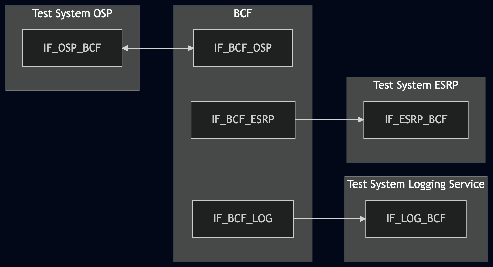
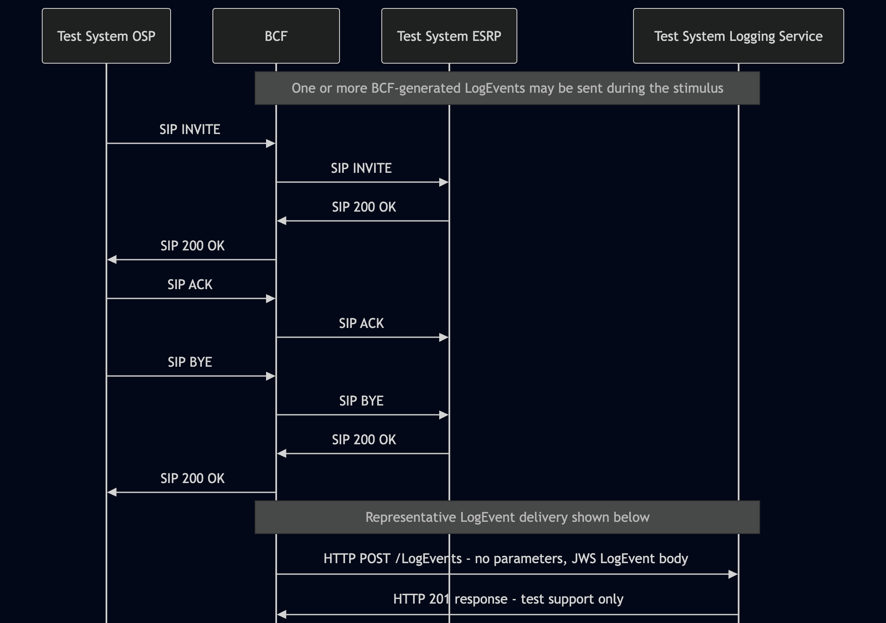

# Test Description: TD_BCF_015

## Overview

### Summary

Validation of the LogEvents POST request properties sent by the BCF.

### Description

This test verifies that when the BCF sends a LogEvent to the Logging Service, it sends an HTTP POST request to the configured `.../LogEvents` entry point without request parameters and with a request body containing a JSON Web Signature (JWS) of a LogEvent.

The test validates only the HTTP POST request properties defined by RQ_BCF_156. Validation of LogEvent member semantics, the additional JWS serialization and signing requirements defined in Section 5.10, cryptographic signature/certificate validation, and Logging Service response semantics is outside the scope of this test.

### References

* Requirements : RQ_BCF_156
* Test Case    : n/a

### Requirements

Implementation eXtra Information for Testing (IXIT) config file for BCF.

## Configuration

### Implementation Under Test Interface Connections

* Test System OSP
  * IF_OSP_BCF - connected to BCF IF_BCF_OSP

* BCF
  * IF_BCF_OSP - connected to Test System OSP IF_OSP_BCF
  * IF_BCF_ESRP - connected to Test System ESRP IF_ESRP_BCF
  * IF_BCF_LOG - connected to Test System Logging Service IF_LOG_BCF

* Test System ESRP
  * IF_ESRP_BCF - connected to BCF IF_BCF_ESRP

* Test System Logging Service (LOG)
  * IF_LOG_BCF - connected to BCF IF_BCF_LOG

### Test System Interfaces

* Test System OSP
  * IF_OSP_BCF - Active

* BCF
  * IF_BCF_OSP - Active
  * IF_BCF_ESRP - Active
  * IF_BCF_LOG - Active

* Test System ESRP
  * IF_ESRP_BCF - Active

* Test System Logging Service (LOG)
  * IF_LOG_BCF - Active

### Connectivity Diagram

<!--
https://mermaid.live/edit#pako:eNp1k19vgjAUxb8Kuc9oKGjRZtnDnC4mLi7iXjYW00EFMqGmlm3O-N3X8kcYizxxzu393dMbOEHAQwYEtjv-FcRUSGOx8jM_M9Qzn22W3tPmbjJ79aERPrwZN73era4rqe2yXglVv_Rra7F8aOpK6P6qXakGX4lu-9RbtfhatQBaNoRaFYgScsjfI0H3sVGmXLODNLzjQbLUaEf9e93SY1n4jzJ_XitKO2UrqQZ2PX3frlfc4eqIcl3toAseRUkWGR4Tn0nAuqPrvV0lVhtsI6s1_uFctleDwIRIJCEQKXJmQspESrWEkz7ig4xZqtIQ9RpS8eGDn51Vz55mL5yndZvgeRQD2dLdQal8H1LJ7hOqoqUXV6hpTEx4nkkg2C4YQE7wDcSxUB-7Awdha-iM0cBxTTgCQUPUR_YYYdfGGDvWyD2b8FOMtfrqKMLIcq2R7WA8HphAc8m9YxbUoViYSC4ey2-_-AXqaNOiUiU7_wK5Q-vR
-->



## Pre-Test Conditions

### Test System OSP, Test System ESRP, Test System Logging Service

* Interfaces are connected to the network.
* Interfaces have IP addresses assigned.
* Devices are active.

### BCF

* Interfaces are connected to the network.
* Interfaces have IP addresses assigned.
* IUT is initialized using the IXIT config file.
* Device is configured to use Test System Logging Service as its Logging Service.
* Logging is enabled.
* Device is active and in normal operating state.
* No active calls.

## Test Sequence

### Test Preamble

#### Test System OSP

* Install SIPp by following the documentation[^1].
* Copy `test_suite/test_files/SIPp_scenarios/CALLS/SIP_basic_call_from_OSP.xml` to the local storage of Test System OSP. Run the SIPp stimulus command from the directory containing the copied file.

#### Test System ESRP

* Install SIPp by following the documentation[^1].
* Copy `test_suite/test_files/SIPp_scenarios/CALLS/SIP_RECEIVE_basic_call_and_answer.xml` to the local storage of Test System ESRP. Run the SIPp receiver command from the directory containing the copied file.

* Prepare Test System ESRP to receive the call from BCF. For the current TCP lab mapping, example:

  ```
  sudo sipp -t t1 -sf SIP_RECEIVE_basic_call_and_answer.xml -i IF_ESRP_BCF_IP_ADDRESS -p 5060
  ```

#### Test System Logging Service

* Ensure the project repository is available on Test System Logging Service. Run the repository-relative commands below from the repository root.
* For the current HTTP/TCP lab mapping, prepare a valid LogEvents response body:

  ```
  mkdir -p /tmp/bcf_015
  ID="$(python3 -c 'import uuid; print(uuid.uuid4().hex)')"
  printf '{"logEventId":"urn:emergency:uid:logid:%s:test.example"}\n' "$ID" > /tmp/bcf_015/logeventid.json
  ```

* Start the Logging Service receiver with the two routes required by the current BCF test environment:

  ```
  python3 test_suite/services/stub_server/http/http_entry.py \
    --ip IF_LOG_BCF_IP_ADDRESS \
    --port 8080 \
    --role RECEIVER \
    --path '["/LogEvents","/Versions"]' \
    --method '["POST","GET"]' \
    --response_code '["201","200"]' \
    --body '["file./tmp/bcf_015/logeventid.json","file.test_suite/test_files/JSON/versions/Logging_Service_Versions_object_example_v010.3f.5.0.0.json"]' \
    --content_type application/json
  ```

* `GET /Versions` is provided only as Logging Service version-discovery support for the BCF test environment. It is not evaluated for RQ_BCF_156.
* Install Wireshark[^2].
* Start packet tracing on IF_LOG_BCF and capture HTTP traffic exchanged between BCF and the Logging Service.

### Test Body

#### Stimulus

Simulate a basic emergency call from Test System OSP to BCF using the existing SIPp scenario.

For the current TCP lab mapping, example:

```
sudo sipp -t t1 -sf SIP_basic_call_from_OSP.xml IF_BCF_OSP_IP_ADDRESS:5060
```

Allow the call flow to complete and wait for BCF-generated LogEvents resulting from the stimulus to be delivered to Test System Logging Service.

#### Response

Using Wireshark, verify the LogEvent request messages sent by the BCF to IF_LOG_BCF:

* the HTTP method is `POST`;
* the request URI contains the configured `.../LogEvents` entry point;
* the request target URI contains no request parameters or query component. Example of a failing URI:
  ```
  IF_LOG_BCF:8080/api/LogEvents?param=test
  ```
* the request contains a valid JWS JSON body containing the following members:
  * `"protected"` or `"header"` - with a Base64Url-encoded value;
  * `"payload"` - with a Base64Url-encoded value;
  * `"signature"` - with a Base64Url-encoded value or an empty string for an unsigned JWS.

VERDICT:

* ERROR - if the stimulus SIP INVITE message was not sent from Test System OSP to BCF.
* PASSED - if all recorded LogEvent requests sent by the BCF pass all checks.
* FAILED - any other cases.

### Test Postamble

#### Test System OSP, Test System ESRP, Test System Logging Service

* Stop all SIPp processes, if still running.
* Stop the Logging Service HTTP receiver, if applicable.
* Stop packet tracing.
* Archive required test evidence.
* Remove temporary test files, if applicable.

#### BCF

* Restore any configuration changed specifically for this test.
* Return the device to its normal operating state.

## Post-Test Conditions

### Test System OSP, Test System ESRP, Test System Logging Service

* Test tools are stopped.
* Test-specific temporary files are removed.

### BCF

* Device is in its normal operating state.

## Sequence Diagram

<!--
https://mermaid.live/edit#pako:eNqdU8Fy2jAQ_ZUdnQ21MTGgAzMJpW2aNDAx0047vij2xniKJXclk7oM_17JxCQt9NKTrX373j6tdncsVRkyznq9XiJTJR-LnCcSoCyIFF2mRpHm8Cg2GhPZJmn8UaNM8W0hchKlSwaoBJkiLSohDSziJQgNK9QG4kYbLF3oNO9q9s7l2c8pNo_vT0Rc7DTzdvH-78RbleeFzCFG2hap9X1g3SmDoLZIrqRneRwW0kYISkXogr0cJZIwmDmN-Ral0VCKBh4QtD1AVpMTNmt7NkVZb2rdqdsr9qZTK8Ihvl7C9d3n69X8ADnl6dTZP8Vc9DVv4PuwuHnNs8J_QmfrXc5uzhdrgbOUq6__8HcE_tvcmVbfY0XomihMscVjfyHDjT1TA3qtnqTt9EY9dTKHGi39w2q1hOUiXsGbl6fpgVRuGESJBkl78PFL_KL8oLLmoGMVumu0OgM_AGumUnaYrYhxs6PrqlJkQMlNwzyWU5ExbqhGj5VIpXBHtnN6CbPvX2LCuP3NBH1PWCL3lmPn8ZtSZUcjVedrxtvd8VhdZXawnpfmGCWUGdJM1dIwPh63Gozv2E_GQz_oR6NhGET-RTgJhuHIYw3jwUXQDwaTIBoNoigK_fFo77FfbVm_b1ODKPBH_ngQRtFk6DFRGxU3Mu1MYVbYlf50WPp29ztr8xZ5drb_DU7OQMo
-->



## Comments

Version:  010.3f.5.0.0

Date:     20260828

## Footnotes

[^1]: SIPp - tool for SIP packet simulations. Official documentation: https://sipp.sourceforge.net/doc/reference.html
[^2]: Wireshark - tool for packet tracing and analysis. Official website: https://www.wireshark.org/download.html
