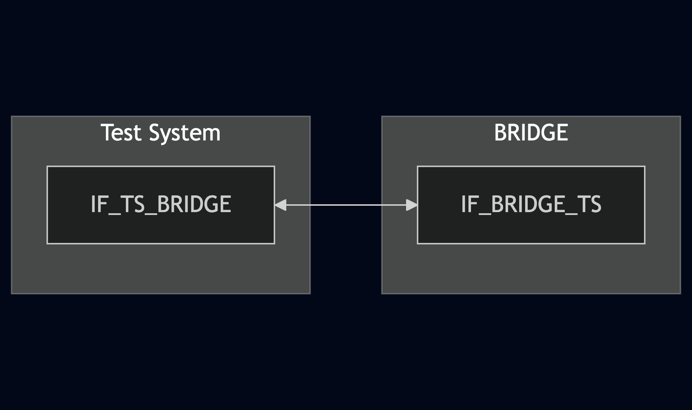
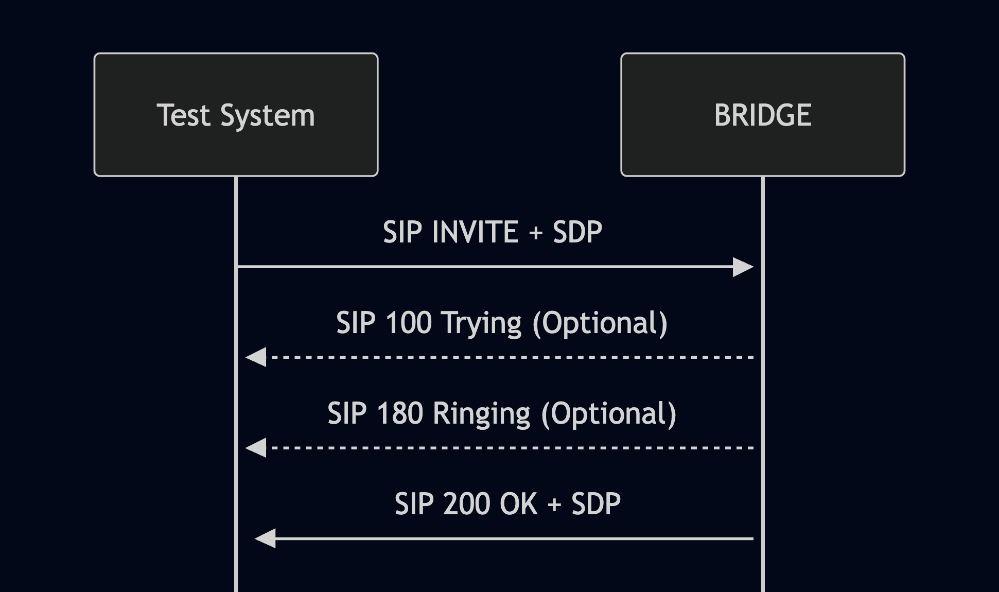

# Test Description: TD_BRIDGE_001

## Overview
### Summary
Multimedia capability

### Description
This test checks if all types of media are supported by BRIDGE:
- audio
- video
- text

### References
* Requirements : RQ_BRIDGE_001
* Test Case    : TC_BRIDGE_001

### Requirements
IXIT config file for BRIDGE

### SIP transport types
Test can be performed with 2 different SIP transport types. Steps describing actions for specific one are marked as following:
- (TLS transport) - should be used by default
- (TCP transport) - used in lab for testing purposes only if default TLS is not possible

## Configuration
### Implementation Under Test Interface Connections
<!-- Identify each of the FEs that are part of the configuration and how they are connected -->
* Test System
  * IF_TS_BRIDGE - connected to IF_BRIDGE_TS
* BRIDGE
  * IF_BRIDGE_TS - connected to IF_TS_BRIDGE 

### Test System Interfaces
<!-- Identify each of the test system interfaces and whether it will be in active or monitor mode -->
* Test System
  * IF_TS_BRIDGE - Active
* BRIDGE
  * IF_BRIDGE_TS - Active

### Connectivity Diagram

<!--

-->

## Pre-Test Conditions
### Test System
* Interfaces are connected to network
* Interfaces have IP addresses assigned by DHCP
* Device is active
* ng911 repository cloned to local storage
* (TLS) Generated own PCA-signed certificate and private key files (test_system.crt, test_system.key)
* (TLS) Certificate and key used by BRIDGE copied to local storage

### BRIDGE
* Interfaces are connected to network
* Interfaces have IP addresses assigned by DHCP
* IUT is active
* IUT is in normal operating state
* Default configuration is loaded
* IUT is initialized using IXIT config file
* (TLS) Generated own PCA-signed certificate and private key files
* Conference SIP URI is known

## Test Sequence

### Test Preamble

#### Test System
* Install SIPp by following steps from documentation[^1]
* Install Wireshark[^2]
* (TLS v1.2) Configure Wireshark to decode HTTP over TLS, use tests system and FE certificate keys [^3]
* (TLS v1.3) Configure logging of session keys and configure Wireshark to decode SIP over TLS [^4]
* Using Wireshark on 'Test System' start packet tracing on IF_TS_BRIDGE interface - run following filter:
   * (TLS transport)
     > ip.addr == IF_TS_BRIDGE_IP_ADDRESS and tls
   * (TCP transport)
     > ip.addr == IF_TS_BRIDGE_IP_ADDRESS and sip
* Edit SIPp scenario files for all variations:
Change `To: urn:service:sos` to `To: CONFERNECE_URI` where CONFERENCE_URI is known SIP URI of conference on Bridge

### Test Body

#### Variations

1. Validate SIP 200 OK response for SIP INVITE with g711alaw audio media

Use SIPp scenario: `SIP_INVITE_SDP_with_g711alaw_audio.xml`

2. Validate SIP 200 OK response for SIP INVITE with g711ulaw audio media

Use SIPp scenario: `SIP_INVITE_SDP_with_g711ulaw_audio.xml`

3. Validate SIP 200 OK response for SIP INVITE with H.264 video media with baseline profile level 1b

Use SIPp scenario: `SIP_INVITE_SDP_with_H.264_video_level_1b.xml`

4. Validate SIP 200 OK response for SIP INVITE with H.264 video media with baseline profile level 1.1

Use SIPp scenario: `SIP_INVITE_SDP_with_H.264_video_level_1.1.xml`

5. Validate SIP 200 OK response for SIP INVITE with H.264 video media with baseline profile level 2.0

Use SIPp scenario: `SIP_INVITE_SDP_with_H.264_video_level_2.0.xml`

6. Validate SIP 200 OK response for SIP INVITE with H.264 video media with baseline profile level 3.0

Use SIPp scenario: `SIP_INVITE_SDP_with_H.264_video_level_3.0.xml`

7. Validate SIP 200 OK response for SIP INVITE with t140 text media

Use SIPp scenario: `SIP_INVITE_SDP_with_text.xml`

#### Stimulus

Send SIP INVITE to BRIDGE - run following SIPp command on Test System, example:
  * (TLS transport)
    > sudo sipp -t l1 -tls_cert test_system.crt -tls_key test_system.key -sf SIPP_SCENARIO_FILE -i IF_TS_BRIDGE IF_BRIDGE_TS:5061
  * (TCP transport)
    > sudo sipp -t t1 -sf SIPP_SCENARIO_FILE -i IF_TS_BRIDGE IF_BRIDGE_TS:5060

#### Response
* BRIDGE responds with SIP 200 OK
* SIP 200 OK SDP body contains the same codec as offered in SIP INVITE

VERDICT:
* PASSED - if BRIDGE responded as expected
* FAILED - any other cases

### Test Postamble
#### Test System
* stop all SIPp processes (if still running)
* archive all logs generated
* stop Wireshark (if still running)
* remove ng911 repository files
* disconnect interfaces from BRIDGE

#### BRIDGE
* disconnect IF_BRIDGE_TS
* reconnect interfaces back to default

## Post-Test Conditions 
### Test System 
* Test tools stopped
* interfaces disconnected from BRIDGE

### BRIDGE
* device connected back to default
* device in normal operating state

## Sequence Diagram

<!--

-->

## Comments

Version:  010.3f.3.0.3

Date:     20250417

## Footnotes
[^1]: SIPp - tool for SIP packet simulations. Official documentation: https://sipp.sourceforge.net/doc/reference.html#Getting+SIPp
[^2]: Wireshark - tool for packet tracing and anaylisis. Official website: https://www.wireshark.org/download.html
[^3]: Wireshark configuration to decrypt TLS packets: https://www.zoiper.com/en/support/home/article/162/How%20to%20decode%20SIP%20over%20TLS%20with%20Wireshark%20and%20Decrypting%20SDES%20Protected%20SRTP%20Stream
[^4]: TLS v1.3 session keys logging + Wireshark configuration to decrypt traffic: https://my.f5.com/manage/s/article/K50557518
