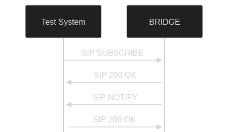

# Test Description: TD_BRIDGE_002

## Overview
### Summary
ElementState and ServiceState

### Description
This test checks if Bridge has implemented ElementState and ServiceState

### References
* Requirements : RQ_BRIDGE_012
* Test Case    : TC_BRIDGE_002

### Requirements
IXIT config file for BRIDGE

### SIP transport types
Test can be performed with 2 different SIP transport types. Steps describing actions for specific one are marked as following:
- (TLS transport) - should be used by default
- (TCP transport) - used in lab for testing purposes only if default TLS is not possible

## Configuration
### Implementation Under Test Interface Connections
<!-- Identify each of the FEs that are part of the configuration and how they are connected -->
* Test System
  * IF_TS_BRIDGE - connected to IF_BRIDGE_TS
* BRIDGE
  * IF_BRIDGE_TS - connected to IF_TS_BRIDGE 

### Test System Interfaces
<!-- Identify each of the test system interfaces and whether it will be in active or monitor mode -->
* Test System
  * IF_TS_BRIDGE - Active
* BRIDGE
  * IF_BRIDGE_TS - Active

### Connectivity Diagram
<!--
[](https://mermaid.live/edit#pako:eNpdUMFugzAM_RXkM0VJGQlE0w5bt6nSdik9TUhVBimgNQkKQRtD_PvSpp2q-mQ_v-dne4JSVwIY7A_6u2y4scHbplCBi_XLbpvvHjfr1evz_WLx4GpfOLhQntMPn7XhXRNsRW-DfOytkL5zO8GjQlU3wuvuWXPlctZACFIYydvKbTod4QJsI6QogLm04uargELNjscHq_NRlcCsGUQIQ1dxK1Ytd3YS2J4feod2XH1oLS8kUbVWm3f_idNDThRgE_wAwzGNcJLRFGdJGqO7JIQRGEkigpOUUEJxjGlK5hB-TzNRRBFCMVoSuoxTgkkWgtFD3fzb1-Z4ifc27j5hnvSgLLAsmf8AQFZ4Fw)
-->


## Pre-Test Conditions
### Test System
* Interfaces are connected to network
* Interfaces have IP addresses assigned by DHCP
* Device is active
* ng911 repository cloned to local storage
* (TLS) Generated own PCA-signed certificate and private key files (test_system.crt, test_system.key)
* (TLS) Certificate and key used by BRIDGE copied to local storage
* (TLS) PCA certificate copied to local storage

### BRIDGE
* Interfaces are connected to network
* Interfaces have IP addresses assigned by DHCP
* IUT is active
* IUT is in normal operating state
* Default configuration is loaded
* IUT is initialized using IXIT config file
* Bridge is provisioned with policy allowing to subscribe for ElementState and ServiceState from Test System
  
## Test Sequence

### Test Preamble

#### Test System
* Install SIPp by following steps from documentation[^1]
* Install Wireshark[^2]
* (TLS v1.2) Configure Wireshark to decode HTTP over TLS, use tests system and FE certificate keys [^3]
* (TLS v1.3) Configure logging of session keys and configure Wireshark to decode SIP over TLS [^4]
* Using Wireshark on 'Test System' start packet tracing on IF_TS_BRIDGE interface - run following filter:
   * (TLS transport)
     > ip.addr == IF_TS_BRIDGE_IP_ADDRESS and tls
   * (TCP transport)
     > ip.addr == IF_TS_BRIDGE_IP_ADDRESS and sip

### Test Body

1. ElementState - scenario file: `SIP_SUBSCRIBE_ElementState.xml`
2. ServiceState - scenario file: `SIP_SUBSCRIBE_ServiceState.xml`

#### Stimulus

Send SIP INVITE to BRIDGE - run following SIPp command on Test System, example:
  * (TLS transport)
    > sudo sipp -t l1 -sf SIPP_SCENARIO_FILE -s CONFERENCE_ID IF_TS_BRIDGE_IP_ADDRESS:5060
  * (TCP transport)
    > sudo sipp -t t1 -sf SIPP_SCENARIO_FILE -s CONFERENCE_ID IF_TS_BRIDGE_IP_ADDRESS:5061

#### Response

Variation 1
* BRIDGE responds with 200 OK for SIP SUBSCRIBE
* BRIDGE sends SIP NOTIFY with the same event as requested in SIP SUBSCRIBE
* SIP NOTIFY contains following fields in JSON body:
- elementId which is FQDN
- state which is one of:
  ```
   Normal
   ScheduledMaintenance
   ServiceDisruption 
   Overloaded
   GoingDown
   Down
   Unreachable
  ```
- reason (optional) which is a string

Variation 2
* BRIDGE responds with 200 OK for SIP SUBSCRIBE
* BRIDGE sends SIP NOTIFY with the same event as requested in SIP SUBSCRIBE
* SIP NOTIFY contains following fields in JSON body:
- service which contains:
    - name which is one of:
      ```
       ADR
       Bridge
       ECRF
       ESRP
       GCS
       IMR
       Logging
       LVF
       MCS
       MDS
       PolicyStore
       PSAP 
      ```
    - serviceId (optional) which is FQDN the same as in 'domain'
    - domain which is FQDN
- serviceState which contains:
    - state which is one of:
      ```
       Normal
       Unstaffed
       ScheduledMaintenanceDown
       ScheduledMaintenanceAvailable
       MajorIncidentInProgress
       Partial
       Overloaded
       GoingDown
       Down
       Unreachable
      ```
    - reason whish is string or empty
- securityPosture (optional) which contains:
    - posture which is one of:
        ```
          Green
          Yellow
          Orange
          Red
        ```

VERDICT:
* PASSED - if BRIDGE responded as expected
* FAILED - any other cases

### Test Postamble
#### Test System
* stop all SIPp processes (if still running)
* archive all logs generated
* stop Wireshark (if still running)
* remove ng911 repository files
* disconnect interfaces from BRIDGE

#### BRIDGE
* disconnect IF_BRIDGE_TS
* reconnect interfaces back to default

## Post-Test Conditions 
### Test System 
* Test tools stopped
* interfaces disconnected from BRIDGE

### BRIDGE
* device connected back to default
* device in normal operating state

## Sequence Diagram
<!--
[](https://mermaid.live/edit#pako:eNqFkEtPwzAQhP-KtVeSyk6TJvWhEn2AIgRFTTmAfLGSbRqB7eI4EqXqfycPFfXW22r32xnNnCA3BQIH3_eFzo3eVSUXmhBVWWvsfe6MrTnZya8ahe6hGr8b1DkuK1laqTqYkC3WjmTH2qHyZ7O7-SZdPq44ydJXkr3Ns8Umna8Gcjh10NXPQAaUkvXTTexlvU0f3m_6XquBBwqtklXRRj11OwFujwoF8HYspP0UIPS55WTjTHbUOXBnG_SgORTSXcIC75vw4CD1hzHqAmFRtUU9D1X2jfYI8BP8AB-zEUuiaUwZpcEkYsyDI_AwiEZhNI7DCWOMTsOzB7-9JB0lYciCCQ2jmI6TJJ56YE1T7v_dS9sFGawt6gLtwjTaAWdBdP4DLXmMuQ)
-->




## Comments

Version:  010.3f.3.0.4

Date:     20250626

## Footnotes
[^1]: SIPp - tool for SIP packet simulations. Official documentation: https://sipp.sourceforge.net/doc/reference.html#Getting+SIPp
[^2]: Wireshark - tool for packet tracing and anaylisis. Official website: https://www.wireshark.org/download.html
[^3]: Wireshark configuration to decrypt TLS packets: https://www.zoiper.com/en/support/home/article/162/How%20to%20decode%20SIP%20over%20TLS%20with%20Wireshark%20and%20Decrypting%20SDES%20Protected%20SRTP%20Stream
[^4]: TLS v1.3 session keys logging + Wireshark configuration to decrypt traffic: https://my.f5.com/manage/s/article/K50557518
