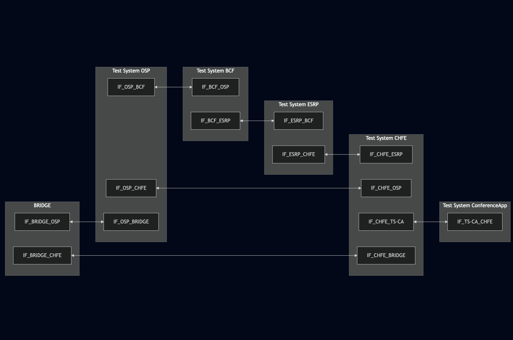
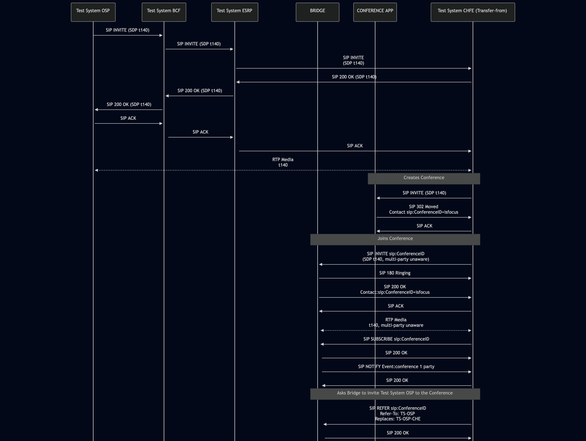
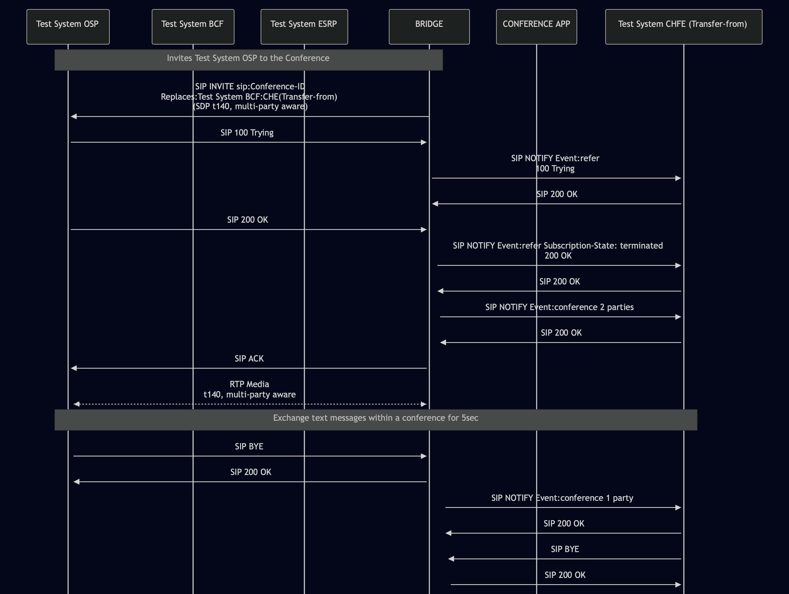

# Test Description: TD_BRIDGE_003

## Overview
### Summary
Handling multi-party aware and unaware endpoints in the same session

### Description
This test checks if Bridge is capable of handling multi-party aware and multi-party unaware endpoints in the same session

### References
* Requirements : RQ_BRG_042
* Test Case    : 

### Requirements
IXIT config file for BRIDGE

### SIP transport types
Test can be performed with 2 different SIP transport types. Steps describing actions for specific one are marked as following:
- (TLS transport) - should be used by default
- (TCP transport) - used in lab for testing purposes only if default TLS is not possible

## Configuration
### Implementation Under Test Interface Connections
<!-- Identify each of the FEs that are part of the configuration and how they are connected -->
* Test System OSP
  * IF_OSP_BCF - connected to IF_BCF_OSP
  * IF_OSP_CHFE - connected to IF_CHFE_OSP
  * IF_OSP_BRIDGE - connected to IF_BRIDGE_OSP
* Test System BCF
  * IF_BCF_OSP - connected to IF_OSP_BCF
  * IF_BCF_ESRP - connected to IF_ESRP_BCF
* Test System ESRP
  * IF_ESRP_BCF - connected to IF_BCF_ESRP
  * IF_ESRP_CHFE - connected to IF_CHFE_ESRP
* BRIDGE
  * IF_BRIDGE_CHFE - connected to IF_CHFE_BRIDGE
  * IF_BRIDGE_OSP - connected to IF_OSP_BRIDGE
* Test System CHFE (Transfer-from) 
  * IF_CHFE_OSP - connected to IF_OSP_CHFE
  * IF_CHFE_ESRP - connected to IF_ESRP_CHFE
  * IF_CHFE_BRIDGE - connected to IF_BRIDGE_CHFE
  * IF_CHFE_TS-CA - connected to IF_TS-CA_CHFE
* Test System Conference App
  * IF_TS-CA_CHFE - connected to IF_CHFE_TS-CA

### Test System Interfaces
<!-- Identify each of the test system interfaces and whether it will be in active or monitor mode -->
* Test System OSP
  * IF_OSP_BCF - Active
  * IF_OSP_CHFE - Active
  * IF_OSP_BRIDGE - Active
* Test System BCF
  * IF_BCF_OSP - Active
  * IF_BCF_ESRP - Active
* Test System ESRP
  * IF_ESRP_BCF - Active
  * IF_ESRP_CHFE - Active
* BRIDGE
  * IF_BRIDGE_CHFE - Active
  * IF_BRIDGE_OSP - Active
* Test System CHFE (Transfer-from)
  * IF_CHFE_OSP - Active
  * IF_CHFE_ESRP - Active
  * IF_CHFE_BRIDGE - Active
  * IF_CHFE_TS-CA - Active
* Test System Conference App
  * IF_TS-CA_CHFE - Active

### Connectivity Diagram
<!--
https://mermaid.live/edit#pako:eNqNVNtugkAQ_RUyz2qAVW5pmljU1qRNjfjUkJgtrGIqLFmWtNb4711WRC6mkaeZs2fOnJ0he4SAhgQc2OzpdxBhxpXXpZ8o4pvP1u_eYv3kzh76_UeRiahAqtMin3rLRXlchAVWnUvAfZlNS0IRSrCh3ybUO0hg5fXdccmQsYSvLpbzyfO0I3OG2ywhXpLk1UrOmZXln1uG00hZkYwr3iHjJFYqN82JdLCrpTqx5oEk4T9t2pKNUbfGfY_elVffRbtLtaB7JDs3bG6rDna6dzbS2W_NQcvDjbLaym_hladbco0r0WRDGEkCMk7ThlL7PxNK0IMt24XgcJaTHsSExbhI4VhQfOARiYkPjghDzL588JOTqElx8kFpfCljNN9G4GzwPhNZnoaYk8kOC29xhQpHIWEuzRMODrJ1KQLOEX7A0VRrgCwVoaFhI81WDdSDAzjGaGCOTH1oIts2kalppx78yrbqwDIM3ULqyNZ0VTMtIYdzTr1DElxMkXDHKXs7PwTyPTj9AeRbKcs
-->

## Pre-Test Conditions
### Test System OSP, Test System BCF, Test System ESRP, Test System CHFE, Test System Conference App
* Interfaces are connected to network
* Interfaces have IP addresses assigned by DHCP
* Device is active
* ng911 repository cloned to local storage
* (TLS) Generated own PCA-signed certificate and private key files (test_system.crt, test_system.key)
* (TLS) Certificate and key used by BRIDGE copied to local storage
* (TLS) PCA certificate copied to local storage

### BRIDGE
* Interfaces are connected to network
* Interfaces have IP addresses assigned by DHCP
* IUT is active
* IUT is in normal operating state
* Default configuration is loaded
* IUT is initialized using IXIT config file
  
## Test Sequence

### Test Preamble

#### Test System OSP, Test System BCF, Test System ESRP, Test System CHFE, Test System Conference App
* Install SIPp by following steps from documentation[^1]
* Install Wireshark[^2]
* (TLS v1.2) Configure Wireshark to decode SIP over TLS, use Test Systems and IUT certificate keys [^3]
* (TLS v1.3) Configure logging of session keys and configure Wireshark to decode SIP over TLS [^4]
* Using Wireshark, start packet tracing on all local interfaces - run following filter (e.g. for IF_OSP_BRIDGE):
   * (TLS transport)
     > ip.addr == IF_OSP_BRIDGE_IP_ADDRESS and tls
   * (TCP transport)
     > ip.addr == IF_OSP_BRIDGE_IP_ADDRESS and sip

#### Test System Conference App

Prepare to receive call and redirect Test System CHFE (Transfer-from):
  * (TLS transport)
    >   sudo sipp -t l1 --tls_cert cert.crt --tls_key cert.key -sf SIP_INVITE_RECEIVE_302_Moved_Contact.xml \
    > -i IF_TS-CA_CHFE -p 5061 \
  -set conference_id CONFERENCE_ID_VALUE \
  -set BRIDGE_IP IF_BRIDGE_CHFE_IP \
  -set BRIDGE_port 5061 \
  -max_socket 1000 -m 1 IF_TS-CA_CHFE_IP_ADDRESS:5061
  * (TCP transport)
    >   sudo sipp -t t1 -sf SIP_INVITE_RECEIVE_302_Moved_Contact.xml \
    > -i IF_TS-CA_CHFE -p 5060 \
  -set conference_id CONFERENCE_ID_VALUE \
  -set BRIDGE_IP IF_BRIDGE_CHFE_IP \
  -set BRIDGE_port 5060 \
  -max_socket 1000 -m 1 IF_TS-CA_CHFE_IP_ADDRESS:5061

#### Test System BCF

Run custom SIP service using following command (replace names in {} with values):
  * (TLS transport)
    >   sudo python3 test_suite/services/stub_server/sip_service/sip_entry.py \
  --scenario test_suite/test_files/SIPp_scenarios/sip_service/CHFE_006/BCF_CHFE_006_var2.xml \
  --scenario-type auto --bind-ip {IF_BCF_OSP_IP} --bind-port 5061 \
  --remote-ip {IF_ESRP_BCF_IP} --remote-port 5061 \
  --tls-cert {BCF_CERT_FILE_PATH} --tls_key {BCF_KEY_FILE_PATH} \
  --tls-ca {PCA_CERT_FILE_PATH} \
  --set IF_OSP_BCF {IF_OSP_BCF_IP} \
  --set IF_ESRP_BCF {IF_ESRP_BCF_IP} \
  --protocol TLS
  * (TCP transport)
    >   sudo python3 test_suite/services/stub_server/sip_service/sip_entry.py \
  --scenario test_suite/test_files/SIPp_scenarios/sip_service/CHFE_006/BCF_CHFE_006_var2.xml \
  --scenario-type auto --bind-ip {IF_BCF_OSP_IP} --bind-port 5060 \
  --remote-ip {IF_ESRP_BCF_IP} --remote-port 5060 \
  --set IF_OSP_BCF {IF_OSP_BCF_IP} \
  --set IF_ESRP_BCF {IF_ESRP_BCF_IP} \
  --protocol TCP

#### Test System ESRP

Run custom SIP service using following command (replace names in {} with values):
  * (TLS transport)
    >   sudo python3 test_suite/services/stub_server/sip_service/sip_entry.py \
  --scenario test_suite/test_files/SIPp_scenarios/sip_service/CHFE_006/ESRP_CHFE_006_var2_var3.xml \
  --scenario-type auto --bind-ip {IF_ESRP_BCF_IP} --bind-port 5061 \
  --remote-ip {IF_CHFE_ESRP_IP} --remote-port 5061 \
  --tls-cert {ESRP_CERT_FILE_PATH} --tls_key {ESRP_KEY_FILE_PATH} \
  --tls-ca {PCA_CERT_FILE_PATH} \
  --set IF_BCF_ESRP {IF_BCF_ESRP_IP} \
  --set IF_CHFE_ESRP_BCF {IF_CHFE_ESRP_IP} \
  --protocol TLS
  * (TCP transport)
    >   sudo python3 test_suite/services/stub_server/sip_service/sip_entry.py \
  --scenario test_suite/test_files/SIPp_scenarios/sip_service/CHFE_006/ESRP_CHFE_006_var2_var3.xml \
  --scenario-type auto --bind-ip {IF_ESRP_BCF_IP} --bind-port 5060 \
  --remote-ip {IF_CHFE_ESRP_IP} --remote-port 5060 \
  --set IF_BCF_ESRP {IF_BCF_ESRP_IP} \
  --set IF_CHFE_ESRP_BCF {IF_CHFE_ESRP_IP} \
  --protocol TCP

#### Test System CHFE

Run custom SIP service using following command (replace names in {} with values):
  * (TLS transport)
    >   sudo python3 test_suite/services/stub_server/sip_service/sip_entry.py \
  --scenario test_suite/test_files/SIPp_scenarios/sip_service/BRIDGE_003/CHFE_BRIDGE_003.xml \
  --scenario-type auto --bind-ip {IF_CHFE_ESRP_IP} --bind-port 5061 \
  --remote-ip {IF_CHFE_BRIDGE_IP} --remote-port 5061 \
  --tls-cert {CHFE_CERT_FILE_PATH} --tls_key {CHFE_KEY_FILE_PATH} \
  --tls-ca {PCA_CERT_FILE_PATH} \
  --set conference_id {CONFERENCE_ID} \
  --set IF_OSP_CHFE {IF_OSP_CHFE_IP} \
  --set IF_CHFE_OSP {IF_CHFE_OSP_IP} \
  --set IF_TS-CA_CHFE {IF_TS-CA_CHFE_IP} \
  --set IF_CHFE_TS-CA {IF_CHFE_TS-CA_IP} \
  --set IF_BRIDGE_CHFE {IF_BRIDGE_CHFE_IP} \
  --set IF_CHFE_BRIDGE_BCF {IF_CHFE_BRIDGE_IP} \
  --protocol TLS
  * (TCP transport)
    >   sudo python3 test_suite/services/stub_server/sip_service/sip_entry.py \
  --scenario test_suite/test_files/SIPp_scenarios/sip_service/BRIDGE_003/CHFE_BRIDGE_003.xml \
  --scenario-type auto --bind-ip {IF_CHFE_ESRP_IP} --bind-port 5060 \
  --remote-ip {IF_CHFE_BRIDGE_IP} --remote-port 5060 \
  --set conference_id {CONFERENCE_ID} \
  --set IF_OSP_CHFE {IF_OSP_CHFE_IP} \
  --set IF_CHFE_OSP {IF_CHFE_OSP_IP} \
  --set IF_TS-CA_CHFE {IF_TS-CA_CHFE_IP} \
  --set IF_CHFE_TS-CA {IF_CHFE_TS-CA_IP} \
  --set IF_BRIDGE_CHFE {IF_BRIDGE_CHFE_IP} \
  --set IF_CHFE_BRIDGE_BCF {IF_CHFE_BRIDGE_IP} \
  --protocol TCP

### Test Body

#### Stimulus

Start text call with CHFE, then exchange text messages after receiving INVITE to conference from BRIDGE - run following SIPp command on Test System OSP.

Run custom SIP service using following command (replace names in {} with values):
  * (TLS transport)
    >   sudo python3 test_suite/services/stub_server/sip_service/sip_entry.py \
  --scenario test_suite/test_files/SIPp_scenarios/sip_service/BRIDGE_003/OSP_BRIDGE_003.xml \
  --scenario-type auto --bind-ip {IF_OSP_BCF_IP} --bind-port 5061 \
  --remote-ip {IF_BCF_OSP_IP} --remote-port 5061 \
  --tls-cert {OSP_CERT_FILE_PATH} --tls_key {OSP_KEY_FILE_PATH} \
  --tls-ca {PCA_CERT_FILE_PATH} \
  --set conference_id {CONFERENCE_ID} \
  --set IF_OSP_BCF {IF_OSP_BCF_IP} \
  --set IF_BCF_OSP {IF_BCF_OSP_IP} \
  --set IF_OSP_CHFE {IF_OSP_CHFE_IP} \
  --set IF_CHFE_OSP {IF_CHFE_OSP_IP} \
  --set IF_BRIDGE_OSP {IF_BRIDGE_OSP_IP} \
  --set IF_OSP_BRIDGE_BCF {IF_OSP_BRIDGE_IP} \
  --protocol TLS
  * (TCP transport)
    >   sudo python3 test_suite/services/stub_server/sip_service/sip_entry.py \
  --scenario test_suite/test_files/SIPp_scenarios/sip_service/BRIDGE_003/OSP_BRIDGE_003.xml \
  --scenario-type auto --bind-ip {IF_OSP_BCF_IP} --bind-port 5060 \
  --remote-ip {IF_BCF_OSP_IP} --remote-port 5060 \
  --set conference_id {CONFERENCE_ID} \
  --set IF_OSP_BCF {IF_OSP_BCF_IP} \
  --set IF_BCF_OSP {IF_BCF_OSP_IP} \
  --set IF_OSP_CHFE {IF_OSP_CHFE_IP} \
  --set IF_CHFE_OSP {IF_CHFE_OSP_IP} \
  --set IF_BRIDGE_OSP {IF_BRIDGE_OSP_IP} \
  --set IF_OSP_BRIDGE_BCF {IF_OSP_BRIDGE_IP} \
  --protocol TCP

#### Response

* BRIDGE accepts SDP offer from Test System CHFE (t140 media, multi-party unaware)
* BRIDGE accepts SDP response from Test System OSP (t140 media, multi-party aware)
* All text messages sent from Test System OSP are delivered through BRIDGE to Test System CHFE
* All text messages sent from Test System CHFE are delivered through BRIDGE to Test System OSP
* All RTP packets received by Test System OSP and Test System CHFE from BRIDGE contain one SSRC (Synchronization Source Identifier) which identify the BRIDGE
* All RTP packets sent by BRIDGE to Test System CHFE do not contain any ids in CSRC (Contributing Source Identifiers) or this section is missing in packets
* All RTP packets sent by BRIDGE to Test System OSP contain CSRC (Contributing Source Identifiers) with ID of Test System CHFE

VERDICT:
* PASSED - All checks passed
* FAILED - any other cases

### Test Postamble
#### Test System OSP, Test System BCF, Test System ESRP, Test System CHFE, Test System Conference App
* stop all SIPp processes (if still running)
* archive all logs generated
* stop Wireshark (if still running)
* remove ng911 repository files
* disconnect interfaces from BRIDGE

#### BRIDGE
* reconnect interfaces back to default

## Post-Test Conditions 
### Test System OSP, Test System BCF, Test System ESRP, Test System CHFE, Test System Conference App
* Test tools stopped
* interfaces disconnected

### BRIDGE
* device connected back to default
* device in normal operating state

## Sequence Diagram
<!--
https://mermaid.live/edit#pako:eNqtVl1vmzAU_StXflpV6AiEJrWqSgkhW1Y1iYBN2sSLB06KWuzMmG5Z1f8-A0uaUpTmoygPxNx7OPdcH3MfUcRjijDSdT1kEWezZI5DBpAmQnDRiyQXGYYZuc9oyMqgjP7KKYvoICFzQdIiGGBBhEyiZEGYhIBmEvxlJmkKE3-6PaDvDLcHuL7XANH3RoNP7ut1ZzIeup47dlzoTd94tfN56MKHQBCWzajQZ4KnJyGrcmo16FdXpzXW2B9NYTT-NgoUiD-Ygmy1jZPX2Sq0nl2UtGt6EVvPbyKO4Rnw8qf4eLUVtQmhkWWJahoGTK73plmItGt-g0pK9p3Tt7So51zv15TGhP3a0AihOF5e6grkbQwvmMINjRNSdrKoebUvx1xS4A9UvNlO7aUVMDiCEkkzcJTJqSgcXEHuujfqeFs2cHG9DN9dO8sw4UZVGJe1K7KSRBKyZIGfiY8Gp0k241GeHV9C2au9xa3OHwxfeMIOl3SFsiFlvdBShbW-GqT5vUz04khbQs7IbyLohugV4O5it7oGeAmbq9_hIJU_N9uF36ddm_KsLfXM8HA3Ncp4ODf_a993vFH_dfeOFRUOBxhPgtHwO7gPlEkcrTlBq_weLg-vtmJ2hGd62V0GfZHEcwqSQ8IeEoVROyqLJ_KWvou1PFe5vtlZHi2yAo4h8PXihK4WF_ckotlqUXc-u8d2MmRIQ3NVNMJS5FRDKRUpKf6ixwI7RKralIYIq9uYiLsQhexJ5aix5Qfn6SpN8Hx-i3A5kGkoX8TqTP8_ia1XVYExFQ7PmUT4ot0pQRB-RH8QNo2Ls45pmPZ5x7Cttt3V0FKttrpn7Qu7Y9ntrq0eGJ0nDf0tX2ucndtGt92yLNvqmJbZUnAkl9xfsmhFSplLzYk31SRZDpRP_wDUCS-_
-->

<!--
https://mermaid.live/edit#pako:eNq1VVtP2zAU_itHfgItYbmVgoWQIE23aqKtmmoSU15McppaI3bnOECH-O9zkhWmcGk1RJ4c-1y-7_M5PvcklRkSSmzbTkQqxYLnNBEABVdKqrNUS1VSWLDrEhPRGJX4q0KR4oCzXLGiNgZYMaV5yldMaJhjqSFelxoLmMTTtw3Ow-HbBlE8eyHE-Ww0-BI93w8n42E0i8ZhBGfTLanDr8MI9uaKiXKByl4oWewnovUZS40gb1B12VhtZgojccM1lt1z0BL0EiE0UqKqdWoD1l_rap-efuo4UYhHUxiNv4_mEZR8RZ-87dHg5Ep9PoUZrq5ZiiXtqEfDr1GHROOwFw8MGDdwLCiqa83tWoY1sFumcP8JUwdJDW7DsMbkOg7M1ZqLfBuNl9RsY4wn89HwEqIbFJoqNKcNwJdCbwvYheeZGJNvO7Ppmr-fCcTVVZkqvtJcCjvWTCMFjargwiyzhuhbIP-H5LtQp4-VBV7bGVh-NLTHCj8Ln9menNjG_Jn1bD6FC8w4axR8pYy3N-t2gaK7dMlEjubS7jQUWJYsN119y_WSC2Dwj14LqaBXYrpJu0PBnV9GO4vzUdfsNte8_pgm28V_BxFeZ9UmJxbJFc8I1apCixSmwVj9S-7ryAkxL26BCaFmmTH1MyGJeDA-5sn_IWWxcVOyypeENsPMItUqMy36d4o97hrNMlShrIQm1At6TRBC78kdoa4XHBweBr7j9z3P944c1yJrs-0fHwRHPdfpOz3HnAX9B4v8bvI6Bz3fPwxcr3_UD8yJf2wRVmkZr0W6QWWq3AzZi3YMN9P44Q92A1RW
-->

## Comments

Version:  010.3f.5.0.1

Date:     20260107

## Footnotes
[^1]: SIPp - tool for SIP packet simulations. Official documentation: https://sipp.sourceforge.net/doc/reference.html#Getting+SIPp
[^2]: Wireshark - tool for packet tracing and anaylisis. Official website: https://www.wireshark.org/download.html
[^3]: Wireshark configuration to decrypt TLS packets: https://www.zoiper.com/en/support/home/article/162/How%20to%20decode%20SIP%20over%20TLS%20with%20Wireshark%20and%20Decrypting%20SDES%20Protected%20SRTP%20Stream
[^4]: TLS v1.3 session keys logging + Wireshark configuration to decrypt traffic: https://my.f5.com/manage/s/article/K50557518
