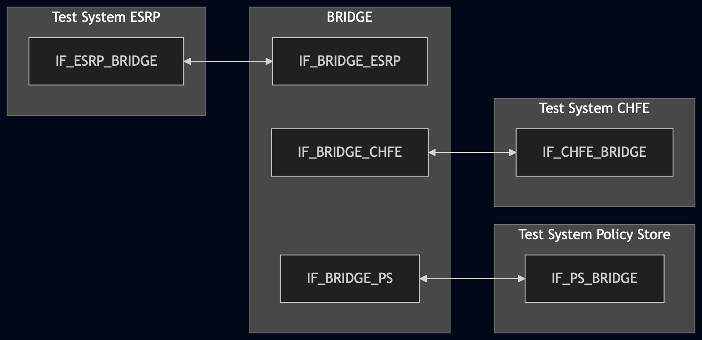
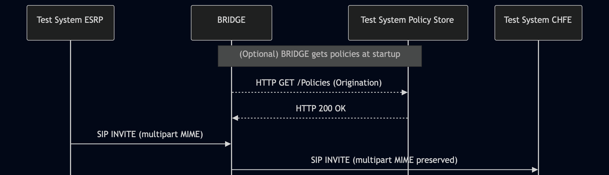

# Test Description: TD_BRIDGE_005
## Overview

### Summary

Multipart MIME support for SIP INVITE requests processed by the BRIDGE.

### Description

This test verifies that the BRIDGE, operating in a Route All Calls via a Conference-Aware User Agent environment, supports multipart Multipurpose Internet Mail Extensions (MIME) bodies as defined in RFC 2046. The test verifies that the BRIDGE receives a SIP INVITE and sends it further to the Test System CHFE with the MIME body parts preserved.

### SIP transport types

Test can be performed with 2 different SIP transport types. Steps describing actions for specific one are marked as following:
- (TLS transport) - used by default inside ESInet on production environment
- (TCP transport) - used in lab for testing purposes only if default TLS is not possible

### References

* Requirements : RQ_BRG_158
* Test Case    : TC_BRIDGE_005

### Requirements

IXIT config file for BRIDGE specifying configuration of:

Variant 1:
- default Policy Store URL

Variant 2:
- URI of downstream CHFE


## Configuration

### Implementation Under Test Interface Connections

* Test System ESRP
  * IF_ESRP_BRIDGE - connected to BRIDGE IF_BRIDGE_ESRP
* BRIDGE
  * IF_BRIDGE_ESRP - connected to Test System ESRP IF_ESRP_BRIDGE
  * IF_BRIDGE_PS - connected to Test System Policy Store IF_PS_BRIDGE
  * IF_BRIDGE_CHFE - connected to Test System CHFE IF_CHFE_BRIDGE
* Test System Policy Store
  * IF_PS_BRIDGE - connected to BRIDGE IF_BRIDGE_PS
* Test System CHFE
  * IF_CHFE_BRIDGE - connected to BRIDGE IF_BRIDGE_CHFE

### Test System Interfaces

* Test System ESRP
  * IF_ESRP_BRIDGE - Active
* BRIDGE
  * IF_BRIDGE_ESRP - Active
  * IF_BRIDGE_PS - Monitor
  * IF_BRIDGE_CHFE - Active
* Test System Policy Store
  * IF_PS_BRIDGE - Monitor
* Test System CHFE
  * IF_CHFE_BRIDGE - Active

### Connectivity Diagram
<!--
https://mermaid.live/edit#pako:eNqNUtlOwzAQ_JVon9MqZxNbiAd6QCWQoqa8QFBlEreJaOLKcQSh6r_jXL0CEn7yzs7OzFreQ8giChjWW_YZxoQL5XERZIo889lq6i-81d1iPrmf3gwGtxJpirpxZLXY-GHWsaprC1-zPL_leP6R0XDy4n3DyS5WljQXil_mgqbKyagfqcFpFvUU5s_L1wBaFrxdCPQ2uM73G1ot9LfdeWCPbZOwVHzBOL1QOtv3Pzonx3a-96ZSAVTY8CQCLHhBVUgpT0lVwr6iBCBimtIAsLxGhH8EEGQHObMj2QtjaTfGWbGJAa_JNpdVsYuIoJOEyEzpEeXSjfIxKzIB2HS0WgTwHr4AW87QRiNT03WEXNsykK1CCXjkDh3NdHXD1U3kGpZ7UOG7ttWGDkKWZY8MJGdcx1SBFIL5ZRZ2mWiUyBd8av5m_UW7ZNO60wY7_ABM7c_N
-->



## Pre-Test Conditions

### Test System ESRP, Test System CHFE, Test System Policy Store

* Interfaces are connected to the network
* Interfaces have IP addresses assigned by DHCP
* Test Systems are active
* ng911 repository is cloned to local storage
* No active test calls

### BRIDGE

* Interfaces are connected to the network
* Interfaces have IP addresses assigned by DHCP
* IUT is active
* IUT is in normal operating state
* Default configuration is loaded
* IUT is initialized using the IXIT config file - default Policy Store URL is set to Test System Policy Store, or default downstream SIP URI is set to Test System CHFE
* IUT is configured to operate in a Route All Calls via a Conference-Aware User Agent environment
* IUT is configured to use Test System Policy Store as its policy source
* IUT is configured to receive SIP signaling from Test System ESRP through IF_BRIDGE_ESRP
* IUT is configured to route SIP signaling to Test System CHFE through IF_BRIDGE_CHFE
* No active calls

## Test Sequence

### Test Preamble

#### Test System ESRP

* Install SIPp by following steps from documentation[^1]
* Copy the following SIPp scenario files to local storage:

  ```
  SIP_INVITE_from_ESRP_with_complex_multipart_mixed_SDP_PIDFLO_AddData_NGAACN.xml
  SIP_INVITE_from_ESRP_with_nested_multipart_mixed.xml
  SIP_INVITE_from_ESRP_with_single_multipart_mixed_SDP_only.xml
  ```
* Install Wireshark[^2]
* (TLS v1.2) Configure Wireshark to decode SIP over TLS, use Test Systems and IUT certificate keys [^3]
* (TLS v1.3) Configure logging of session keys and configure Wireshark to decode SIP over TLS [^4]
* Using Wireshark, start packet tracing - run following filter:
   * (TLS transport)
     > ip.addr == IF_ESRP_BRIDGE_IP_ADDRESS and tls
   * (TCP transport)
     > ip.addr == IF_ESRP_BRIDGE_IP_ADDRESS and sip

#### Test System CHFE

* Install SIPp by following steps from documentation[^1]
* Copy `SIP_INVITE_RECEIVE.xml` to local storage
* Install Wireshark[^2]
* (TLS v1.2) Configure Wireshark to decode SIP over TLS, use Test Systems and IUT certificate keys [^3]
* (TLS v1.3) Configure logging of session keys and configure Wireshark to decode SIP over TLS [^4]
* Using Wireshark, start packet tracing - run following filter:
   * (TLS transport)
     > ip.addr == IF_CHFE_BRIDGE_IP_ADDRESS and tls
   * (TCP transport)
     > ip.addr == IF_CHFE_BRIDGE_IP_ADDRESS and sip

* Prepare Test System CHFE to receive SIP INVITE requests using the command corresponding to the selected transport:

  * (TLS transport)

    ```
    sudo sipp -t l1 -tls_cert cacert.pem -tls_key cakey.pem -sf SIP_INVITE_RECEIVE.xml -i IF_CHFE_BRIDGE_IP_ADDRESS -p 5061
    ```

  * (TCP transport)

    ```
    sudo sipp -t t1 -sf SIP_INVITE_RECEIVE.xml -i IF_CHFE_BRIDGE_IP_ADDRESS -p 5060
    ```

### Test Body

#### Variations

1. SIP INVITE with a `multipart/mixed` body containing exactly one SDP part

Use SIPp scenario: `SIP_INVITE_from_ESRP_with_single_multipart_mixed_SDP_only.xml`

2. SIP INVITE with a `multipart/mixed` body containing a comprehensive set of emergency metadata: 1x SDP, 1x PIDF-LO XML, 3x Additional Data XML blocks (RFC 7852), 1x NG-AACN Control block and 1x VEDS Crash Data block.

Use SIPp scenario: `SIP_INVITE_from_ESRP_with_complex_multipart_mixed_SDP_PIDFLO_AddData_NGAACN.xml`

3. SIP INVITE with a nested `multipart/mixed` body where the outer multipart contains one SDP part and one nested `multipart/mixed` part. The inner multipart contains one PIDF-LO part and one EmergencyCallData.DeviceInfo part. The outer and inner multipart use distinct boundary strings.

Use SIPp scenario: `SIP_INVITE_from_ESRP_with_nested_multipart_mixed.xml`

#### Stimulus

Simulate basic call from Test System ESRP to BRIDGE - run SIPp scenario by using following command on Test System ESRP, example:
* (TCP transport)
  ```
  sudo sipp -t t1 -sf SIPP_SCENARIO_FILE IF_BRIDGE_ESRP_IPv4:5060
  ```
* (TLS transport)
  ```
  sudo sipp -t l1 -tls_cert test_system.crt -tls_key test_system.key -sf SIPP_SCENARIO_FILE IF_BRIDGE_ESRP_IPv4:5060
  ```

#### Response

- The BRIDGE must receive the INVITE and forward it to the CHFE.
- The forwarded INVITE at the BRIDGE interface must contain the exact same MIME structure and content as the original stimulus.
- Content-Type headers must correctly reflect the boundary strings and multipart subtypes.

VERDICT:

* PASSED - if all checks passed for variation
* FAILED - all other cases

### Test Postamble

#### Test System ESRP, Test System CHFE, Test System Policy Store

* Stop all SIPp processes, if still running
* Stop Wireshark, if still running
* Archive generated logs and packet traces
* Remove copied SIPp scenario files
* Disconnect interfaces from the BRIDGE

#### BRIDGE

* Restore the configuration used before the test
* Disconnect interfaces from the Test Systems
* Reconnect interfaces to their default connections

## Post-Test Conditions

#### Test System ESRP, Test System CHFE, Test System Policy Store

* Test tools are stopped
* Packet traces are archived
* Interfaces are disconnected from the BRIDGE

### BRIDGE

* Configuration used before the test is restored
* Interfaces are reconnected to their default connections
* No test calls remain active
* IUT is back in normal operating state

## Sequence Diagram
<!--
https://mermaid.live/edit#pako:eNp9kk-PmzAQxb_KaE6JRFLyH3yI1O7SXVRlgxbaQ8XFglnWarCpMaumUb57bRJaaSP1Zs-835tna05YqJKQ4WQyyWWh5IuoWC4BaqG10h8Lo3TL4IUfWsplL2rpZ0eyoHvBK81rJwZouDaiEA2XBqL0OQHeQkatgfTYGqr72q0y_po54afn-P4hum0n6XubRB1EcYTUpqJb_d3j5-g94Wq5vGiflCFQb6TdYM_as9G-MUJJfhhfQ0BFpoXGjRHUAjfQGjuhay4OlptMtltLwmOWJfAQZfAhGdSjvRaVkNxZji9Akjq9xa7A3Pdh_2UI5H5laKdxAvHTtziLYFR3ByPcy2AX76Kr1b8E26171f8QaDS1pN-oHKOHlRYlMqM78rAmXXN3xZMzzNG8Uk05Mnssuf6RYy7PlrEf-l2pesC06qpXZP0eeNg1JTfDAvytapIl6TvVSYNsEfq9CbIT_kK23ExX4Xrhz2ZhGKyW83Dl4RHZOphu_EUwmwezRRjMl8HZw9_9WH-6CcPlcrWeh5YJNgsPeWdUepTFkIlKYfdgd9nffo2HZFHfuQY7_wGyZOiX
-->



## Comments

Version:  010.3f.5.0.0

Date:     20260907

## Footnotes

[^1]: SIPp - tool for SIP packet simulations. Official documentation: https://sipp.sourceforge.net/doc/reference.html#Getting+SIPp
[^2]: Wireshark - tool for packet tracing and anaylisis. Official website: https://www.wireshark.org/download.html
[^3]: Wireshark configuration to decrypt TLS packets: https://www.zoiper.com/en/support/home/article/162/How%20to%20decode%20SIP%20over%20TLS%20with%20Wireshark%20and%20Decrypting%20SDES%20Protected%20SRTP%20Stream
[^4]: TLS v1.3 session keys logging + Wireshark configuration to decrypt traffic: https://my.f5.com/manage/s/article/K50557518