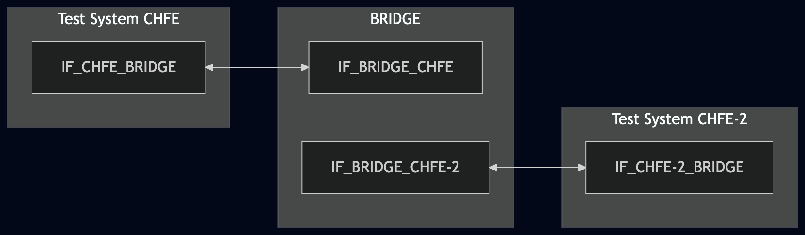
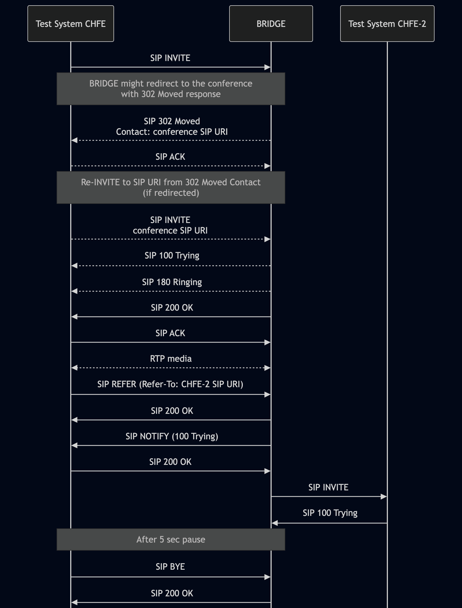

# Test Description: TD_BRIDGE_006

## Overview

### Summary

Outgoing SIP INVITE created by BRIDGE for call transfer to a secondary PSAP

### Description

This test verifies the SIP INVITE created by BRIDGE when a call is transferred from a primary PSAP to a secondary PSAP.

The test verifies that the outgoing SIP INVITE:

- uses the service URN as the Request-URI;
- contains a Route header field with the transfer target URI obtained from the Refer-To header field of the received SIP REFER;
- contains a Referred-By header field with the URI of the primary PSAP.

The Route URI should include the `lr` parameter to avoid Request-URI rewriting.

### References

* Requirements : RQ_BRG_009, RQ_BRG_010
* Test Case    :

### Requirements

IXIT config file for BRIDGE.

### SIP transport types

The test uses the SIP transport configured for the participating interfaces in the lab configuration.

Transport selection and transport-security conformance are outside the scope of this test.

## Configuration

### Implementation Under Test Interface Connections

* Test System CHFE
  * IF_CHFE_BRIDGE - connected to IF_BRIDGE_CHFE
* BRIDGE
  * IF_BRIDGE_CHFE - connected to IF_CHFE_BRIDGE
  * IF_BRIDGE_CHFE-2 - connected to IF_CHFE-2_BRIDGE
* Test System CHFE-2
  * IF_CHFE-2_BRIDGE - connected to IF_BRIDGE_CHFE-2

### Test System Interfaces

* Test System CHFE
  * IF_CHFE_BRIDGE - Active
* BRIDGE
  * IF_BRIDGE_CHFE - Active
  * IF_BRIDGE_CHFE-2 - Active
* Test System CHFE-2
  * IF_CHFE-2_BRIDGE - Active

### Connectivity Diagram

<!--

-->

## Pre-Test Conditions

### Test System CHFE, Test System CHFE-2

* Interfaces are connected to the network.
* Interfaces have IP addresses assigned.
* Test systems are active.

### BRIDGE

* Interfaces are connected to the network.
* Interfaces have IP addresses assigned.
* IUT is active.
* IUT is in normal operating state.
* Default configuration is loaded.
* IUT is initialized using the IXIT config file.

## Test Sequence

### Test Preamble

#### Test System CHFE

* Install SIPp by following steps from documentation[^1]
* Install Wireshark[^2]
* Using Wireshark on 'Test System' start packet tracing on IF_CHFE_BRIDGE interface - run following filter:
   * (TLS)
     > ip.addr == IF_CHFE_BRIDGE_IP_ADDRESS and tls
   * (TCP)
     > ip.addr == IF_CHFE_BRIDGE_IP_ADDRESS and sip

#### Test System CHFE-2

* Install SIPp by following steps from documentation[^1]
* Install Wireshark[^2]
* Using Wireshark on 'Test System' start packet tracing on IF_CHFE-2_BRIDGE interface - run following filter:
   * (TLS)
     > ip.addr == IF_CHFE-2_BRIDGE_IP_ADDRESS and tls
   * (TCP)
     > ip.addr == IF_CHFE-2_BRIDGE_IP_ADDRESS and sip
* Prepare to receive the SIP INVITE generated by BRIDGE and respond with SIP 100 Trying using the reusable `SIP_INVITE_RECEIVE_100_Trying.xml` SIPp scenario from `test_suite/test_files/SIPp_scenarios/SIP_RECEIVE/`:
  * (TLS transport)
    > sudo sipp -t l1 --tls_cert cert.crt --tls_key cert.key -sf test_suite/test_files/SIPp_scenarios/SIP_RECEIVE/SIP_INVITE_RECEIVE_100_Trying.xml \
    > -i IF_CHFE-2_BRIDGE_IP_ADDRESS -port 5061 IF_BRIDGE_CHFE-2_IP_ADDRESS
  * (TCP transport)
    > sudo sipp -t t1 -sf test_suite/test_files/SIPp_scenarios/SIP_RECEIVE/SIP_INVITE_RECEIVE_100_Trying.xml \
    > -i IF_CHFE-2_BRIDGE_IP_ADDRESS -port 5060 IF_BRIDGE_CHFE-2_IP_ADDRESS

### Test Body

#### Stimulus

From Test System CHFE, run the TD-specific `CHFE_BRIDGE_006.xml` SIP service scenario against BRIDGE:
* (TLS transport)
     > python3 sip_entry.py --bind-ip IF_CHFE_BRIDGE_IP_ADDRESS --bind-port 5061 --remote-ip IF_BRIDGE_CHFE_IP_ADDRESS --remote-port 5061 --protocol TLS --scenario CHFE_BRIDGE_006.xml --message-timeout 5000 --transaction-timeout 5000 --tls-cert CHFE_CERTIFICATE_FILE --tls-key CHFE_KEY_FILE --tls-ca PCA_CERTIFICATE_FILE
* (TCP transport)
     > python3 sip_entry.py --bind-ip IF_CHFE_BRIDGE_IP_ADDRESS --bind-port 5060 --remote-ip IF_BRIDGE_CHFE_IP_ADDRESS --remote-port 5060 --protocol TCP --scenario CHFE_BRIDGE_006.xml --message-timeout 5000 --transaction-timeout 5000
  

The scenario uses a valid SIP REFER whose Refer-To header field contains the SIP URI of Test System CHFE-2 and a `serviceurn` header parameter with value `urn:service:sos`, and whose Referred-By header field contains the SIP URI of Test System CHFE.

Example SIP REFER header fields:

> Refer-To: <sip:chfe-2@example.com:5060>;serviceurn="urn:service:sos"
> Referred-By: <sip:chfe@example.com:5060>

The corresponding SIP INVITE created by BRIDGE is expected to contain:

> INVITE urn:service:sos SIP/2.0
> Route: <sip:chfe-2@example.com:5060;lr>
> Referred-By: <sip:chfe@example.com:5060>

#### Response

Verify that, after the valid SIP REFER described above is accepted, BRIDGE sends a SIP INVITE towards Test System CHFE-2.

Verify that the outgoing SIP INVITE:

* has the Request-URI set to the same service URN supplied in the `serviceurn` parameter of the received SIP REFER;
* has a Route header field containing the SIP URI of Test System CHFE-2 found in the Refer-To header field of the received SIP REFER;
* (optional) has a Route URI that should include the `lr` parameter to avoid Request-URI rewriting;
* has a Referred-By header field containing the URI of Test System CHFE, matching the primary PSAP URI provided in the received SIP REFER.

VERDICT:

* PASSED - if all mandatory checks passed. The optional `lr` parameter in the Route URI does not affect the test verdict.
* ERROR - if Test System CHFE fails to re-send SIP INVITE after receiving SIP 302 Moved redirection, Test System CHFE fails to send SIP REFER, or the test setup or available capture prevents evaluation of the required BRIDGE behavior.
* FAILED - any other cases.

### Test Postamble

#### Test System CHFE, Test System CHFE-2

* Stop all SIPp processes if still running.
* Archive generated logs.
* Stop packet capture.
* Disconnect test interfaces.

#### BRIDGE

* Restore the default interface configuration.

## Post-Test Conditions

### Test System CHFE, Test System CHFE-2

* Test tools are stopped.
* Test interfaces are disconnected.

### BRIDGE

* Device is connected back to the default configuration.
* Device is in normal operating state.

## Sequence Diagram

<!--
[](https://mermaid.live/edit#pako:eNqNVF2P2jAQ_CsrP4GU0HwAIRZC4jho0em4U0grXZUXNzEhamNTx2lLEf-9jkMo4sK1b_F6dnZms94DinlCEUamaUYs5myTpThiAHkmBBfTWHJRYNiQbwWNmAYV9HtJWUzvM5IKkldggB0RMouzHWESZh8WcyAFhLSQsN4XkuY69hp5Fyzv32ts_dXO5bSRmU7Earg-TSY1A4b18hmWq0_L8MS24pIC_0GFBhoN7FQ6z9KtBEGTTNBYguQgtxSqPlBRmRx_ERP4mcktuJYDj4onUehix1nVj4q_JjKVgoq_rn_GqvR3kxlnkksQSX9Bq1MdgeeHgysJ09tAYvOEgoGbts1J94oON4PmF1FPpykUn25x90qR7u3JNqpXfEtzm2bYsCMU-Y-kbmJEFgUJcgy4xjuJ5erj5a3Vfmrvx-FJ8ED5DrhySNyYjmC_mAXQCqnyZIcenWWrsdf9LVsv16ilcLl6g87cL3ZsaGqoWMuf1_OrwFcN1r1vnBJqM6Uaq2AAKGqu3VTaD26Ls7mX-jwYgA6UiSxCWoqQGyqnISXVEhyoxQur15DRCWH0mRHyNUMSOKke95c-c502a4GW6RVhvFQOVu4TIZp2co2rsEipmvGQSYd_THAgf0C-E-yO3N3Bt3xq4vutZfddAe4Rtu9fv27aaMctxR_3hwDsa6LeuavX8oWd59sB3RpbnDf2RgUgp-XrP4kaTGhy16x7rbaiX4vEPTFV56g)
-->

## Comments

Version:  010.3f.5.0.1

Date:     20260909

## Footnotes
[^1]: SIPp - tool for SIP packet simulations. Official documentation: https://sipp.sourceforge.net/doc/reference.html#Getting+SIPp
[^2]: Wireshark - tool for packet tracing and analysis. Official website: https://www.wireshark.org/download.html
