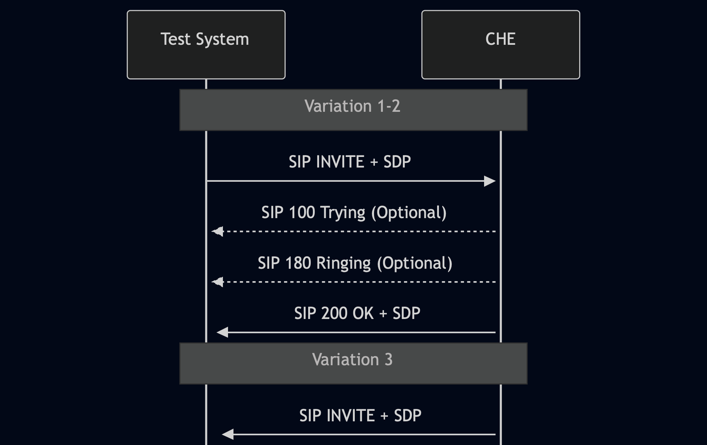

# Test Description: TD_CHE_003

## Overview
### Summary
Language tags in SDP

### Description
This test covers including language tags by CHE in SDP offers and answers

### References
* Requirements : RQ_CHE_008, RQ_CHE_009
* Test Case    : TC_CHE_003

### Requirements
IXIT config file for CHE

### SIP transport types
Test can be performed with 2 different SIP transport types. Steps describing actions for specific one are marked as following:
- (TLS transport) - should be used by default
- (TCP transport) - used in lab for testing purposes only if default TLS is not possible

## Configuration
### Implementation Under Test Interface Connections
<!-- Identify each of the FEs that are part of the configuration and how they are connected -->
* Test System
  * IF_TS_CHE - connected to IF_CHE_TS
* CHE
  * IF_CHE_TS - connected to IF_TS_CHE 

### Test System Interfaces
<!-- Identify each of the test system interfaces and whether it will be in active or monitor mode -->
* Test System
  * IF_TS_CHE - Active
* CHE
  * IF_CHE_TS - Active

### Connectivity Diagram


<!--
[](https://mermaid.live/edit#pako:eNpdUEsLgkAQ_isyZ_0DEl16UFCX9BQLMrmTSu6u7IMQ8b83pQY1p_ke8xygNJIghXtrnmWN1keni9ARx3Ff5FmxOexWSbJmwBkTQk-qC7fKYldHOTkfZb3zpCblp3aiSMu_qq80u5fmsxtiUGQVNpJXG960AF-TIgEppxLtQ4DQI_sweJP1uoTU20AxhE6ip22DPEgtZIf6agzDO7aOMcnGG3ueTv98IAZrQlXPjvEF1-xYFw)
-->

## Pre-Test Conditions
### Test System
* Interfaces are connected to network
* Interfaces have IP addresses assigned by DHCP
* Device is active
* ng911 repository cloned to local storage
* (TLS) Generated own PCA-signed certificate and private key files (test_system.crt, test_system.key)
* (TLS) Certificate and key used by CHE copied to local storage
* (TLS) PCA certificate copied to local storage

### CHE
* Interfaces are connected to network
* Interfaces have IP addresses assigned by DHCP
* IUT is active
* IUT is in normal operating state
* Default configuration is loaded
* IUT is initialized using IXIT config file
* IUT has configured tel number from which calls are accepted and auto-answered
* Test System configured as default ESRP
* Agent logged in (f.e. tester@psap.example.com)

## Test Sequence

### Test Preamble

#### Test System
* Install SIPp by following steps from documentation[^1]
* Install Wireshark[^2]
* (TLS v1.2) Configure Wireshark to decode HTTP over TLS, use tests system and FE certificate keys [^3]
* (TLS v1.3) Configure logging of session keys and configure Wireshark to decode HTTP over TLS [^4]
* Using Wireshark on 'Test System' start packet tracing on IF_TS_CHE interface - run following filter:
   * (TLS transport)
     > ip.addr == IF_TS_CHE_IP_ADDRESS and tls
   * (TCP transport)
     > ip.addr == IF_TS_CHE_IP_ADDRESS and sip
* edit 'From' header field in SIPp XML scenarios used in all variations with tel number accepted and auto-answered by CHE


### Test Body

#### Variations

1. Validate SDP answer from CHE on 'SIP INVITE + SDP' without language tags

Send SIP INVITE:
`SIP_INVITE_SDP_with_g711alaw_audio.xml`

2. Validate SDP answer from CHE on 'SIP INVITE + SDP' with language tags

Send SIP INVITE:
`SIP_INVITE_SDP_with_language_tags.xml`

3. Validate SDP offer from CHE for outgoing calls

Receive SIP INVITE using scenario file:
`SIP_INVITE_RECEIVE.xml`

#### Stimulus
* Variation 1-2
   - Send SIP INVITE to CHE - run following SIPp command on Test System, example:
      * (TLS transport)
       > sudo sipp -t l1 -sf SIPP_SCENARIO_FILE IF_CHE_TS:5060
      * (TCP transport)
       > sudo sipp -t t1 -sf SIPP_SCENARIO_FILE IF_CHE_TS:5061
  - On CHE answer incoming call

* Variation 3
   - Prepare Test System for receiving SIP INVITE from CHE - run following SIPp command on Test System, example:
      * (TLS transport)
       > sudo sipp -t l1 -sf SIP_INVITE_RECEIVE.xml -i IF_TS_CHE -p 5061 IF_CHE_TS:5061
      * (TCP transport)
       > sudo sipp -t t1 -sf SIP_INVITE_RECEIVE.xml -i IF_TS_CHE -p 5060 IF_CHE_TS:5060
   - On CHE trigger outbound call to Test System

#### Response
* Variation 1-2
    - after accepting a call CHE responds with SIP 200 OK
    - SIP 200 OK contains SDP body
    - SDP body should contain language tags conformant with 'IETF BCP 47', f.e.:

      ```
       a=hlang-send:es eu en
       a=hlang-recv:es eu en
      ```
      
* Variation 3
    - CHE sends out SIP INVITE
    - SIP INVITE should contain SDP body
    - SDP body should contain language tags conformant with 'IETF BCP 47', f.e.:

      ```
       a=hlang-send:es eu en
       a=hlang-recv:es eu en
      ```

VERDICT:
* PASSED - if CHE sends language tags as expected
* FAILED - any other cases


### Test Postamble
#### Test System
* stop all SIPp processes (if still running)
* archive all logs generated
* stop Wireshark (if still running)
* remove ng911 repository files
* disconnect interfaces from CHE

#### CHE
* disconnect IF_CHE_TS
* reconnect interfaces back to default

## Post-Test Conditions 
### Test System 
* Test tools stopped
* interfaces disconnected from CHE

### CHE
* device connected back to default
* device in normal operating state

## Sequence Diagram



<!--
[](https://mermaid.live/edit#pako:eNqFkltrwkAQhf_KME8tJrKbNBf3QSgqVEq1NOJDycuSrDHU7NrNpjQV_3uTSKqFXt728p0zc5g5YKJSgQxt245louQmz1gsAYpca6VvE6N0yWDDd6WIZQeV4rUSMhHTnGeaF7FcKCNAvQkNK1EaiOrSiMKCyd2MwZrrnJtcSaC20_rCJWSPx4MOi-aPMF-s56sZDCCaPp7I5stukQvFCaWEwErXuczgarlv7fnu-j9NSOCpUfwm-knjNHWW931L55wNb8E3-pzT_dvyMiVamOk8RWZ0JSwshC54e8VD6xGj2YpCxMiaY8r1S4yxPDaaPZfPShW9TKsq2yLrRmRhtU-56Wfz9aqFTIWeqEoaZD7tPJAd8B0ZdYMh9UZBSEde6JIbz8K6YbyhT73QD_yAujQI_aOFH11RMgwIIS5x_MBxQ5_6Iwt5ZVRUy6RvSaR5szcPp83qFuz4CcSQvY0)
-->

## Comments

Version:  010.3f.3.0.9

Date:     20250818

## Footnotes
[^1]: SIPp - tool for SIP packet simulations. Official documentation: https://sipp.sourceforge.net/doc/reference.html#Getting+SIPp
[^2]: Wireshark - tool for packet tracing and anaylisis. Official website: https://www.wireshark.org/download.html
[^3]: Wireshark configuration to decrypt TLS packets: https://www.zoiper.com/en/support/home/article/162/How%20to%20decode%20SIP%20over%20TLS%20with%20Wireshark%20and%20Decrypting%20SDES%20Protected%20SRTP%20Stream
[^4]: TLS v1.3 session keys logging + Wireshark configuration to decrypt traffic: https://my.f5.com/manage/s/article/K50557518
