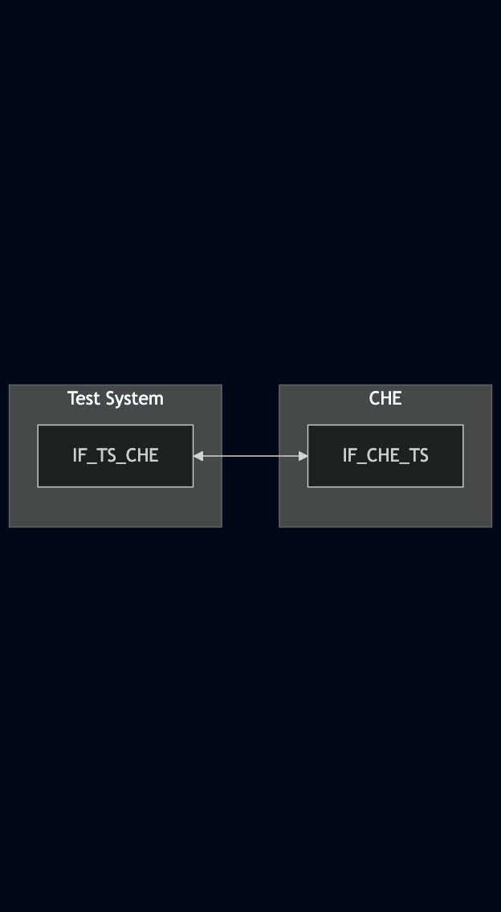
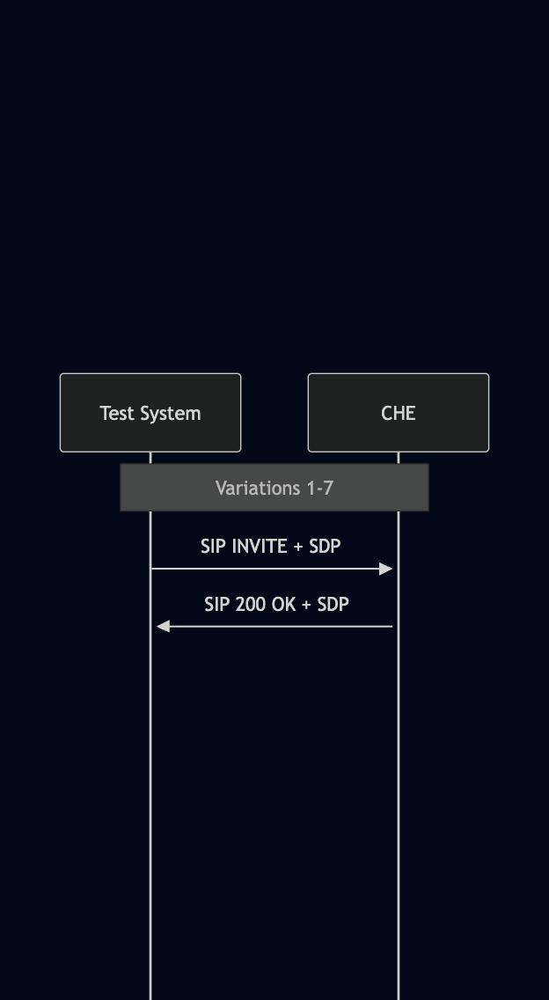

# Test Description: TD_CHE_005

## Overview
### Summary
Test call interface

### Description
This test covers:
- handling incoming test calls
- support of all media types for test calls

### References
* Requirements : RQ_CHE_033, RQ_CHE_034
* Test Case    : TC_CHE_005

### Requirements
IXIT config file for CHE

### SIP transport types
Test can be performed with 2 different SIP transport types. Steps describing actions for specific one are marked as following:
- (TLS transport) - should be used by default
- (TCP transport) - used in lab for testing purposes only if default TLS is not possible

## Configuration
### Implementation Under Test Interface Connections
<!-- Identify each of the FEs that are part of the configuration and how they are connected -->
* Test System
  * IF_TS_CHE - connected to IF_CHE_TS
* CHE
  * IF_CHE_TS - connected to IF_TS_CHE 

### Test System Interfaces
<!-- Identify each of the test system interfaces and whether it will be in active or monitor mode -->
* Test System
  * IF_TS_CHE - Active
* CHE
  * IF_CHE_TS - Active

### Connectivity Diagram
<!--

-->

## Pre-Test Conditions
### Test System
* Interfaces are connected to network
* Interfaces have IP addresses assigned by DHCP
* Device is active
* ng911 repository cloned to local storage
* (TLS) Generated own PCA-signed certificate and private key files (test_system.crt, test_system.key)
* (TLS) Certificate and key used by CHE copied to local storage
* (TLS) PCA certificate copied to local storage

### CHE
* Interfaces are connected to network
* Interfaces have IP addresses assigned by DHCP
* IUT is active
* IUT is in normal operating state
* Default configuration is loaded
* IUT is initialized using IXIT config file
* IUT has configured tel number from which calls are accepted and auto-answered
* Test System configured as default ESRP
* Agent logged in (f.e. tester@psap.example.com)

## Test Sequence

### Test Preamble

#### Test System
* Install SIPp by following steps from documentation[^1]
* Install Wireshark[^2]
* (TLS v1.2) Configure Wireshark to decode HTTP over TLS, use tests system and FE certificate keys [^3]
* (TLS v1.3) Configure logging of session keys and configure Wireshark to decode HTTP over TLS [^4]
* Using Wireshark on 'Test System' start packet tracing on IF_TS_CHE interface - run following filter:
   * (TLS transport)
     > ip.addr == IF_TS_CHE_IP_ADDRESS and tls
   * (TCP transport)
     > ip.addr == IF_TS_CHE_IP_ADDRESS and sip
* edit 'From' header field in SIPp XML scenarios used in all variations with tel number accepted and auto-answered by CHE

### Test Body

#### Variations

1. Validate CHE response for SIP INVITE with 'urn:service:test.sos' with g711alaw audio media type in SDP offer

Use SIPp scenario:
`SIP_INVITE_test_SDP_with g711alaw_audio.xml`

2. Validate CHE response for SIP INVITE with 'urn:service:test.sos' with g711ulaw audio media type in SDP offer

Use SIPp scenario:
`SIP_INVITE_test_SDP_with g711ulaw_audio.xml`

3. Validate CHE response for SIP INVITE with 'urn:service:test.sos' with H.264 video media with baseline profile level 1b in SDP offer

Send SIP INVITE:
`SIP_INVITE_test_SDP_with_H.264_video_level_1b.xml`

4. Validate CHE response for SIP INVITE with 'urn:service:test.sos' with H.264 video media with baseline profile level 1.1 in SDP offer

Send SIP INVITE:
`SIP_INVITE_test_SDP_with_H.264_video_level_1.1.xml`

5. Validate CHE response for SIP INVITE with 'urn:service:test.sos' with H.264 video media with baseline profile level 2.0 in SDP offer

Send SIP INVITE:
`SIP_INVITE_test_SDP_with_H.264_video_level_2.0.xml`

6. Validate CHE response for SIP INVITE with 'urn:service:test.sos' with H.264 video media with baseline profile level 3.0 in SDP offer

Send SIP INVITE:
`SIP_INVITE_test_SDP_with_H.264_video_level_3.0.xml`

7. Validate CHE response for SIP INVITE with 'urn:service:test.sos' with text media in SDP offer

Send SIP INVITE:
`SIP_INVITE_test_SDP_with_text.xml`

#### Stimulus
Send SIP INVITE to CHE - run following SIPp command on Test System, example:
  * (TLS transport)
    > sudo sipp -t l1 -sf SIPP_SCENARIO_FILE IF_TS_CHE_IP_ADDRESS:5060
  * (TCP transport)
    > sudo sipp -t t1 -sf SIPP_SCENARIO_FILE IF_TS_CHE_IP_ADDRESS:5061

#### Response
1. Test verdict depends on response from the CHE:
- 200 OK - PASSED
- 486 Busy Here - PASSED with note "CHE is busy". Test should be performed again when service load decrease
- 404 Not Found - PASSED with note "Test service not supported"
- no response - FAILED
2. SIP 200 OK SDP body contains the same codec as offered in SIP INVITE

VERDICT:
* PASSED - if CHE responds with 200 OK
* PASSED_with_note - if CHE responds with 486 Busy Here or 404 Not Found
* FAILED - in case of no response

### Test Postamble
#### Test System
* stop all SIPp processes (if still running)
* archive all logs generated
* stop Wireshark (if still running)
* remove ng911 repository files
* disconnect interfaces from CHE

#### CHE
* disconnect IF_CHE_TS
* reconnect interfaces back to default

## Post-Test Conditions 
### Test System 
* Test tools stopped
* interfaces disconnected from CHE

### CHE
* device connected back to default
* device in normal operating state

## Sequence Diagram
<!--

-->

## Comments

Version:  010.3f.3.0.8

Date:     20250807

## Footnotes
[^1]: SIPp - tool for SIP packet simulations. Official documentation: https://sipp.sourceforge.net/doc/reference.html#Getting+SIPp
[^2]: Wireshark - tool for packet tracing and anaylisis. Official website: https://www.wireshark.org/download.html
[^3]: Wireshark configuration to decrypt TLS packets: https://www.zoiper.com/en/support/home/article/162/How%20to%20decode%20SIP%20over%20TLS%20with%20Wireshark%20and%20Decrypting%20SDES%20Protected%20SRTP%20Stream
[^4]: TLS v1.3 session keys logging + Wireshark configuration to decrypt traffic: https://my.f5.com/manage/s/article/K50557518
