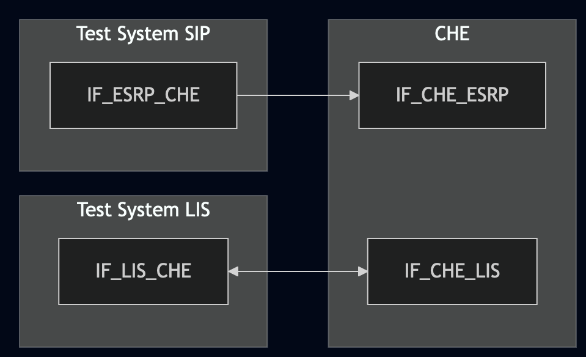
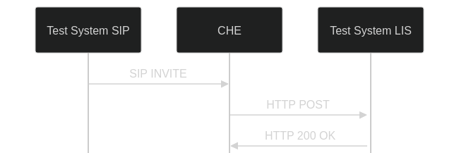
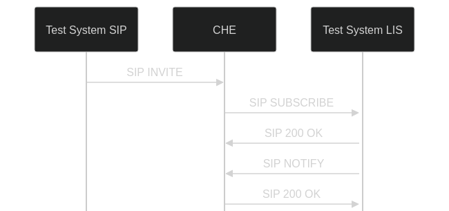

# Test Description: TD_CHFE_001
## Overview
### Summary
Dereferencing from LIS

### Description
This test checks CHFE dereferencing from LIS:
- using SIP Presence Event Package
- using HELD

### References
* Requirements : RQ_CHFE_011
* Test Case    : TC_CHFE_001

### Requirements
IXIT config file for CHFE

### HTTP and SIP transport types
Test can be performed with 2 different SIP and HTTP transport types. Steps describing actions for specific one are marked as following:
- (TLS transport) - should be used by default
- (TCP transport) - used in lab for testing purposes only if default TLS is not possible

## Configuration
### Implementation Under Test Interface Connections
<!-- Identify each of the FEs that are part of the configuration and how they are connected -->
* Test System SIP
  * IF_ESRP_CHFE - connected to IF_CHFE_ESRP
* CHFE
  * IF_CHFE_ESRP - connected to IF_ESRP_CHFE
  * IF_CHFE_LIS - connected to IF_LIS_CHFE
* Test System LIS
  * IF_LIS_CHFE - connected to IF_CHFE_LIS


### Test System Interfaces
<!-- Identify each of the test system interfaces and whether it will be in active or monitor mode -->
* Test System SIP
  * IF_ESRP_CHFE - Active
* CHFE
  * IF_CHFE_ESRP - Active
  * IF_CHFE_LIS - Active
* Test System LIS
  * IF_LIS_CHFE - Active


### Connectivity Diagram
<!--
https://mermaid.live/edit#pako:eNplUV1rgzAU_Styn60YF6OGsZeuY0IHo-5pCCXTVGXVSIxsTvzvi9q6tstT7jn3fMDtIREpBwqHo_hKciaVsd3FlaFf-LTfRLvX_fp5s1o96El_JmSht2E0gvd_tEZmtmk_Msnq3HjjjTKirlG8NKLwpL2xn0FepTfahTrtXxe4AJfY_x6X-cvadf9FCiZkskiBKtlyE0ouSzaO0I8rMaiclzwGqr8pk58xxNWgNTWr3oUozzIp2iwHemDHRk9tnTLFHwum65QLKnUal2vRVgqo600eQHv4Buog18IkCBzPxa7tY__OhA4o8SyfeAiRwA9sgpAzmPAzpdqWh23sOh4hGPl4dGOtElFXJedKPC2UkC_zpaeDD79tqZR7
-->




## Pre-Test Conditions

### Test System SIP
* Interfaces are connected to network
* Interfaces have IP addresses assigned by DHCP
* Device is active
* ng911 repository cloned to local storage
* (TLS) Generated own PCA-signed certificate and private key files (test_system_sip.crt, test_system_sip.key)
* (TLS) Certificate and key used by CHFE copied to local storage
* (TLS) PCA certificate copied to local storage

### CHFE
* Interfaces are connected to network
* Interfaces have IP addresses assigned by DHCP
* IUT is active
* IUT is in normal operating state
* Default configuration is loaded
* IUT is initialized using IXIT config file
* IUT has configured tel number from which calls are accepted and auto-answered
* Test System SIP configured as default ESRP
* Test System LIS configured as default LIS
* Agent logged in (f.e. tester@psap.example.com)

### Test System LIS
* Interfaces are connected to network
* Interfaces have IP addresses assigned by DHCP
* Device is active
* ng911 repository cloned to local storage
* (TLS) Generated own PCA-signed certificate and private key files (test_system_lis.crt, test_system_lis.key)
* (TLS) Certificate and key used by CHFE copied to local storage
* (TLS) PCA certificate copied to local storage

## Test Sequence

### Test Preamble

#### Test System SIP
* Install SIPp by following steps from documentation[^1]
* Install Wireshark[^2]
* (TLS v1.2) Configure Wireshark to decode SIP over TLS, use test system and CHFE certificate keys [^3]
* (TLS v1.3) Configure logging of session keys and configure Wireshark to decode SIP over TLS [^4]
* Using Wireshark on 'Test System SIP' start packet tracing on IF_ESRP_CHFE interface - run following filter:
   * (TLS)
     > ip.addr == IF_ESRP_CHFE_IP_ADDRESS and tls
   * (TCP)
     > ip.addr == IF_ESRP_CHFE_IP_ADDRESS and http
* edit 'From' header field in SIPp XML scenarios used in all variations with tel number accepted and auto-answered by CHFE

#### Test System LIS
* Install SIPp by following steps from documentation[^1]
* Install Wireshark[^2]
* (TLS v1.2) Configure Wireshark to decode SIP and HTTP over TLS, use test system and CHFE certificate keys [^3]
* (TLS v1.3) Configure logging of session keys and configure Wireshark to decode SIP and HTTP over TLS [^4]
* Using Wireshark on 'Test System LIS' start packet tracing on IF_LIS_CHFE interface - run following filter:
   * (TLS)
     > ip.addr == IF_LIS_CHFE_IP_ADDRESS and tls
   * (TCP)
     > ip.addr == IF_LIS_CHFE_IP_ADDRESS and (http or sip)
* Start http server responding for HTTPS POST requests:
    * (TCP transport)
      ```
      echo -e "HTTP/1.1 200 OK\r\nContent-Type: application/lost+xml\r\nContent-Length: 750\r\n\r\n$(cat Location_response | \
      nc -lp 80
      ```
    * (TLS transport)
      ```
      echo -e "HTTP/1.1 200 OK\r\nContent-Type: application/lost+xml\r\nContent-Length: 750\r\n\r\n$(cat Location_response | \
      openssl s_server -quiet -accept LOCAL_PORT -cert server.pem -key server.key
      ```

* run following SIPp scenario to handle SIP Presence Event Package:
    * (TCP transport)
      ```
      sudo sipp -t t1 -sf SIP_SUBSCRIBE_LIS.xml IF_LIS_CHFE_IPv4:5060
      ```
    * (TLS transport)
      ```
      sudo sipp -t l1 -tls_cert test_system.crt -tls_key test_system.key -sf SIP_SUBSCRIBE_LIS.xml IF_LIS_CHFE_IPv4:5061
      ```

### Test Body

#### Variations
1. Validate HTTP POST sent to LIS after receiving SIP INVITE (HELD)

Use SIPp scenario file: `SIP_INVITE_geolocation_HELD.xml`

2. Validate SIP SUBSCRIBE sent to LIS after receiving SIP INVITE (SIP Presence Event Package)

Use SIPp scenario file: `SIP_INVITE_geolocation_SIP.xml`

#### Stimulus

Send SIP INVITE to CHFE from Test System SIP, use SIP INVITE
* (TCP transport)
  ```
  sudo sipp -t t1 -sf SIPP_SCENARIO IF_ESRP_CHFE_IPv4:5060
  ```
* (TLS transport)
  ```
  sudo sipp -t l1 -tls_cert test_system.crt -tls_key test_system.key -sf SIPP_SCENARIO IF_ESRP_CHFE_IPv4:5061
  ```

#### Response
* Variation 1
    - CHFE sends HTTP POST or HTTP GET to Test System LIS
    - Request is addressed to URL from 'Geolocation' header field in received SIP INVITE
    - if request is a HTTP POST then shall contain XML body with 'locationRequest', example:

     ```
     <?xml version="1.0"?>
         <locationRequest xmlns="urn:ietf:params:xml:ns:geopriv:held"/>
     ```

* Variation 2
    - CHFE sends SIP SUBSCRIBE to Test System LIS
    - SIP SUBSCRIBE contains 'To' header field with SIP URI from 'Geolocation' header field in received SIP INVITE
    - SIP SUBSCRIBE contains 'Event: presence'
    - SIP SUBSCRIBE contains 'Accept: application/pidf+xml'
    - CHFE responds with SIP 200 OK for each SIP NOTIFY sent by 'Test System LIS'

VERDICT:
* PASSED - if CHFE sends correct message with expected header field values
* FAILED - any other cases


### Test Postamble
#### Test System SIP/LIS
* stop all SIPp processes (if still running)
* (TCP transport) stop all NC processes (if still running)
* (TLS transport) stop all Openssl processes (if still running)
* archive all logs generated
* stop Wireshark (if still running)
* remove all SIPp and HTTP scenarios
* (TLS transport) remove certificates
* disconnect interfaces from CHFE

#### CHFE
* reconnect interfaces back to default

## Post-Test Conditions 
### Test System 
* Test tools stopped
* interfaces disconnected from CHFE

### CHFE
* device connected back to default
* device in normal operating state

## Sequence Diagram
### Variation 1 (HELD)
<!--
[](https://mermaid.live/edit#pako:eNplkF1rgzAUhv9KOLfTErWLJheFsRUq-6ig7GLkJmhqZTPpYoQ58b8v2pYNdnfOeZ_zno8RSl1JYOD7PlelVoemZlwh1DbGaHNXWm06hg7io5NcLVAnP3upSvnQiNqIdoYRKmRnUT50VrYoTzN_s7nfbdkcovTlNS22Z8wVnXTzl35Kc4Z2RZGhbJ8X_92cfnVbqBBjtH_kCjxopWlFU7ntx7mPgz3KVnJgLqyEeefA1eQ40VudD6oEZk0vPehPlbDX_YEtx3lwEupN699cVo07_vn8nuVLCwNshC9gQUhWAaGUxhGmNKFx6MEAzFUjHOIgTCjFmAZrMnnwvdiuVyEhBMcxCaIkwrexB0b39fEycPoBC0t36A)
-->




### Variation 2 (SIP Presence Event Package)
<!--
[](https://mermaid.live/edit#pako:eNqFkF1LwzAUhv9KOLe2I21nuuRi4GbFom5ip6DkJrRZV7TJTFNwjv73Za3iwIvdnY_nvAeePeS6kMDA932ucq3WVcm4QqiujNHmKrfaNAytxUcjueqhRn62UuXyuhKlEfURRmglG4uyXWNljbL00Z9O57cJO5YoXbykq2TA3NCtLk7p-zQbuOx5ls2f0lnyP9Exp4khxmh5dxZbLFfpzev5x0MceFBLU4uqcDb2xysOdiNryYG5shDmnQNXneNEa3W2Uzkwa1rpQbsthP31AayX5cFWqDet_3pZVE7mw6C7t94zwPbwBSwIySgglNI4wpROaBx6sAPmphEOcRBOKMWYBmPSefDdx45HISEExzEJokmEL2MPjG7Lzc_D7gCtjI4O)
-->



## Comments

Version: 010.3f.5.0.11

Date: 20260310


## Footnotes
[^1]: SIPp - tool for SIP packet simulations. Official documentation: https://sipp.sourceforge.net/doc/reference.html#Getting+SIPp
[^2]: Wireshark - tool for packet tracing and anaylisis. Official website: https://www.wireshark.org/download.html
[^3]: Wireshark configuration to decrypt SIP over TLS packets: https://www.zoiper.com/en/support/home/article/162/How%20to%20decode%20SIP%20over%20TLS%20with%20Wireshark%20and%20Decrypting%20SDES%20Protected%20SRTP%20Stream
[^4]: TLS v1.3 session keys logging + Wireshark configuration to decrypt traffic: https://my.f5.com/manage/s/article/K50557518


