# Test Description: TD_CHFE_006

## Overview
### Summary
Transfer models support

### Description
This test verifies implementation of transfer models:
- Route All Calls Via a Conference-aware UA
- Ad Hoc without B2BUA in the Ingress Call Path
- Ad Hoc with B2BUA in the Ingress Call Path

### References
* Requirements : RQ_CHFE_070
* Test Case    : TC_CHFE_006

### Requirements
IXIT config file for CHFE

### SIP transport types
Test can be performed with 2 different SIP transport types. Steps describing actions for specific one are marked as following:
- (TLS transport) - should be used by default
- (TCP transport) - used in lab for testing purposes only if default TLS is not possible

## Configuration
### Implementation Under Test Interface Connections
<!-- Identify each of the FEs that are part of the configuration and how they are connected -->

**Variation 1**
* Test System OSP
  * IF_OSP_BCF - connected to IF_BCF_OSP
* Test System BCF
  * IF_BCF_OSP - connected to IF_OSP_BCF
  * IF_BCF_ESRP - connected to IF_ESRP_BCF
* Test System ESRP
  * IF_ESRP_BCF - connected to IF_BCF_ESRP
  * IF_ESRP_TS-CHFE - connected to IF_TS-CHFE_ESRP
  * IF_ESRP_CHFE - connected to IF_CHFE_ESRP
* CHFE (Transfer-from)
  * IF_CHFE_ESRP - connected to IF_ESRP_CHFE
* Test System CHFE (Transfer-to)
  * IF_TS-CHFE_ESRP - connected to IF_ESRP_TS-CHFE

**Variation 2**
* Test System OSP
  * IF_OSP_BCF - connected to IF_BCF_OSP
  * IF_OSP_CHFE - connected to IF_CHFE_OSP
* Test System BCF
  * IF_BCF_TS-CHFE - connected to IF_TS-CHFE_BCF
  * IF_BCF_ESRP - connected to IF_ESRP_BCF
  * IF_BCF_OSP - connected to IF_OSP_BCF
  * IF_BCF_BRIDGE - connected to IF_BRIDGE_BCF
  * IF_BCF_CHFE - connected to IF_CHFE_BCF
* Test System ESRP
  * IF_ESRP_BCF - connected to IF_BCF_ESRP
  * IF_ESRP_CHFE - connected to IF_CHFE_ESRP
* CHFE (Transfer-from)
  * IF_CHFE_ESRP - connected to IF_ESRP_CHFE
  * IF_CHFE_BCF - connected to IF_BCF_CHFE
  * IF_CHFE_OSP - connected to IF_OSP_CHFE
  * IF_CHFE_TS-CA - connected to IF_TS-CA_CHFE
  * IF_CHFE_BRIDGE - connected to IF_BRIDGE_CHFE
* Test System Conference App
  * IF_TS-CA_CHFE - connected to IF_CHFE_TS-CA
* Test System BRIDGE
  * IF_BRIDGE_BCF - connected to IF_BCF_BRIDGE
  * IF_BRIDGE_CHFE - connected to IF_CHFE_BRIDGE
  * IF_BRIDGE_TS-CHFE - connected to IF_TS-CHFE_BRIDGE
* Test System CHFE (Transfer-to)
  * IF_TS-CHFE_BCF - connected to IF_BCF_TS-CHFE
  * IF_TS-CHFE_BRIDGE - connected to IF_BRIDGE_TS-CHFE

**Variation 3**
* Test System OSP
  * IF_OSP_BCF - connected to IF_BCF_OSP
* Test System BCF
  * IF_BCF_TS-CHFE - connected to IF_TS-CHFE_BCF
  * IF_BCF_ESRP - connected to IF_ESRP_BCF
  * IF_BCF_OSP - connected to IF_OSP_BCF
  * IF_BCF_BRIDGE - connected to IF_BRIDGE_BCF
  * IF_BCF_CHFE - connected to IF_CHFE_BCF
* Test System ESRP
  * IF_ESRP_BCF - connected to IF_BCF_ESRP
  * IF_ESRP_CHFE - connected to IF_CHFE_ESRP
* CHFE (Transfer-from)
  * IF_CHFE_ESRP - connected to IF_ESRP_CHFE
  * IF_CHFE_BCF - connected to IF_BCF_CHFE
  * IF_CHFE_TS-CA - connected to IF_TS-CA_CHFE
  * IF_CHFE_BRIDGE - connected to IF_BRIDGE_CHFE
* Test System Conference App
  * IF_TS-CA_CHFE - connected to IF_CHFE_TS-CA
* Test System BRIDGE
  * IF_BRIDGE_BCF - connected to IF_BCF_BRIDGE
  * IF_BRIDGE_CHFE - connected to IF_CHFE_BRIDGE
  * IF_BRIDGE_TS-CHFE - connected to IF_TS-CHFE_BRIDGE
* Test System CHFE (Transfer-to)
  * IF_TS-CHFE_BCF - connected to IF_BCF_TS-CHFE
  * IF_TS-CHFE_BRIDGE - connected to IF_BRIDGE_TS-CHFE

### Test System Interfaces
<!-- Identify each of the test system interfaces and whether it will be in active or monitor mode -->
**Variation 1**
* Test System OSP
  * IF_OSP_BCF - Active
* Test System BCF
  * IF_BCF_OSP - Active
  * IF_BCF_ESRP - Active
* Test System ESRP
  * IF_ESRP_BCF - Active
  * IF_ESRP_TS-CHFE - Active
  * IF_ESRP_CHFE - Active 
* CHFE (Transfer-from)
  * IF_CHFE_ESRP - Active
* Test System CHFE (Transfer-to)
  * IF_TS-CHFE_ESRP - Active

**Variation 2**
* Test System OSP
  * IF_OSP_BCF - Active
  * IF_OSP_CHFE - Active
* Test System BCF
  * IF_BCF_TS-CHFE - Active
  * IF_BCF_ESRP - Active
  * IF_BCF_OSP - Active
  * IF_BCF_BRIDGE - Active
  * IF_BCF_CHFE - Active
* Test System ESRP
  * IF_ESRP_BCF - Active
  * IF_ESRP_CHFE - Active
* CHFE (Transfer-from)
  * IF_CHFE_ESRP - Active
  * IF_CHFE_BCF - Active
  * IF_CHFE_OSP - Active
  * IF_CHFE_TS-CA - Active
  * IF_CHFE_BRIDGE - Active
* Test System Conference App
  * IF_TS-CA_CHFE - Active
* Test System BRIDGE
  * IF_BRIDGE_BCF - Active
  * IF_BRIDGE_CHFE - Active
  * IF_BRIDGE_TS-CHFE - Active
* Test System CHFE (Transfer-to)
  * IF_TS-CHFE_BCF - Active
  * IF_TS-CHFE_BRIDGE - Active

**Variation 3**
* Test System OSP
  * IF_OSP_BCF - Active
* Test System BCF
  * IF_BCF_TS-CHFE - Active
  * IF_BCF_ESRP - Active
  * IF_BCF_OSP - Active
  * IF_BCF_BRIDGE - Active
  * IF_BCF_CHFE - Active
* Test System ESRP
  * IF_ESRP_BCF - Active
  * IF_ESRP_CHFE - Active
* CHFE (Transfer-from)
  * IF_CHFE_ESRP - Active
  * IF_CHFE_BCF - Active
  * IF_CHFE_TS-CA - Active
  * IF_CHFE_BRIDGE - Active
* Test System Conference App
  * IF_TS-CA_CHFE - Active
* Test System BRIDGE
  * IF_BRIDGE_BCF - Active
  * IF_BRIDGE_CHFE - Active
  * IF_BRIDGE_TS-CHFE - Active
* Test System CHFE (Transfer-to)
  * IF_TS-CHFE_BCF - Active
  * IF_TS-CHFE_BRIDGE - Active

### Connectivity Diagram
#### Variation 1
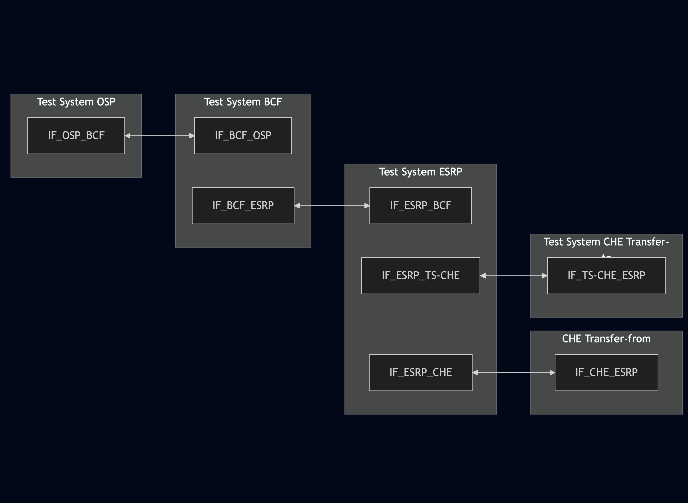
<!--
https://mermaid.live/edit#pako:eNqNU11rwjAU_SvlPrfSj2jbMPYwp2ywMbE-jYJkNrUyk0iasjnxvy_9tHVjrE_3nnPuuR-kJ9iIhAKGdC8-NhmRynhaxtzQ3-N8_RIt1nfT-Y1l3epMRyXSsWU-i5aLhi7DEuv4Cpg-zBpeRxU05FeRdZHUSaOqdXnxtpXkkBkrmisjOuaKMqObYjhnjVGe_FHayXpLXNu1i_3H76Lrb3XdpT3FT7BeudfpqpcmjZUkPE-ptFIp2MBieNPf6vuzDryUGDgNTt-YgQlbuUsAK1lQExiVjJQpnEpJDCqjjMaAdZgQ-R5DzM-65kD4qxCsLZOi2GaAU7LPdVYcEqLo_Y7o8ViHSt2NyqkouALsBuPKBPAJPgH74SgIJ77rhGMP2WjsmnAEjJwRcpDvhq7jOUFge2cTvqqu9iiY2MjxbB-hUFcEngmkUCI68k07E012Ssjn-ulXf8D5G42A458
-->

#### Variation 2
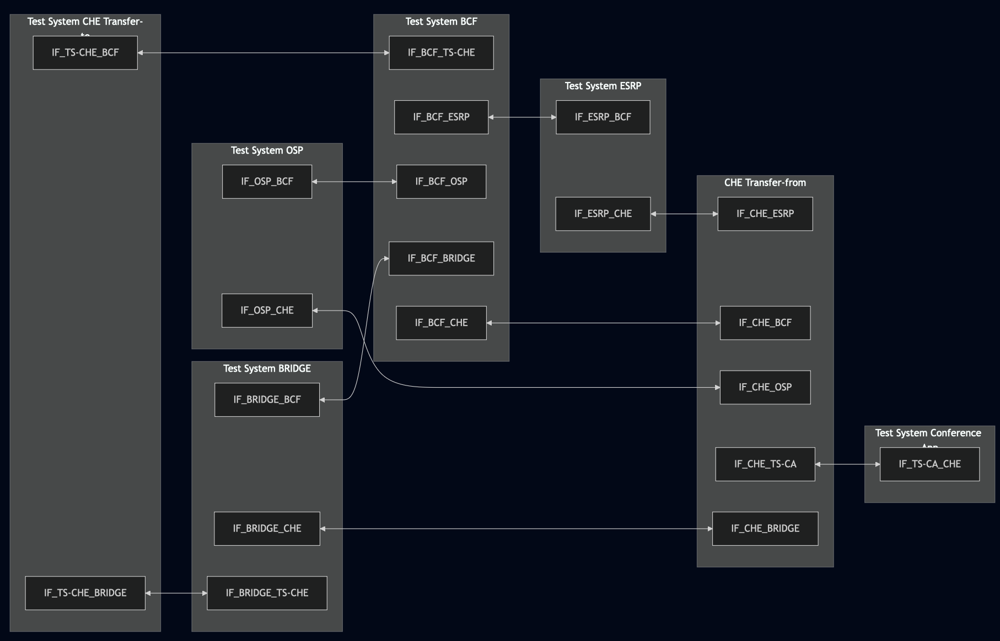
<!--
https://mermaid.live/edit#pako:eNqFVF1PwjAU_SvLfR4EaIdsMSaI-JFoNIwns4RUVj6ia5euiyLhv9tubK4dKE-3557ec27vZXtY8phCAKsP_rncECGdx1nEHPV7uF08hy-L68ntZadzpU4q0oiRndxPj1kVGVnNnoazl2Nahxr7zc8ebu6mVvkSrDnzsKPLmpwSrDlFYdOGhmwdk3FGp0ArqfKepaZpGhofWUW8aDK0RUtMd13ms_xtLUi6ceY0k064yyRNnPrVzFdvYYVKiVIW_1HQvmwMzhpPC2w-jdlSC2u-zd-OWkrmOlijbFS0aqqkMxeEZSsqOivBE-O-sYINzNYxd6RJbPdeD_y8qWajhkHJK-6pPTuZqZz-p3NqSvUf6hTcml97vf_tjTPVFWVL6ozTtGV_bIwOXFiLbQyBFDl1IaEiIfoIe02JQG5oQiMIVBgT8R5BxA7qTkrYK-dJdU3wfL2BYEU-MnXK05hIerMlyltSo8pRTMWE50xCgPojv6gCwR6-IMCDLvJ95OHBaIgvkAs7xfG6AzTE2O97GPkYI-_gwneh2uuOsCJ6uI_8Ier1LjwXSC55uGPLyhONt5KLp_KzWXw9Dz8V7Hv7
-->

#### Variation 3
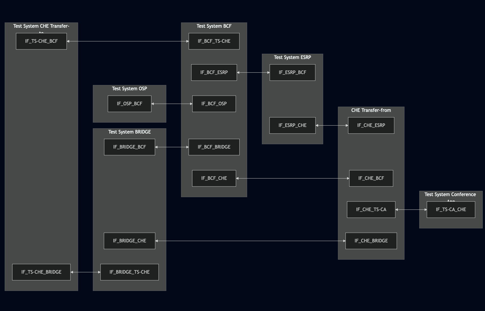
<!--
https://mermaid.live/edit#pako:eNqFVF1vgjAU_SvkPqNxUlTIssT5sZlsmRGfFhLTSf3IpCWlZHPG_74WlNGijqf23HPvub2n9ABLFhHwYbVjX8sN5sJ6mYXUkt9kvHgLpovHwfi-0XiQO7lSSBlV-1Ewm57Caqmwv_hsMnwaGQUKsOTMg8bg2eQUYMnJC0vgxFB8BZk6OuOKTo6epYo8Q03RFNQ_sfL1ospQLRpi6tRFPM0-1hwnG2tOUmEF-1SQ2Cqnps-1wAiNbqSWtIq4We5sRA2sDkFvvoZVp3C7o5qSbrxhWqWiUVMGrTnHNF0R3lhxFmv55VgNrKZumm3aeL2B6qG0ZgTTSml352JEs_KWmRf8KH-SS3DNqfqV_fdkjMozEbokVj9Jau33NZPAhjXfRuALnhEbYsJjrLZwUJQQxIbEJARfLiPMP0MI6VHmJJi-Mxaf0zjL1hvwV3iXyl2WRFiQ4RbL3uISlR1FhA9YRgX4HTevAf4BvsFH7abjeY6L2r0O6jo27MF33Gbb6SDk3bnI8RBy3KMNP7lmq9lDkug6Pa_Va7VQt2MDzgQL9nR57ohEW8H4a_HU5S_e8Rc_CWgW
-->

## Pre-Test Conditions
### Test System OSP, Test System BCF, Test System ESRP, Test System CHFE (Transfer-to), Test System BRIDGE, Test System Conference App
* Interfaces are connected to network
* Interfaces have IP addresses assigned by DHCP
* Device is active
* ng911 repository cloned to local storage
* (TLS) Generated own PCA-signed certificate and private key files (test_system_NAME.crt, test_system_NAME.key)
* (TLS) Certificates and keys used by other devices copied to local storage
* (TLS) PCA certificate copied to local storage

### CHFE (Transfer-from)
* Interfaces are connected to network
* Interfaces have IP addresses assigned by DHCP
* IUT is active
* IUT is in normal operating state
* Default configuration is loaded
* IUT is initialized using IXIT config file
* IUT has configured tel numbers from which calls are accepted and auto-answered
* Test System ESRP configured as default ESRP
* Test System LOCAL BRIDGE configured as default Bridge
* Agent logged in (f.e. tester@psap.example.com)

## Test Sequence

### Test Preamble

### Test System OSP, Test System BCF, Test System ESRP, Test System CHFE (Transfer-to), Test System BRIDGE, Test System Conference App
* Install SIPp by following steps from documentation[^1]
* Install Wireshark[^2]
* (TLS v1.2) Configure Wireshark to decode SIP over TLS, use tests system and FE certificate keys [^3]
* (TLS v1.3) Configure logging of session keys and configure Wireshark to decode SIP over TLS [^4]
* Using Wireshark start packet tracing on all local interfaces - run following filter (example for device with 2x local interfaces):
   * (TLS transport)
     > ip.addr == INTERFACE_IP_ADDRESS or ip.addr == INTERFACE_2_IP_ADDRESS and tls
   * (TCP transport)
     > ip.addr == INTERFACE_IP_ADDRESS or ip.addr == INTERFACE_2_IP_ADDRESS and sip

#### Variation 1

**Test System BCF**

Prepare to receive call from Test System OSP and pass it to Test System ESRP:
  * (TLS transport)
    >   sudo sipp -t l1 --tls_cert cert.crt --tls_key cert.key -sf BCF_call_transferred_variation_1.xml \
    > -i LOCAL_IP -p LOCAL_IP \
  -set OSP_IP OSP_IP_VALUE \
  -set OSP_port OSP_PORT_VALUE \
  -set OSP_tel OSP_TEL_VALUE \
  -set CHFE_tel CHFE_TEL_VALUE \
  -set ESRP_IP ESRP_IP_VALUE \
  -set ESRP_port ESRP_PORT_VALUE \
  -max_socket 1000 -m 1 IF_BCF_ESRP_IP_ADDRESS:5061
  * (TCP transport)
    >   sudo sipp -t t1 -sf BCF_call_transferred_variation_1.xml \
    > -i LOCAL_IP -p LOCAL_IP \
  -set OSP_IP OSP_IP_VALUE \
  -set OSP_port OSP_PORT_VALUE \
  -set OSP_tel OSP_TEL_VALUE \
  -set CHFE_tel CHFE_TEL_VALUE \
  -set ESRP_IP ESRP_IP_VALUE \
  -set ESRP_port ESRP_PORT_VALUE \
  -max_socket 1000 -m 1 IF_BCF_ESRP_IP_ADDRESS:5060

**Test System ESRP**

Prepare to receive call from Test System BCF and pass it to CHFE (Transfer-from):

  * (TLS transport)
    >   sudo sipp -t l1 --tls_cert cert.crt --tls_key cert.key -sf ESRP_CHFE_call_transfer_isfocus.xml \
    > -i LOCAL_IP -p LOCAL_IP \
  -set OSP_IP OSP_IP_VALUE \
  -set OSP_port OSP_PORT_VALUE \
  -set OSP_tel OSP_TEL_VALUE \
  -set conference_id CONFERENCE_ID_VALUE \
  -set CHFE_tel CHFE_TEL_VALUE \
  -set TS_CHFE_IP TS_CHFE_IP_VALUE \
  -set TS_CHFE_port TS_CHFE_PORT_VALUE \
  -set TS_CHFE_tel TS_CHFE_TEL_VALUE \
  -max_socket 1000 -m 1 IF_ESRP_CHFE_IP_ADDRESS:5061
  * (TCP transport)
    >   sudo sipp -t t1 --tls_cert cert.crt --tls_key cert.key -sf ESRP_CHFE_call_transfer_isfocus.xml \
    > -i LOCAL_IP -p LOCAL_IP \
  -set OSP_IP OSP_IP_VALUE \
  -set OSP_port OSP_PORT_VALUE \
  -set OSP_tel OSP_TEL_VALUE \
  -set conference_id CONFERENCE_ID_VALUE \
  -set CHFE_tel CHFE_TEL_VALUE \
  -set TS_CHFE_IP TS_CHFE_IP_VALUE \
  -set TS_CHFE_port TS_CHFE_PORT_VALUE \
  -set TS_CHFE_tel TS_CHFE_TEL_VALUE \
  -max_socket 1000 -m 1 IF_ESRP_CHFE_IP_ADDRESS:5060

**Test System CHFE (Transfer-to)**

Prepare to receive and answer a call from ESRP:

  * (TLS transport)
    >   sudo sipp -t l1 --tls_cert cert.crt --tls_key cert.key -sf TS_CHFE_ESRP_call_transfer_isfocus.xml \
    > -m 1 IF_TS-CHFE_ESRP_IP_ADDRESS:5061
  * (TCP transport)
    >   sudo sipp -t t1 -sf TS_CHFE_ESRP_call_transfer_isfocus.xml \
    > -m 1 IF_TS-CHFE_ESRP_IP_ADDRESS:5060

#### Variation 2

**Test System BCF**

Prepare to receive call from Test System OSP and pass it to CHFE (Transfer-from):
  * (TLS transport)
    >   sudo sipp -t l1 --tls_cert cert.crt --tls_key cert.key -sf BCF_call_transferred_variation_2.xml \
    > -i LOCAL_IP -p LOCAL_IP \
  -set OSP_IP OSP_IP_VALUE \
  -set OSP_port OSP_PORT_VALUE \
  -set OSP_tel OSP_TEL_VALUE \
  -set CHFE_tel CHFE_TEL_VALUE \
  -set ESRP_IP ESRP_IP_VALUE \
  -set ESRP_port ESRP_PORT_VALUE \
  -max_socket 1000 -m 1 IF_BCF_CHFE_IP_ADDRESS:5061
  * (TCP transport)
    >   sudo sipp -t t1 -sf BCF_call_transferred_variation_2.xml \
    > -i LOCAL_IP -p LOCAL_IP \
  -set OSP_IP OSP_IP_VALUE \
  -set OSP_port OSP_PORT_VALUE \
  -set OSP_tel OSP_TEL_VALUE \
  -set CHFE_tel CHFE_TEL_VALUE \
  -set ESRP_IP ESRP_IP_VALUE \
  -set ESRP_port ESRP_PORT_VALUE \
  -max_socket 1000 -m 1 IF_BCF_CHFE_IP_ADDRESS:5060

**Test System Conference App**

Prepare to receive call and redirect CHFE (Transfer-from) to Conference ID:
  * (TLS transport)
    >   sudo sipp -t l1 --tls_cert cert.crt --tls_key cert.key -sf SIP_INVITE_RECEIVE_302_Moved_Contact.xml \
    > -i LOCAL_IP -p LOCAL_IP \
  -set conference_id CONFERENCE_ID_VALUE \
  -set BRIDGE_IP BRIDGE_IP_VALUE \
  -set BRIDGE_port BRIDGE_PORT_VALUE \
  -set CHFE_tel CHFE_TEL_VALUE \
  -max_socket 1000 -m 1 IF_CA_CHFE_IP_ADDRESS:5061
  * (TCP transport)
    >   sudo sipp -t t1 -sf SIP_INVITE_RECEIVE_302_Moved_Contact.xml \
    > -i LOCAL_IP -p LOCAL_IP \
  -set conference_id CONFERENCE_ID_VALUE \
  -set BRIDGE_IP BRIDGE_IP_VALUE \
  -set BRIDGE_port BRIDGE_PORT_VALUE \
  -set CHFE_tel CHFE_TEL_VALUE \
  -max_socket 1000 -m 1 IF_CA_CHFE_IP_ADDRESS:5060

**Test System CHFE (Transfer-to)**

Prepare to receive call transfer from Test System Local Bridge:

  * (TLS transport)
    >   sudo sipp -t l1 --tls_cert cert.crt --tls_key cert.key -sf TS_CHFE_ESRP_call_transfer.xml \
    > -m 1 IF_TS-CHFE_BRIDGE_IP_ADDRESS:5061
  * (TCP transport)
    >   sudo sipp -t t1 -sf TS_CHFE_ESRP_call_transfer.xml \
    > -m 1 IF_TS-CHFE_BRIDGE_IP_ADDRESS:5060

### Test Body

#### Variations

1. Route All Calls Via a Conference-aware UA
    
    For signalling the ESRP (used here as Conference-aware UA) is always in the call path. Call transfers are accomplished by adding and deleting parties from conference.
2. Ad Hoc without B2BUA in the Ingress Call Path

    Only used when the calling device (Test System OSP) supports the 'Replaces' header field. BRIDGE is used only when needed for transferring a call.
3. Ad Hoc with B2BUA in the Ingress Call Path

    Used regardless if the calling device (Test System OSP) supports the 'Replaces' header field. Media is bridged through B2BUA (Test System BCF). BRIDGE is used only when needed for transferring a call.

#### Stimulus
- From Test System OSP establish basic call sending following SIPp scenario to Test System BCF:
  * (TLS transport)
    >   sudo sipp -t l1 --tls_cert cert.crt --tls_key cert.key -sf TS_OSP_basic_call.xml \
    > -m 1 IF_OSP_BCF_IP_ADDRESS:5061
  * (TCP transport)
    >   sudo sipp -t t1 -sf TS_OSP_basic_call.xml \
    > -m 1 IF_OSP_BCF_IP_ADDRESS:5060

- On CHFE (Transfer-from) answer incoming call
- On CHFE (Transfer-from) trigger call transfer to Test System CHFE (Transfer-to)

#### Response
**Variation 1**
1. IUT sends to Test System ESRP proper SIP SUBSCRIBE with 'Event: conference' after accepting SIP INVITE
2. IUT responds with 200 OK for all SIP NOTIFY messages with 'Event: conference'
3. After manual trigger of call transfer IUT sends SIP REFER to Test System ESRP containing:
   - Request URI and To: header field with Conference ID (received in Contact header field of SIP INVITE)
   - Refer-To: header field with SIP URI of Test System CHFE (Transfer-to)`
4. IUT responds with 200 OK for all SIP NOTIFY messages with 'Event: refer'
5. Call transfer is successful after manual drop out of IUT from the call:
   * media packets are exchanged between Test System ESRP and Test System CHFE (Transfer-to)
   * media packets are exchanged between Test System ESRP and Test System OSP through Test System BCF
   * media packets type match SDP Answer body from SIP 200 OK (last from test System CHFE (Transfer-to) and last from Test System OSP)

**Variation 2**
1. After manual trigger of call transfer IUT sends SIP INVITE to provisioned Conference App entity (Test System Conference App)
2. After receiving '302 Moved Contact' response IUT sends back ACK
3. IUT uses ConferenceID received in Contact header for request URI and To header field for SIP INVITE sent to Test System BRIDGE
4. SIP INVITE sent in #3 should establish call between Test System BRIDGE and IUT (RTP packets exchanged)
5. IUT sends to Test System BRIDGE proper SIP SUBSCRIBE with 'Event: conference' after accepting SIP INVITE
6. IUT responds with 200 OK for all SIP NOTIFY messages with 'Event: conference'
7. After manual trigger of call transfer IUT sends SIP REFER to Test System BRIDGE containing:
   - Request URI and To: header field with Conference ID (received in Contact header field of SIP 302)
   - Replaces: header field with: CALL_ID;to-tag=TO_TAG;from-tag=FROM_TAG where
     * CALL_ID is Call-ID header field value from initial Test System OSP call
     * TO_TAG is value of 'tag=' parameter added to 'To:' header field in initial Test System OSP call
     * FROM_TAG is value of 'tag=' parameter added to 'From:' header field in initial Test System OSP call
   - Refer-To: header field with SIP URI of Test System OSP`
8. IUT responds with 200 OK for all SIP NOTIFY messages with 'Event: refer'
9. IUT responds with 200 OK for all SIP BYE messages
10. After receiving SIP BYE from Test System OSP IUT sends SIP REFER to Test System BRIDGE containing:
    - Request URI and To: header field with Conference ID (received in Contact header field of SIP 302)
    - Refer-To: header field with SIP URI of Test System CHFE (Transfer-to)`
11. Call transfer is successful after manual drop out of IUT from the call:
    - media packets are exchanged between Test System CHFE (Transfer-to) and Test System OSP
    - media packets type match SDP Answer body from SIP 200 OK (last from Test System OSP)

**Variation 3**

1. After manual trigger of call transfer IUT sends SIP INVITE to provisioned Conference App entity (Test System Conference App)
2. After receiving '302 Moved Contact' response IUT sends back ACK
3. IUT uses ConferenceID received in Contact header for request URI and To header field for SIP INVITE sent to Test System BRIDGE
4. SIP INVITE sent in #3 should establish call between Test System BRIDGE and IUT (RTP packets exchanged)
5. IUT sends to Test System BRIDGE proper SIP SUBSCRIBE with 'Event: conference' after accepting SIP INVITE
6. IUT responds with 200 OK for all SIP NOTIFY messages with 'Event: conference'
7. After manual trigger of call transfer IUT sends SIP REFER to Test System BRIDGE containing:
   - Request URI and To: header field with Conference ID (received in Contact header field of SIP 302)
   - Replaces: header field with: CALL_ID;to-tag=TO_TAG;from-tag=FROM_TAG where
     * CALL_ID is Call-ID header field value from initial Test System BCF call
     * TO_TAG is value of 'tag=' parameter added to 'To:' header field in initial Test System BCF call
     * FROM_TAG is value of 'tag=' parameter added to 'From:' header field in initial Test System BCF call
   - Refer-To: header field with SIP URI of Test System BCF`
8. IUT responds with 200 OK for all SIP NOTIFY messages with 'Event: refer'
9. IUT responds with 200 OK for all SIP BYE messages
10. After receiving SIP BYE from Test System OSP IUT sends SIP REFER to Test System BRIDGE containing:
    - Request URI and To: header field with Conference ID (received in Contact header field of SIP 302)
    - Refer-To: header field with SIP URI of Test System CHFE (Transfer-to)`
11. Call transfer is successful after manual drop out of IUT from the call:
    - media packets are exchanged between Test System CHFE (Transfer-to) and Test System BCF
    - media packets type match SDP Answer body from SIP 200 OK (last from Test System BCF)

VERDICT:
* PASSED - If IUT behaved as expected
* ERROR - if any of Test System entities not responded or responded wrong while messages from IUT were correct
* FAILED - all other cases

### Test Postamble
#### Test System BCF, Test System ESRP, Test System CHFE (Transfer-to), Test System BRIDGE
* stop all SIPp processes (if still running)
* archive all logs generated
* stop Wireshark (if still running)
* remove ng911 repository files
* (TLS transport) remove certificates
* disconnect interfaces

#### CHFE
* disconnect all interfaces
* reconnect interfaces back to default

## Post-Test Conditions 
### Test System BCF, Test System ESRP, Test System CHFE (Transfer-to), Test System BRIDGE
* Test tools stopped
* interfaces disconnected from CHFE

### CHFE
* device connected back to default
* device in normal operating state

## Sequence Diagram

1. Route All Calls Via a Conference-aware UA

a) 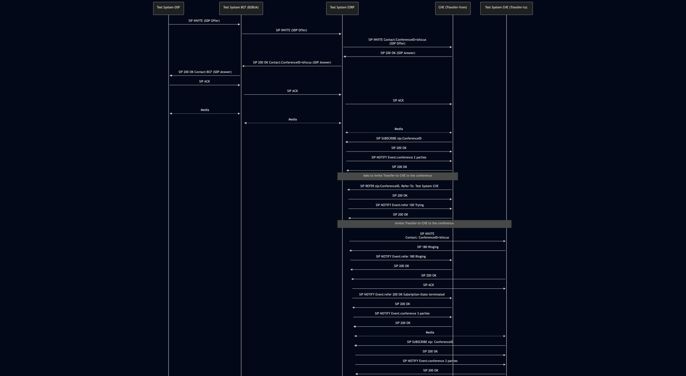
<!-- 
https://mermaid.live/edit#pako:eNrFV2FvmzAQ_Ssnf-pU6ICEJrGqSkmaaqhqU4V00ia-UHBSq8PObNMtq_rfZ0jbpQkQSiPtE5Dce3fcO57tRxTxmCCMTNMMWMTZjM5xwAASKgQX_UhxITHMwh-SZD-rO5IQDIzwgOUQSX6mhEXkjIZzESZZDMAiFIpGdBEyBVMiFfhLqUgCY_-6OmAwPIeDgTO46X-qDhz5kwKq4ZcRHExFyOSMCHMmeLKD5i1A8efwjZrN09PDkiqx712Dd_XVm2oi_-waxjPNVECzhtmky96lNk8WnBEUvCqGNZIhZyqMFNZXHZAp5J0dUjnjUSpPbsXn0-00BZSFpeZpHMuC8cWKpM_kr8piy5q3zlRV8I40Fb3V6hVmySGVpDV07w8vmgldCKxSthSkqzw5MTWstMWXJKZhcbaPIgtncA31roHybwb-cOINRiDp4s0UNPgIVmo3AF6Np975Nxg9EKZw9FoEOCsLIbLxp7ICXnFFgD8QUURhbOP78l6C4kDZA9XINavKCfRFOzL8K7RBeZPR-Wiy1XQDJiQDTznedMz_pofIKgJbc03FkrL53rSoXBIKVPFyNWRdOXZZ4lbKdSfPzfrFtqDIHbeTbBGWN8TuWjDRvXxt54fl2SRsrE_DN9o1azU6_25_LmvG86rjp7dS0IWinJm-CvXYKSISyvRdvMcmNXa31p7cbfcCU9DwkmXmHYq_XTqg3tpRYwz2MEk1O_6hUUcGmgsaI6xESgyU6NEKs0f0mJEHKN-zBwjr2zgU9wEK2JPG6M3wd86TF5jg6fwO4Xynb6B0EevhfN7Uv4YQFhMx5ClTCHedtpuTIPyIfiPsuM6Rdex23K5rt2y719X_LhFuWUcd_dBxO-223XZ7rvNkoD95Xuuo57Ztx-5Y3e5xr9dq2wYKU8X9JYteUurZ0CeQy9UZJT-qPP0F1sz6vQ
-->

b) 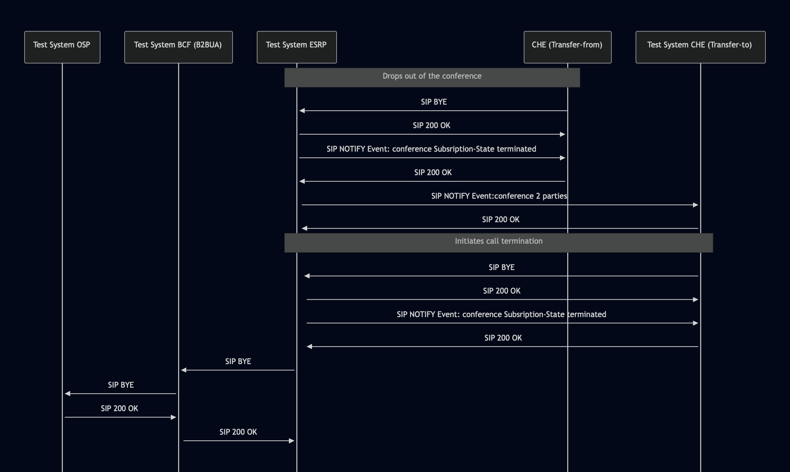
<!-- 
https://mermaid.live/edit#pako:eNqtVV1P2zAU_StXfmJaUuWjSYofkGgpWjWNoqV7AOXFS5xirbEz20ErVf_7nARYabOUMd78cc-5x-deXW9QKjKKMLJtO-Gp4Dlb4oQDFExKIc9TLaTCkJOVoglvghT9WVGe0gtGlpIUdTBASaRmKSsJ17CgSkO8VpoWMI-v-wPGk0s4GXvjb-cf-gOn8dcOqsmnKZwsJOEqp9LOpSiO0LwEaPEYfiU0BXFPZRejta8Dw4UUpQJRaRA56DsKtXVU1r60hB009tnZx0OmeHYN45tpi9q_riEdTC3KcxyYf34D8Gq-mF3ewPSeco13lENcfVeSlZoJbseaGEs0lQXjZpW94VnHBPbWpUPqjlKvLTBVh-wHTK8T-KcDesk6emHGmWbGIgUpWa2eLTMm_pe43qZ4hXXv7f6_Nco7VOSY6J3R0ePYTtQ-gRlOPUBzezTj3-T2JD18K7LQUrIMYS0raqHCOEnqLdrUxAky46WgCcJmmRH5I0EJ3xqMGW23QhRPMCmq5R3CzaS2UFVmphaPI_r51BQvo3IiKq4R9oMgaFgQ3qBfZu8OPN_1gmjkhWHkjkJzu0Z45Az8U9cNIsePfCcM_K2FHpq8ziAcRsPIjwJveDoKvTCyEKm0iNc8fVJFM2Z-kC_tH9N8NdvfB9MLbA
-->

2. Ad Hoc without B2BUA in the Ingress Call Path

a) 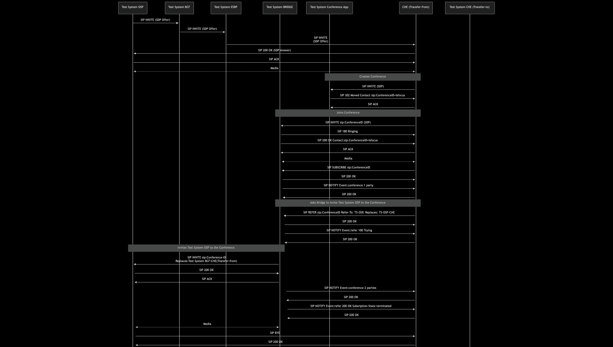
<!-- 
https://mermaid.live/edit#pako:eNq1V11v2jAU_SuWnzY16QhQPqyqEl_dsqqlImxSJ17SxFCrjZ3ZDhur-t93kwClwaWUbBIPYM45vvfcm2vnEQcipJhg27YnPBB8ymZkwhGKmJRCdgItpCJo6j8oOuEZSNGfCeUB7TN_Jv0oBSMU-1KzgMU-12hMlUbeQmkaoaF3vRvQ7Z3vBgy80VsSI7f_ebAb04PMqEzDRp043sb2vgzQh7H0uQKYPZUi-viG4AuCFkt4IXf77OyokC3x3GvkXn13xyDg9a_RcAoKBjpgi_TUi735KTgVMKRG0LPI6a38dLatZGAVo4H8cqFqpYKGF7lGh6tfxnCWbpiiSTU6vQsj5_TUBpoxh0saMj8nXQlNkZhTaYrber0RCOpJ6muqNtb3zr8oVSiMwYOXjJ3FqVWq6BIyClOS9gONFIvJs4DbP2JqKoJElYp3bfv-DuaPG0FfBeMH-bYS2PCrmNtrBubUncY5rQoaMT6Dz0H8ZTMvXSelXd_M1tjkOWC_Pn_nft63rtcbud1tg8tYcxD3ajh2z2_QYE65JsFzJzrZhF0clF4ez6H921H3CnUlC2cUaYEYnzOQKIyf9B99R8u2-WhwPhhtd_mIpuyxIGjs2bCbBSvxgx9QtVqxYaMStSpfKpmGiBxQG8vF-pn6J4UqWG0skptVRe1bFnOmxkPLOHlst5-fh-s6FE9vyNx4T3jr4H_FjXcEvGN4HPTkVfO7DVWlS1q-v5aTxUtulWSxZoLbnoZzGWkqI8bhW_gfosxn7pbZG_N2zwtMtlf3ZnDo1QlbeAaDCBMtE2rhCJL205_4MVWcYGj1iE4wga-hL-8neMKfgAOX0h9CRCuaFMnsDpPsrm7hJA7BtuUlfQ2hPKSyJxKuMak69WozU8HkEf_GxGlWj9tOu9VunrROKq2GU7XwAhM7XW82GvWGU6nXarWK03yy8J9sZ-cYcO02cGpOq1UHlIX9RAtvwYPVpmAnvEVc5u8Z2evG01-L4O84
-->

b) 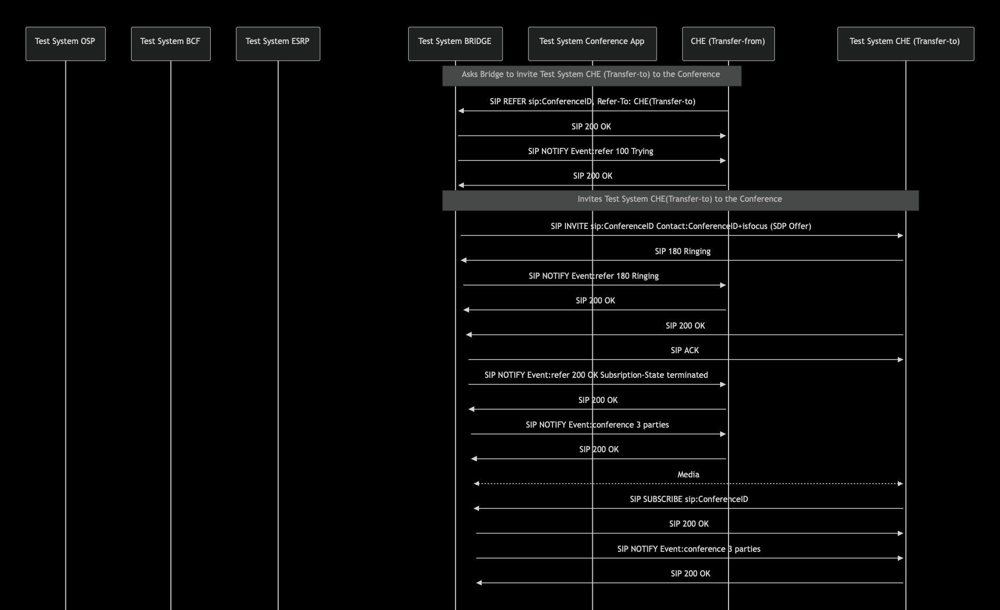
<!-- 
https://mermaid.live/edit#pako:eNq1Vttum0AQ_ZXRPqUKWFyMXa-iSL6QFlWJLaCVWvFCYe2sUnbp7mLFjfzvXWznaoTTOH3jMnPOmTnDMnco4zlBGJmmmbCMszld4IQBFFQILoaZ4kJimKe_JEnYJkiS3xVhGZnQdCHSog4GKFOhaEbLlCmIiVQQraQiBUyjWXvAaHzRHuBH4SGIMJh88ttjxroyImrZMCzL_djxZx9OYpEyqcPMueDFhwOAzxIU34VfcUWAL4loQjT2VWMYyhsJI0HzBQHFgbIl1RCtVHWcuiZPitqSN1Ca5-enTaxRMIPQv_BDkLTEj0DBxICQ1OkxxzVgQ437eDVLA_mWxrEsmH55U-rVNA4uvoO_JExhUcsCW6PFYkXZ4k01PxXz6FVrtxtdCzY2yZeZr7KpuQmtGrbig6tvQezvOVYTqDRTzx6eUjnnWSXhJJrMYDrXLxrs2yNq65390YJQN_6h9-_g5kvII-x8c12HB_QV3gzH7zbiWz0QVT-loKWinJmRSvWsKiIKyvRV_q7N-leV2eNZ6m7PRyL_g6CzM1MnH2j9JclpeqT_0ddRNA6D0f6XdeRM7Iw8EuWVvT96_JGBFvo3hLASFTFQoYctrW_RXU2QIH2UFSRBWF_mqbhJUMLWOkf_GX9wXtynCV4trhHeLAwGqspcj-tuU3h4qvXnRIx5xRTCtj7RexsYhO_QLcIDr9N1PKfr2v2B49lu10ArHeZ1O57r2V3b6fW8ft_prQ30Z0Nsdfp9y3EHjusO-lav69gGSivFoxXL7mXpMdGbzOV219msPOu_ipbbSw
-->

c) 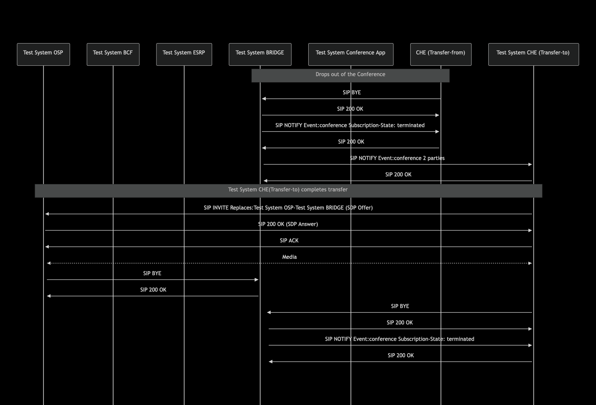
<!-- 
https://mermaid.live/edit#pako:eNq1lWFvmzAQhv-K5U-tBlEgIQGrqpQm6RZVTaIQTerEFw8uKVqwmTHtsij_fQbSdS2MkEz7ZuC9596zfdwO-zwATLCu6x7zOVuFa-IxhKJQCC4GvuQiIWhFNwl4LBcl8D0F5sMopGtBo0yMUEyFDP0wpkyiJSQSudtEQoRm7rxecDO8rReM3cUxxGIy-jiu1wxVZSAy22gQx2Xt8NMYXSwFZYmS6SvBo8sjwDcBkh_kUy4B8ScQVUSt7JqgkeBxgngqEV8h-Qh_WC2QFSD9-vpDFcudzNHNw2EryoIsrIJWxJntNprdnRU6nS0ntw9o_ARMEv91p930a-KLMJYhZ7orqQSCJIgoZGoZnFXdcZe1h1Tv1yxOG5Iyv0RqavL1QtTitHdNQ97L36iRz6N4AxISJA-vz7Ccp8n8TqafJ8sxWkC8oT4k5J1IL9eJLtzRHM1WinxZzpzFNDuJYqcK2oAlz5W45oUMhncNwq-udEUoAe4hCGmjYk5ot0qbf7vEJ12yExLXbv5_6qUmvf-PDYY1vBZhgIkUKWg4UnSaPeJdhvew-plG4GGilgEV3zzssb2KUb_yL5xHL2GCp-tHTPIJp-E0DpS_w2j7LQEWgBjylElMbNPo5xBMdvgHJrrRMvqO2etYhmN2Dce2DA1vs_dWy-rbjmN22lava_dNa6_hn3nmdsu2-x3LMbrqY6fb69kapqnk7pb5L0nVbVSz976YzvmQ3v8CmzF0lA
-->

3. Ad Hoc with B2BUA in the Ingress Call Path

a) 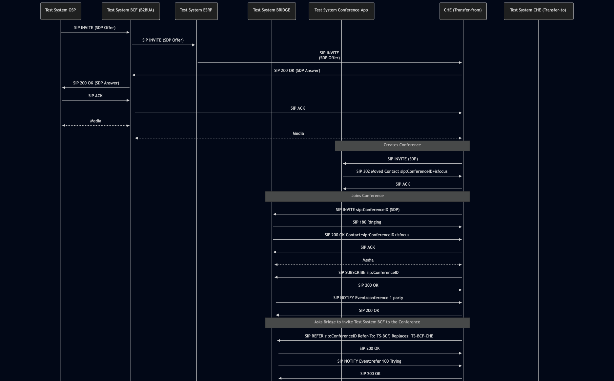
<!-- 
https://mermaid.live/edit#pako:eNqlVl1v2jAU_SuWnzo16fJFCVZVCQLdsqpQJemkTXnJEkOjNnZmO90Y6n-fE6ClEFJKJB7AOefce8-9DncBY5pgiKCqqiGJKZmmMxQSALKUMcr6saCMIzCNHjkOSQXi-HeBSYyHaTRjUVaCAcgjJtI4zSMiQIC5AP6cC5yBiX_bDBg4V-BkYAzu-p-agSPfe0_Kc4dfRs0YR1aIWZk-6Of5Ltb5OgInAYsIlzB1ymj2TlpvCYKu4FseqJeXp3uqRr57C9zxdzeQQv7wFkymUqlGZoOzLVd6c7BOCS4FakpF4FXk4hf7fLmrVMNqKq4SNDQNTK6XWn3C_3y0PGngB4QOsLvvXL-bQJ09e7ky5sWFKmn7ot7gJI0aYy75tU3ZII-pwIA-YVbXCGX_pCPgMBwJzDfOD27ottTWpNX04C2jcdpMzQA3sqKkJIkoFoCnOXoVcIenKZ_SuOCt8n1p2-EOLt8nCHyjKTnKt7XAhl_bte0zcEltNE63NeClZCY_R_FXl2nlOmrt-ma19ResAhw25x-M598NfMdzB7sGt7HmKO54ErhXP8DoCROB4tdJ1Ku_kPlR5S3zOXZ--_yBgwFLkxkGgoKUPKVSYvs1JJ-Ie9x2zL3R1cjbnXIPl-yAIhD4qoymyJP8MYoxX5-oMlCLXrVvFStTBLpUC9j85U61aBRU4EyaDpFgBVZghlkWlT_honweQul2hkOI5NckYg8hDMmz5MgN4yel2ZrGaDG7h6hawBRY5Il8ia82r5dT6XKCmUMLIiAyTK1TqUC0gH8hMs8M61wzu6betW2ja1uWAucQqXpPO7PsrtXpWuf2uWF0Os8K_FdF1s8027R1q9e1O71ex7JNBUaFoP6cxOu85FWVq-HNcnmsdsjn_4YLNwU
-->

b) 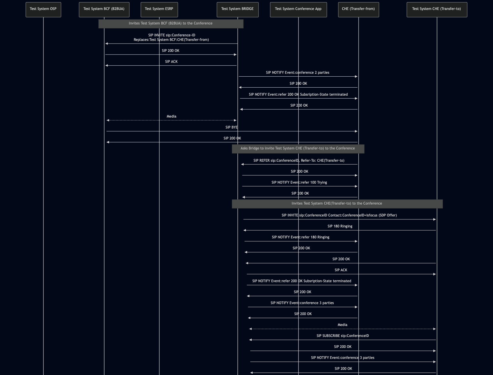
<!-- 
https://mermaid.live/edit#pako:eNrFV1tvmzAU_iuWnzoVOkjIzaoqhYRuaGpTQTqpEy8UnNRqsZltomVV__sMSW_h0qZJtTcu5_Kd75zzGe5hxGIMEdR1PaARozMyRwEFICGcMz6MJOMCgVl4J3BACyOBf2eYRnhMwjkPk9wYgDTkkkQkDakEUywk8JdC4gRM_ItmA3t0Cg7sln05_NJs6PjeW6E8d_zNabYZqQoxz-GDYZqWbUffHXAw5SEVykyfcZa8Aeu1g2Rr83MmMWALzCsQajX1I-DSBZFY1BEEJAPyBr8oYpWsnEI_OTmszeK7F8A9_-lOHSBIip6j6e74-Jp_PQEeTu_CCAu0EQOpaivZqclVglGAWyFoGQaY_PhwAcNRo29FH1d-55Ope3oFnAWmEkXP09BadRiLVdQK_92KeR8gjtXbdTTgZ9eCk1QSRnVfhmqgJOYJoeoq_gSUx8e6cq4l_QzHJHyz27Vl2lfO-zFvNvsl8OfNqoikVZU-FLcC2JzEc5xvECmWrHmJ6zZtS8I959TxNpbMHWtqv3L3KUPg1UI9qceWI7Tf6TNVtClfEjrfeciqVbDEdmXXqrRwk62PC2IJQ4MsuuM8gQwj-erhIREzFmUCHPjjCzCZqRcV7SslauLO7BvAU8Q_cb-Hbm6G3JNmbFXXdlpf05u9KP7_FNgPnUvtTzyXyopfQX2N7m_Vf__S9keea5c3a8eZWDdyxyjv5H7n8YcanKtjCCLJM6zBRA1bmN_C-zxBAJWUJTiASF3GIb8NYEAflI_65vzFWPLoxlk2v4Go-CTXYJbGalzX3-JPTxX-GPMRy6iEqNXtGkUUiO7hH4jM1pFhWgNzYFlGt9vrmaYGlxC1raNOb9Axe-2uNeh0-50HDf4t8hpHg3bLsnpmu2NZfavT6WswzCTzlzR6RKWmRP0qnK1-Jop_iod_0GvjNg
-->

c) 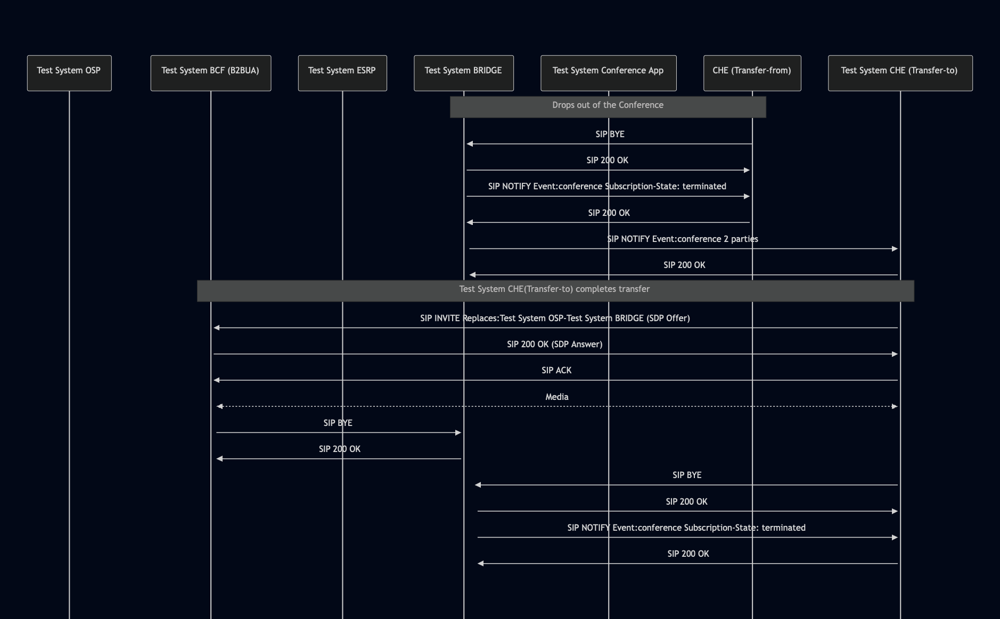
<!-- 
https://mermaid.live/edit#pako:eNq1lW1v2jAQx7_Kya9aLUEhgbRYVSWeuqGqgAib1ClvvMTQaMTObKcbQ3z3OYSOtgnhYdq7JPrf7_7n8-VWKOAhRRiZpumzgLNZNMc-A4gjIbhoB4oLiWFGFpL6bCOS9EdKWUB7EZkLEmdigIQIFQVRQpiCKZUKvKVUNIaRN64WdLp3cNGxO5_bl9XCvjc5hJoMeh_71ZqurpCKzD60k6So7X7qw8VUECa1zJwJHh-w9TZA8a18yBUF_kxFGdEousbQEzyRwFMFfAbqib6ymiNLQObt7YcyljcYQ-dxexRFQRZWQsvjbMuC0f1ZocPRdHD3CP1nyhQOdiftpd9kIKJERZyZniKKYlBUxBHTj-FZ1R12Wdmkar923m0qi_wC6ViTuwtRiTP2zAZ-H_YmCgIeJwuqqAS1_XyO9dfpMv-D4ZfBtA8TmixIQCV-N9hmsW648HpjGM10hsuS5uwSHNmh_ARzapvJn6XY0wtrd--PwNzcmJq0F_RAw4icVOQJ41lpf9_lP-lynmCgsjn_aQaP-Wf842AiA81FFCKsREoNFGs6yV7RKsP7SP-EY-ojrB9DIr77yGdrHaNXwFfO45cwwdP5E8KbDWmgNAm1v-1q_CuhLKSiy1OmEK7bdXsDQXiFfiFsW07t2nYsp-7YVtN1W1cGWmpZw625zZZjN6yWbdXt5tpAvzdprZrbcF2nee1YDct2rhqOgUiquLdkwUtGfTX14n7IV_tmw6__ABQYgJ8
-->

## Comments

Version:  010.3f.5.0.12

Date: 20251113

## Footnotes
[^1]: SIPp - tool for SIP packet simulations. Official documentation: https://sipp.sourceforge.net/doc/reference.html#Getting+SIPp
[^2]: Wireshark - tool for packet tracing and anaylisis. Official website: https://www.wireshark.org/download.html
[^3]: Wireshark configuration to decrypt TLS packets: https://www.zoiper.com/en/support/home/article/162/How%20to%20decode%20SIP%20over%20TLS%20with%20Wireshark%20and%20Decrypting%20SDES%20Protected%20SRTP%20Stream
[^4]: TLS v1.3 session keys logging + Wireshark configuration to decrypt traffic: https://my.f5.com/manage/s/article/K50557518
