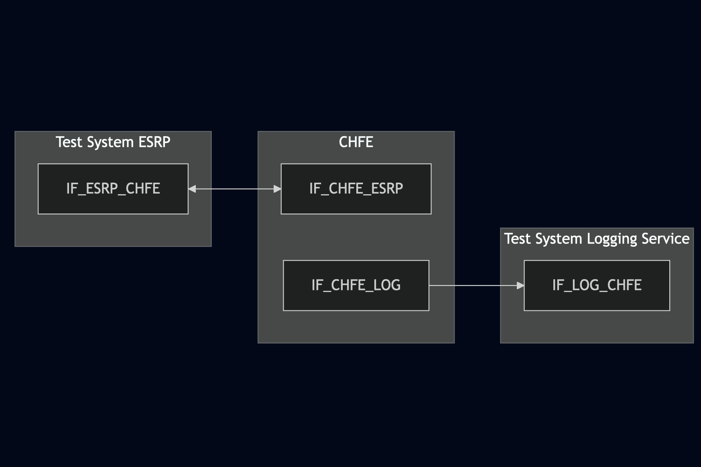
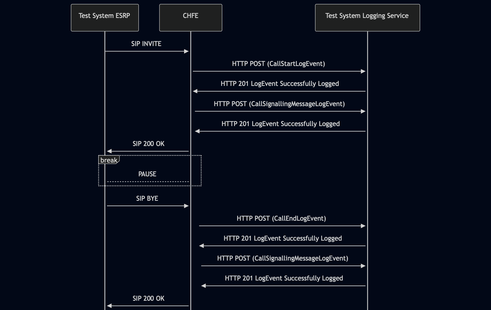

# Test Description: TD_CHFE_007
## Overview
### Summary
Logging the call status

### Description
Test covers logging of CallStartLogEvent, CallEndLogEvent and CallSignallingMessageLogEvent

### References
* Requirements :  RQ_CHFE_312, RQ_CHFE_318, RQ_CHFE_319, RQ_CHFE_320
* Test Case    : 

### Requirements
IXIT config file for IUT

### HTTP transport types
Test can be performed with 2 different SIP and HTTP transport types. Steps describing actions for specific one are marked as following:
- (TLS) - used by default inside ESInet on production environment
- (TCP) - used if default TLS is not possible

## Configuration
### Implementation Under Test Interface Connections
<!-- Identify each of the FEs that are part of the configuration and how they are connected -->
* Test System ESRP
  * IF_ESRP_CHFE - connected to IF_CHFE_ESRP
* CHFE
  * IF_CHFE_ESRP - connected to Test System OSP IF_ESRP_CHFE
  * IF_CHFE_LOG - connected to Test System Logging Service IF_LOG_CHFE
* Test System Logging Service
  * IF_LOG_CHFE - connected to IF_CHFE_LOG

### Test System Interfaces
<!-- Identify each of the test system interfaces and whether it will be in active or monitor mode -->
* Test System ESRP
  * IF_ESRP_CHFE - Active
* CHFE
  * IF_CHFE_ESRP - Active
  * IF_CHFE_LOG - Active
* Test System Logging Service
  * IF_LOG_CHFE - Active
 
### Connectivity Diagram
<!--
https://mermaid.live/edit#pako:eNp9UtFOg0AQ_BWyz7SBgxZ6Mb7UVk1qNKVPhqQ5YQvEctcch4qEf_cAaWubuE-7s7Mzc8nVEIkYgcJuLz6jlEllrNYhN3Q9LreLYP2ynT8sFzej0a2e27YDj4wOWT3f93vddEjIe0JRviWSHVJjg4UygqpQmBun-0uXHkUeX1yfdueuVzpDlv-o1-Ln0VYiSTKeGAHKjyzCP0Knt_3qgAmJzGKgSpZoQo4yZ-0IdUsJQaWYYwhUtzGT7yGEvNE3B8ZfhciHMynKJAW6Y_tCT-UhZgrvMqaz5UdUajeUc1FyBdRxOg2gNXwBtYk7nnmO5U51WT6x9bYC6pKxO9HwdDZ1LWviE7cx4buztcYecSYWIbavGzLzbBNYqURQ8WgIhXGmhHzqf0b3QZofPCOiYg
-->




## Pre-Test Conditions
### Test System ESRP/Test System Logging Service
* Interfaces are connected to network
* Interfaces have IP addresses assigned by DHCP
* Device is active
* ng911 repository cloned to local storage
* (TLS) Generated own PCA-signed certificate and private key files (test_system.crt, test_system.key)
* (TLS) Certificate and key used by CHFE copied to local storage
* (TLS) PCA certificate copied to local storage

### CHFE
* Interfaces are connected to network
* Interfaces have IP addresses assigned by DHCP
* Device configured to use Logging Service Test System as a Logging Service
* IUT is initialized with steps from IXIT config file
* Device is active
* Device is in normal operating state
* IUT is initialized using IXIT config file

## Test Sequence

### Test Preamble

#### Test System ESRP
* Install SIPp by following steps from documentation[^1]
* Copy following XML scenario file to local storage:
  `SIP_basic_call.xml`
  `g711ulaw_rtp_stream.pcap`
* Install Wireshark[^2]
* (TLS v1.2) Configure Wireshark to decode SIP over TLS, use tests system and IUT certificate keys [^3]
* (TLS v1.3) Configure logging of session keys and configure Wireshark to decode SIP over TLS [^4]
* Using Wireshark on 'Test System' start packet tracing on IF_ESRP_CHFE interface - run following filter:
   * (TLS)
     > ip.addr == IF_ESRP_CHFE_IP_ADDRESS and tls
   * (TCP)
     > ip.addr == IF_ESRP_CHFE_IP_ADDRESS and sip

#### Test System Logging Service
* Install Wireshark[^2]
* (TLS v1.2) Configure Wireshark to decode HTTP over TLS, use tests system and CHFE certificate keys [^3]
* (TLS v1.3) Configure logging of session keys and configure Wireshark to decode HTTP over TLS [^4]
* Using Wireshark on 'Test System' start packet tracing on IF_LOG_CHFE interface - run following filter:
   * (TLS)
     > ip.addr == IF_LOG_CHFE_IP_ADDRESS and tls
   * (TCP)
     > ip.addr == IF_LOG_CHFE_IP_ADDRESS and http

### Test Body

#### Stimulus
Simulate basic call from Test System ESRP to CHFE - run SIPp scenario by using following command on Test System ESRP, example:
* (TCP transport)
  ```
  sudo sipp -t t1 -sf SIP_basic_call.xml IF_CHFE_ESRP_IPv4:5060
  ```
* (TLS transport)
  ```
  sudo sipp -t l1 -tls_cert test_system.crt -tls_key test_system.key -sf SIP_basic_call.xml IF_CHFE_ESRP_IPv4:5060
  ```

#### Response
Using traced packets on Wireshark verify:
* If CHFE sends HTTP POST to Logging Service Test System with signed JWS body containing:
  * "logEventType": "CallStartLogEvent"
  * "timestamp" with correct date-time format (f.e. 2020-03-10T11:00:01-05:00) and date-time match the time when SIP INVITE message has been received
  * "elementId" which has value with FQDN of CHFE
  * "agencyId" which has value with FQDN of an agency
  * "callId" which has value f.e.: `urn:emergency:uid:callid:1234567890:bcf.ng911.example`. Check:
    * if header field contains "urn:emergency:uid:callid:"
    * if "urn:emergency:uid:callid:" is followed by 10 to 32 alphanumeric characters (String ID)
    * if String ID is followed by ":" and domain name
  * "incidentId" which has value f.e.: `urn:emergency:uid:incidentid:1234567890:bcf.ng911.example`. Check:
    * if header field contains "urn:emergency:uid:incidentid:"
    * if "urn:emergency:uid:incidentid:" is followed by 10 to 32 alphanumeric characters (String ID)
    * if String ID is followed by ":" and domain name
  * "callIdSIP" which has value f.e.: `1234567890qwertyuiop@caller.example.com` 
  * "direction" which has value: `incoming`
  * (optionally) zero or one "standardPrimaryCallType" with one of string values:
    - "emergency"
    - "nonEmergency"
    - "silentMonitoring"
    - "intervene"
    - "legacyWireline"
    - "legacyWireless"
    - "legacyVoip"
  * (optionally) zero or one "standardSecondaryCallType" with one of string values mentioned for "standardPrimaryCallType"
  * (optionally) zero or one "localCallType" with string value
  * (optionally) zero or one "localUse" with string value
  * (optionally) zero or one "clientAssignedIdentifier" with string value
  * (optionally) zero or one "extension" with string value
* If CHFE sends HTTP POST to Logging Service Test System with signed JWS body containing:
  * "logEventType": "CallSignalingMessageLogEvent"
  * "timestamp" with correct date-time format (f.e. 2020-03-10T11:00:01-05:00) and date-time match the time when SIP INVITE message has been received
  * "elementId" which has value with FQDN of CHFE
  * "agencyId" which has value with FQDN of an agency
  * "callId" which has value f.e.: `urn:emergency:uid:callid:1234567890:bcf.ng911.example`. Check:
    * if header field contains "urn:emergency:uid:callid:"
    * if "urn:emergency:uid:callid:" is followed by 10 to 32 alphanumeric characters (String ID)
    * if String ID is followed by ":" and domain name
  * "incidentId" which has value f.e.: `urn:emergency:uid:incidentid:1234567890:bcf.ng911.example`. Check:
    * if header field contains "urn:emergency:uid:incidentid:"
    * if "urn:emergency:uid:incidentid:" is followed by 10 to 32 alphanumeric characters (String ID)
    * if String ID is followed by ":" and domain name
  * "callIdSIP" which has value f.e.: `1234567890qwertyuiop@caller.example.com` 
  * "direction" which has value: `incoming`
  * "text" which has string value containing SIP INVITE message received by CHFE from Test System ESRP
  * (Optional) "protocol" which has string value: `sip`
* If CHFE sends HTTP POST to Logging Service Test System with signed JWS body containing:
  * "logEventType": "CallEndLogEvent"
  * "timestamp" with correct date-time format (f.e. 2020-03-10T11:00:01-05:00) and date-time match SIP BYE message received by CHFE from Test System ESRP
  * "elementId" which has value with FQDN of CHFE
  * "agencyId" which has value with FQDN of an agency
  * "callId" which has value f.e.: `urn:emergency:uid:callid:1234567890:bcf.ng911.example`. Check:
    * if header field contains "urn:emergency:uid:callid:"
    * if "urn:emergency:uid:callid:" is followed by 10 to 32 alphanumeric characters (String ID)
    * if String ID is followed by ":" and domain name
  * "incidentId" which has value f.e.: `urn:emergency:uid:incidentid:1234567890:bcf.ng911.example`. Check:
    * if header field contains "urn:emergency:uid:incidentid:"
    * if "urn:emergency:uid:incidentid:" is followed by 10 to 32 alphanumeric characters (String ID)
    * if String ID is followed by ":" and domain name
  * "callIdSIP" which has value f.e.: `1234567890qwertyuiop@caller.example.com` 
  * "direction" which has value: `incoming`
  * (optionally) zero or one "standardPrimaryCallType" with one of string values:
    - "emergency"
    - "nonEmergency"
    - "silentMonitoring"
    - "intervene"
    - "legacyWireline"
    - "legacyWireless"
    - "legacyVoip"
  * (optionally) zero or one "standardSecondaryCallType" with one of string values mentioned for "standardPrimaryCallType"
  * (optionally) zero or one "localCallType" with string value
  * (optionally) zero or one "localUse" with string value
  * (optionally) zero or one "clientAssignedIdentifier" with string value
  * (optionally) zero or one "extension" with string value
* If CHFE sends HTTP POST to Logging Service Test System with signed JWS body containing:
  * "logEventType": "CallSignalingMessageLogEvent"
  * "timestamp" with correct date-time format (f.e. 2020-03-10T11:00:01-05:00) and date-time match SIP BYE message received by CHFE from Test System ESRP
  * "elementId" which has value with FQDN of CHFE
  * "agencyId" which has value with FQDN of an agency
  * "callId" which has value f.e.: `urn:emergency:uid:callid:1234567890:bcf.ng911.example`. Check:
    * if header field contains "urn:emergency:uid:callid:"
    * if "urn:emergency:uid:callid:" is followed by 10 to 32 alphanumeric characters (String ID)
    * if String ID is followed by ":" and domain name
  * "incidentId" which has value f.e.: `urn:emergency:uid:incidentid:1234567890:bcf.ng911.example`. Check:
    * if header field contains "urn:emergency:uid:incidentid:"
    * if "urn:emergency:uid:incidentid:" is followed by 10 to 32 alphanumeric characters (String ID)
    * if String ID is followed by ":" and domain name
  * "callIdSIP" which has value f.e.: `1234567890qwertyuiop@caller.example.com` 
  * "direction" which has value: `incoming`
  * "text" which has string value containing SIP BYE message received by CHFE from Test System ESRP
  * (Optional) "protocol" which has string value: `sip`

VERDICT:
* PASSED - if Logging Service responded as expected
* FAILED - any other cases


### Test Postamble
#### Test System ESRP
* stop SIPp (if still running)
* stop Wireshark (if still running)
* archive all logs generated
* disconnect interfaces from IUT
* (TLS) remove certificates

#### Test System Logging Service
* stop Wireshark (if still running)
* archive all logs generated
* disconnect interfaces from IUT
* (TLS) remove certificates

#### CHFE
* restore default configuration
* disconnect interfaces from Test Systems
* reconnect interfaces back to default

## Post-Test Conditions
### Test System ESRP/Test System Logging Service
* Test tools stopped
* interfaces disconnected from IUT

### CHFE
* device connected back to default
* device in normal operating state

## Sequence Diagram
<!--
https://mermaid.live/edit#pako:eNrtVF1v0zAU_SvWfQKRVI6bfvmh0ihBq2AswhkSKC8mufWiJfZwnGml6n_HSdV1GgghJt7wi7_OOT7yse8OClMicAjDMNeF0ZtK8VwT0lTWGntWOGNbTjaybjHXA6jFbx3qAt9UUlnZ9OBDy7B1RGxbhw1JxMc0XC5frc7fJpyIdUrWHz6ts-SE7nd6xGPWe6NUpRURaO-qAjk5z7KUpJciIy9Wsq6Fk9Z5UHKH2r389clPNE4mBi1GI3IUIKIrCmzbTVfX24GH5TP9VUr7zkMuvK5U-I-9_t5tn8Hh7hml5PLdCf3Vorw5TR8EwuXP_PTsSjyKDXX5p4m__vzMuBNd_g_7r8OGAJStSuDOdhhAg7aR_RR2vVIO7hobzIH7YSntTQ653nvOrdRfjGmONGs6dQ18KAABdLeldMef_7Bq_aNAuzKddsDjcTyIAN_BPfCIxaPFbEzjqW90zqJxAFuPYqN44peni2lM6WTO4n0A34dz6WjGxhPKWDT3A7aYRQHIzhmx1cXRFZaVL0wXh9I1VLD9Dy9veCk
-->




## Comments

Version:  010.3f.5.0.3

Date:     20260402

## Footnotes
[^1]: SIPp - tool for SIP packet simulations. Official documentation: https://sipp.sourceforge.net/doc/reference.html#Getting+SIPp
[^2]: Wireshark - tool for packet tracing and anaylisis. Official website: https://www.wireshark.org/download.html
[^3]: Wireshark configuration to decrypt TLS packets: https://www.zoiper.com/en/support/home/article/162/How%20to%20decode%20SIP%20over%20TLS%20with%20Wireshark%20and%20Decrypting%20SDES%20Protected%20SRTP%20Stream
[^4]: TLS v1.3 session keys logging + Wireshark configuration to decrypt traffic: https://my.f5.com/manage/s/article/K50557518
