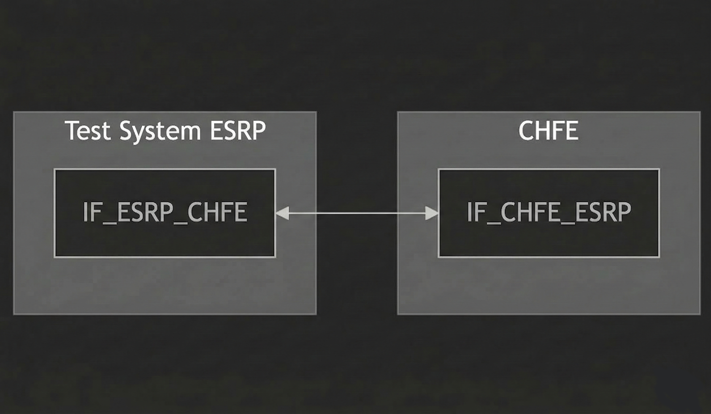
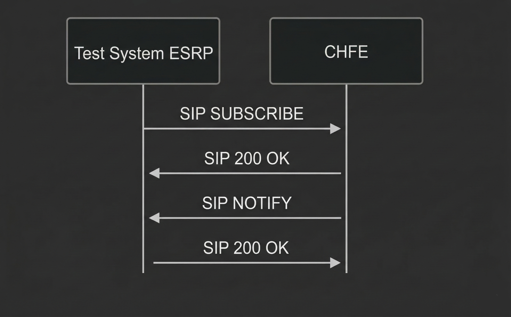

# Test Description: TD_CHFE_008

## Overview
### Summary
The PSAP MUST deploy a ServiceState notifier

### Description
This test checks if CHFE has implemented ServiceState

### References
* Requirements : RQ_CHFE_017
* Test Case    : TC_CHFE_008

### Requirements
IXIT config file for CHFE

### SIP transport types
Test can be performed with 2 different SIP transport types. Steps describing actions for specific one are marked as following:
- (TLS transport) - should be used by default
- (TCP transport) - used in lab for testing purposes only if default TLS is not possible

## Configuration
### Implementation Under Test Interface Connections
<!-- Identify each of the FEs that are part of the configuration and how they are connected -->
* Test System
  * IF_ESRP_CHFE - connected to IF_CHFE_ESRP
* CHFE
  * IF_CHFE_ESRP - connected to IF_ESRP_CHFE

### Test System ESRP
<!-- Identify each of the test system interfaces and whether it will be in active or monitor mode -->
* Test System
  * IF_ESRP_CHFE - Active
* CHFE
  * IF_CHFE_ESRP - Active

### Connectivity Diagram



## Pre-Test Conditions
### Test System
* Interfaces are connected to network
* Interfaces have IP addresses assigned by DHCP
* Device is active
* ng911 repository cloned to local storage
* (TLS) Generated own PCA-signed certificate and private key files (test_system.crt, test_system.key)
* (TLS) Certificate and key used by CHFE copied to local storage
* (TLS) PCA certificate copied to local storage

### CHFE
* Interfaces are connected to network
* Interfaces have IP addresses assigned by DHCP
* IUT is active
* IUT is in normal operating state
* Default configuration is loaded
* IUT is initialized using IXIT config file
* IUT has configured tel number from which calls are accepted and auto-answered
* Test System configured as default ESRP
* Agent logged in (f.e. tester@psap.example.com)
  
## Test Sequence

### Test Preamble

#### Test System
* Install SIPp by following steps from documentation[^1]
* Install Wireshark[^2]
* (TLS v1.2) Configure Wireshark to decode HTTP over TLS, use tests system and FE certificate keys [^3]
* (TLS v1.3) Configure logging of session keys and configure Wireshark to decode SIP over TLS [^4]
* Using Wireshark on 'Test System' start packet tracing on IF_TS_CHFE interface - run following filter:
   * (TLS)
     > ip.addr == IF_ESRP_CHFE_IP_ADDRESS and tls
   * (TCP)
     > ip.addr == IF_ESRP_CHFE_IP_ADDRESS and http

### Test Body

1. ServiceState - scenario file: `SIP_SUBSCRIBE_ServiceState.xml`

#### Stimulus

Send SIP INVITE to CHFE - run following SIPp command on Test System, example:
  * (TCP transport)
    > sudo sipp -t l1 -sf SIPP_SCENARIO_FILE -s IF_ESRP_CHFE_IPv4:5060
  * (TLS transport)
    > sudo sipp -t t1 -sf SIPP_SCENARIO_FILE -s CONFERENCE_ID IF_ESRP_CHFE_IPv4:5061

#### Response

Variation
* CHFE responds with 200 OK for SIP SUBSCRIBE
* CHFE sends SIP NOTIFY with the same event as requested in SIP SUBSCRIBE(emergency-ServiceState)
* SIP NOTIFY contains following fields in JSON body:
- service which contains:
    - name which is one of:
      ```
       ADR
       Bridge
       ECRF
       ESRP
       GCS
       IMR
       Logging
       LVF
       MCS
       MDS
       PolicyStore
       PSAP 
      ```
    - serviceId (optional) which is FQDN the same as in 'domain'
    - domain which is FQDN
- serviceState which contains:
    - state which is one of:
      ```
       Normal
       Unstaffed
       ScheduledMaintenanceDown
       ScheduledMaintenanceAvailable
       MajorIncidentInProgress
       Partial
       Overloaded
       GoingDown
       Down
       Unreachable
      ```
    - reason whish is string or empty
- securityPosture (optional) which contains:
    - posture which is one of:
        ```
          Green
          Yellow
          Orange
          Red
        ```

VERDICT:
* PASSED - if CHFE responded as expected
* FAILED - any other cases

### Test Postamble
#### Test System
* stop all SIPp processes (if still running)
* archive all logs generated
* stop Wireshark (if still running)
* remove ng911 repository files
* disconnect interfaces from CHFE

#### CHFE
* disconnect IF_CHFE_TS
* reconnect interfaces back to default

## Post-Test Conditions 
### Test System 
* Test tools stopped
* interfaces disconnected from CHFE

### CHFE
* device connected back to default
* device in normal operating state

## Sequence Diagram



## Comments

Version:  010.3f.5.0.5

Date:     20260309

## Footnotes
[^1]: SIPp - tool for SIP packet simulations. Official documentation: https://sipp.sourceforge.net/doc/reference.html#Getting+SIPp
[^2]: Wireshark - tool for packet tracing and analysis. Official website: https://www.wireshark.org/download.html
[^3]: Wireshark configuration to decrypt TLS packets: https://www.zoiper.com/en/support/home/article/162/How%20to%20decode%20SIP%20over%20TLS%20with%20Wireshark%20and%20Decrypting%20SDES%20Protected%20SRTP%20Stream
[^4]: TLS v1.3 session keys logging + Wireshark configuration to decrypt traffic: https://my.f5.com/manage/s/article/K50557518
