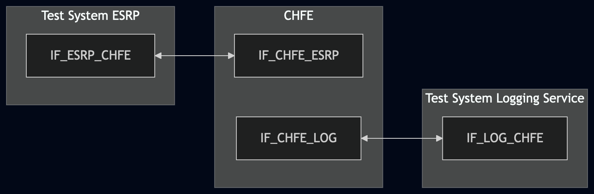
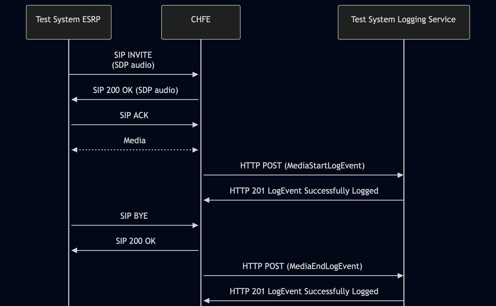

# Test Description: TD_CHFE_009
## Overview
### Summary
Logging the media transmission status

### Description
Test covers logging of MediaStartLogEvent and MediaEndLogEvent

### References
* Requirements : RQ_CHFE_304, RQ_CHFE_308
* Test Case    : TC_CHFE_009

### Requirements
IXIT config file for IUT

### HTTP transport types
Test can be performed with 2 different SIP and HTTP transport types. Steps describing actions for specific one are marked as following:
- (TLS) - used by default inside ESInet on production environment
- (TCP) - used if default TLS is not possible

## Configuration
### Implementation Under Test Interface Connections
<!-- Identify each of the FEs that are part of the configuration and how they are connected -->
* Test System ESRP
  * IF_ESRP_CHFE - connected to IF_CHFE_ESRP
* CHFE
  * IF_CHFE_ESRP - connected to IF_ESRP_CHFE
  * IF_CHFE_LOG - connected to IF_LOG_CHFE
* Test System Logging Service
  * IF_LOG_CHFE - connected to IF_CHFE_LOG

### Test System Interfaces
<!-- Identify each of the test system interfaces and whether it will be in active or monitor mode -->
* Test System ESRP
  * IF_ESRP_CHFE - Active
* CHFE
  * IF_CHFE_ESRP - Active
  * IF_CHFE_LOG - Active
* Test System Logging Service
  * IF_LOG_CHFE - Active
 
### Connectivity Diagram
<!--
https://mermaid.live/edit#pako:eNp9Ul1LwzAU_SvlPneln1kbxJe5qTBRVp-kMGJ71xbXZKSpOsf-u2nqNqdiHsK9J-ecey5kB7koECis1uItr5hU1nyRcUuf29lymi4elpOb2fRiNLrUfV8a8MgwyPz--ougKwMN78Pdds-lZJvKesRWWem2VdhYJ5OfowYUeZHxf_RzUZY1L60U5Wud45nVeQjj9EeaE-P7Kr9yHRY8moENpawLoEp2aEODsmF9C7uekoGqsMEMqC4LJl8yyPheazaMPwnRHGRSdGUFdMXWre66TcEUXtVMRztR9DCUE9FxBTQxDkB38A7UCyJnHHq-G8eJG3okGduwBTomTuwnYRS6YRgEnhvsbfgwM12HED8inp9oGSGx5rNOiXTL88M0LGol5N3wGcyf2H8CHICfAw
-->



## Pre-Test Conditions
### Test System ESRP/Test System Logging Service
* Interfaces are connected to network
* Interfaces have IP addresses assigned by DHCP
* Device is active
* ng911 repository cloned to local storage
* (TLS) Generated own PCA-signed certificate and private key files (test_system.crt, test_system.key)
* (TLS) Certificate and key used by CHFE copied to local storage
* (TLS) PCA certificate copied to local storage

### CHFE
* Interfaces are connected to network
* Interfaces have IP addresses assigned by DHCP
* Device configured to use Logging Service Test System as a Logging Service
* IUT is initialized with steps from IXIT config file
* Device is active
* Device is in normal operating state
* IUT is initialized using IXIT config file

## Test Sequence
### Test Preamble

#### Test System ESRP
* Install SIPp by following steps from documentation[^1]
* Copy following XML scenario file to local storage:
  `SIP_basic_call_with_RTP.xml`
  `g711ulaw_rtp_stream.pcap`
* Install Wireshark[^2]
* (TLS v1.2) Configure Wireshark to decode SIP over TLS, use tests system and IUT certificate keys [^3]
* (TLS v1.3) Configure logging of session keys and configure Wireshark to decode SIP over TLS [^4]
* Using Wireshark on 'Test System' start packet tracing on IF_ESRP_CHFE interface - run following filter:
   * (TLS)
     > ip.addr == IF_ESRP_CHFE_IP_ADDRESS and tls
   * (TCP)
     > ip.addr == IF_ESRP_CHFE_IP_ADDRESS and sip

#### Test System Logging Service
* Install Wireshark[^2]
* (TLS v1.2) Configure Wireshark to decode HTTP over TLS, use tests system and CHFE certificate keys [^3]
* (TLS v1.3) Configure logging of session keys and configure Wireshark to decode HTTP over TLS [^4]
* Using Wireshark on 'Test System' start packet tracing on IF_LOG_CHFE interface - run following filter:
   * (TLS)
     > ip.addr == IF_LOG_CHFE_IP_ADDRESS and tls
   * (TCP)
     > ip.addr == IF_LOG_CHFE_IP_ADDRESS and http
* The Logging Service must be configured to accept and process HTTP POST requests.
  To verify this manually, you can simulate a listening HTTP endpoint on port 8080 using command in the terminal:
    * Step 1 - Prepare logEventId and JSON body
      ```
      ID="urn:emergency:uid:logid:$(date +%s%N):logger.state.pa.us"
      BODY="{\"logEventId\":\"$ID\"}"
      ```
    * Step 2 - Run server:
      * (TLS)
      ```
      python3 http_entry.py --ip IF_LOG_CHFE --port 8080 --role RECEIVER --path /LogEvents --method POST --body "$BODY" --content_type application/json --response_code 201 --server_cert /tmp/cert.crt --server_key /tmp/cert.key
      ```
      * (TCP)
      ```
      python3 http_entry.py --ip IF_LOG_CHFE --port 8080 --role RECEIVER --path /LogEvents --method POST --body "$BODY" --content_type application/json --response_code 201
      ```
    * Step 3 - In another terminal, send a POST request to verify it is working:
      * (TLS)
      ```
      curl -k -X POST http://localhost:8080 -d '{"log":"test"}'
      ```   
      * (TCP)
      ```
      curl -X POST http://localhost:8080 -d '{"log":"test"}'
      ```   

### Test Body

#### Stimulus
* Run SIPp scenario by using following command on Test System ESRP, example:
  * (TLS transport)
    ``` 
    sudo sipp -t l1 -tls_cert test_system.crt -tls_key test_system.key -sf SIP_basic_call_with_RTP.xml 
    IF_CHFE_ESRP_IPv4:5061
    ```
  * (TCP transport)
    ```
    sudo sipp -t t1 -sf SIP_basic_call_with_RTP.xml IF_CHFE_ESRP_IPv4:5060
    ```
#### Response
 Using traced packets on Wireshark verify:
* If CHFE sends HTTP POST to Test System Logging Service with JWS body containing:
  * "logEventType": "MediaStartLogEvent"
  * "timestamp" with correct date-time format (e.g. 2020-03-10T11:00:01-05:00) and date-time match the time when SIP INVITE message has been received
  * "elementId" which has value with FQDN of CHFE
  * "agencyId" which has value with FQDN of an agency
  * "callId" which has value e.g.: `urn:emergency:uid:callid:1234567890:bcf.ng911.example`. Check:
    * if header field contains "urn:emergency:uid:callid:"
    * if "urn:emergency:uid:callid:" is followed by 10 to 32 alphanumeric characters (String ID)
    * if String ID is followed by ":" and domain name
  * "callId" should have the same value as callId in the stimulus SIP INVITE (Call-Info header field), example:
    for following Call-Info header field in the stimulus SIP INVITE:
    ```
    Call-Info: <urn:emergency:uid:callid:123ABCdefg123ABCdefg123ABCdefg12:test.com>;purpose=CallId
    ```
    "callId" should contain value:
    ```
    urn:emergency:uid:callid:123ABCdefg123ABCdefg123ABCdefg12:test.com
    ```
  * "incidentId" which has value e.g.: `urn:emergency:uid:incidentid:1234567890:bcf.ng911.example`. Check:
    * if header field contains "urn:emergency:uid:incidentid:"
    * if "urn:emergency:uid:incidentid:" is followed by 10 to 32 alphanumeric characters (String ID)
    * if String ID is followed by ":" and domain name
  * "incidentId" should have the same value as incidentId in the stimulus SIP INVITE (Call-Info header field), example:
    for following Call-Info header field in the stimulus SIP INVITE:
    ```
    Call-Info: <urn:emergency:uid:incidentid:123ABCdefg123ABCdefg123ABCdefg12:test.com>;purpose=IncidentId
    ```
    "callId" should contain value:
    ```
    urn:emergency:uid:incidentid:123ABCdefg123ABCdefg123ABCdefg12:test.com
    ```
  * "callIdSip" which has value e.g.: `1234567890qwertyuiop@caller.example.com` 
  * "callIdSip" should have the same value as Call-ID in the stimulus SIP INVITE, example:
  for following Call-ID header field in the stimulus SIP INVITE:
    ```
    Call-ID: test@ng911.example.com
    ```
    "callIdSip" should contain value:
    ```
    test@ng911.example.com
    ```
  * "direction" which has value: `incoming` or `outgoing`
  * "sdp" is a string set to an RFC 2327 SDP description of the media codecs as negotiated. Need to contain SDP body from 200 OK CHFE response for the stimulus SIP INVITE, 
    for example:
      `"v=0\r\no=- 123456 654321 IN IP4 192.168.1.1\r\ns=-\r\nc=IN IP4 192.168.1.1\r\nt=0 0\r\nm=audio 49170 RTP/AVP 
      0\r\na=rtpmap:0 PCMU/8000\r\na=label:audio1\r\n"`
  * one or more "mediaLabel" is an array where:
      * each member is a string value
      * each value comes from SDP label assigned to one of the media streams, e.g.: 
        200 OK from CHFE contains in SDP:
        ```
           m=audio 6886 RTP/AVP 0
           a=label:audio1
           m=audio 22334 RTP/AVP 0
           a=label:audio2
        ```
        then:
        ```
           "mediaLabel": [
               "audio1",
               "audio2"
            ]
        ```
      * if no media labels have been assigned to the media, the 'mediaLabel' member is an array with one element 
        consisting of an empty string `[""]`
  * (optional) "clientAssignedIdentifier" field with string value
  * (optional) "agencyAgentId" field with string value
  * (optional) "agencyPositionId" field with string value
  * (optional) field "ipAddressPort" with string value representing normalized IP address and port number, or FQDN of 
   another element that participated in the transaction that triggered this LogEvent element 
  * (optional) "extension" field with string value

* If CHFE sends HTTP POST to Logging Service Test System with JWS body containing:
  * "logEventType": "MediaEndLogEvent"
  * "timestamp" with correct date-time format (e.g. 2020-03-10T11:00:01-05:00) and date-time match SIP BYE message 
    received by CHFE from Test System ESRP
  * "elementId" which has value with FQDN of CHFE
  * "agencyId" which has value with FQDN of an agency
  * "callId" which has value e.g.: `urn:emergency:uid:callid:1234567890:bcf.ng911.example`. Check:
    * if header field contains "urn:emergency:uid:callid:"
    * if "urn:emergency:uid:callid:" is followed by 10 to 32 alphanumeric characters (String ID)
    * if String ID is followed by ":" and domain name
  * "callId" should have the same value as callId in the stimulus SIP INVITE (Call-Info header field), example:
    for following Call-Info header field in the stimulus SIP INVITE:
    ```
    Call-Info: <urn:emergency:uid:callid:123ABCdefg123ABCdefg123ABCdefg12:test.com>;purpose=CallId
    ```
    "callId" should contain value:
    ```
    urn:emergency:uid:callid:123ABCdefg123ABCdefg123ABCdefg12:test.com
    ```
  * "incidentId" which has value e.g.: `urn:emergency:uid:incidentid:1234567890:bcf.ng911.example`. Check:
    * if header field contains "urn:emergency:uid:incidentid:"
    * if "urn:emergency:uid:incidentid:" is followed by 10 to 32 alphanumeric characters (String ID)
    * if String ID is followed by ":" and domain name
  * "incidentId" should have the same value as incidentId in the stimulus SIP INVITE (Call-Info header field), example:
    for following Call-Info header field in the stimulus SIP INVITE:
    ```
    Call-Info: <urn:emergency:uid:incidentid:123ABCdefg123ABCdefg123ABCdefg12:test.com>;purpose=IncidentId
    ```
    "callId" should contain value:
    ```
    urn:emergency:uid:incidentid:123ABCdefg123ABCdefg123ABCdefg12:test.com
    ```
  * "callIdSip" which has value e.g.: `1234567890qwertyuiop@caller.example.com` 
  * "callIdSip" should have the same value as Call-ID in the stimulus SIP INVITE, example:
  for following Call-ID header field in the stimulus SIP INVITE:
    ```
    Call-ID: test@ng911.example.com
    ```
    "callIdSip" should contain value:
    ```
    test@ng911.example.com
    ```
  * "direction" which has value: `incoming` or `outgoing`
  * one or more "mediaLabel" is an array where:
      * each member is a string value
      * each value comes from SDP label assigned to one of the media streams, e.g.: 
        200 OK from CHFE contains in SDP:
        ```
           m=audio 6886 RTP/AVP 0
           a=label:audio1
           m=audio 22334 RTP/AVP 0
           a=label:audio2
        ```
        then:
        ```
           "mediaLabel": [
               "audio1",
               "audio2"
            ]
        ```
      * if no media labels have been assigned to the media, the 'mediaLabel' member is an array with one element 
        consisting of an empty string `[""]`
  * "mediaQualityStats" which has string value in VQSessionReport format containing:
      * "VQSessionReport:CallTerm"
      * "SessionDesc" section with codec information (e.g. PT, Codec, SampleRate)
      * "LocalMetrics" section containing numeric values for Jitter, PacketLoss, Delay, MOSLQ
      * "RemoteMetrics" section containing numeric values for Jitter, PacketLoss, Delay, MOSLQ
      * "DialogID" field with SIP Call-ID format: `DialogID:1234567890@caller.example.com;to-tag=calleE_tag;from-tag=calleR_tag`
         
        For example:
      `"VQSessionReport:CallTerm\r\nSessionDesc:PT=0\r\nSessionDesc:Codec=PCMU\r\nSessionDesc:SampleRate=8000\r\nLocalMetrics:\r\nJitter:5\r\nPacketLoss:0\r\nDelay:100\r\nMOSLQ:4.1\r\nRemoteMetrics:\r\nJitter:7\r\nPacketLoss:1\r\nDelay:120\r\nMOSLQ:3.9\r\nDialogID:1234567890@caller.example.com;to-tag=calleE_tag;from-tag=calleR_tag"`
  * (optional) "clientAssignedIdentifier" field with string value
  * (optional) "agencyAgentId" field with string value
  * (optional) "agencyPositionId" field with string value
  * (optional) field "ipAddressPort" with string value representing normalized IP address and port number, or FQDN of 
   another element that participated in the transaction that triggered this LogEvent element 
  * (optional) "extension" field with string value

* Verify that MediaStartLogEvent and MediaEndLogEvent are related to the same session by comparing the following values:
  * "callId" values are identical
  * "incidentId" values are identical
  * "callIdSip" values are identical
  * "mediaLabel" arrays contain identical values


VERDICT:
* PASSED - CHFE sent MediaStartLogEvent and MediaEndLogEvent in the correct format
* FAILED - any other cases


### Test Postamble
#### Test System ESRP
* stop SIPp (if still running)
* stop Wireshark (if still running)
* archive all logs generated
* disconnect interfaces from IUT
* (TLS) remove certificates

#### Test System Logging Service
* stop Wireshark (if still running)
* archive all logs generated
* disconnect interfaces from IUT
* (TLS) remove certificates

#### CHFE
* restore default configuration
* disconnect interfaces from Test Systems
* reconnect interfaces back to default

## Post-Test Conditions
### Test System ESRP/Test System Logging Service
* Test tools stopped
* interfaces disconnected from IUT

### CHFE
* device connected back to default
* device in normal operating state

## Sequence Diagram
<!--
https://mermaid.live/edit#pako:eNq1k99vmzAQx_-V0z11GmQhEIitKFKXMjXquqKCJm3ixQOHWgt2ZkzVLMr_PnBE1aXZHibNT_b5871futtjoUqOFF3XzWWh5FpUNJcAtdBa6cvCKN1QWLNNw3NpoYb_aLks-JVglWZ1DwNsmTaiEFsmDWS8MZDuGsNriNP75DWxvP4Q5_JoP6XdxeJt_08hXSWw-vR5lcXzb_rdAi7SqwRYWwr15ijtsR4_dXGUTsZjuLt5rToT0MbrNZfLm_PQfO4OHNzyUrDfMnhJf1RVJWQFKdePouAUrrMsgeQuzeDCKlPTdaKj4kcuzZmcThw8h7V-JmMPBi2kbVHwplm3m83Oynj59xJtX95_if-Y_Gn3_r3KWJb_t8b-oIOVFiVSo1vuYM11zfon7nsmR_PAa54j7a4l099zzOWh03Qz-FWpepBp1VYPSO2MO9huS2aG4X62ai5LrpeqlQbpJPKtE6R7fEIaBSOfEOKRqRdMQy8iDu6QhuEoIEEQhOE4JMT3Dw7-tEHHo1kUdDyJfJ9MZzPfc5C1RqU7WQwpdR3sFu_2uJp2Qw-_AKTII-s
-->



## Comments

Version:  010.3f.5.0.1

Date:     20260505

## Footnotes
[^1]: SIPp - tool for SIP packet simulations. Official documentation: https://sipp.sourceforge.net/doc/reference.html#Getting+SIPp
[^2]: Wireshark - tool for packet tracing and anaylisis. Official website: https://www.wireshark.org/download.html
[^3]: Wireshark configuration to decrypt TLS packets: https://www.zoiper.com/en/support/home/article/162/How%20to%20decode%20SIP%20over%20TLS%20with%20Wireshark%20and%20Decrypting%20SDES%20Protected%20SRTP%20Stream
[^4]: TLS v1.3 session keys logging + Wireshark configuration to decrypt traffic: https://my.f5.com/manage/s/article/K50557518
