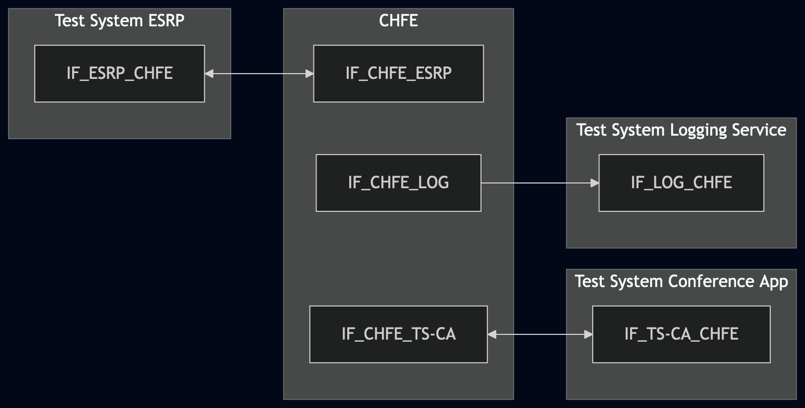
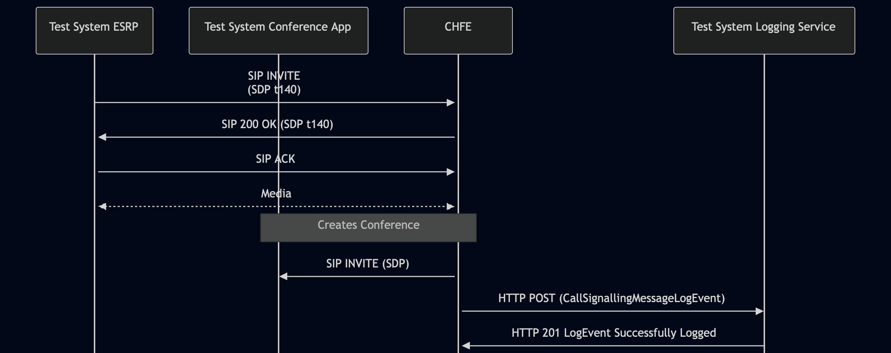

# Test Description: TD_CHFE_010
## Overview
### Summary
Logging CallSignallingMessageLogEvent for outgoing messages

### Description
Test covers logging of CallSignallingMessageLogEvent originated by CHFE(outgoing)

### References
* Requirements : RQ_CHFE_313, RQ_CHFE_314
* Test Case    : TC_CHFE_010

### Requirements
IXIT config file for IUT

### HTTP transport types
Test can be performed with 2 different SIP and HTTP transport types. Steps describing actions for specific one are marked as following:
- (TLS) - used by default inside ESInet on production environment
- (TCP) - used if default TLS is not possible

## Configuration
### Implementation Under Test Interface Connections
<!-- Identify each of the FEs that are part of the configuration and how they are connected -->
* Test System ESRP
  * IF_ESRP_CHFE - connected to IF_CHFE_ESRP
* CHFE
  * IF_CHFE_ESRP - connected to IF_ESRP_CHFE
  * IF_CHFE_TS-CA - connected to IF_TS-CA_CHFE
  * IF_CHFE_LOG - connected to IF_LOG_CHFE
* Test System Conference App
  * IF_TS-CA_CHFE - connected to IF_CHFE_TS-CA
* Test System Logging Service
  * IF_LOG_CHFE - connected to IF_CHFE_LOG

### Test System Interfaces
<!-- Identify each of the test system interfaces and whether it will be in active or monitor mode -->
* Test System ESRP
  * IF_ESRP_CHFE - Active
* CHFE
  * IF_CHFE_ESRP - Active
  * IF_CHFE_LOG - Active
* Test System Conference App
  * IF_TS-CA_CHFE - Active
* Test System Logging Service
  * IF_LOG_CHFE - Active
 
### Connectivity Diagram
<!--
https://mermaid.live/edit#pako:eNqFUmtLwzAU_Svlfu5G32uLCKNuKkwUu09SGLG9a4trUtJUnWP_3Sx1j26i-RDuPTnn3AfZQMoyhBCWK_aRFoQLbfacUE2e--liEj8_LaK76eRqMLiW-S5U4IGhkHk8iMY_FBUruM-ZPd52BBmcPHd3077mnNSFNsdGaPG6EVhpxzrn3XQo0iyhf-gjRpfIkaaojeu653Te5H9WM5bnJc21GPl7mWLPqz-PcvplsCPjdCkXIx7XeQnLQocaoEPOywxCwVvUoUJekV0Kmx0lAVFghQmEMswIf0sgoVupqQl9Yazayzhr8wLCJVk1MmvrjAi8KYnsuDqgcoEZ8oi1VEBom64ygXADnxCatjscOaZl-H5gOKYXjHRYQzjyhr4VOK5jOI5tm4a91eFLlTWGnme5nmkFUuZ5vuSTVrB4TdN9T5iVgvGH7lOqv7n9BoHSxb8
-->



## Pre-Test Conditions
### Test System ESRP/Test System Logging Service/Test System Conference App
* Interfaces are connected to network
* Interfaces have IP addresses assigned by DHCP
* Device is active
* ng911 repository cloned to local storage
* (TLS) Generated own PCA-signed certificate and private key files (test_system.crt, test_system.key)
* (TLS) Certificate and key used by CHFE copied to local storage
* (TLS) PCA certificate copied to local storage

### CHFE
* Interfaces are connected to network
* Interfaces have IP addresses assigned by DHCP
* Device configured to use Logging Service Test System as a Logging Service
* IUT is initialized with steps from IXIT config file
* Device is active
* Device is in normal operating state
* IUT is initialized using IXIT config file

## Test Sequence

### Test Preamble

#### Test System ESRP
* Install SIPp by following steps from documentation[^1]
* Copy following XML scenario file to local storage:
  `SIP_basic_call_with_RTP.xml`
  `g711ulaw_rtp_stream.pcap`
* Install Wireshark[^2]
* (TLS v1.2) Configure Wireshark to decode SIP over TLS, use tests system and IUT certificate keys [^3]
* (TLS v1.3) Configure logging of session keys and configure Wireshark to decode SIP over TLS [^4]
* Using Wireshark on 'Test System' start packet tracing on IF_ESRP_CHFE interface - run following filter:
   * (TLS)
     > ip.addr == IF_ESRP_CHFE_IP_ADDRESS and tls
   * (TCP)
     > ip.addr == IF_ESRP_CHFE_IP_ADDRESS and sip
* Establish basic call from Test System ESRP to CHFE - run SIPp scenario by using following command on Test System ESRP, example:
  * (TLS transport)
    ``` 
    sudo sipp -t l1 -tls_cert test_system.crt -tls_key test_system.key -sf SIP_basic_call_with_RTP.xml 
    IF_CHFE_ESRP_IPv4:5061
    ```
  * (TCP transport)
    ```
    sudo sipp -t t1 -sf SIP_basic_call_with_RTP.xml IF_CHFE_ESRP_IPv4:5060
    ```
    
#### Test System Logging Service
* Install Wireshark[^1]
* (TLS v1.2) Configure Wireshark to decode HTTP over TLS, use tests system and PS certificate keys [^2]
* (TLS v1.3) Configure logging of session keys and configure Wireshark to decode HTTP over TLS [^3]
* Using Wireshark on 'Test System LOG' start packet tracing on IF_LOG_CHFE interface - run following filter:
   * (TLS)
     > ip.addr == IF_LOG_CHFE_IP_ADDRESS and tls
   * (TCP)
     > ip.addr == IF_LOG_CHFE_IP_ADDRESS and http
* The Logging Service must be configured to accept and process HTTP POST requests.
  To verify this manually, you can simulate a listening HTTP endpoint on port 8080 using command in the terminal:
    * Step 1 - Prepare logEventId and JSON body
      ```
      ID="urn:emergency:uid:logid:$(date +%s%N):logger.state.pa.us"
      BODY="{\"logEventId\":\"$ID\"}"
      ```
    * Step 2 - Run server:
      * (TLS)
      ```
      python3 http_entry.py --ip IF_LOG_CHFE --port 8080 --role RECEIVER --path /LogEvents --method POST --body "$BODY" --content_type application/json --response_code 201 --server_cert /tmp/cert.crt --server_key /tmp/cert.key
      ```
      * (TCP)
      ```
      python3 http_entry.py --ip IF_LOG_CHFE --port 8080 --role RECEIVER --path /LogEvents --method POST --body "$BODY" --content_type application/json --response_code 201
      ```
    * Step 3 - In another terminal, send a POST request to verify it is working:
      * (TLS)
      ```
      curl -k -X POST http://localhost:8080 -d '{"log":"test"}'
      ```   
      * (TCP)
      ```
      curl -X POST http://localhost:8080 -d '{"log":"test"}'
      ```   

#### Test System Conference App
* Install SIPp by following steps from documentation[^1]
* Copy following XML scenario file to local storage:
  `SIP_INVITE_RECEIVE.xml`
* Configure SIPp to act as a UAS and receive SIP INVITE messages from CHFE
* Install Wireshark[^2]
* (TLS v1.2) Configure Wireshark to decode SIP over TLS, use tests system and IUT certificate keys [^3]
* (TLS v1.3) Configure logging of session keys and configure Wireshark to decode SIP over TLS [^4]
* Using Wireshark on 'Test System' start packet tracing on IF_TS_CA_CHFE interface - run following filter:
   * (TLS)
     > ip.addr == IF_TS_CA_CHFE_IP_ADDRESS and tls
   * (TCP)
     > ip.addr == IF_TS_CA_CHFE_IP_ADDRESS and sip
* Run SIPp scenario by using following command on Test System Conference App, example:
  * (TLS transport)
    ``` 
    sudo sipp -t l1 -tls_cert test_system.crt -tls_key test_system.key -sf SIP_INVITE_RECEIVE.xml -i IF_TS-CA_CHFE_IPv4 -p 5061
    ```
  * (TCP transport)
    ```
    sudo sipp -t t1 -sf SIP_INVITE_RECEIVE.xml -i IF_TS-CA_CHFE_IPv4 -p 5060
    ```

### Test Body

#### Stimulus
Answer the incoming call on CHFE and perform an Ad Hoc attended call transfer to the Test System Conference App (manually by the user)
#### Response
 Using traced packets on Wireshark verify:
* If CHFE sends HTTP POST to Logging Service Test System(/LogEvents) with JWS body containing:
  * "logEventType": "CallSignalingMessageLogEvent"
  * "timestamp" with correct date-time format (e.g. 2020-03-10T11:00:01-05:00) and date-time match the time when SIP 
    INVITE message has been sent
  * "elementId" which has value with FQDN of CHFE
  * "agencyId" which has value with FQDN of an agency
  * "callId" which has value e.g.: `urn:emergency:uid:callid:1234567890:bcf.ng911.example`. Check:
    * if header field contains "urn:emergency:uid:callid:"
    * if "urn:emergency:uid:callid:" is followed by 10 to 32 alphanumeric characters (String ID)
    * if String ID is followed by ":" and domain name
  * "incidentId" which has value e.g.: `urn:emergency:uid:incidentid:1234567890:bcf.ng911.example`. Check:
    * if header field contains "urn:emergency:uid:incidentid:"
    * if "urn:emergency:uid:incidentid:" is followed by 10 to 32 alphanumeric characters (String ID)
    * if String ID is followed by ":" and domain name
  * "callIdSip" which has value e.g.: `1234567890qwertyuiop@caller.example.com` 
  * "direction" which has value: `outgoing`
  * "text" which has string value containing SIP INVITE message received by Test System Conference App from CHFE
  * (optional) "protocol" field with string value: `sip`
  * (optional) "clientAssignedIdentifier" field with string value
  * (optional) "agencyAgentId" field with string value
  * (optional) "agencyPositionId" field with string value
  * (optional) field "ipAddressPort" with string value representing normalized IP address and port number, or FQDN of 
   another element that participated in the transaction that triggered this LogEvent element 
  * (optional) "extension" field with string value


VERDICT:
* PASSED - CHFE sent CallSignallingMessageLogEvent in the correct format
* FAILED - any other cases


### Test Postamble
#### Test System ESRP
* stop SIPp (if still running)
* stop Wireshark (if still running)
* archive all logs generated
* disconnect interfaces from IUT
* (TLS) remove certificates

#### Test System Logging Service
* stop Wireshark (if still running)
* archive all logs generated
* disconnect interfaces from IUT
* (TLS) remove certificates

#### CHFE
* restore default configuration
* disconnect interfaces from Test Systems
* reconnect interfaces back to default

## Post-Test Conditions
### Test System ESRP/Test System Logging Service/Tets System Conference App
* Test tools stopped
* interfaces disconnected from IUT

### CHFE
* device connected back to default
* device in normal operating state

## Sequence Diagram
<!--
https://mermaid.live/edit#pako:eNp9k1FvmzAQx7_KyU-tBh1QQogVRYpopkZdWjRQHyZePLhQNLCZMdGyKN99BkYatV3EA_j4__53Pt0dSCoyJJSYppnwVPBtkdOEA1SFlEIuUyVkQ2HLygYT3osa_NUiT_GuYLlkVScGqJlURVrUjCuIsVEQ7RuFFayib-FlRaBzouwMYVnX77XB_ZdVwof4W2dzsfjU_acQrUNYPz6v49X8h_y8gKvoLgRlu9b1QHaqTv3WYSAdy4Knh3fQB-n6bB2yDB4-Fs3n5qiDDWYFG4t_FApB7FD2xRj_7wGFQCJT2JzFB4uzm1zCX5vRX-n6IvxV5HnBc4hQ7ooUKdzHcQjhUxTDVcDKMipyrl9assGmYTlqYLVDrs5sL_idetHbOpYNIw9Rm6bactuW5b7HMDtZdk0jBsllkRGqZIsGqVBWrDuSQydLiHrBChNC9WfG5M-EJPyoGT0134WoRkyKNn8htJ9gg7R1pjv7b3RPUd27DGUgWq4IdS23NyH0QH4Tat_aNzPXcTzHm_nTmTOdGGQ_hL2JNbHdiT-b-p47PRrkT5_XuvFd_fjWrePbU9-1PIOwVoloz9OxKj0YerM2w-71K3j8C7OiGuo
-->



## Comments

Version:  010.3f.5.0.0

Date:     20260421

## Footnotes
[^1]: SIPp - tool for SIP packet simulations. Official documentation: https://sipp.sourceforge.net/doc/reference.html#Getting+SIPp
[^2]: Wireshark - tool for packet tracing and anaylisis. Official website: https://www.wireshark.org/download.html
[^3]: Wireshark configuration to decrypt TLS packets: https://www.zoiper.com/en/support/home/article/162/How%20to%20decode%20SIP%20over%20TLS%20with%20Wireshark%20and%20Decrypting%20SDES%20Protected%20SRTP%20Stream
[^4]: TLS v1.3 session keys logging + Wireshark configuration to decrypt traffic: https://my.f5.com/manage/s/article/K50557518
