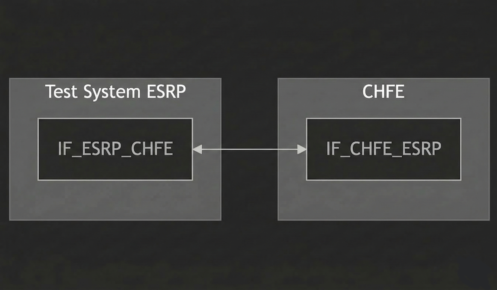
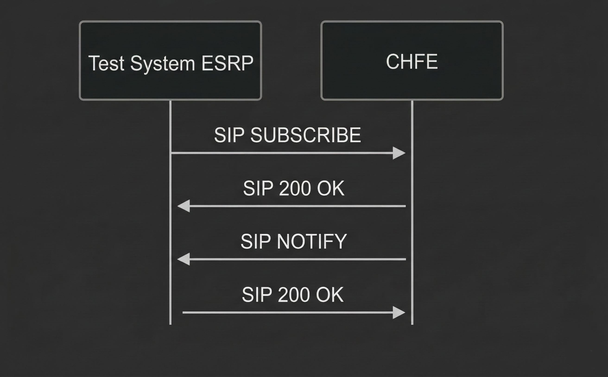

# Test Description: TD_CHFE_012

## Overview
### Summary
The PSAP MUST implement a QueueState notifier

### Description
This test checks if CHFE has implemented a QueueState notifier for all queues it manages. The NOTIFY body must contain all mandatory fields and must not include the "unreachable" state value.

### References
* Requirements : RQ_CHFE_020
* Test Case    : TC_CHFE_012

### Requirements
IXIT config file for CHFE

### SIP transport types
Test can be performed with 2 different SIP transport types. Steps describing actions for specific one are marked as following:
- (TLS transport) - should be used by default
- (TCP transport) - used in lab for testing purposes only if default TLS is not possible

## Configuration
### Implementation Under Test Interface Connections
<!-- Identify each of the FEs that are part of the configuration and how they are connected -->
* Test System
  * IF_ESRP_CHFE - connected to IF_CHFE_ESRP
* CHFE
  * IF_CHFE_ESRP - connected to IF_ESRP_CHFE

### Test System ESRP
<!-- Identify each of the test system interfaces and whether it will be in active or monitor mode -->
* Test System
  * IF_ESRP_CHFE - Active
* CHFE
  * IF_CHFE_ESRP - Active

### Connectivity Diagram




## Pre-Test Conditions
### Test System
* Interfaces are connected to network
* Interfaces have IP addresses assigned by DHCP
* Device is active
* ng911 repository cloned to local storage
* (TLS) Generated own PCA-signed certificate and private key files (test_system.crt, test_system.key)
* (TLS) Certificate and key used by CHFE copied to local storage
* (TLS) PCA certificate copied to local storage

### CHFE
* Interfaces are connected to network
* Interfaces have IP addresses assigned by DHCP
* IUT is active
* IUT is in normal operating state
* Default configuration is loaded
* IUT is initialized using IXIT config file
* Queue length and number of permitted dequeuers must be higher than 1
* Device is provisioned with policy allowing to subscribe for QueueState from Test System
* Agent logged in (e.g. tester@psap.example.com)

## Test Sequence

### Test Preamble

#### Test System
* Install SIPp by following steps from documentation[^1]
* Copy following XML scenario file to local storage:
  `SIP_SUBSCRIBE_QueueState.xml`
* Install Wireshark[^2]
* (TLS v1.2) Configure Wireshark to decode SIP over TLS, use test system and FE certificate keys[^3]
* (TLS v1.3) Configure logging of session keys and configure Wireshark to decode SIP over TLS[^4]
* Using Wireshark on 'Test System' start packet tracing on IF_ESRP_CHFE interface - run following filter:
   * (TLS)
     > ip.addr == IF_ESRP_CHFE_IP_ADDRESS and tls
   * (TCP)
     > ip.addr == IF_ESRP_CHFE_IP_ADDRESS and sip

### Test Body

QueueState - scenario file: `SIP_SUBSCRIBE_QueueState.xml`

#### Stimulus

Send SIP SUBSCRIBE to CHFE - run following SIPp command on Test System ESRP for all CHFE queues, example:
  * (TCP transport)
    > sudo sipp -t t1 -sf SIP_SUBSCRIBE_QueueState.xml -i IF_ESRP_CHFE_IP_ADDRESS -p 5060 -bind_local -s CHFE_QUEUE_NAME IF_CHFE_ESRP_IP_ADDRESS:5060 -timeout 10
  * (TLS transport)
    > sudo sipp -t l1 -tls_cert test_system.crt -tls_key test_system.key -sf SIP_SUBSCRIBE_QueueState.xml -i IF_ESRP_CHFE_IP_ADDRESS -p 5061 -bind_local  -s CHFE_QUEUE_NAME IF_CHFE_ESRP_IP_ADDRESS:5061 -timeout 10

#### Response

* CHFE responds with 200 OK for SIP SUBSCRIBE
* CHFE sends SIP NOTIFY with the same event as requested in SIP SUBSCRIBE (`emergency-QueueState`)
* SIP NOTIFY contains the following mandatory fields in JSON body:
  - `queueUri` which is a SIP URI of the queue
  - `queueLength` which is an integer indicating the current number of calls in the queue
  - `queueMaxLength` which is an integer indicating the maximum length of the queue
  - `state` which is one of:
    ```
    Active
    Inactive
    Disabled
    ```
* The `state` field value MUST NOT be `unreachable`

VERDICT:
* PASSED - if CHFE responded as expected
* FAILED - any other cases

### Test Postamble
#### Test System
* stop all SIPp processes (if still running)
* archive all logs generated
* stop Wireshark (if still running)
* remove ng911 repository files
* disconnect interfaces from CHFE
* (TLS) remove certificates

#### CHFE
* disconnect IF_CHFE_ESRP
* reconnect interfaces back to default
* restore previous configuration

## Post-Test Conditions
### Test System
* Test tools stopped
* interfaces disconnected from CHFE

### CHFE
* device connected back to default
* device in normal operating state

## Sequence Diagram




## Comments

Version:  010.3f.5.0.6

Date:     20260507

## Footnotes
[^1]: SIPp - tool for SIP packet simulations. Official documentation: https://sipp.sourceforge.net/doc/reference.html#Getting+SIPp
[^2]: Wireshark - tool for packet tracing and analysis. Official website: https://www.wireshark.org/download.html
[^3]: Wireshark configuration to decrypt TLS packets: https://www.zoiper.com/en/support/home/article/162/How%20to%20decode%20SIP%20over%20TLS%20with%20Wireshark%20and%20Decrypting%20SDES%20Protected%20SRTP%20Stream
[^4]: TLS v1.3 session keys logging + Wireshark configuration to decrypt traffic: https://my.f5.com/manage/s/article/K50557518