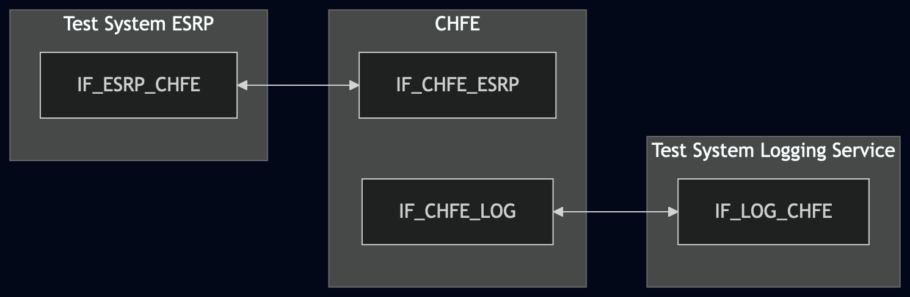
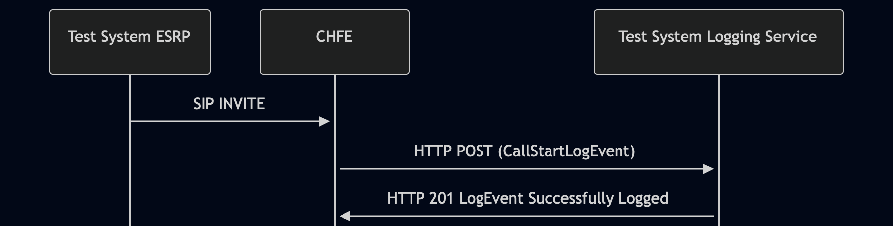

# Test Description: TD_CHFE_013

<!-- MULTIPLE TDs already exist - review & consolidate
 Existing TD(s) - TD_CHFE_013 (from RQ_CHFE_405 / CHFE); TD_ECRF-LVF_007 (from RQ_ECRF-LVF_103 / ECRF-LVF); TD_ESRP_015 (from RQ_ESRP_193 / ESRP) -->

## Overview
### Summary
Verification of JSON Web Signature (JWS) format used in LogEvents sent by CHFE

### Description
Test covers that CHFE, when sending LogEvents to the Logging Service, uses:
* flat JSON serialization format for JWS 
* EdDSA algorithm with Curve448 for signed LogEvents, OR algorithm "none" for unsigned LogEvents 

### References
* Requirements : RQ_CHFE_405
* Test Case    : TC_CHFE_013

### Requirements
IXIT config file for IUT

### HTTP transport types
Test can be performed with 2 different SIP and HTTP transport types. Steps describing actions for specific one are marked as following:
- (TLS) - used by default inside ESInet on production environment
- (TCP) - used if default TLS is not possible

## Configuration
### Implementation Under Test Interface Connections
<!-- Identify each of the FEs that are part of the configuration and how they are connected -->
* Test System ESRP
  * IF_ESRP_CHFE - connected to IF_CHFE_ESRP
* CHFE
  * IF_CHFE_ESRP - connected to IF_ESRP_CHFE
  * IF_CHFE_LOG - connected to IF_LOG_CHFE
* Test System Logging Service
  * IF_LOG_CHFE - connected to IF_CHFE_LOG

### Test System Interfaces
<!-- Identify each of the test system interfaces and whether it will be in active or monitor mode -->
* Test System ESRP
  * IF_ESRP_CHFE - Active
* CHFE
  * IF_CHFE_ESRP - Active
  * IF_CHFE_LOG - Active
* Test System Logging Service
  * IF_LOG_CHFE - Active
 
### Connectivity Diagram
<!--
https://mermaid.live/edit#pako:eNp9UtFOwjAU_ZXlPg_SjbFujfEFQU0wGuaTWULqdtkWWUu6TkXCv9t1AqLGPjT3nJ577rlJd5DJHIHBai3fspIr7cwXqXDMuZ0tp8niYTm5mU0vBoNLg7vSkkeFZeb3118CU1mqf-_vpn0uFN-UziM22km2jcbaOZn8HNWzKPJU_NM_l0VRicJJUL1WGZ5ZnYewTn-kOSm-r_Ir12HBoxm4UKgqB6ZViy7UqGreQdh1khR0iTWmwEyZc_WSQir2pmfDxZOU9aFNybYoga34ujGo3eRc41XFTbT6yCozDdVEtkIDo571ALaDd2DeKBiO4xGhcRBGJPD8yIUtsJAOQ58YREYxDWgY7V34sFPJMIzDwKc08n3PGxNi7HirZbIV2SET5pWW6q7_D_Zb7D8B7fWfqg
-->



## Pre-Test Conditions
### Test System ESRP/Test System Logging Service
* Interfaces are connected to network
* Interfaces have IP addresses assigned by DHCP
* Device is active
* ng911 repository cloned to local storage
* (TLS) Generated own PCA-signed certificate and private key files (test_system.crt, test_system.key)
* (TLS) Certificate and key used by CHFE copied to local storage
* (TLS) PCA certificate copied to local storage

### CHFE
* Interfaces are connected to network
* Interfaces have IP addresses assigned by DHCP
* Device configured to use Logging Service Test System as a Logging Service
* IUT is initialized with steps from IXIT config file
* Device is active
* Device is in normal operating state
* IUT is initialized using IXIT config file

## Test Sequence
### Test Preamble

#### Test System ESRP
* Install SIPp by following steps from documentation[^1]
* Copy following XML scenario file to local storage:
  `SIP_basic_call_with_RTP.xml`
  `g711ulaw_rtp_stream.pcap`
* Install Wireshark[^2]
* (TLS v1.2) Configure Wireshark to decode SIP over TLS, use tests system and IUT certificate keys [^3]
* (TLS v1.3) Configure logging of session keys and configure Wireshark to decode SIP over TLS [^4]
* Using Wireshark on 'Test System' start packet tracing on IF_ESRP_CHFE interface - run following filter:
   * (TLS)
     > ip.addr == IF_ESRP_CHFE_IP_ADDRESS and tls
   * (TCP)
     > ip.addr == IF_ESRP_CHFE_IP_ADDRESS and sip

#### Test System Logging Service
* Install Wireshark[^2]
* Install OpenSSL v1.1.1 or higher[^5].
* (TLS v1.2) Configure Wireshark to decode HTTP over TLS, use tests system and CHFE certificate keys [^3]
* (TLS v1.3) Configure logging of session keys and configure Wireshark to decode HTTP over TLS [^4]
* Using Wireshark on 'Test System' start packet tracing on IF_LOG_CHFE interface - run following filter:
   * (TLS)
     > ip.addr == IF_LOG_CHFE_IP_ADDRESS and tls
   * (TCP)
     > ip.addr == IF_LOG_CHFE_IP_ADDRESS and http
* The Logging Service must be configured to accept and process HTTP POST requests. To verify this manually, you can simulate a listening HTTP endpoint on port 8080 using command in the terminal:
    * Step 1 - Prepare logEventId and JSON body
      ```
      ID="urn:emergency:uid:logid:$(date +%s%N):logger.state.pa.us"
      BODY="{\"logEventId\":\"$ID\"}"
      ```
    * Step 2 - Run server:
      * (TLS)
      ```
      python3 http_entry.py --ip IF_LOG_CHFE --port 8080 --role RECEIVER --path /LogEvents --method POST --body "$BODY" --content_type application/json --response_code 201 --server_cert /tmp/cert.crt --server_key /tmp/cert.key
      ```
      * (TCP)
      ```
      python3 http_entry.py --ip IF_LOG_CHFE --port 8080 --role RECEIVER --path /LogEvents --method POST --body "$BODY" --content_type application/json --response_code 201
      ```
    * Step 3 - In another terminal, send a POST request to verify it is working:
      * (TLS)
      ```
      curl -k -X POST http://localhost:8080 -d '{"log":"test"}'
      ```   
      * (TCP)
      ```
      curl -X POST http://localhost:8080 -d '{"log":"test"}'
      ```   

### Test Body

#### Stimulus
* Run SIPp scenario by using following command on Test System ESRP, example:
  * (TLS transport)
    ``` 
    sudo sipp -t l1 -i IF_ESRP_CHFE_IPv4 -p 5061 -bind_local -tls_cert test_system.crt -tls_key test_system.key -sf 
    SIP_basic_call_with_RTP.xml IF_CHFE_ESRP_IPv4:5061
    ```
  * (TCP transport)
    ```
    sudo sipp -t t1 -i IF_ESRP_CHFE_IPv4 -p 5060 -bind_local -sf SIP_basic_call_with_RTP.xml IF_CHFE_ESRP_IPv4:5060
    ```
#### Response
 Using traced packets on Wireshark verify:
* If CHFE sends HTTP POST to Test System Logging Service with JWS body containing FLat JSON Serialization Format:
  * The body MUST be a JSON object containing exactly the following top-level fields (and no others from the 
    alternative formats):
    * "protected" - a Base64url-encoded string (the JWS Protected Header);
    * "payload" - a Base64url-encoded string (the LogEvent content);
    * "signature" - a Base64url-encoded string (the digital signature or empty string if unsigned).
    
    Correct example:
    ```
    {
       "protected": "eyJhbGciOiJFZERTQSJ9",
       "payload": "eyJsb2dFdmVudFR5cGUiOiAiLi4uIn0",
       "signature": "BASE64URL_SIGNATURE_VALUE"
    }
    ```
  * JWS body does NOT use:
    * JWS Compact Serialization - which would appear as a single dot-delimited string in the 
      format 
      ``` 
      BASE64URL.BASE64URL.BASE64URL
      ```
    * General JWS JSON Serialization - which would contain a "signatures" array field (plural)
  * The "payload" field decoded from Base64url contains a valid LogEvent JSON object (e.g. a CallStartLogEvent, MediaStartLogEvent, or other event type as appropriate for the triggered stimulus). This confirms the JWS wraps actual LogEvent content
  * Decode the "protected" field from Base64url and parsed JSON contains one "alg" field with one of value:
    * "EdDSA" - if the Logging Service policy requires signed LogEvents;
    * "none" - if the Logging Service policy permits unsigned LogEvents.
  * If "protected" contain "alg": "EdDSA":
    * check if "signature" contains string value
    * using PCA-signed key file used by CHFE verify if JWS object is properly signed, use decode_jws method, example command:
      
    ```
           python3 -m main decode_jws JWS_FILE_PATH --key CHFE.key --password pass123
    ```

    * verify if method did not return any decoding errors
    * verify if key file used by CHFE for JWS signing is Edwards-curve Digital Signature Algorithm (ECDSA) with Curve448, run example command:

    ```
    openssl pkey -in CHFE.key -text -noout
    ```

    Command must return "ED448", example:

    ```
    ED448 Private-Key:
    priv:
        cb:18:b3:9a:3a:09:ba:87:ad:86:79:0c:84:08:79:
        2a:16:31:76:19:a1:0f:92:1e:11:e5:7f:2c:7a:01:
        66:7e:f8:2a:04:47:8a:da:25:c2:c8:99:3a:52:20:
        37:54:a5:ea:d9:1d:a0:70:29:d8:3b:20
    pub:
        07:cc:7b:cc:d0:ff:e6:1c:79:fc:65:df:18:fc:f2:
        89:15:db:68:6a:08:2c:b6:7d:20:45:e8:81:64:b6:
        4c:8f:62:f1:63:df:f5:b3:38:ea:14:d4:28:0a:2b:
        88:62:7d:32:ed:c3:ab:8d:fc:a3:e0:80
    ```
  * If "protected" contain "alg": "none":
    * check that "signature" is empty

VERDICT:
* PASSED - if all checks passed
* FAILED - any other cases


### Test Postamble
#### Test System ESRP
* stop SIPp (if still running)
* stop Wireshark (if still running)
* archive all logs generated
* disconnect interfaces from IUT
* (TLS) remove certificates

#### Test System Logging Service
* stop Wireshark (if still running)
* archive all logs generated
* disconnect interfaces from IUT
* (TLS) remove certificates

#### CHFE
* restore default configuration
* disconnect interfaces from Test Systems
* reconnect interfaces back to default

## Post-Test Conditions
### Test System ESRP/Test System Logging Service
* Test tools stopped
* interfaces disconnected from IUT

### CHFE
* device connected back to default
* device in normal operating state

## Sequence Diagram
<!--
https://mermaid.live/edit#pako:eNptkU1Pg0AQhv_KZk4aoaGAfOyhiamYNvGDuMSD4bKBKSXCbl2WRmz63wUq1hj3tDP7vO_MzhwgkzkCBdM0U5FJsSkLmgpC6lIpqW4yLVVDyYZXDaZihBp8b1FkeFvyQvF6gE8nwUYT1jUaaxKx59hcLK6Wq7uIEraOyfrxZZ1EZ3p4GYjfqntZFKUoCEO1LzOkZJUkMYmfWEIulryqmOZK91C0R6Ev_6_8x-PcxOhlW3MyGRDWZhk2zaatqm7UYf7tCQYUqsyBatWiATWqmg8hHAYgBb3FGlOg_TXn6i2FVBx7zY6LVynrSaZkW2yBjsMzoN3lXE9T-8kqFDmqpWyFBjr3Rg-gB_joI8edXYeO5YeuF1ju3A4M6IB6_szrv2EHlhP6ru8FRwM-x6rWzAs91_Z9z762Aie0bQN4qyXrRDb1hHnZr_ThtPRx98cvaqKfvA
-->



## Comments

Version:  010.3f.5.0.2

Date:     20260525

## Footnotes
[^1]: SIPp - tool for SIP packet simulations. Official documentation: https://sipp.sourceforge.net/doc/reference.html#Getting+SIPp
[^2]: Wireshark - tool for packet tracing and anaylisis. Official website: https://www.wireshark.org/download.html
[^3]: Wireshark configuration to decrypt TLS packets: https://www.zoiper.com/en/support/home/article/162/How%20to%20decode%20SIP%20over%20TLS%20with%20Wireshark%20and%20Decrypting%20SDES%20Protected%20SRTP%20Stream
[^4]: TLS v1.3 session keys logging + Wireshark configuration to decrypt traffic: https://my.f5.com/manage/s/article/K50557518
[^5]: OpenSSL v1.1.1 or higher - toolkit required for TLS operations and certificate/key handling. Official website and downloads: https://www.openssl.org/source/ . Installation documentation: https://github.com/openssl/openssl/blob/master/INSTALL.md
