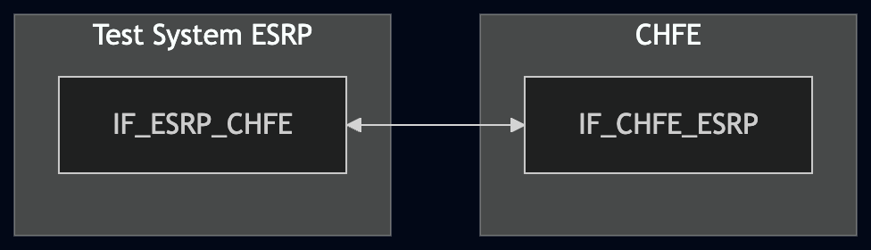
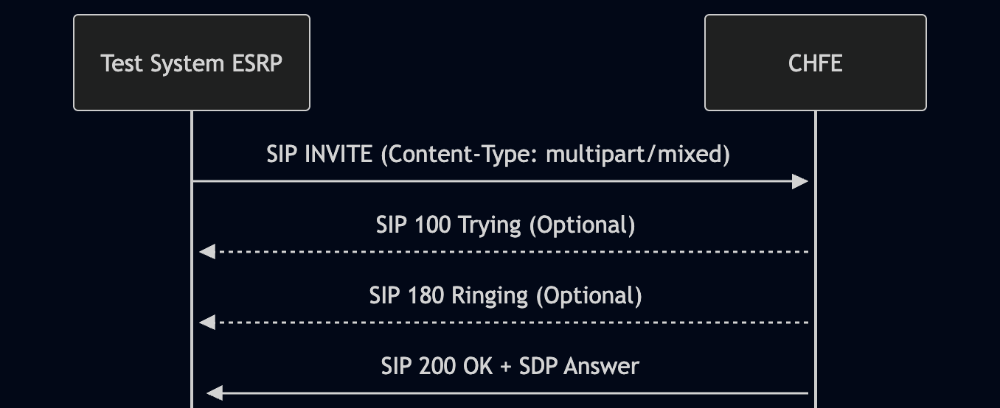

# Test Description: TD_CHFE_014
## Overview
### Summary
Multipart/mixed MIME support for SIP INVITE

### Description
The test ensures that CHFE supports complex multipart/mixed message bodies as defined in RFC 2046

### References
* Requirements : RQ_CHFE_406
* Test Case    : TC_CHFE_014

### Requirements
IXIT config file for CHFE

### SIP transport types
Test can be performed with 2 different SIP transport types. Steps describing actions for specific one are marked as following:
- (TLS transport) - should be used by default
- (TCP transport) - used in lab for testing purposes only if default TLS is not possible

## Configuration
### Implementation Under Test Interface Connections
* Test System ESRP
  * IF_ESRP_CHFE - connected to IF_CHFE_ESRP
* CHFE
  * IF_CHFE_ESRP - connected to IF_ESRP_CHFE

### Test System Interfaces
* Test System ESRP
  * IF_ESRP_CHFE - Active
* CHFE 
  * IF_CHFE_ESRP - Active
 
### Connectivity Diagram


<!--
[](https://mermaid.live/edit#pako:eNpdUN1OgzAUfhVyrhkprFDWGG_mFk00MZtXhmSp0AFxtKS0USS8y55lT2YBRbNe9fvrd3o6SGXGgUIijif5kRZMaedxlwjHnoftYbPfPR_W99vN5XyzWNxaZgAjfTknYvI15i1XrC6cF95oZ982mlfOYJnk66cmlovsKv2n_STmqjkBLuSqzIBqZbgLFVcVGyB0gyUBXfCKJ0DtNWPqPbHf6m2mZuJVygrokZ0am1PS5MWMTJ0xze9KZsf457F1XK2lERpo6LvAjJb7VqS_5TwrtVRP0_rGLY5FQDv4BLoMsBesMFoSHBAf-zhyoQUaRx72o4Agn8QYW7F34WscDXkE-wiFMQlRGJEArfpvHTp8uQ)
-->

## Pre-Test Conditions
### Test System ESRP
* Interfaces are connected to network
* Interfaces have IP addresses assigned by DHCP
* Device is active
* ng911 repository cloned to local storage
* (TLS) Generated own PCA-signed certificate and private key files (test_system_NAME.crt, test_system_NAME.key)
* (TLS) Certificates and keys used by other devices copied to local storage
* (TLS) PCA certificate copied to local storage

### CHFE 
* Interfaces are connected to network
* Interfaces have IP addresses assigned by DHCP
* IUT is active
* IUT is in normal operating state
* Default configuration is loaded
* IUT is initialized using IXIT config file 
* IUT has configured tel numbers from which calls are accepted and auto-answered
* Test System ESRP configured as default ESRP
* Agent logged in (f.e. tester@psap.example.com)

## Test Sequence

### Test Preamble

#### Test System ESRP, CHFE
* Install SIPp by following steps from documentation[^1]
* Copy following XML scenario files to local storage:
 > SIP_INVITE_from_ESRP_with_single_multipart_mixed_SDP_only.xml
 > SIP_INVITE_from_ESRP_with_complex_multipart_mixed_SDP_PIDFLO_AddData_NGAACN.xml
 > SIP_INVITE_from_ESRP_with_nested_multipart_mixed.xml
* Install Wireshark[^2]
* (TLS v1.2) Configure Wireshark to decode SIP over TLS, use tests system and IUT certificate keys [^3]
* (TLS v1.3) Configure logging of session keys and configure Wireshark to decode SIP over TLS [^4]
* Using Wireshark on 'Test System' start packet tracing on IF_ESRP_CHFE interface - run following filter:
   * (TLS)
     > ip.addr == IF_ESRP_CHFE_IP_ADDRESS and tls
   * (TCP)
     > ip.addr == IF_ESRP_CHFE_IP_ADDRESS and sip

### Test Body

#### Variations

1. SIP INVITE with a `multipart/mixed` body containing exactly one SDP part

Use SIPp scenario: `SIP_INVITE_from_ESRP_with_single_multipart_mixed_SDP_only.xml`

2. SIP INVITE with a `multipart/mixed` body containing a comprehensive set of emergency metadata: 1x SDP, 1x PIDF-LO XML, 3x Additional Data XML blocks (RFC 7852), 1x NG-AACN Control block and 1x VEDS Crash Data block.

Use SIPp scenario: `SIP_INVITE_from_ESRP_with_complex_multipart_mixed_SDP_PIDFLO_AddData_NGAACN.xml`

3. SIP INVITE with a nested `multipart/mixed` configuration where a MIME container is embedded inside another MIME container.

Use SIPp scenario: `SIP_INVITE_from_ESRP_with_nested_multipart_mixed.xml`

#### Stimulus

Simulate basic call from Test System ESRP to CHFE - run SIPp scenario by using following command on Test System ESRP, example:
* (TCP transport)
  ```
  sudo sipp -t t1 -sf SIPP_SCENARIO_FILE IF_CHFE_ESRP_IPv4:5060
  ```
* (TLS transport)
  ```
  sudo sipp -t l1 -tls_cert test_system.crt -tls_key test_system.key -sf SIPP_SCENARIO_FILE IF_CHFE_ESRP_IPv4:5060
  ```

#### Response
* (optional) The CHFE responds with SIP 100 Trying back to the Test System ESRP
* (optional) The CHFE responds with SIP 180 Ringing back to the Test System ESRP
* The CHFE responds with SIP 200 OK back to the Test System ESRP 
 
VERDICT:
* PASSED - if CHFE responded as expected
* FAILED - any other cases

### Test Postamble
#### Test System ESRP
* stop all SIPp processes (if still running)
* archive all logs generated
* stop Wireshark (if still running)
* remove ng911 repository files
* disconnect interfaces from CHFE

#### CHFE
* disconnect IF_CHFE_ESRP
* reconnect interfaces back to default

## Post-Test Conditions 
### Test System ESRP
* Test tools stopped
* interfaces disconnected from CHFE

### CHFE
* device connected back to default
* device in normal operating state

## Sequence Diagram



<!--
[](https://mermaid.live/edit#pako:eNqNkU9r4zAUxL_K451aaqeW4z-xDoWQZmko3YY69FB8EfaLKzaSXFmm9YZ897UduoWFwt70YH4zYuaIpakIOfq-X-jS6L2seaEBlLTW2GXpjG057MWhpUJPopbeOtIl3UpRW6FGMcCOWgd53zpSsM6ftv7NzdXq7seaQ77Zwubn82a3houV0Y6083d9QxxUd3CyEdZdK_lB1eXZaaT8Ef_X8mzFggB2tpe6hovHxkmjxeE_yUUATwP3LfotGQ6Zj_dwBfntFpa6fSeLHtZWVsid7chDRVaJ8cTjaFigeyVFBfLhWQn7q8BCnwamEfrFGIV8KtRDa7r69e_VNZVwn71-aUhXZFem0w45i0IPRedM3uvyM50qOcz0cB5y2nNKQn7EjwFJshmLWTCPsihjUZLGHvbIo2CWpXEYD7Uk2SJNWHzy8Pf0uWCWsnTO4iSdL8IFC-PTH2EgqVM)
-->

## Comments

Version:  010.3d.5.0.1

Date: 20260722

## Footnotes
[^1]: SIPp - tool for SIP packet simulations. Official documentation: https://sipp.sourceforge.net/doc/reference.html#Getting+SIPp
[^2]: Wireshark - tool for packet tracing and analysis. Official website: https://www.wireshark.org/download.html
[^3]: Wireshark configuration to decrypt TLS packets: https://www.zoiper.com/en/support/home/article/162/How%20to%20decode%20SIP%20over%20TLS%20with%20Wireshark%20and%20Decrypting%20SDES%20Protected%20SRTP%20Stream
[^4]: TLS v1.3 session keys logging + Wireshark configuration to decrypt traffic: https://my.f5.com/manage/s/article/K50557518
