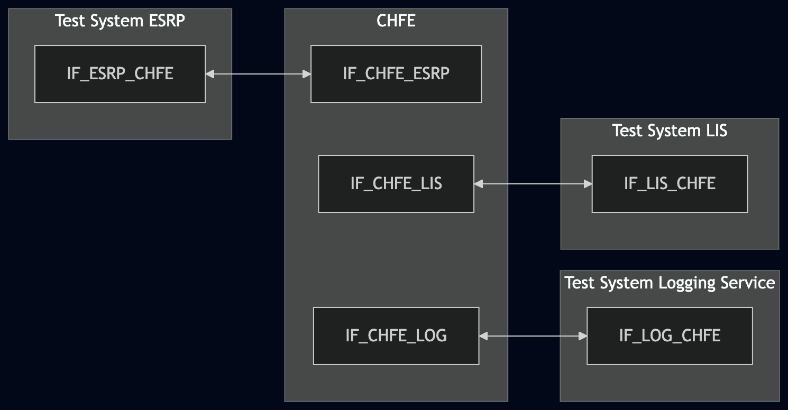
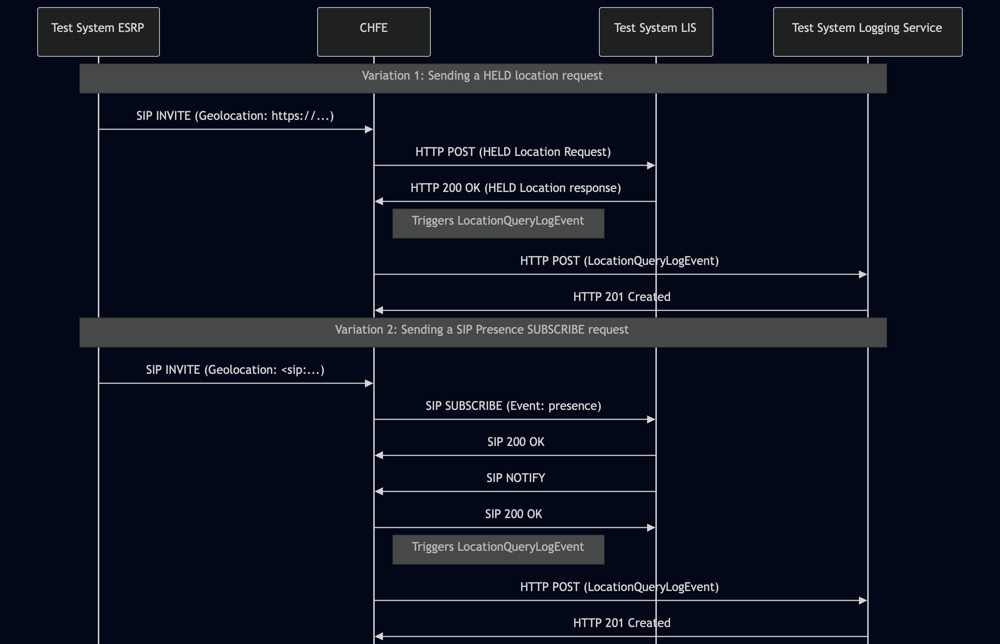

# Test Description: TD_CHFE_015
## Overview
### Summary
Sending LocationQueryLogEvent for HELD and SIP location requests

### Description
The test ensures that if the CHFE generates and sends a `LocationQueryLogEvent` to the Logging Service with the payload containing all mandatory members formatted in accordance with the standard.

### References
* Requirements : RQ_CHFE_367
* Test Case    : TC_CHFE_???

### Requirements
IXIT config file for CHFE 

### HTTP and SIP transport types
Test can be performed with 2 different SIP and HTTP transport types. Steps describing actions for specific one are marked as following:
- (TLS transport) - should be used by default
- (TCP transport) - used in lab for testing purposes only if default TLS is not possible

## Configuration
### Implementation Under Test Interface Connections
* Test System ESRP
  * IF_ESRP_CHFE - connected to IF_CHFE_ESRP
* CHFE
  * IF_CHFE_ESRP - connected to IF_ESRP_CHFE
  * IF_CHFE_LIS - connected to IF_LIS_CHFE
  * IF_CHFE_LOG - connected to IF_LOG_CHFE
* Test System LIS
  * IF_LIS_CHFE - connected to IF_CHFE_LIS
* Test System Logging Service
  * IF_LOG_CHFE - connected to IF_CHFE_LOG

### Test System Interfaces
* Test System ESRP
  * IF_ESRP_CHFE - Active
* CHFE
  * IF_CHFE_ESRP - Active
  * IF_CHFE_LOG - Active
  * IF_CHFE_LIS - Active
* Test System LIS
  * IF_LIS_CHFE - Active
* Test System Logging Service
  * IF_LOG_CHFE - Active

### Connectivity Diagram
<!--
https://mermaid.live/edit#pako:eNqFUstuwjAQ_JVozwEl5OFiVb1QaJGoWpGeqkjITZYkKrGR47SliH-vYxog9LUHa3d2d2ZseQuJSBEoLFfiLcmZVNZsHnNLx3SyGEfzh8XodjK-7PWudN2kBjxMGGR2f_M1oDMDnfWnUdufRif9_VnVz5lk69x6xEpZ0aZSWFpHkXMrexR5GvM_9mciywqeWRHK1yLBDlXXpGH6x4223WXoXOM3huPE6WN8u1n7hD-AraxWABsyWaRAlazRhhJlyZoSts1IDCrHEmOgOk2ZfIkh5ju9s2b8SYgS6JKtKr0nRZ3lh6pep0zhdcG04ZMZLYdyJGqugLqeDaxWItrwpBXHtFBC3u0_jvk_RgjoFt71xsDve447JEO3CeJrhg3Q4KLvOIOQuI5HPNch_s6GD2PN6ZMgIG4Y6HYY-sTzd58PksCR
-->


## Pre-Test Conditions
### Test System ESRP/Test System Logging Service/Test System LIS
* Interfaces are connected to network
* Interfaces have IP addresses assigned by DHCP
* Device is active
* ng911 repository cloned to local storage
* (TLS) Generated own PCA-signed certificate and private key files (test_system.crt, test_system.key)
* (TLS) Certificate and key used by CHFE copied to local storage
* (TLS) PCA certificate copied to local storage

### CHFE
* Interfaces are connected to network
* Interfaces have IP addresses assigned by DHCP
* IUT is configured to use Test System Logging Service as a Logging Service
* IUT is configured to use Test System LIS for location dereference by default
* IUT is initialized with steps from IXIT config file
* IUT is active
* IUT is in normal operating state
* No active calls

## Test Sequence
### Test Preamble

#### Test System ESRP
* Install SIPp by following steps from documentation[^1]
* Copy following XML scenario file to local storage:

  `SIP_INVITE_geolocation_HELD.xml`

  `SIP_INVITE_geolocation_SIP.xml`

* For SIP_INVITE_geolocation_HELD.xml replace LIS_LOCATION_REFERENCE_URL with URL to the Test System LIS, e.g. https://lis.ng911.dev.lab:4443/location
* For SIP_INVITE_geolocation_SIP.xml replace LOCATION_SIP_URI with SIP URI to the Test System LIS, e.g. sip:location@lis.ng911.dev.lab:5060
* Install Wireshark[^2]
* (TLS v1.2) Configure Wireshark to decode SIP over TLS, use tests system and IUT certificate keys [^3]
* (TLS v1.3) Configure logging of session keys and configure Wireshark to decode SIP over TLS [^4]
* Using Wireshark on 'Test System' start packet tracing on IF_ESRP_CHFE interface - run following filter:
   * (TLS)
     > ip.addr == IF_ESRP_CHFE_IP_ADDRESS and tls
   * (TCP)
     > ip.addr == IF_ESRP_CHFE_IP_ADDRESS and sip

#### Test System LIS
* Install SIPp by following steps from documentation[^1]
* Copy following HTTP and SIP scenario files and scripts to local storage:
  ```
  Location_response
  
  SIP_SUBSCRIBE_LIS.xml
  ```
* Install Wireshark[^2]
* (TLS v1.2) Configure Wireshark to decode SIP and HTTP over TLS, use test system and CHFE certificate keys [^3]
* (TLS v1.3) Configure logging of session keys and configure Wireshark to decode SIP and HTTP over TLS [^4]
* Using Wireshark on 'Test System LIS' start packet tracing on IF_LIS_CHFE interface - run following filter:
   * (TLS)
     > ip.addr == IF_LIS_CHFE_IP_ADDRESS and tls
   * (TCP)
     > ip.addr == IF_LIS_CHFE_IP_ADDRESS and (http or sip)
* Depending on current variation use one of following scenario files:
  * Variation 1 (HELD dereference)
    Start HTTP server responding to the ESRP's HTTP POST with the `Location_response` (PIDF-LO) body.
    `--path` MUST match the path component of `LIS_LOCATION_REFERENCE_URL` in `SIP_INVITE_geolocation_HELD.xml`
    Replace the example below with your configured value(e.g. if that URL is `https:// IF_LIS_ESRP_IP_ADDRESS:443/heldLocationRequest`, then `--path /heldLocationRequest`):
    * (TLS):
    ```
    python3 http_entry.py --ip IF_LIS_CHFE --port 443 --role RECEIVER --path /heldLocationRequest --method POST \
    --body Location_response --content_type application/held+xml --response_code 200 --server_cert PCA-cacert.pem --server_key PCA-cakey.pem
    ``` 
    * (TCP):
    ```
    python3 http_entry.py --ip IF_LIS_CHFE --port 80 --role RECEIVER --path /heldLocationRequest --method POST \
    --body Location_response --content_type application/held+xml --response_code 200
    ```
  * Variation 2 (SIP Presence dereference)
    Prepare Test System to receive SIP SUBSCRIBE - run following SIPp command on Test System, example:
    * (TLS transport)
      > sudo sipp -t l1 -sf SIP_SUBSCRIBE_LIS.xml -tls_cert cacert.pem -tls_key cakey.pem -i IF_LIS_CHFE_IP_ADDRESS -p 5061
    * (TCP transport)
      > sudo sipp -t t1 -sf SIP_SUBSCRIBE_LIS.xml -i IF_LIS_CHFE_IP_ADDRESS -p 5060

#### Test System Logging Service
* Install Wireshark[^2]
* Install OpenSSL v1.1.1 or higher[^5].
* (TLS v1.2) Configure Wireshark to decode HTTP over TLS, use tests system and CHFE certificate keys [^3]
* (TLS v1.3) Configure logging of session keys and configure Wireshark to decode HTTP over TLS [^4]
* Using Wireshark on 'Test System' start packet tracing on IF_LOG_CHFE interface - run following filter:
   * (TLS)
     > ip.addr == IF_LOG_CHFE_IP_ADDRESS and tls
   * (TCP)
     > ip.addr == IF_LOG_CHFE_IP_ADDRESS and http
* The Logging Service must be configured to accept and process HTTP POST requests. To verify this manually, you can simulate a listening HTTP endpoint on port 8080 using command in the terminal:
    * Step 1 - Prepare logEventId and JSON body
      ```
      ID="urn:emergency:uid:logid:$(date +%s%N):logger.state.pa.us"
      BODY="{\"logEventId\":\"$ID\"}"
      ```
    * Step 2 - Run server:
      * (TLS)
      ```
      python3 http_entry.py --ip IF_LOG_CHFE --port 8080 --role RECEIVER --path /LogEvents --method POST --body "$BODY" --content_type application/json --response_code 201 --server_cert /tmp/cert.crt --server_key /tmp/cert.key
      ```
      * (TCP)
      ```
      python3 http_entry.py --ip IF_LOG_CHFE --port 8080 --role RECEIVER --path /LogEvents --method POST --body "$BODY" --content_type application/json --response_code 201
      ```
    * Step 3 - In another terminal, send a POST request to verify it is working:
      * (TLS)
      ```
      curl -k -X POST https://localhost:8080 -d '{"log":"test"}'
      ```   
      * (TCP)
      ```
      curl -X POST http://localhost:8080 -d '{"log":"test"}'
      ```   

### Test Body

#### Variations

1. Sending a HELD location request

Validate the generation of a `LocationQueryLogEvent` to the Logging Service when the CHFE performs a location dereference via HELD.
The CHFE receives a SIP INVITE containing a by-reference Geolocation header with an `https://...` URI to trigger an outbound HELD location request (HTTP POST) to the LIS.

Use SIPp scenario: `SIP_INVITE_geolocation_HELD.xml`

2. Sending a SIP Presence SUBSCRIBE request

Validate the generation of a `LocationQueryLogEvent` to the Logging Service when the CHFE performs a location dereference via SIP Presence.
The CHFE receives a SIP INVITE containing a by-reference Geolocation header with a `pres:` or `sip:` URI to trigger an outbound SIP SUBSCRIBE request (Event: presence) to the LIS.

Use SIPp scenario: `SIP_INVITE_geolocation_SIP.xml`

#### Stimulus

Simulate basic call from Test System ESRP to CHFE - run SIPp scenario by using following command on Test System ESRP, example:
* (TCP transport)
  ```
  sudo sipp -t t1 -sf SIPP_SCENARIO_FILE IF_CHFE_ESRP_IPv4:5060
  ```
* (TLS transport)
  ```
  sudo sipp -t l1 -tls_cert test_system.crt -tls_key test_system.key -sf SIPP_SCENARIO_FILE IF_CHFE_ESRP_IPv4:5060
  ```
#### Response
Using traced packets on Wireshark verify if CHFE sends HTTP POST to Test System Logging Service with JWS body containing:
  * "logEventType": "LocationQueryLogEvent"
  * "timestamp" with correct date-time format (e.g. 2020-03-10T11:00:01-05:00)
  * "elementId" which has value with FQDN of ESRP
  * "agencyId" which has value with FQDN of an agency
  * "callId" which has value e.g.: `urn:emergency:uid:callid:1234567890:bcf.ng911.example`. Check:
    * if header field contains "urn:emergency:uid:callid:"
    * if "urn:emergency:uid:callid:" is followed by 10 to 32 alphanumeric characters (String ID)
    * if String ID is followed by ":" and domain name
  * "callId" should have the same value as callId in the SIP INVITE from ESRP (Call-Info header field), example:
    for following Call-Info header field in the SIP INVITE:
    ```
    Call-Info: <urn:emergency:uid:callid:123ABCdefg123ABCdefg123ABCdefg12:test.com>;purpose=emergency-CallId
    ```
    "callId" should contain value:
    ```
    urn:emergency:uid:callid:123ABCdefg123ABCdefg123ABCdefg12:test.com
    ```
  * "incidentId" which has value e.g.: `urn:emergency:uid:incidentid:1234567890:bcf.ng911.example`. Check:
    * if header field contains "urn:emergency:uid:incidentid:"
    * if "urn:emergency:uid:incidentid:" is followed by 10 to 32 alphanumeric characters (String ID)
    * if String ID is followed by ":" and domain name
  * "incidentId" should have the same value as incidentId in the SIP INVITE from ESRP (Call-Info header field), example:
    for following Call-Info header field in the SIP INVITE:
    ```
    Call-Info: <urn:emergency:uid:incidentid:123ABCdefg123ABCdefg123ABCdefg12:test.com>;purpose=emergency-IncidentId
    ```
    "callId" should contain value:
    ```
    urn:emergency:uid:incidentid:123ABCdefg123ABCdefg123ABCdefg12:test.com
    ```
  * "callIdSip" which has value e.g.: `1234567890qwertyuiop@caller.example.com` 
  * "callIdSip" should have the same value as Call-ID in the SIP INVITE from ESRP, example:
  for following Call-ID header field in the SIP INVITE:
    ```
    Call-ID: test@ng911.example.com
    ```
    "callIdSip" should contain value:
    ```
    test@ng911.example.com
    ```
  * "direction" (String): Must be set exactly to the value `outgoing`
  * "queryId" - with globally unique string value e.g.`urn:emergency:uid:queryid:globally_unique_id`
  * "uri" (String): Must match the exact `HELD URI` used for the location request (extracted from the stimulus Geolocation header, excluding angle brackets < >) 
  * "text" (String):
    * Variation 1 - Must contain the full body of the outbound HELD location request. Verify the presence of mandatory XML elements like `<locationRequest>` and the correct HELD namespace
    * Variation 2 - Must contain the message body of the outbound SIP Presence SUBSCRIBE request. If the CHFE sends a basic request without a body (Content-Length: 0), this field must be an empty string `""`
  * (optional) "clientAssignedIdentifier" field with string value
  * (optional) "agencyAgentId" field with string value
  * (optional) "agencyPositionId" field with string value
  * (optional) field "ipAddressPort" with string value representing normalized IP address and port number, or FQDN of 
   another element that participated in the transaction that triggered this LogEvent element 
  * (optional) "extension" field should contain a JSON object


VERDICT:
* PASSED - all JSON assertions for the `LocationQueryLogEvent` object pass
* FAILED - any other cases

### Test Postamble
#### Test System ESRP
* stop all SIPp processes (if still running)
* stop Wireshark (if still running)
* archive all logs generated
* disconnect interfaces from IUT
* (TLS) remove certificates

#### Test System LIS
* stop all SIPp processes (if still running)
* stop all python HTTP server processes (if still running)
* archive all logs generated
* stop Wireshark (if still running)
* remove all scenario and response files (Location_response, SIP_SUBSCRIBE_LIS.xml)
* disconnect interfaces from CHFE
* (TLS transport) remove certificates

#### Test System Logging Service
* stop all python HTTP server processes (if still running)
* stop Wireshark (if still running)
* archive all logs generated
* disconnect interfaces from IUT
* (TLS) remove certificates

#### CHFE
* restore default configuration
* disconnect interfaces from Test Systems
* reconnect interfaces back to default

## Post-Test Conditions
### Test System ESRP/Test System LIS/Test System Logging Service
* Test tools stopped
* Interfaces disconnected from IUT

### CHFE
* IUT connected back to default
* IUT in normal operating state

## Sequence Diagram
<!--
[https://mermaid.live/edit#pako:eNrVVW1v2jAQ_isnS6hUSiEJ79ZWjVJWonaFkawfpnzxEjdYIzZ1HDSG-O-zE6BsFGmqNmnzhyQ-P8_d-e6JvUaRiCnCqFJZM84UhvVZRp9yyiN6ZiYpk1LIfqSEzLThkcwzutlsKpWQ73DXjCSSpCEHPSoVeD-EBZGKRWxBuMpK-4EFhv50AiSDgGYK_FWmaFrY3nyR9ctj-GCkPWq4eR-v3nn-r7606QXc-OYIJ5KE8QR8KpcsoiHfb-Htb4895aE_9fqBN74H59Vu7oWiIJZUFuWwTM4YHohkRDHBwcE6VR6blAmMhnfXMBdRuSRNLzJVuimfxsXF5aWpmuZ5E_DuH7xgCNUbKnY8DDOlFhmu12u12nnJM4QLTTT8kujYNgRyZeJWxcLwyPw0uGvDVENPog_BrvY8vj2Rb39we7ifLVk3F8MoCCYwGfsBVIs63O3qMC3rcH5ILKoqWTJTIB6h9B_oeUJltmd-zKlcaUEMl5SrnwOaJhwEfJGhpbaaCxJvA2vOfisF1bUdGEhKFI3_lMzcvyUz91BmphETSTPzo4P_6cofTL2r4ev1ttC-cETmcyrf_V-aM8vPBagWbS_3Y2rzLysOWSiRLEZYyZxaKKUyJWaK1oYbIjWjKQ0R1p8xkV9DFPKN5uhj87MQKcLFoW8hKfJktp_li1j73p79zxgtHCoHIucKYddtWojkSvgrHu2i05jpu-RDeesUl08RCeE1-oZwr12zu41Gs9vqtjvtjoVWCDdrTddpdpyW2-vZbsexWxsLfS8ys2vdVk-vNHqO0-7ajV5r8wPnpQEZ](https://mermaid.live/edit#pako:eNrNlWFP2zAQhv_KyRISSGmpS9pQa0OCEiCCtV2TIW3KFysxqTViZ45TrUP899lJ02XQDxPapOVD25zvuXtzfus8oUSmDBHU6_VikUjxwDMSC8i5UlKdJ1qqksADfSxZLOqcWJTsW8VEwi45zRTNTba5Dg7gyoeCKs0TXlChyybeiYAfLhdAS4hYqSHclJrldex15vTGFDOZ9vv16l0QvixjQnvy5tev8mSWcZFByNSaJ8w-zlb9-z--dsj9-TI4j4L5DPCby8ykZiDXTNWTcKxmAvdUcaq5FICJkSpSK5nCjX93CY8yaZaU3YZSN2WaT1uid3Zmp2a4YAHB7D6IfDi8ZrLlCKy0LkpyfNzv948azgKGM0MkcBNFC1jMwwgO6353bb9l02-LmNxdpxoZDgYwv30JKVYW0jjmqPO0imcrDfIBGjoy9xlT5Q76WDG1MRvlr5nQvwu0w-kI3Eu0AufXLwVimCpGNUu7M7MW-DsmGP4rEwy7JrDbujBjtf9ACD9dhNNlcOG_3Q3vSl6QxgpduGsJy_7qdFhPmUCxFbHHEBZo_LB_bTaPgqvP-xu13H9lGOSgTPEUEa0q5qCcqZzaW_Rk2RjpFctZjIj5mVL1NUaxeDaMOYW-SJm3mJJVtkKkPk0dVBWpKb09RHdRZTaaqamshEYED_CkroLIE_qOiOv13dHExZ47OvU8D584aINIDw-8_njkjtzJ6Xjsnp54J88O-lE3xv0BxiN3OMHj4cSb4OHYQbTSMtyIpJXFUm6O-Q_Ne6B-HbTi_Hplq-35J3kL0eA)
-->


## Comments

Version:  010.3d.5.0.2

Date:     20260730

## Footnotes
[^1]: SIPp - tool for SIP packet simulations. Official documentation: https://sipp.sourceforge.net/doc/reference.html#Getting+SIPp

[^2]: Wireshark - tool for packet tracing and anaylisis. Official website: https://www.wireshark.org/download.html

[^3]: Wireshark configuration to decrypt TLS packets: https://www.zoiper.com/en/support/home/article/162/How%20to%20decode%20SIP%20over%20TLS%20with%20Wireshark%20and%20Decrypting%20SDES%20Protected%20SRTP%20Stream

[^4]: TLS v1.3 session keys logging + Wireshark configuration to decrypt traffic: https://my.f5.com/manage/s/article/K50557518

[^5]: OpenSSL v1.1.1 or higher - toolkit required for TLS operations and certificate/key handling. Official website and downloads: https://www.openssl.org/source/ . Installation documentation: https://github.com/openssl/openssl/blob/master/INSTALL.md
