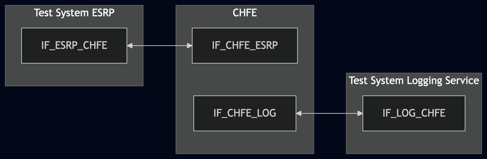
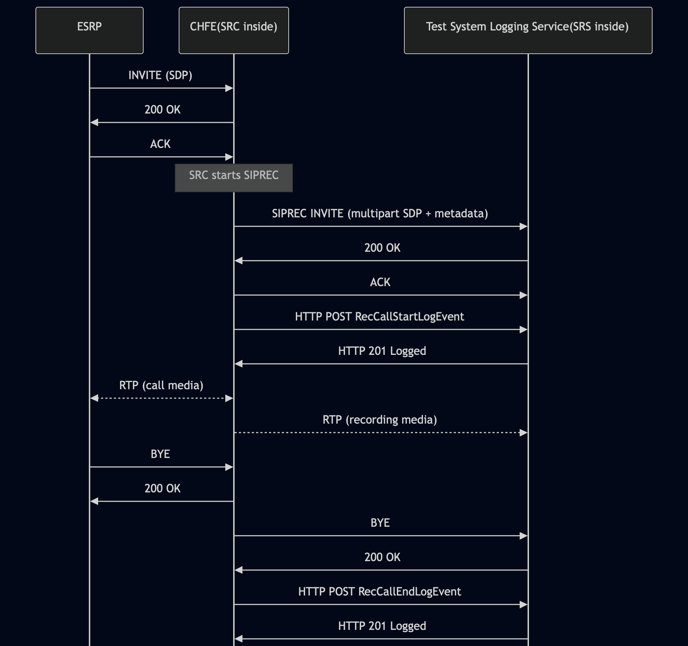

# Test Description: TD_CHFE_016
## Overview
### Summary
Logging of RecCallStartLogEvent and RecCallEndLogEvent

### Description
Test covers logging of RecCallStartLogEvent and RecCallEndLogEvent, checking their members.

### References
* Requirements : RQ_CHFE_341, RQ_CHFE_342
* Test Case    : TC_CHFE_016

### Requirements
IXIT config file for IUT

### HTTP transport types
Test can be performed with 2 different SIP and HTTP transport types. Steps describing actions for specific one are marked as following:
- (TLS) - used by default inside ESInet on production environment
- (TCP) - used if default TLS is not possible

## Configuration
### Implementation Under Test Interface Connections
<!-- Identify each of the FEs that are part of the configuration and how they are connected -->
* Test System ESRP
  * IF_ESRP_CHFE - connected to IF_CHFE_ESRP
* CHFE(SRC inside)
  * IF_CHFE_ESRP - connected to IF_ESRP_CHFE
  * IF_CHFE_LOG - connected to IF_LOG_CHFE
* Test System Logging Service(SRS inside)
  * IF_LOG_CHFE - connected to IF_CHFE_LOG

### Test System Interfaces
<!-- Identify each of the test system interfaces and whether it will be in active or monitor mode -->
* Test System ESRP
  * IF_ESRP_CHFE - Active
* CHFE
  * IF_CHFE_ESRP - Active
  * IF_CHFE_LOG - Active
* Test System Logging Service
  * IF_LOG_CHFE - Active
 
### Connectivity Diagram
<!--
https://mermaid.live/edit#pako:eNp9UlFPwjAQ_ivLPQ8y1o2tjfEFQU0wGsaTWULqdmyLrCVdpyLhv1s6AUFjH5q77-777rvktpDJHIHBciXfs5Ir7UxnqXDMu58sxsnsaTG6m4yver1rk-9DCx47LDJ9vP1uMJGFunr3N-1Lofi6dObYaCfZNBpr5yRyOapDUeSp-Ic_lUVRicJJUL1VGZ5JnZuwSn-4OXX8XOWXr8OCF2LgQqGqHJhWLbpQo6r5PoXtvp6CLrHGFJgJc65eU0jFznDWXDxLWR9oSrZFCWzJV43J2nXONd5U3Bisj6gyM1GNZCs0MH9gNYBt4QMYof1gOKA08MnQ8_yAurABRv0-oYSQOIyHcUSjnQufdqbXj4MoDEPfgGQQhV7oAm-1TDYiOzjCvNJSPXQ3YU9j9wUH6KCt
-->



## Pre-Test Conditions
### Test System ESRP/Test System Logging Service
* Interfaces are connected to network
* Interfaces have IP addresses assigned by DHCP
* Device is active
* ng911 repository cloned to local storage
* (TLS) Generated own PCA-signed certificate and private key files (test_system.crt, test_system.key)
* (TLS) Certificate and key used by CHFE copied to local storage
* (TLS) PCA certificate copied to local storage

### CHFE
* Interfaces are connected to network
* Interfaces have IP addresses assigned by DHCP
* Device configured to use Logging Service Test System as a Logging Service
* IUT is initialized with steps from IXIT config file
* Device is active
* Device is in normal operating state
* IUT is initialized using IXIT config file

## Test Sequence
### Test Preamble

#### Test System ESRP
* Install SIPp by following steps from documentation[^1]
* Copy following XML scenario file to local storage:
  `SIP_basic_call_with_RTP.xml`
  `g711ulaw_rtp_stream.pcap`
* Install Wireshark[^2]
* (TLS v1.2) Configure Wireshark to decode SIP over TLS, use tests system and IUT certificate keys [^3]
* (TLS v1.3) Configure logging of session keys and configure Wireshark to decode SIP over TLS [^4]
* Using Wireshark on 'Test System' start packet tracing on IF_ESRP_CHFE interface - run following filter:
   * (TLS)
     > ip.addr == IF_ESRP_CHFE_IP_ADDRESS and tls
   * (TCP)
     > ip.addr == IF_ESRP_CHFE_IP_ADDRESS and sip

#### Test System Logging Service
* Install Wireshark[^2]
* (TLS v1.2) Configure Wireshark to decode HTTP over TLS, use tests system and CHFE certificate keys [^3]
* (TLS v1.3) Configure logging of session keys and configure Wireshark to decode HTTP over TLS [^4]
* Using Wireshark on 'Test System' start packet tracing on IF_LOG_CHFE interface - run following filter:
   * (TLS)
     > ip.addr == IF_LOG_CHFE_IP_ADDRESS and tls
   * (TCP)
     > ip.addr == IF_LOG_CHFE_IP_ADDRESS and http
* The Logging Service must be configured to accept and process HTTP POST requests.
  To verify this manually, you can simulate a listening HTTP endpoint on port 8080 using command in the terminal:
    * Step 1 - Prepare logEventId and JSON body
      ```
      ID="urn:emergency:uid:logid:$(date +%s%N):logger.state.pa.us"
      BODY="{\"logEventId\":\"$ID\"}"
      ```
    * Step 2 - Run server:
      * (TLS)
      ```
      python3 http_entry.py --ip IF_LOG_CHFE --port 443 --role RECEIVER --path /LogEvents --method POST --body "$BODY" --content_type application/json --response_code 201 --server_cert /tmp/cert.crt --server_key /tmp/cert.key
      ```
      * (TCP)
      ```
      python3 http_entry.py --ip IF_LOG_CHFE --port 8080 --role RECEIVER --path /LogEvents --method POST --body "$BODY" --content_type application/json --response_code 201
      ```
    * Step 3 - In another terminal, send a POST request to verify it is working:
      * (TLS)
      ```
      curl -k -X POST http://localhost:8080 -d '{"log":"test"}'
      ```   
      * (TCP)
      ```
      curl -X POST http://localhost:8080 -d '{"log":"test"}'
      ```   
* Copy following XML scenario file to local storage:
  `SIPREC_RECEIVE_Audio_SRS_UAS.xml`
* Run SIPp scenario by using following command on Test System Logging Service, example:
  * (TLS transport)
    ``` 
    sudo sipp -t l1 -tls_cert test_system.crt -tls_key test_system.key -sf SIPREC_RECEIVE_Audio_SRS_UAS.xml IF_LOG_CHFE_IPv4:5061
    ```
  * (TCP transport)
    ```
    sudo sipp -t t1 -sf SIPREC_RECEIVE_Audio_SRS_UAS.xml IF_LOG_CHFE_IPv4:5060
    ```

### Test Body

#### Stimulus
* Run SIPp scenario by using following command on Test System ESRP, example:
  * (TLS transport)
    ``` 
    sudo sipp -t l1 -tls_cert test_system.crt -tls_key test_system.key -sf SIP_basic_call_with_RTP.xml IF_CHFE_ESRP_IPv4:5061
    ```
  * (TCP transport)
    ```
    sudo sipp -t t1 -sf SIP_basic_call_with_RTP.xml IF_CHFE_ESRP_IPv4:5060
    ```
    
* Answer the incoming call on CHFE and manually trigger recording, causing CHFE to establish recording session(SIPREC)
with the Test System Logging Service(SRS inside). 

#### Response
 Using traced packets on Wireshark verify:
* If CHFE sends HTTP POST to Test System Logging Service with JWS body containing:
  * "logEventType": "RecCallStartLogEvent"
  * "timestamp" with correct date-time format (e.g. 2020-03-10T11:00:01-05:00) and date-time match the time when 
    SIPREC INVITE message has been sent by CHFE
  * "elementId" which has value with FQDN of CHFE
  * "agencyId" which has value with FQDN of an agency
  * "callId" which has value e.g.: `urn:emergency:uid:callid:1234567890:bcf.ng911.example`. Check:
    * if header field contains "urn:emergency:uid:callid:"
    * if "urn:emergency:uid:callid:" is followed by 10 to 32 alphanumeric characters (String ID)
    * if String ID is followed by ":" and domain name
  * "callId" should have the same value as callId in the SIP INVITE from ESRP (Call-Info header field), example:
    for following Call-Info header field in the SIP INVITE:
    ```
    Call-Info: <urn:emergency:uid:callid:123ABCdefg123ABCdefg123ABCdefg12:test.com>;purpose=emergency-CallId
    ```
    "callId" should contain value:
    ```
    urn:emergency:uid:callid:123ABCdefg123ABCdefg123ABCdefg12:test.com
    ```
  * "incidentId" which has value e.g.: `urn:emergency:uid:incidentid:1234567890:bcf.ng911.example`. Check:
    * if header field contains "urn:emergency:uid:incidentid:"
    * if "urn:emergency:uid:incidentid:" is followed by 10 to 32 alphanumeric characters (String ID)
    * if String ID is followed by ":" and domain name
  * "incidentId" should have the same value as incidentId in the SIP INVITE from ESRP (Call-Info header field), example:
    for following Call-Info header field in the SIP INVITE:
    ```
    Call-Info: <urn:emergency:uid:incidentid:123ABCdefg123ABCdefg123ABCdefg12:test.com>;purpose=emergency-IncidentId
    ```
    "callId" should contain value:
    ```
    urn:emergency:uid:incidentid:123ABCdefg123ABCdefg123ABCdefg12:test.com
    ```
  * "callIdSip" which has value e.g.: `1234567890qwertyuiop@caller.example.com` 
  * "callIdSip" should have the same value as Call-ID in the SIPREC INVITE from CHFE, example:
  for following Call-ID header field in the SIP INVITE:
    ```
    Call-ID: test@ng911.example.com
    ```
    "callIdSip" should contain value:
    ```
    test@ng911.example.com
    ```
  * "direction" which has value: `incoming` or `outgoing`
  * (optional) "standardPrimaryCallType" field with one of string values:
    - "emergency"
    - "nonEmergency"
    - "silentMonitoring"
    - "intervene"
    - "legacyWireline"
    - "legacyWireless"
    - "legacyVoip"
  * (optional) "standardSecondaryCallType" field with one of string values mentioned for "standardPrimaryCallType"
  * (optional) "localCallType" field with string value
  * (optional) "localUse" field should contain a JSON object
  * (optional) "clientAssignedIdentifier" field with string value
  * (optional) "agencyAgentId" field with string value
  * (optional) "agencyPositionId" field with string value
  * (optional) "ipAddressPort" field with string value representing normalized IP address and port number, or FQDN of 
   another element that participated in the transaction that triggered this LogEvent element 
  * (optional) "extension" field should contain a JSON object

* If CHFE sends HTTP POST to Logging Service Test System with JWS body containing:
  * "logEventType": "RecCallEndLogEvent"
  * "timestamp" with correct date-time format (e.g. 2020-03-10T11:00:01-05:00) and date-time match SIP BYE message has been sent by CHFE
  * "elementId" which has value with FQDN of CHFE
  * "agencyId" which has value with FQDN of an agency
  * "callId" which has value e.g.: `urn:emergency:uid:callid:1234567890:bcf.ng911.example`. Check:
    * if header field contains "urn:emergency:uid:callid:"
    * if "urn:emergency:uid:callid:" is followed by 10 to 32 alphanumeric characters (String ID)
    * if String ID is followed by ":" and domain name
  * "callId" should have the same value as callId in the SIP INVITE from ESRP (Call-Info header field), example:
    for following Call-Info header field in the SIP INVITE:
    ```
    Call-Info: <urn:emergency:uid:callid:123ABCdefg123ABCdefg123ABCdefg12:test.com>;purpose=emergency-CallId
    ```
    "callId" should contain value:
    ```
    urn:emergency:uid:callid:123ABCdefg123ABCdefg123ABCdefg12:test.com
    ```
  * "incidentId" which has value e.g.: `urn:emergency:uid:incidentid:1234567890:bcf.ng911.example`. Check:
    * if header field contains "urn:emergency:uid:incidentid:"
    * if "urn:emergency:uid:incidentid:" is followed by 10 to 32 alphanumeric characters (String ID)
    * if String ID is followed by ":" and domain name
  * "incidentId" should have the same value as incidentId in the SIP INVITE from ESRP (Call-Info header field), example:
    for following Call-Info header field in the SIP INVITE:
    ```
    Call-Info: <urn:emergency:uid:incidentid:123ABCdefg123ABCdefg123ABCdefg12:test.com>;purpose=emergency-IncidentId
    ```
    "callId" should contain value:
    ```
    urn:emergency:uid:incidentid:123ABCdefg123ABCdefg123ABCdefg12:test.com
    ```
  * "callIdSip" which has value e.g.: `1234567890qwertyuiop@caller.example.com` 
  * "callIdSip" should have the same value as Call-ID in the SIPREC INVITE from CHFE, example:
    for following Call-ID header field in the SIP INVITE:
    ```
    Call-ID: test@ng911.example.com
    ```
    "callIdSip" should contain value:
    ```
    test@ng911.example.com
    ```
  * "direction" which has value: `incoming` or `outgoing`
  * (optional) "standardPrimaryCallType" field with one of string values:
    - "emergency"
    - "nonEmergency"
    - "silentMonitoring"
    - "intervene"
    - "legacyWireline"
    - "legacyWireless"
    - "legacyVoip"
  * (optional) "standardSecondaryCallType" field with one of string values mentioned for "standardPrimaryCallType"
  * (optional) "localCallType" field with string value
  * (optional) "localUse" field should contain a JSON object
  * (optional) "clientAssignedIdentifier" field with string value
  * (optional) "agencyAgentId" field with string value
  * (optional) "agencyPositionId" field with string value
  * (optional) "ipAddressPort" field with string value representing normalized IP address and port number, or FQDN of 
   another element that participated in the transaction that triggered this LogEvent element 
  * (optional) "extension" field should contain a JSON object

* Verify that RecCallStartLogEvent are RecCallEndLogEvent are related to the same session by comparing the following values:
  * "callId" values are identical
  * "incidentId" values are identical
  * "callIdSip" values are identical


VERDICT:
* PASSED - all checks are passed
* FAILED - any other cases


### Test Postamble
#### Test System ESRP
* stop SIPp (if still running)
* stop Wireshark (if still running)
* archive all logs generated
* disconnect interfaces from IUT
* (TLS) remove certificates

#### Test System Logging Service
* stop Wireshark (if still running)
* archive all logs generated
* disconnect interfaces from IUT
* (TLS) remove certificates

#### CHFE
* restore default configuration
* disconnect interfaces from Test Systems
* reconnect interfaces back to default

## Post-Test Conditions
### Test System ESRP/Test System Logging Service
* Test tools stopped
* interfaces disconnected from IUT

### CHFE
* device connected back to default
* device in normal operating state

## Sequence Diagram
<!--
https://mermaid.live/edit#pako:eNq1VW1r2zAQ_iuHPqXMDrLjvFSUQud6NHRrQxwGG_4i7KsrFkuZLIelIf99shunpcloS9Zvlnhe7jmfz2uSqgwJI67rJjJV8k7kLJEAhdBa6YvUKF0yuOPzEhPZgEr8XaFM8VLwXPOiBgMsuDYiFQsuDUTxdLJ_G159iTrxNAQhS5HhyT5ihqWBeFUaLOCrynMhc4hRL0WKlhg_ER-ptY17fv5Sl8H45vt4FkEnvpxsXV5iLK1mM_AphdvrV_QuwuvW80YZBLVEDfuw-lAam6eEeDyZRmFLOuD-xqhsq7SLVFRzI-qegQ0Hn6BAwzNu-DbnG2UPpnzeimMqftatY2SuZrMJTG7jGUwxDfl8HtettZRoidIcH7fR96nXEDF7GoGzM_cgYWrxndQWYpueCX7yz5DvSdmIakyVzmpMq1zrvjKUn39E75jtY97Ezul_TNcHDEYksw8cC-KQXIuMMKMrdEiBuuD1kaxrs4SYeywwIcw-Zlz_SkgiN5ZjF9pPpYqWplWV3xPWrFGHVAv7zbb7c3erUWaoQ1VJQ1jQo40IYWvyhzCP9rqD_mnfD4a05_sjb-iQFWED2g0COgwCz_NGfj8YbRzy0NjS7nBAT3vDfjDwe9T3Bn2H8MqoeCXTtig7bHa7f3vc_81vYPMXf1blRA
-->



## Comments

Version:  010.3f.5.0.0

Date:     20260715

## Footnotes
[^1]: SIPp - tool for SIP packet simulations. Official documentation: https://sipp.sourceforge.net/doc/reference.html#Getting+SIPp
[^2]: Wireshark - tool for packet tracing and anaylisis. Official website: https://www.wireshark.org/download.html
[^3]: Wireshark configuration to decrypt TLS packets: https://www.zoiper.com/en/support/home/article/162/How%20to%20decode%20SIP%20over%20TLS%20with%20Wireshark%20and%20Decrypting%20SDES%20Protected%20SRTP%20Stream
[^4]: TLS v1.3 session keys logging + Wireshark configuration to decrypt traffic: https://my.f5.com/manage/s/article/K50557518
