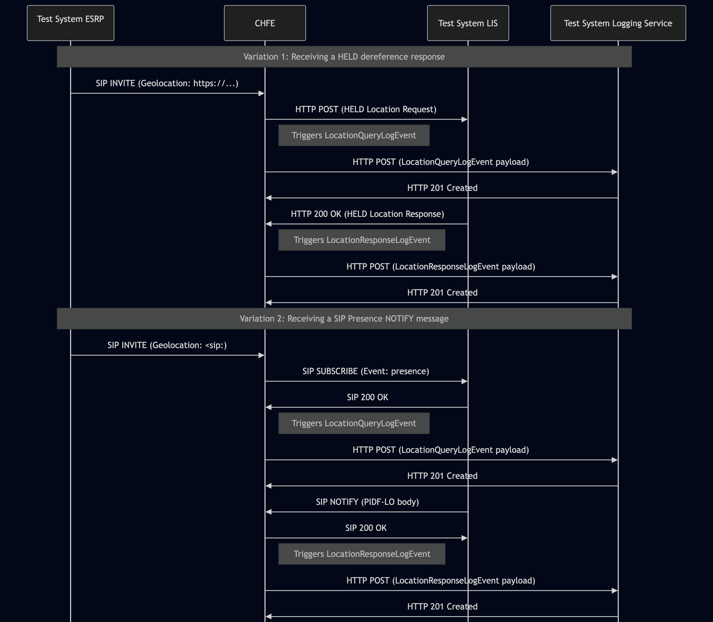
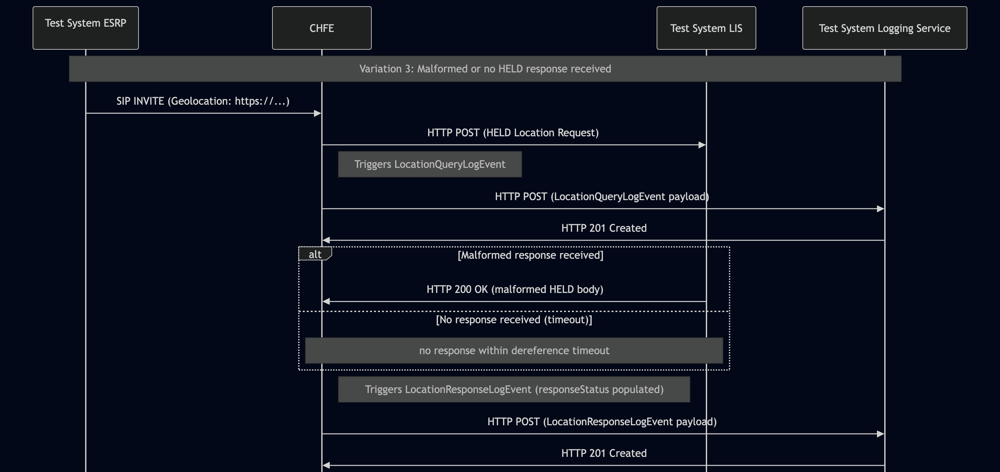

# Test Description: TD_CHFE_017
## Overview
### Summary
Sending LocationResponseLogEvent for HELD dereference responses, SIP Presence NOTIFY messages

### Description
The test ensures that the CHFE successfully generates and sends a `LocationResponseLogEvent` to the Logging Service with log event payload containing all mandatory members formatted in accordance with the standard.

### References
* Requirements : RQ_CHFE_368, RQ_CHFE_369, RQ_CHFE_370
* Test Case    : TC_CHFE_017

### Requirements
IXIT config file for CHFE

### HTTP and SIP transport types
Test can be performed with 2 different SIP and HTTP transport types. Steps describing actions for specific one are marked as following:
- (TLS) - should be used by default
- (TCP) - used in lab for testing purposes only if default TLS is not possible

## Configuration
### Implementation Under Test Interface Connections
* Test System ESRP
  * IF_ESRP_CHFE - connected to IF_CHFE_ESRP
* CHFE
  * IF_CHFE_ESRP - connected to IF_ESRP_CHFE
  * IF_CHFE_LIS - connected to IF_LIS_CHFE
  * IF_CHFE_LOG - connected to IF_LOG_CHFE
* Test System LIS
  * IF_LIS_CHFE - connected to IF_CHFE_LIS
* Test System Logging Service
  * IF_LOG_CHFE - connected to IF_CHFE_LOG

### Test System Interfaces
* Test System ESRP
  * IF_ESRP_CHFE - Active
* CHFE
  * IF_CHFE_ESRP - Active
  * IF_CHFE_LOG - Active
  * IF_CHFE_LIS - Active
* Test System LIS
  * IF_LIS_CHFE - Active
* Test System Logging Service
  * IF_LOG_CHFE - Active

### Connectivity Diagram
<!--
https://mermaid.live/edit#pako:eNqFUstuwjAQ_JVozwEl5OFiVb1QaJGoWpGeqkjITZYkKrGR47SliH-vYxog9LUHa3dmd3ZseQuJSBEoLFfiLcmZVNZsHnNLx3SyGEfzh8XodjK-7PWudN2kBjx0GGR2f_PVoDMDnfHTqOWn0Qm_P6v6OZNsnVuPWCkr2lQKS-u45NzKHkWexvyP-ZnIsoJnVoTytUiwI9U1aZT-caNtdxU61_hN4dhx-hjfbtY-4Q9gu1ZvABsyWaRAlazRhhJlyZoStk1LDCrHEmOgOk2ZfIkh5js9s2b8SYgS6JKtKj0nRZ3lh6pep0zhdcG04bKVlnobypGouQI6tIHVSkQbnrQ8poUS8m7_bczvMWuAbuEdqDvw-57jDsnQbYL4ng0boMFF33EGIXEdj3iuQ_ydDR_GmNMnQUDcMNB0GPrE83efl_DAGw
-->


## Pre-Test Conditions
### Test System ESRP/Test System Logging Service/Test System LIS
* Interfaces are connected to network
* Interfaces have IP addresses assigned by DHCP
* Device is active
* ng911 repository cloned to local storage
* (TLS) Generated own PCA-signed certificate and private key files (test_system.crt, test_system.key)
* (TLS) Certificate and key used by CHFE copied to local storage
* (TLS) PCA certificate copied to local storage

### CHFE
* Interfaces are connected to network
* Interfaces have IP addresses assigned by DHCP
* IUT is configured to use Test System Logging Service as a Logging Service
* IUT is configured to use Test System LIS for location dereference by default
* IUT is initialized with steps from IXIT config file
* IUT is active
* IUT is in normal operating state
* No active calls

## Test Sequence
### Test Preamble

#### Test System ESRP
* Install SIPp by following steps from documentation[^1]
* Copy following XML scenario files to local storage:

  `SIP_INVITE_geolocation_HELD.xml`

  `SIP_INVITE_geolocation_SIP.xml`

* For SIP_INVITE_geolocation_HELD.xml replace LIS_LOCATION_REFERENCE_URL with URL to the Test System LIS, e.g. https://lis.ng911.dev.lab:4443/location
* For SIP_INVITE_geolocation_SIP.xml replace LOCATION_SIP_URI with SIP URI to the Test System LIS, e.g. sip:location@lis.ng911.dev.lab:5060
* Install Wireshark[^2]
* (TLS v1.2) Configure Wireshark to decode SIP over TLS, use tests system and IUT certificate keys [^3]
* (TLS v1.3) Configure logging of session keys and configure Wireshark to decode SIP over TLS [^4]
* Using Wireshark on 'Test System' start packet tracing on IF_ESRP_CHFE interface - run following filter:
   * (TLS)
     > ip.addr == IF_ESRP_CHFE_IP_ADDRESS and tls
   * (TCP)
     > ip.addr == IF_ESRP_CHFE_IP_ADDRESS and sip

#### Test System LIS
* Install SIPp by following steps from documentation[^1]
* Copy following HTTP and SIP scenario files and scripts to local storage:

  `Location_response`

  `Location_response_malformed`
  
  `SIP_SUBSCRIBE_LIS.xml`

* Install Wireshark[^2]
* (TLS v1.2) Configure Wireshark to decode SIP and HTTP over TLS, use test system and CHFE certificate keys [^3]
* (TLS v1.3) Configure logging of session keys and configure Wireshark to decode SIP and HTTP over TLS [^4]
* Using Wireshark on 'Test System LIS' start packet tracing on IF_LIS_CHFE interface - run following filter:
   * (TLS)
     > ip.addr == IF_LIS_CHFE_IP_ADDRESS and tls
   * (TCP)
     > ip.addr == IF_LIS_CHFE_IP_ADDRESS and (http or sip)
* Depending on current variation use one of following scenario files:

  * Variation 1 (HELD dereference response)
    Start HTTP server responding to the CHFE's HTTP POST with the `Location_response` (PIDF-LO) body.
    `--path` MUST match the path component of `LIS_LOCATION_REFERENCE_URL` in `SIP_INVITE_geolocation_HELD.xml`
    Replace the example below with your configured value(e.g. if that URL is `https:// IF_LIS_ESRP_IP_ADDRESS:443/heldLocationRequest`, then `--path /heldLocationRequest`):
    * (TLS):
    ```
    python3 http_entry.py --ip IF_LIS_CHFE --port 443 --role RECEIVER --path /heldLocationRequest --method POST \
    --body Location_response --content_type application/held+xml --response_code 200 --server_cert PCA-cacert.pem --server_key PCA-cakey.pem
    ``` 
    * (TCP):
    ```
    python3 http_entry.py --ip IF_LIS_CHFE --port 80 --role RECEIVER --path /heldLocationRequest --method POST \
    --body Location_response --content_type application/held+xml --response_code 200
    ```
  * Variation 2 (SIP Presence NOTIFY message)
    Prepare Test System to receive SIP SUBSCRIBE - run following SIPp command on Test System, example:
    * (TLS transport)
      > sudo sipp -t l1 -sf SIP_SUBSCRIBE_LIS.xml -tls_cert cacert.pem -tls_key cakey.pem -i IF_LIS_CHFE_IP_ADDRESS -p 5061
    * (TCP transport)
      > sudo sipp -t t1 -sf SIP_SUBSCRIBE_LIS.xml -i IF_LIS_CHFE_IP_ADDRESS -p 5060

  * Variation 3 (malformed HELD dereference response)
    Start HTTP server responding to the CHFE's HTTP POST with the `Location_response_malformed` (PIDF-LO) body.
    `--path` MUST match the path component of `LIS_LOCATION_REFERENCE_URL` in `SIP_INVITE_geolocation_HELD.xml`
    Replace the example below with your configured value(e.g. if that URL is `https:// IF_LIS_ESRP_IP_ADDRESS:443/heldLocationRequest`, then `--path /heldLocationRequest`):
    * (TLS):
    ```
    python3 http_entry.py --ip IF_LIS_CHFE --port 443 --role RECEIVER --path /heldLocationRequest --method POST \
    --body Location_response_malformed --content_type application/held+xml --response_code 200 --server_cert PCA-cacert.pem --server_key PCA-cakey.pem
    ``` 
    * (TCP):
    ```
    python3 http_entry.py --ip IF_LIS_CHFE --port 80 --role RECEIVER --path /heldLocationRequest --method POST \
    --body Location_response_malformed --content_type application/held+xml --response_code 200
    ```

#### Test System Logging Service
* Install Wireshark[^2]
* Install OpenSSL v1.1.1 or higher[^5].
* (TLS v1.2) Configure Wireshark to decode HTTP over TLS, use tests system and CHFE certificate keys [^3]
* (TLS v1.3) Configure logging of session keys and configure Wireshark to decode HTTP over TLS [^4]
* Using Wireshark on 'Test System' start packet tracing on IF_LOG_CHFE interface - run following filter:
   * (TLS)
     > ip.addr == IF_LOG_CHFE_IP_ADDRESS and tls
   * (TCP)
     > ip.addr == IF_LOG_CHFE_IP_ADDRESS and http
* The Logging Service must be configured to accept and process HTTP POST requests, and must capture both the `LocationQueryLogEvent` and the subsequent `LocationResponseLogEvent` for the same transaction, so that the `queryId` of the former can be correlated against the `responseId`. To verify this manually, you can simulate a listening HTTP endpoint on port 8080 using command in the terminal:
    * Step 1 - Prepare logEventId and JSON body
      ```
      ID="urn:emergency:uid:logid:$(date +%s%N):logger.state.pa.us"
      BODY="{\"logEventId\":\"$ID\"}"
      ```
    * Step 2 - Run server:
      * (TLS)
      ```
      python3 http_entry.py --ip IF_LOG_CHFE --port 8080 --role RECEIVER --path /LogEvents --method POST --body "$BODY" --content_type application/json --response_code 201 --server_cert /tmp/cert.crt --server_key /tmp/cert.key
      ```
      * (TCP)
      ```
      python3 http_entry.py --ip IF_LOG_CHFE --port 8080 --role RECEIVER --path /LogEvents --method POST --body "$BODY" --content_type application/json --response_code 201
      ```
    * Step 3 - In another terminal, send a POST request to verify it is working:
      * (TLS)
      ```
      curl -k -X POST https://localhost:8080 -d '{"log":"test"}'
      ```
      * (TCP)
      ```
      curl -X POST http://localhost:8080 -d '{"log":"test"}'
      ```

### Test Body

#### Variations

1. Receiving a HELD dereference response

Validate the successful generation and transmission of a `LocationResponseLogEvent` to the Logging Service. Validate that the event payload contains all mandatory members correctly populated (`text`, `direction`, and `responseId` members).

Use SIPp scenario: `SIP_INVITE_geolocation_HELD.xml` / LIS response body: `Location_response`

2. Receiving a SIP Presence NOTIFY message

Validate the successful generation and transmission of a `LocationResponseLogEvent` to the Logging Service. Validate that the event payload contains all mandatory members correctly populated (`text`, `direction`, and `responseId` members).

Use SIPp scenario: `SIP_INVITE_geolocation_SIP.xml` / LIS scenario: `SIP_SUBSCRIBE_LIS.xml`

3. Receiving a malformed HELD dereference response

Validate the successful generation and transmission of a `LocationResponseLogEvent` to the Logging Service. Validate that the event payload correctly includes the conditional `responseStatus` member, populated with an appropriate status code from the Status Codes Registry (Section 10.29), alongside the mandatory `responseId` matching the preceding query.

Use SIPp scenario: `SIP_INVITE_geolocation_HELD.xml` / LIS response body: `Location_response_malformed`

#### Stimulus

Simulate a call from Test System ESRP to CHFE using the appropriate SIPp scenario for the given variation - run SIPp scenario by using following command on Test System ESRP, example:
* (TCP transport)
  ```
  sudo sipp -t t1 -sf SIPP_SCENARIO_FILE IF_CHFE_ESRP_IPv4:5060
  ```
* (TLS transport)
  ```
  sudo sipp -t l1 -tls_cert test_system.crt -tls_key test_system.key -sf SIPP_SCENARIO_FILE IF_CHFE_ESRP_IPv4:5060
  ```

#### Response
Using traced packets on Wireshark verify if CHFE sends HTTP POST to Test System Logging Service with decoded JWS payload containing a `LocationResponseLogEvent` object with the following fields:
  * `logEventType`: "LocationResponseLogEvent"
  * `timestamp` - with correct date-time format (e.g. 2020-03-10T11:00:01-05:00)
  * `elementId` - which has value with FQDN of CHFE
  * `agencyId` - which has value with FQDN of an agency
  * `callId` - which has value e.g.: `urn:emergency:uid:callid:1234567890:bcf.ng911.example`. Check:
    * if header field contains `urn:emergency:uid:callid:`
    * if `urn:emergency:uid:callid:` is followed by 10 to 32 alphanumeric characters (String ID)
    * if String ID is followed by `:` and domain name
  * `callId` should have the same value as callId in the SIP INVITE from ESRP (Call-Info header field), example:
    for following Call-Info header field in the SIP INVITE:
    ```
    Call-Info: <urn:emergency:uid:callid:123ABCdefg123ABCdefg123ABCdefg12:test.com>;purpose=emergency-CallId
    ```
    `callId` should contain value:
    ```
    urn:emergency:uid:callid:123ABCdefg123ABCdefg123ABCdefg12:test.com
    ```
  * `incidentId` - which has value e.g.: `urn:emergency:uid:incidentid:1234567890:bcf.ng911.example`. Check:
    * if header field contains `urn:emergency:uid:incidentid:`
    * if `urn:emergency:uid:incidentid:` is followed by 10 to 32 alphanumeric characters (String ID)
    * if String ID is followed by `:` and domain name
  * `incidentId` - should have the same value as `incidentId` in the SIP INVITE from ESRP (Call-Info header field), example:
    for following Call-Info header field in the SIP INVITE:
    ```
    Call-Info: <urn:emergency:uid:incidentid:123ABCdefg123ABCdefg123ABCdefg12:test.com>;purpose=emergency-IncidentId
    ```
    `callId` should contain value:
    ```
    urn:emergency:uid:incidentid:123ABCdefg123ABCdefg123ABCdefg12:test.com
    ```
  * `callIdSip` - which has value e.g.: `1234567890qwertyuiop@caller.example.com` 
  * `callIdSip` - should have the same value as Call-ID in the SIP INVITE from ESRP, example:
  for following Call-ID header field in the SIP INVITE:
    ```
    Call-ID: test@ng911.example.com
    ```
    `callIdSip` should contain value:
    ```
    test@ng911.example.com
    ```
  * (optional) `clientAssignedIdentifier` field with string value
  * (optional) `agencyAgentId` field with string value
  * (optional) `agencyPositionId` field with string value
  * (optional) field `ipAddressPort` with string value representing normalized IP address and port number, or FQDN of 
   another element that participated in the transaction that triggered this LogEvent element 
  * (optional) `extension` field should contain a JSON object
  * `text` (String):
    * Variation 1 - Must contain the full body of the received HELD dereference response. Verify that it contains the valid location content returned by the LIS (e.g., a PIDF-LO XML document).
    * Variation 2 - Must contain the full body of the received SIP NOTIFY message. Verify that it contains the presence/location document provided by the LIS.
    * Variation 3 - Must contain the exact body of the received malformed or invalid response (the broken payload as received by the CHFE). However, if no response was received at all (e.g., due to a network timeout), this field MUST be an empty string `""`
  * `responseId` (String): - globally unique value e.g.`urn:emergency:uid:queryid:globally_unique_id`
    * Variation 1 - Must be present and MUST be identical to the `queryId` value logged in the `LocationQueryLogEvent` generated for the corresponding outbound HELD request;
    * Variation 2 - Must be present and MUST be identical to the `queryId` value logged in the `LocationQueryLogEvent` generated for the corresponding outbound SUBSCRIBE;
    * Variation 3 - Must be present and MUST be identical to the `queryId` value logged in the `LocationQueryLogEvent` generated for the corresponding outbound HELD request
  * `direction` (String): Must be set exactly to the value `incoming`
  * (optional) `responseStatus` - field with string value. (Optional check) In case of malformed, invalid or no response at all field might contain status code from Status Codes Registry (Section 10.29).

The Test System Logging Service must respond to the CHFE's HTTP POST request with an `HTTP/1.1 201 Created` status code.

VERDICT:
* PASSED - all JSON assertions for the `LocationResponseLogEvent` object pass
* FAILED - any other cases

### Test Postamble
#### Test System ESRP
* stop all SIPp processes (if still running)
* stop Wireshark (if still running)
* archive all logs generated
* disconnect interfaces from IUT
* (TLS) remove certificates

#### Test System LIS
* stop all SIPp processes (if still running)
* stop all python HTTP server processes (if still running)
* archive all logs generated
* stop Wireshark (if still running)
* remove all scenario and response files (Location_response, SIP_SUBSCRIBE_LIS.xml)
* disconnect interfaces from CHFE
* (TLS transport) remove certificates

#### Test System Logging Service
* stop all python HTTP server processes (if still running)
* stop Wireshark (if still running)
* archive all logs generated
* disconnect interfaces from IUT
* (TLS) remove certificates

#### CHFE
* restore default configuration
* disconnect interfaces from Test Systems
* reconnect interfaces back to default

## Post-Test Conditions
### Test System ESRP/Test System LIS/Test System Logging Service
* Test tools stopped
* Interfaces disconnected from IUT

### CHFE
* IUT connected back to default
* IUT in normal operating state

## Sequence Diagram
Variations 1 and 2
<!--
https://mermaid.live/edit#pako:eNrVVWFv2jAQ_SsnS6hFSmlICwWrq9RS2kZjwEhWaVO-uMk1WGvizHHQGOK_z06AtYUPo9omzVKU-HLv7t75ybcgoYiQUFKrLXjKFYXFQY7fCkxDPDCbhEsp5GWohMy14ZE95bhcLmu1IF37XXMWS5YEKehVq8FNHzImFQ95xlKVV_ZnFuh7kzGwHHzMFXjzXGFS2s4f5PHFtnvvTkfU7ua9_Xfgeq9jadMOv9Htlp-IY57G4KGc8RA3BN799tpA7i8n7qXvjobQfHOYoVAIYoaybIZlKqZwzyRniosUmhQmGCKfmZIZ3PUH1xChxEf96FMAiXkm9KEEaRXOBDm6uDBdo-C5Y3CH967fh8NbFE8iLINSmCqV5fT4uNFo1NdIA9FI3UYKd74_hvHI8-GwzDhYIXUt-vRztQGV1UseTxWIR6iy-nofo8w3qI8Fyrlue3-GqXqZzJB9lmwnQh_o_EmwqF5BNWZDsIQ6dhN6EpnCaF2WJvHax4bR-202VfP2o7NG7cXoNWgvUn9Coc7fUqjzUqFGc2OtylKdw5Hv3nyGBPOcxXtq9DznGd2pTgPxPl15vYl7pVFlPylkq6T1bQkYQKWA_0i3puhV_w7H7vXN0WAEDyKa13c35A38_rWQiUViySNClSzQIgnKhJktWRhsQNQUEwwI1Z8Rk18DEqRLjdEX-RchEkLLMWQRKYp4utkVWaRjr6bRLx9M9S3ZE0WqCHVajkVYoYQ3T8N1doy4nm4fqjlYjsMyE6EL8p3Qjt04cdrtlm23Tpttp9OyyNwEaji20z219eqcdc9OnaVFfpS12Y1u02k3291W86Tb7Z6cdZY_AWjEO3c
-->




Variation 3
<!--
https://mermaid.live/edit#pako:eNqdVGFv2jAQ_SsnS6ggpRRIB8HaKlUta9HawkjUDxNf3OQI1oidOQ4bQ_z3XQIEVvqhmxFKfLn3nu-dfGsW6ggZZ7XaWippOazPMvyRowrxrNgk0hhtrkOrTUaBmVhkuNlsarWp2ufdShEbkUwV0KrV4PMAUmGsDGUqlM228aMIDPzJGEQGAWYW_FVmMSljH1_MxdVp-s09MVJ68Tz9-jD0X3NR6I280d1Jno5jqWLw0SxliFUBn969Ksjz9WR4HQxHT-D-N82Ttgh6iaY0wylOzOFZGCms1ApcDo9iMdMmwQi0AaXhfvBwCwazVFMz6CVEucRoqrZ8Bcv51VVhGwd_OIbh0_MwGED9DvVChyUrh7m1acYvLprNZmOPLCCEJB853AfBGMYjP4B6KfewQ8KkaH9mK1B5fCPjuQU9g61qQPsYTVahvuZoVuT7YInK_i1WVHsk9iaCOrpaaBE1tlDCVAWW0E6rDTcGhT24IBb2yLc3zILdompfk7Vg9AXqSYUuDXjR0Wqnj3QZqO5TVqhbmaDObePAf2gvKTlbHXWE_SntXCqI0OCM_nSxYEeyE1PRP1k92RFX3tX3Ur4VNs8g1Wm-KKxqvKsRJ3zv7wVzWGxkxLg1OTosQZOIYsvWBXbK7BwTnDJOr5Ew36dsqjaEoXv7TeuE8XLqOMzoPJ5XuzyNiHs3fA45ZBOaG50ry3jHc5jIrfZXKtyLYyRplj1up145_EohxtfsF-PtZrt36bV7vZ7XbX9o9V3XYSvGz_vdptelL51uy-teum5_47Df5dlazX6v13e9jnvptbr08zZ_AOLHqkQ
-->




## Comments

Version:  010.3d.5.0.0

Date:     20260805

## Footnotes
[^1]: SIPp - tool for SIP packet simulations. Official documentation: https://sipp.sourceforge.net/doc/reference.html#Getting+SIPp

[^2]: Wireshark - tool for packet tracing and anaylisis. Official website: https://www.wireshark.org/download.html

[^3]: Wireshark configuration to decrypt TLS packets: https://www.zoiper.com/en/support/home/article/162/How%20to%20decode%20SIP%20over%20TLS%20with%20Wireshark%20and%20Decrypting%20SDES%20Protected%20SRTP%20Stream

[^4]: TLS v1.3 session keys logging + Wireshark configuration to decrypt traffic: https://my.f5.com/manage/s/article/K50557518

[^5]: OpenSSL v1.1.1 or higher - toolkit required for TLS operations and certificate/key handling. Official website and downloads: https://www.openssl.org/source/ . Installation documentation: https://github.com/openssl/openssl/blob/master/INSTALL.md
