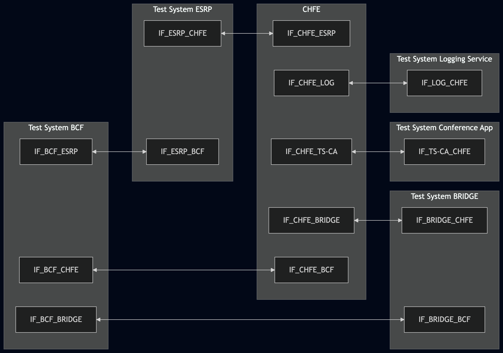
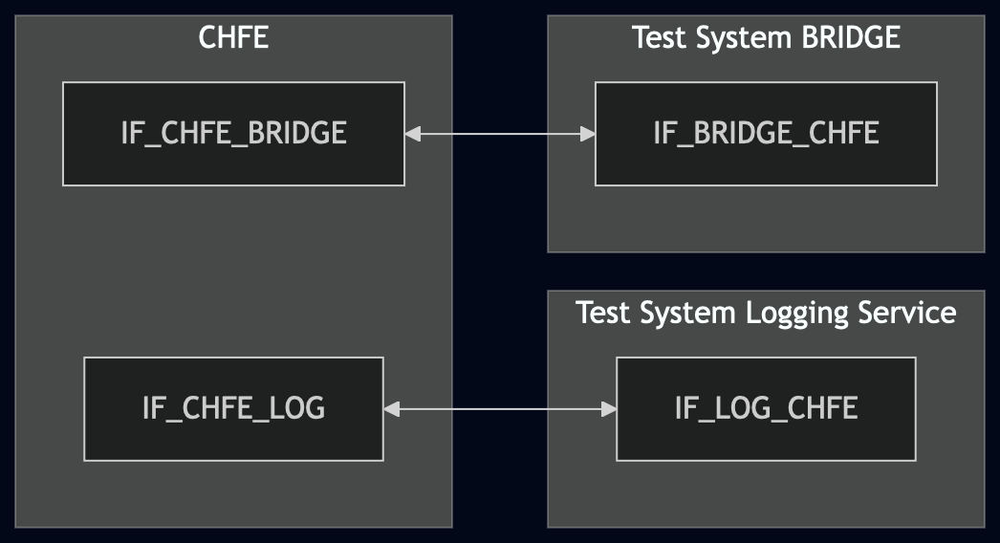
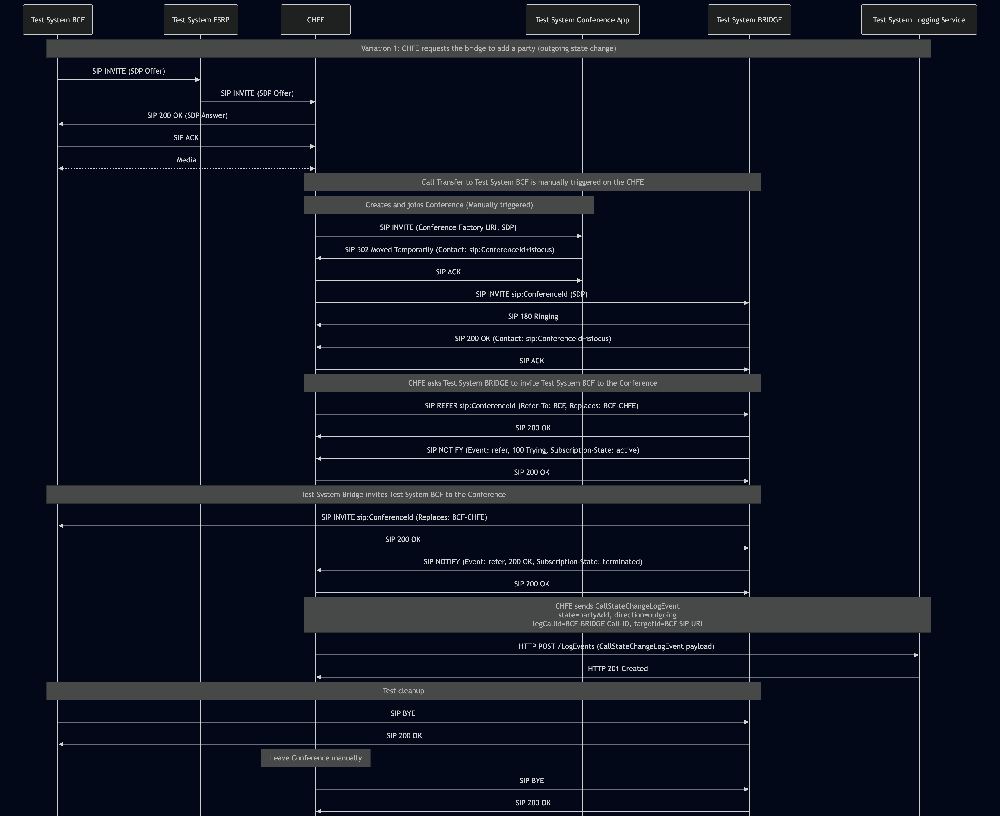
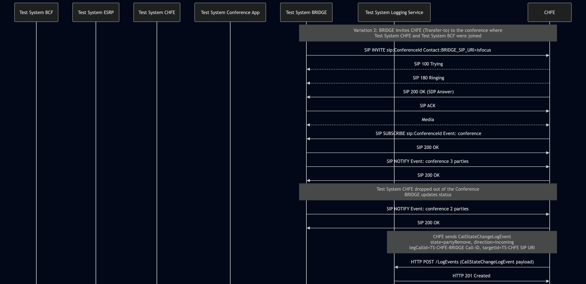

# Test Description: TD_CHFE_018
## Overview
### Summary
Logging CallStateChangeLogEvent for adding or removing a party in a conference

### Description
The test ensures that the CHFE successfully generates and sends a proper `CallStateChangeLogEvent` to the Logging Service with log event payload containing all mandatory members formatted in accordance with the standard, when a party is added to, or removed from, a conference call on the Bridge.

### References
* Requirements : RQ_CHFE_359, RQ_CHFE_360
* Test Case    : TC_CHFE_018

### Requirements
IXIT config file for CHFE

### HTTP and SIP transport types
Test can be performed with 2 different SIP and HTTP transport types. Steps describing actions for specific one are marked as following:
- (TLS) - should be used by default
- (TCP) - used in lab for testing purposes only if default TLS is not possible

## Configuration
### Implementation Under Test Interface Connections

Variation 1:

* Test System BCF
  * IF_BCF_ESRP - connected to IF_ESRP_BCF
  * IF_BCF_BRIDGE - connected to IF_BRIDGE_BCF
  * IF_BCF_CHFE - connected to IF_CHFE_BCF
* Test System ESRP
  * IF_ESRP_BCF - connected to IF_BCF_ESRP
  * IF_ESRP_CHFE - connected to IF_CHFE_ESRP
* CHFE
  * IF_CHFE_ESRP - connected to IF_ESRP_CHFE
  * IF_CHFE_BRIDGE - connected to IF_BRIDGE_CHFE
  * IF_CHFE_TS-CA - connected to IF_TS-CA_CHFE
  * IF_CHFE_LOG - connected to IF_LOG_CHFE
  * IF_CHFE_BCF - connected to IF_BCF_CHFE
* Test System BRIDGE
  * IF_BRIDGE_CHFE - connected to IF_CHFE_BRIDGE
  * IF_BRIDGE_BCF - connected to IF_BCF_BRIDGE
* Test System Conference App
  * IF_TS-CA_CHFE - connected to IF_CHFE_TS-CA
* Test System Logging Service
  * IF_LOG_CHFE - connected to IF_CHFE_LOG

Variation 2:

* CHFE
  * IF_CHFE_BRIDGE - connected to IF_BRIDGE_CHFE
  * IF_CHFE_LOG - connected to IF_LOG_CHFE
* Test System BRIDGE
  * IF_BRIDGE_CHFE - connected to IF_CHFE_BRIDGE
* Test System Logging Service
  * IF_LOG_CHFE - connected to IF_CHFE_LOG

### Test System Interfaces

Variation 1:

* Test System BCF
  * IF_BCF_ESRP - Active 
  * IF_BCF_BRIDGE - Active
  * IF_BCF_CHFE - Active
* Test System ESRP
  * IF_ESRP_CHFE - Active
  * IF_ESRP_BCF - Active
* CHFE
  * IF_CHFE_ESRP - Active
  * IF_CHFE_BRIDGE - Active
  * IF_CHFE_TS-CA - Active
  * IF_CHFE_LOG - Active
  * IF_CHFE_BCF - Active
* Test System BRIDGE
  * IF_BRIDGE_CHFE - Active
  * IF_BRIDGE_BCF - Active
* Test System Conference App
  * IF_TS-CA_CHFE - Active
* Test System Logging Service
  * IF_LOG_CHFE - Active

Variation 2:

* CHFE
  * IF_CHFE_BRIDGE - Active
  * IF_CHFE_LOG - Active
* Test System BRIDGE
  * IF_BRIDGE_CHFE - Active
* Test System Logging Service
  * IF_LOG_CHFE - Active

### Connectivity Diagram

Variation 1:

<!--
https://mermaid.live/edit#pako:eNqFVO9vqjAU_VfI_YwGNxAhy5KNuR-JL28RP20spkIpZNKSUvaeM_7vK0XdKJrx6fbc03vOaRu2ELMEgw_pmv2LM8SFMZtH1JDf0_1yGs6fl8Hj_fRqMLiW66ZU4JGhkNv5093DgdMuVKPLWoSD4GZPUvUJzuzvw54hq27_Nmj97PvKmsQ6_VNGdI4eR_VbRlWvCEdlZlRkuYrT1wgWuBJGuKkELoyGCG8tU_PUA1vtHvwdCNPklCqueKnJqvma7vFe-ugx7hmFFc8TgvVorV09nX6TXfw3pZjRFJV6nECimGMaY-OmLHVJ_V2cGb1mRBs7Y4TklBgh5h95jPW53dd0znCWNgejeNp-7eH3H38fV1H6sHRyYsaPowQTiLwj8AWvsQkF5gVqlrBtKBGIDBcyny_LBPH3CCK6k3tKRF8YK8BP0bqS-zirSXZc1WWCBL7LkQz7gyPlMA9YTQX4o4kJqBYs3ND4II6TXDD-p_1DqB-FEgJ_C__lDscdOs6FZ1muNXHGlmebsJGwezG0LffSHY08x5m43uXOhE_lzRpKcOzaE8u2nbEzsr2DtalS2jvbfQFtilVN
-->



Variation 2:

<!--
https://mermaid.live/edit#pako:eNp1kttOwzAMhl-l8nU39XyIEBfsxKQhpI0rKJqy1ksr1mRKU2BMe3eytkNagVz5t53PvyUfIRUZAoHtTnykOZXKWCwTbug3n65H99PJevE4uxkMbrXUUZO6rt8t5-PZpGtpRdfV9lX1hkm6z42KrdN8iy8JNGV4beu9Wb-TLbPNI8_-4u4E09gnrJSxOlQKS2MhGCs4M1Yo34sU-9OuV_mHupFFxrAH7tz0eFd7d0gwgWkCECVrNKFEWdKzhOO5JQGVY6mNER1mVL4lkPCT_rOn_FmI8vJNiprlQLZ0V2lV7zOqcFxQbbL8yUo9DeVI1FwBsd2ggQA5wqeWYTQMI8_xHCuwIj-MXRMOQDxraIe25_tO7LuB58bByYSvZq41jCzHifzYigPfCW0TaK3E6sDTiyfMCiXkQ3s5zQFdnE2aSmfs9A3X0bae
-->



## Pre-Test Conditions
### Test System BCF/Test System ESRP/Test System BRIDGE/Test System Conference App/Test System CHFE/Test System Logging Service
* Interfaces are connected to network
* Interfaces have IP addresses assigned by DHCP
* Device is active
* ng911 repository cloned to local storage
* (TLS) Generated own PCA-signed certificate and private key files (test_system.crt, test_system.key)
* (TLS) Certificate and key used by CHFE copied to local storage
* (TLS) PCA certificate copied to local storage

### CHFE
* Interfaces are connected to network
* Interfaces have IP addresses assigned by DHCP
* IUT is configured to use Test System Logging Service as a Logging Service
* IUT is configured to use Test System BRIDGE as its conference/media bridge
* IUT is initialized with steps from IXIT config file
* IUT is active
* IUT is in normal operating state
* No active calls

## Test Sequence
### Test Preamble

**Variation 1**

#### Test System BCF (Variation 1)
* Copy following XML scenario files to local storage:
  ```
  BCF_CHFE_018_var_1.xml
  ```
* Install Wireshark[^2]
* (TLS transport) Copy to local storage PCA-signed TLS certificate and private key files:
  ```
  PCA-cacert.pem
  PCA-cakey.pem
  ```
* (TLS transport) Copy to local storage TLS certificate and private key files used by ESRP:
  ```
  ESRP-cacert.pem
  ESRP-cakey.pem
  ```
* (TLS transport) Configure Wireshark to decode SIP over TLS packets from Test System and ESRP[^3]
* Using Wireshark on 'Test System BCF' start packet tracing on all local interfaces - run following filter:
   * (TLS)
     > tls
   * (TCP)
     > sip

#### Test System ESRP (Variation 1)
* Copy following XML scenario file to local storage:
    ```
      ESRP_simple_call.xml
    ```
* Install Wireshark[^2]
* (TLS v1.2) Configure Wireshark to decode SIP over TLS, use tests system and IUT certificate keys [^3]
* (TLS v1.3) Configure logging of session keys and configure Wireshark to decode SIP over TLS [^4]
* Using Wireshark on 'Test System ESRP' start packet tracing on all local interfaces - run following filter:
   * (TLS)
     > tls
   * (TCP)
     > sip
* Run custom SIP service using following command (replace names in {} with values):
  * (TLS transport)
    >   sudo python3 test_suite/services/stub_server/sip_service/sip_entry.py \
  --scenario test_suite/test_files/SIPp_scenarios/sip_service/FEs/ESRP_simple_call.xml \
  --scenario-type auto --bind-ip {IF_ESRP_BCF_IP} --bind-port 5061 \
  --remote-ip {IF_CHFE_ESRP_IP} --remote-port 5061 \
  --tls-cert {ESRP_CERT_FILE_PATH} --tls_key {ESRP_KEY_FILE_PATH} \
  --tls-ca {PCA_CERT_FILE_PATH} \
  --set IF_BCF_ESRP {IF_BCF_ESRP_IP} \
  --set IF_CHFE_ESRP {IF_CHFE_ESRP_IP} \
  --protocol TLS
  * (TCP transport)
    >   sudo python3 test_suite/services/stub_server/sip_service/sip_entry.py \
  --scenario test_suite/test_files/SIPp_scenarios/sip_service/FEs/ESRP_simple_call.xml \
  --scenario-type auto --bind-ip {IF_ESRP_BCF_IP} --bind-port 5060 \
  --remote-ip {IF_CHFE_ESRP_IP} --remote-port 5060 \
  --set IF_BCF_ESRP {IF_BCF_ESRP_IP} \
  --set IF_CHFE_ESRP {IF_CHFE_ESRP_IP} \
  --protocol TCP

#### Test System BRIDGE (Variation 1)
* Depending on the variation copy following XML scenario files to local storage:

  `BRIDGE_CHFE_018_var_1.xml`

* Install Wireshark[^2]
* (TLS v1.2) Configure Wireshark to decode SIP over TLS, use tests system and IUT certificate keys [^3]
* (TLS v1.3) Configure logging of session keys and configure Wireshark to decode SIP over TLS [^4]
* Using Wireshark on 'Test System BRIDGE' start packet tracing on all local interfaces - run following filter:
   * (TLS)
     > tls
   * (TCP)
     > sip
* Run custom SIP service using following command (replace names in {} with values):
  * (TLS transport)
    >   sudo python3 test_suite/services/stub_server/sip_service/sip_entry.py \
  --scenario BRIDGE_CHFE_018_var_1.xml \
  --scenario-type auto --bind-ip {IF_BRIDGE_CHFE_IP} --bind-port 5061 \
  --remote-ip {IF_CHFE_BRIDGE_IP} --remote-port 5061 \
  --tls-cert {BRIDGE_CERT_FILE_PATH} --tls_key {BRIDGE_KEY_FILE_PATH} \
  --tls-ca {PCA_CERT_FILE_PATH} \
  --set CHFE_tel {CHFE_tel_number} \
  --set conference_id {CONFERENCE_ID} \
  --set IF_CHFE_BRIDGE {IF_CHFE_BRIDGE_IP} \
  --set IF_BRIDGE_CHFE {IF_BRIDGE_CHFE_IP} \
  --set IF_BRIDGE_BCF {IF_BRIDGE_BCF_IP} \
  --set IF_BCF_BRIDGE {IF_BCF_BRIDGE_IP} \
  --protocol TLS
  * (TCP transport)
    >   sudo python3 test_suite/services/stub_server/sip_service/sip_entry.py \
  --scenario BRIDGE_CHFE_018_var_1.xml \
  --scenario-type auto --bind-ip {IF_BRIDGE_CHFE_IP} --bind-port 5060 \
  --remote-ip {IF_CHFE_BRIDGE_IP} --remote-port 5060 \
  --set CHFE_tel {CHFE_tel_number} \
  --set conference_id {CONFERENCE_ID} \
  --set IF_CHFE_BRIDGE {IF_CHFE_BRIDGE_IP} \
  --set IF_BRIDGE_CHFE {IF_BRIDGE_CHFE_IP} \
  --set IF_BRIDGE_BCF {IF_BRIDGE_BCF_IP} \
  --set IF_BCF_BRIDGE {IF_BCF_BRIDGE_IP} \
  --protocol TCP

#### Test System Conference App (Variation 1)
* Install SIPp by following steps from documentation[^1]
* Copy following XML scenario file to local storage:

  `SIP_INVITE_RECEIVE_302_Moved_Contact.xml` - responds to CHFE's initial INVITE with a `302 Moved Temporarily`, redirecting CHFE to the conference focus URI hosted on Test System BRIDGE (`;isfocus`)

* Install Wireshark[^2]
* (TLS v1.2) Configure Wireshark to decode SIP over TLS, use tests system and IUT certificate keys [^3]
* (TLS v1.3) Configure logging of session keys and configure Wireshark to decode SIP over TLS [^4]
* Using Wireshark on 'Test System Conference App' start packet tracing on IF_TS-CA_CHFE interface - run following filter:
   * (TLS)
     > ip.addr == IF_TS-CA_CHFE_IP_ADDRESS and tls
   * (TCP)
     > ip.addr == IF_TS-CA_CHFE_IP_ADDRESS and sip
* Run SIPp using following command (replace names in {} with values):
  * (TLS transport)
    >   sudo sipp -t l1 --tls_cert.crt --tls_key cert.key -sf SIP_INVITE_RECEIVE_302_Moved_Contact.xml \
    > -i IF_TS-CA_CHFE_IP -p 5061 \
  -set conference_id {CONFERENCE_ID} \
  -set BRIDGE_IP {IF_BRIDGE_CHFE_IP} \
  -set BRIDGE_port 5061 \
  -max_socket 1000 IF_TS-CA_CHFE_IP_ADDRESS:5061
  * (TCP transport)
    >   sudo sipp -t t1 -sf SIP_INVITE_RECEIVE_302_Moved_Contact.xml \
    > -i IF_TS-CA_CHFE -p 5060 \
  -set conference_id {CONFERENCE_ID} \
  -set BRIDGE_IP {IF_BRIDGE_CHFE_IP} \
  -set BRIDGE_port 5060 \
  -max_socket 1000 IF_TS-CA_CHFE_IP_ADDRESS:5060

#### Test System Logging Service (Variation 1)
* Install Wireshark[^2]
* Install OpenSSL v1.1.1 or higher[^5].
* (TLS v1.2) Configure Wireshark to decode HTTP over TLS, use tests system and CHFE certificate keys [^3]
* (TLS v1.3) Configure logging of session keys and configure Wireshark to decode HTTP over TLS [^4]
* Using Wireshark on 'Test System Logging Service' start packet tracing on IF_LOG_CHFE interface - run following filter:
   * (TLS)
     > ip.addr == IF_LOG_CHFE_IP_ADDRESS and tls
   * (TCP)
     > ip.addr == IF_LOG_CHFE_IP_ADDRESS and http
* The Logging Service must be configured to accept and process HTTP POST requests, and must capture the `CallStateChangeLogEvent` generated for each state change requested or observed by the CHFE. To verify this manually, you can simulate a listening HTTP endpoint on port 8080 using command in the terminal:
    * Step 1 - Prepare logEventId and JSON body
      ```
      ID="urn:emergency:uid:logid:$(date +%s%N):logger.state.pa.us"
      BODY="{\"logEventId\":\"$ID\"}"
      ```
    * Step 2 - Run server:
      * (TLS)
      ```
      python3 http_entry.py --ip IF_LOG_CHFE --port 8080 --role RECEIVER --path /LogEvents --method POST --body "$BODY" --content_type application/json --response_code 201 --server_cert cert.crt --server_key cert.key
      ```
      * (TCP)
      ```
      python3 http_entry.py --ip IF_LOG_CHFE --port 8080 --role RECEIVER --path /LogEvents --method POST --body "$BODY" --content_type application/json --response_code 201
      ```
    * Step 3 - In another terminal, send a POST request to verify it is working:
      * (TLS)
      ```
      curl -k -X POST https://localhost:8080 -d '{"log":"test"}'
      ```
      * (TCP)
      ```
      curl -X POST http://localhost:8080 -d '{"log":"test"}'
      ```

**Variation 2**

#### Test System BRIDGE (Variation 2)
* Install SIPp by following steps from documentation[^1]
* Depending on the variation copy following XML scenario files to local storage:

  `BRIDGE_CHFE_018_var_2.xml`

* Install Wireshark[^2]
* (TLS v1.2) Configure Wireshark to decode SIP over TLS, use tests system and IUT certificate keys [^3]
* (TLS v1.3) Configure logging of session keys and configure Wireshark to decode SIP over TLS [^4]
* Using Wireshark on 'Test System BRIDGE' start packet tracing on all local interfaces - run following filter:
   * (TLS)
     > ip.addr == IF_BRIDGE_CHFE_IP_ADDRESS and tls
   * (TCP)
     > ip.addr == IF_BRIDGE_CHFE_IP_ADDRESS and sip
* Run custom SIP service using following command (replace names in {} with values):
  * (TLS transport)
    >   sudo python3 test_suite/services/stub_server/sip_service/sip_entry.py \
  --scenario BRIDGE_CHFE_018_var_2.xml \
  --scenario-type auto --bind-ip {IF_BRIDGE_CHFE_IP} --bind-port 5061 \
  --remote-ip {IF_CHFE_BRIDGE_IP} --remote-port 5061 \
  --tls-cert {BRIDGE_CERT_FILE_PATH} --tls_key {BRIDGE_KEY_FILE_PATH} \
  --tls-ca {PCA_CERT_FILE_PATH} \
  --set CHFE_tel {CHFE_tel_number} \
  --set conference_id {CONFERENCE_ID} \
  --set IF_CHFE_BRIDGE {IF_CHFE_BRIDGE_IP} \
  --set IF_BRIDGE_CHFE {IF_BRIDGE_CHFE_IP} \
  --protocol TLS
  * (TCP transport)
    >   sudo python3 test_suite/services/stub_server/sip_service/sip_entry.py \
  --scenario BRIDGE_CHFE_018_var_2.xml \
  --scenario-type auto --bind-ip {IF_BRIDGE_CHFE_IP} --bind-port 5060 \
  --remote-ip {IF_CHFE_BRIDGE_IP} --remote-port 5060 \
  --set CHFE_tel {CHFE_tel_number} \
  --set conference_id {CONFERENCE_ID} \
  --set IF_CHFE_BRIDGE {IF_CHFE_BRIDGE_IP} \
  --set IF_BRIDGE_CHFE {IF_BRIDGE_CHFE_IP} \
  --protocol TCP


#### Test System Logging Service (Variation 2)
* Install Wireshark[^2]
* Install OpenSSL v1.1.1 or higher[^5].
* (TLS v1.2) Configure Wireshark to decode HTTP over TLS, use tests system and CHFE certificate keys [^3]
* (TLS v1.3) Configure logging of session keys and configure Wireshark to decode HTTP over TLS [^4]
* Using Wireshark on 'Test System Logging Service' start packet tracing on IF_LOG_CHFE interface - run following filter:
   * (TLS)
     > ip.addr == IF_LOG_CHFE_IP_ADDRESS and tls
   * (TCP)
     > ip.addr == IF_LOG_CHFE_IP_ADDRESS and http
* The Logging Service must be configured to accept and process HTTP POST requests, and must capture the `CallStateChangeLogEvent` generated for each state change requested or observed by the CHFE. To verify this manually, you can simulate a listening HTTP endpoint on port 8080 using command in the terminal:
    * Step 1 - Prepare logEventId and JSON body
      ```
      ID="urn:emergency:uid:logid:$(date +%s%N):logger.state.pa.us"
      BODY="{\"logEventId\":\"$ID\"}"
      ```
    * Step 2 - Run server:
      * (TLS)
      ```
      python3 http_entry.py --ip IF_LOG_CHFE --port 8080 --role RECEIVER --path /LogEvents --method POST --body "$BODY" --content_type application/json --response_code 201 --server_cert /tmp/cert.crt --server_key /tmp/cert.key
      ```
      * (TCP)
      ```
      python3 http_entry.py --ip IF_LOG_CHFE --port 8080 --role RECEIVER --path /LogEvents --method POST --body "$BODY" --content_type application/json --response_code 201
      ```
    * Step 3 - In another terminal, send a POST request to verify it is working:
      * (TLS)
      ```
      curl -k -X POST https://localhost:8080 -d '{"log":"test"}'
      ```
      * (TCP)
      ```
      curl -X POST http://localhost:8080 -d '{"log":"test"}'
      ```

### Test Body

#### Stimulus

Variation 1:

1. Establish a call from Test System BCF - run sip_service scenario by using following command on Test System BCF, example:
  * (TLS transport)
    >   sudo python3 test_suite/services/stub_server/sip_service/sip_entry.py \
  --scenario BCF_CHFE_018_var_1.xml \
  --scenario-type auto --bind-ip {IF_BCF_ESRP_IP} --bind-port 5061 \
  --remote-ip {IF_ESRP_BCF_IP} --remote-port 5061 \
  --tls-cert {BCF_CERT_FILE_PATH} --tls_key {BCF_KEY_FILE_PATH} \
  --tls-ca {PCA_CERT_FILE_PATH} \
  --set conference_id {CONFERENCE_ID} \
  --set IF_BCF_CHFE {IF_BCF_CHFE_IP} \
  --set IF_CHFE_BCF {IF_CHFE_BCF_IP} \
  --set IF_BRIDGE_BCF {IF_BRIDGE_BCF_IP} \
  --set IF_BCF_BRIDGE {IF_BCF_BRIDGE_IP} \
  --protocol TLS
  * (TCP transport)
    >   sudo python3 test_suite/services/stub_server/sip_service/sip_entry.py \
  --scenario BCF_CHFE_018_var_1.xml \
  --scenario-type auto --bind-ip {IF_BCF_ESRP_IP} --bind-port 5060 \
  --remote-ip {IF_ESRP_BCF_IP} --remote-port 5060 \
  --set conference_id {CONFERENCE_ID} \
  --set IF_BCF_CHFE {IF_BCF_CHFE_IP} \
  --set IF_CHFE_BCF {IF_CHFE_BCF_IP} \
  --set IF_BRIDGE_BCF {IF_BRIDGE_BCF_IP} \
  --set IF_BCF_BRIDGE {IF_BCF_BRIDGE_IP} \
  --protocol TCP

  
2. Answer the incoming call on the CHFE.
3. On the CHFE user interface, manually create and join a conference suggested in 302 Moved by Test System Conference App.
4. Manually trigger a call transfer to move the active Test System BCF call into the conference (this manual action triggers the `partyAdd` state change).


Variation 2:

1. Establish a call from Test System BRIDGE to CHFE - run sip_service scenario by using following command on Test System BRIDGE, example:
  * (TLS transport)
    >   sudo python3 test_suite/services/stub_server/sip_service/sip_entry.py \
  --scenario BRIDGE_CHFE_018_var_2.xml \
  --scenario-type auto --bind-ip {IF_BRIDGE_CHFE_IP} --bind-port 5061 \
  --remote-ip {IF_CHFE_BRIDGE_IP} --remote-port 5061 \
  --tls-cert {BRIDGE_CERT_FILE_PATH} --tls_key {BRIDGE_KEY_FILE_PATH} \
  --tls-ca {PCA_CERT_FILE_PATH} \
  --set CHFE_tel {CHFE_tel_number} \
  --set conference_id {CONFERENCE_ID} \
  --set IF_CHFE_BRIDGE {IF_CHFE_BRIDGE_IP} \
  --set IF_BRIDGE_CHFE {IF_BRIDGE_CHFE_IP} \
  --protocol TLS
  * (TCP transport)
    >   sudo python3 test_suite/services/stub_server/sip_service/sip_entry.py \
  --scenario BRIDGE_CHFE_018_var_2.xml \
  --scenario-type auto --bind-ip {IF_BRIDGE_CHFE_IP} --bind-port 5060 \
  --remote-ip {IF_CHFE_BRIDGE_IP} --remote-port 5060 \
  --set CHFE_tel {CHFE_tel_number} \
  --set conference_id {CONFERENCE_ID} \
  --set IF_CHFE_BRIDGE {IF_CHFE_BRIDGE_IP} \
  --set IF_BRIDGE_CHFE {IF_BRIDGE_CHFE_IP} \
  --protocol TCP
  
2. Answer the incoming call on the CHFE.
3. Allow the `BRIDGE_CHFE_018_var_2.xml` script to proceed. It will automatically simulate Test System CHFE dropping out of the conference by sending a `SIP NOTIFY` to the CHFE (updating the conference state to 2 parties). This simulated event triggers the `partyRemove` state change.


#### Response
Using traced packets on Wireshark verify if CHFE sends HTTP POST to Test System Logging Service with decoded JWS payload containing a `CallStateChangeLogEvent` object with the following fields:
  * `logEventType`: "CallStateChangeLogEvent"
  * `timestamp` - with correct date-time format (e.g. 2020-03-10T11:00:01-05:00)
  * `elementId` - which has value with FQDN of CHFE
  * `agencyId` - which has value with FQDN of an agency
  * `callId` - which has value e.g.: `urn:emergency:uid:callid:1234567890:bcf.ng911.example`. Check:
    * if header field contains `urn:emergency:uid:callid:`
    * if `urn:emergency:uid:callid:` is followed by 10 to 32 alphanumeric characters (String ID)
    * if String ID is followed by `:` and domain name
  * `callId` should have the same value as callId in the Call-Info header field from the initial SIP INVITE:
    * Variation 1 - SIP INVITE from Test System ESRP
    * Variation 2 - SIP INVITE from Test System BRIDGE
    
    Example:
    ```
    Call-Info: <urn:emergency:uid:callid:123ABCdefg123ABCdefg123ABCdefg12:test.com>;purpose=emergency-CallId
    ```
    `callId` should contain value:
    ```
    urn:emergency:uid:callid:123ABCdefg123ABCdefg123ABCdefg12:test.com
    ```
  * `incidentId` - which has value e.g.: `urn:emergency:uid:incidentid:1234567890:bcf.ng911.example`. Check:
    * if header field contains `urn:emergency:uid:incidentid:`
    * if `urn:emergency:uid:incidentid:` is followed by 10 to 32 alphanumeric characters (String ID)
    * if String ID is followed by `:` and domain name
  * `incidentId` - should have the same value as incidentId in the Call-Info header field from the initial SIP INVITE:
    * Variation 1 - SIP INVITE from Test System ESRP
    * Variation 2 - SIP INVITE from Test System BRIDGE
    
    Example:
    ```
    Call-Info: <urn:emergency:uid:incidentid:123ABCdefg123ABCdefg123ABCdefg12:test.com>;purpose=emergency-IncidentId
    ```
    `incidentId` should contain value:
    ```
    urn:emergency:uid:incidentid:123ABCdefg123ABCdefg123ABCdefg12:test.com
    ```
  * `callIdSip` - which has value e.g.: `1234567890qwertyuiop@caller.example.com`
  * `callIdSip` - should have the same value as Call-ID in the SIP INVITE establishing the dialog between CHFE and Bridge:
    * Variation 1 - SIP INVITE from CHFE to the Test System BRIDGE
    * Variation 2 - SIP INVITE from Test System BRIDGE to CHFE
  * (optional) `clientAssignedIdentifier` field with string value
  * (optional) `agencyAgentId` field with string value
  * (optional) `agencyPositionId` field with string value
  * (optional) field `ipAddressPort` with string value representing normalized IP address and port number, or FQDN of
   another element that participated in the transaction that triggered this LogEvent element
  * (optional) `extension` field should contain a JSON object
  * `state` (String): Must match an entry's "name" field in the Call States registry (Section 10.24):
    * Variation 1 - this value is set to `partyAdd`, since the state change reflects the addition of a party to the conference.
    * Variation 2 - this value is set to `partyRemove` (reflects Test System CHFE dropping out)
  * `direction` (String): 
    * Variation 1 - the `outgoing` value (as CHFE caused change of the call state)
    * Variation 2 - the `incoming` value (as CHFE was informed about the state change)
  * (optional) `legCallId` (String): 
    * Variation 1 - if present, contains the Call-ID value from the SIP INVITE from Test System BRIDGE to Test System BCF
    * Variation 2 - if present, contains the Call-ID extracted from the `SIP NOTIFY` (Event: conference) XML body sent by the Test System BRIDGE. The CHFE must retrieve this from the `<call-id>` tag located within `<endpoint>/<call-info>/<sip>` for the `<user>` element that matches the Test System CHFE SIP URI (which drops off the conference triggering the LogEvent)

      Example:

      If Test System CHFE is represented in SIP NOTIFY XML body as:
      ```
             <user entity="sip:TS-CHFE@ts-chfe.ng911.test.example:5060" state="full">
              <display-text>TS-CHFE</display-text>
              <endpoint entity="sip:TS-CHFE@ts-chfe.ng911.test.example:5060">
               <status>connected</status>
               <joining-method>dialed-in</joining-method>
               <media id="3">
                <display-text>Main Audio</display-text>
                <type>audio</type>
                <src-id>583400</src-id>
                <status>sendrecv</status>
               </media>
               <call-info>
                  <sip>
                    <call-id>tschfeconferencecallid@ts-chfe.ng911.test.example</call-id>
                    <from-tag>TSCHFEfrom</from-tag>
                    <to-tag>TSCHFEto</to-tag>
                  </sip>
               </call-info>
              </endpoint>
             </user>
      ```
      Then `legCallId` should contain value:
      ```
        tschfeconferencecallid@ts-chfe.ng911.test.example
      ```

  * (optional) `targetId` (String):
    * Variation 1 - contains the SIP URI of Test System BCF.
    * Variation 2 - if present, contains the SIP URI of Test System CHFE. The CHFE extracts this from the `SIP NOTIFY` (Event: conference) XML body, specifically from the `entity` attribute of the `<user>` tag corresponding to the participant that left the conference.

      Example:

      If Test System CHFE is represented in SIP NOTIFY XML body as:
      ```
             <user entity="sip:TS-CHFE@ts-chfe.ng911.test.example:5060" state="full">
              <display-text>TS-CHFE</display-text>
              <endpoint entity="sip:TS-CHFE@ts-chfe.ng911.test.example:5060">
               <status>connected</status>
               <joining-method>dialed-in</joining-method>
               <media id="3">
                <display-text>Main Audio</display-text>
                <type>audio</type>
                <src-id>583400</src-id>
                <status>sendrecv</status>
               </media>
               <call-info>
                  <sip>
                    <call-id>tschfeconferencecallid@ts-chfe.ng911.test.example</call-id>
                    <from-tag>TSCHFEfrom</from-tag>
                    <to-tag>TSCHFEto</to-tag>
                  </sip>
               </call-info>
              </endpoint>
             </user>
      ```
      Then `targetId` should contain value:
      ```
        sip:TS-CHFE@ts-chfe.ng911.test.example:5060
      ```
    
  * (optional) `changeReason` - if present, must be a string (including an empty string); no other content expectation applies, since it is not standardized.

VERDICT:
* PASSED - all JSON assertions for the `CallStateChangeLogEvent` object pass
* FAILED - any other cases

### Test Postamble
#### Test System BCF
* stop all SIPp processes (if still running)
* stop Wireshark (if still running)
* archive all logs generated
* disconnect interfaces from Test Systems
* (TLS) remove certificates

#### Test System ESRP
* stop all SIPp processes (if still running)
* stop Wireshark (if still running)
* archive all logs generated
* disconnect interfaces from IUT
* (TLS) remove certificates

#### Test System BRIDGE
* stop all SIPp processes (if still running)
* archive all logs generated
* stop Wireshark (if still running)
* remove all scenario files
* disconnect interfaces from IUT and Test Systems
* (TLS transport) remove certificates

#### Test System Conference App
* stop all SIPp processes (if still running)
* archive all logs generated
* stop Wireshark (if still running)
* remove all scenario files
* disconnect interfaces from IUT
* (TLS transport) remove certificates

#### Test System Logging Service
* stop all python HTTP server processes (if still running)
* stop Wireshark (if still running)
* archive all logs generated
* disconnect interfaces from IUT
* (TLS) remove certificates

#### Test System CHFE
* stop all SIPp processes (if still running)
* archive all logs generated
* stop Wireshark (if still running)
* remove all scenario files
* disconnect interfaces from Test System BRIDGE

#### CHFE
* restore default configuration
* disconnect interfaces from Test Systems
* reconnect interfaces back to default

## Post-Test Conditions
### Test System BCF/Test System ESRP/Test System CHFE/Test System BRIDGE/Test System Conference App/Test System Logging Service
* Test tools stopped
* Interfaces disconnected from IUT

### CHFE
* IUT connected back to default
* IUT in normal operating state

## Sequence Diagram

Variation 1:

<!--
https://mermaid.live/edit#pako:eNqdVn9v4jgQ_SojS2hbXegCoS1EbSWWwm60bUGQq7Qn_nETN_UtODnbcMchvvuNHRJ-5q49hAS238y8PD9PvCJhEjHikUplxQXXHqw-KfbHnImQfTKDGZcykZ1QJ1LhxCudKrZeryuVichx95zGks4mAvBTqUC_BymVmoc8pUKrbH5nBr50-0AVBExpGC-VZjMzdYzrjUfDQ6CZO0Z2v2FRRJrf49VgXO12DhN1E_HKpOEPnTQ9QXLk33_tHfG0s8foh8HXQ-hDEsdcxDBmcsFDVshz--5PEfLcGfmdwB88Qf1_p3lKNINkwaTR2jGEPXimklPNEwF1L9NQmj1VWoF-Y_AieRQz0AnQKAJqH3gJZ8lcx4l5MqUp5gzfqIjZ-URkdTB79e7ObJMHY38I_tOzH_TgbHw_hMErSn6e4QwCgabqvwMNAoGYN8M1ajUYfM9wHaH-LIBZ5W3CTvd7sXBzUy3WHlnEaU53K4tZdDYbjGrQ6RQCSYVCJkaCA7cCVzCjYo6wJWjJ4xjNFAFKaZTb-vAwv_UippcMtVNARQS_o5hq149nj0eJ97XYJNlVbSe8T81pXcKvI98BVGkTa4P2BHJrDXhEbhE-3CxNJLoBa5pUGlN4oHjqbfP60S9cvSbhXJWSsYrv79pGzh2qh1ntTuZbaOF7JOutGozQbfgtxeSW-CDzXXI71EstkTWZn6c6gnEIFwuOkYdGwRVriYJOKYdRr98bndBnxHBQDRIvO7ojlk5pyJQdVk2e8_9QpnT5aRD4_R9w1lswgbJJU8iBOgYFcomKo3_mLyqUPDVdojo2B94DlJgvWLmWedGTjScH7smUNZpMQPVeBYvnKVpDqcPKJbM94xT5DymWBZ1WSzM54wL_Rh9XLDOg7dXWfYqJSNneZJN3bevFF41lc_MiP9_ZnnxrO3UnihyIuGShoXObt20Lm7LYZPGjW6PAxsNmpurfO6CpjJnOFi0_bCV73C2jb0EwhOFgHMDnnILCM3iaHL48ltOE5hpggkJWm6dRq2-aYvQe44RThj0yLdvELz96ZR7Z3d99oT14YHSx67Oiw5du3HGh47NHHBKjwYmn5Zw5ZIZ-oGZIViZ0QtDbMzYhHv6NqPw5IROxxhi8V_yWJDPi2TuXQ2Qyj9-K0TyNUKvN1WuLQX8w2U3mQhPv0nUInetkvBRhXhxfffhueMzufPbqZwsRb0X-Il612by4um62rtsNt11rXzUdsiReve1euK7bdttN9-q61ahdrR3yt6VWv2jUL1turXbdal-6dUTlzHq20IbY-h_hYSNB
-->



Variation 2:

<!--
https://mermaid.live/edit#pako:eNqdVW1v2kgQ_iujlVBTnUmNaXixkkjEgdZqGxB2I12FVO3ZE2fvYNe3XtLjEP_9dr02JLxcX8wXPH5m5pmZZ3bXJBEpEp80GmvGmfJh_arAv5fIE3xlXhZMSiEHiRKy0IYHOi9ws9k0GjNe424ZzSRdzDjop9GA0RByKhVLWE65Kqz9mQVughHQAmIsFESrQuHCmA5xw2g62Qca2yEyjprBe513D2xsx8GDA6jgDyhNOTDI8yOcp-Htu4ME1nqI_jh-tw_9KLKM8QwilE8swUOfuoAdad3Lqx9-ti73g2k4iMPxHXi_FMY63QmFIJ5QVjU6JS8f7qlkVDHBwfPrpjD-xBRa5nAWS8oL3cumEq9BCVCPCMmuu98e9Z_LP-T1_qCA8nRfE_BNg-FPwTimlpdN2by-tnSicALh3X0YD6Fgub-bYpiakSqaKN-6fNXQr5-n4W-seBDJspKlidLU0SzGxmu5LsRypYf1P5ieC1ONeAl6ifF0nPEHOItuJzDghS7l9ckaBsGH598uL5vbz58wZbQey5E00eebKJiGN0c6MHxCrld61_2T-S3Xk5_vxnE4-v0wHrSthLH4ThdOysrmONBCKkWeYwpiqUA8lBraVWbUU0lvmafUSK9QVNUz_Rn-3i_zN1DHLLpvGRfIU70CdD6PNBcMHinPUC99mVMzfnNtOOKVybea4kIHcSBlEhOzTVeMJ2Kh1VQi55iZQGF6VR1szapcY22Gtw4oKjNUO0BJVav7RRklufdxPIHJOIrhTc2mgLMTPHU3VnNB00qoOsC2jWUcz21BIFH7paYj9ledMc9GG4yquZbUdGH5HM2UVHU0bH3qfgejF6s8xXxOEyx8E6r5_JDVPsZ0SrpHQm43y7oe3SzikEyylPhKLtEhC5QLal7J2rjOiJbfAmfE139TKv-akRnfaB99bH8RYkH88lZ0iBTL7HH7ZqVZXY47jJYJykAsuSK-17lwCF0qEa14UmfXpPRl-8ley-XtXGYi_pr8Q_y3rfNuq-t5brvz9sLru22HrHQgr3_uem6n3-_2et1ur93ZOOTfkpt73ut3O63OhXvR8bxep92rqQ3LRBWzzX8SRW6w
-->




## Comments

Version:  010.3d.5.0.0

Date:     20260903

## Footnotes
[^1]: SIPp - tool for SIP packet simulations. Official documentation: https://sipp.sourceforge.net/doc/reference.html#Getting+SIPp

[^2]: Wireshark - tool for packet tracing and anaylisis. Official website: https://www.wireshark.org/download.html

[^3]: Wireshark configuration to decrypt TLS packets: https://www.zoiper.com/en/support/home/article/162/How%20to%20decode%20SIP%20over%20TLS%20with%20Wireshark%20and%20Decrypting%20SDES%20Protected%20SRTP%20Stream

[^4]: TLS v1.3 session keys logging + Wireshark configuration to decrypt traffic: https://my.f5.com/manage/s/article/K50557518

[^5]: OpenSSL v1.1.1 or higher - toolkit required for TLS operations and certificate/key handling. Official website and downloads: https://www.openssl.org/source/ . Installation documentation: https://github.com/openssl/openssl/blob/master/INSTALL.md
