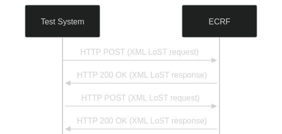

# Test Description: TD_ECRF-LVF_003

## Overview
### Summary
Service boundaries handling

### Description
This test checks if ECRF responds with correct service URN for a requests from location covering:
* fully one service boundary and another one partially
* fully two boundaries

### SIP transport types
Test can be performed with 2 different HTTP transport types. Steps describing actions for specific one are marked as following:
- (TLS transport) - used by default inside ESInet on production environment
- (TCP transport) - used as a fallback if use of TLS is not possible

### References
* Requirements : RQ_ECRF_011
* Test Case    : TC_ECRF_LVF_003

### Requirements
IXIT config file for ECRF-LVF

## Configuration
### Implementation Under Test Interface Connections
<!-- Identify each of the FEs that are part of the configuration and how they are connected -->
* Test System
  * IF_TS_ECRF - connected to IF_ECRF_TS
* ECRF
  * IF_ECRF_TS - connected to IF_TS_ECRF
  * IF_ECRF_ECRF2 - connected to IF_TS_ECRF

### Test System Interfaces
<!-- Identify each of the test system interfaces and whether it will be in active or monitor mode -->
* Test System
  * IF_TS_ECRF - Active
* ECRF
  * IF_ECRF_TS - Active

### Connectivity Diagram
<!--
[](https://mermaid.live/edit#pako:eNpdkN9PgzAQx_8Vcs-MDOwPbIwv0yUm-jL2ZEiWSjsgri0pJYqE_912qDO7vly_97lvrzdBZYQEBseT-agabl30vCt15KMf3mrLuybay95Fxdg7qZZKiKftYV8cHje77aJJLa7aLrUfPgi-6Yq_GN2tVvf_sXACATEoaRVvhZ9zCloJrpFKlsB8Krh9L6HUs-f44Ewx6gqYs4OMYegEd_Kh5X4kBezIT71XO65fjVG_kBStM_Zl2cN5HWcE2ASfwLI8SxBFGOdZRlOMMY1hBOazJCckpSRPib8gOsfwdXZdJyRHa5whQm8QSW9TFIM1Q938DVDb8Jfldes3Ie3GDNp5Vzp_AzjRd9A)
-->


## Pre-Test Conditions

### Test System
* Interfaces are connected to network
* Interfaces have IP addresses assigned by DHCP
* Device is active
* (TLS transport) Test System has it's own certificate signed by PCA

### ECRF
* Interfaces are connected to network
* Interfaces have IP addresses assigned by DHCP
* Default configuration is loaded
* IUT is initialized with steps from IXIT config file
* IUT is active
* IUT is in normal operating state
* IUT is provisioned with following service boundaries:
```
Boundary1 - service SIP URI: sip:boundary1@example.com
40.717309464520554, -73.99120141285248
40.71672360940788, -73.9891917501422
40.71556789497267, -73.9898030924558
40.716159065144886, -73.9917916448061
```

```
Boundary2 - service SIP URI: sip:boundary2@example.com
40.71556789497267, -73.9898030924558
40.716159065144886, -73.9917916448061
40.715035291934925, -73.99236780617362
40.71443880503375, -73.99025982895066
```

## Test Sequence

### Test Preamble

#### Test System
* Install curl[^1]
* Install Wireshark[^2]
* Copy following HTTP scenario files to local storage:
  ```
	findService_polygon_covering_fully_one_and_partialy_another_boundary
	findService_polygon_covering_fully_two_boundaries
  ```

* (TLS transport) Copy to local storage PCA-signed TLS certificate and private key files:
  ```
  PCA-cacert.pem
  PCA-cakey.pem
  ```
* (TLS transport) Copy to local storage TLS certificate and private key files used by ECRF:
  ```
  ECRF-cacert.pem
  ECRF-cakey.pem
  ```
* (TLS transport) Configure Wireshark to decode HTTP over TLS packets from Test System and ECRF as well[^3]
* Using Wireshark on 'Test System' start packet tracing on IF_TS_ECRF and IF_ECRF_ECRF2 interface - run following filter:
   * (TLS transport)
     > ip.addr == IF_TS_ECRF_IP_ADDRESS and tls
   * (TCP transport)
     > ip.addr == IF_TS_ECRF_IP_ADDRESS and http


### Test Body
**Variations**
1. findService_polygon_covering_fully_one_and_partialy_another_boundary
2. findService_polygon_covering_fully_two_boundaries

**Stimulus**

From 'Test System' send HTTP message to ECRF, example:
   * (TLS transport)
     > curl -X POST https://ECRF_URL -H "Content-Type: application/xml" -d @SCENARIO_FILE_PATH

   * (TCP transport)
     > curl -X POST http://ECRF_URL -H "Content-Type: application/xml" -d @SCENARIO_FILE_PATH

**Response**

Variation 1

Using Wireshark verify LoST response from ECRF if returned service URN is from boundary which was fully covered by the polygon (Boundary1)


Variation 2

Using Wireshark verify LoST response from ECRF if returned service URN is one of boundaries covered by the polygon


**VERDICT:**
* PASSED - if all checks passed for variation
* FAILED - all other cases


### Test Postamble
#### Test System
* (TLS transport) stop all Openssl processes (if still running)
* (TCP transport) stop all Netcat processes (if still running)
* archive all logs generated
* stop Wireshark (if still running)
* remove all HTTP scenarios
* disconnect interfaces from ECRF
* (TLS transport) remove certificates

#### ECRF
* disconnect IF_ECRF_TS
* reconnect interfaces back to default


## Post-Test Conditions 
### Test System 
* Test tools stopped
* interfaces disconnected from ECRF

### ECRF
* device connected back to default
* device in normal operating state


## Sequence Diagram
<!--
[](https://mermaid.live/edit#pako:eNrFUV1LwzAU_SvhPjlsR1vTtMvDQKYiuLHh-iCSl9DedUWTzDQF59h_N-2cH7_APJ3A-bj33AOUpkLgEIah0KXRm6bmQhOiGmuNvS6dsS0nG_naotADqcW3DnWJN42srVQ9-fQKbB1Z71uHKpxOL29nj3ec3BfFiqyW64JcPC3mZG48sr1D60Y_0p7ba35ZfEmTKCLLhz_idmf8EKN_DIYAFFolm8o3d-jdBLgtKhTAPaykfREg9NHzZOfMeq9L4M52GEC3q6Q7dwd8KDaAndTPxqgzCavG9744XWY40EABfoB34EmejGlG0zRPkixO0zQLYA_co3HOWJyxPGb-Q7NjAB-DazRmOY3ShLLsirJ4EtMArOnq7fcAte13OaVb1BXamem082HR5PgJyuilKg)
-->




## Comments

Version:  010.3d.3.0.10

Date:     20250425


## Footnotes
[^1]: Curl: https://curl.se/download.html
[^2]: Wireshark - tool for packet tracing and anaylisis. Official website: https://www.wireshark.org/download.html
[^3]: Wireshark configuration to decrypt SIP over TLS packets: https://www.zoiper.com/en/support/home/article/162/How%20to%20decode%20SIP%20over%20TLS%20with%20Wireshark%20and%20Decrypting%20SDES%20Protected%20SRTP%20Stream
