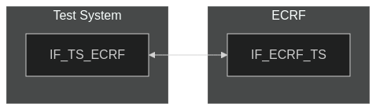
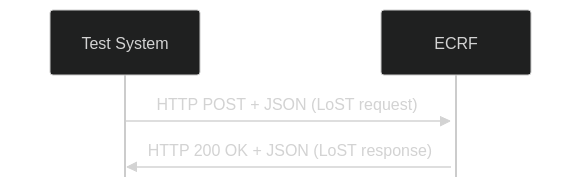

# Test Description: TD_ECRF-LVF_004

## Overview
### Summary
Support of service URN's, listServices, service substitution


### Description
This test checks if ECRF's inside ESInet respond properly for following queries:
* listServices with urn:service:sos
* listServices with urn:emergency:service:sos
* listServicesByLocation with urn:service:sos
* listServicesByLocation with urn:emergency:service:sos


Service substitution is checked in case of the same routing.

### SIP transport types
Test can be performed with 2 different HTTP transport types. Steps describing actions for specific one are marked as following:
- (TLS transport) - used by default inside ESInet on production environment
- (TCP transport) - used as a fallback if use of TLS is not possible

### References
* Requirements : RQ_ECRF_051, RQ_ECRF_052, RQ_ECRF-LVF-054
* Test Case    : TC_ECRF_LVF_004

### Requirements
IXIT config file for ECRF-LVF

## Configuration
### Implementation Under Test Interface Connections
<!-- Identify each of the FEs that are part of the configuration and how they are connected -->
* Test System
  * IF_TS_ECRF - connected to IF_ECRF_TS
* ECRF
  * IF_ECRF_TS - connected to IF_TS_ECRF


### Test System Interfaces
<!-- Identify each of the test system interfaces and whether it will be in active or monitor mode -->
* Test System
  * IF_TS_ECRF - Active
* ECRF
  * IF_ECRF_TS - Active


### Connectivity Diagram
<!--
[](https://mermaid.live/edit#pako:eNpdUMsKgzAQ_BXZs_6AlF7aCoX2op5KQLZmq1KTSEwoIv571yqI3dPszOxzhNJIghherfmUNVoX3FKhA45rUuRZcTmlySGKjpzNkKlF7f2zstjVQU69C7Khd6QWZV-7cKTlX9mmrf5dd_ZDCIqswkbyduNMC3A1KRIQM5Ro3wKEntiH3pls0CXEznoKwXcSHZ0b5FEK4he2PbMd6ocxW06yccbel_N_XwjBGl_Vq2P6AgyGWSg)
-->




## Pre-Test Conditions

### Test System
* Interfaces are connected to network
* Interfaces have IP addresses assigned by DHCP
* Device is active
* (TLS transport) Test System has it's own certificate signed by PCA

### ECRF
* Interfaces are connected to network
* Interfaces have IP addresses assigned by DHCP
* Default configuration is loaded
* IUT is initialized with steps from IXIT config file
* IUT is active
* IUT is in normal operating state
* IUT is provisioned with following service boundaries:
```
Boundary1 - service SIP URI: sip:boundary1@example.com
40.717309464520554, -73.99120141285248
40.71672360940788, -73.9891917501422
40.71556789497267, -73.9898030924558
40.716159065144886, -73.9917916448061
```

```
Boundary2 - service SIP URI: sip:boundary2@example.com
40.71556789497267, -73.9898030924558
40.716159065144886, -73.9917916448061
40.715035291934925, -73.99236780617362
40.71443880503375, -73.99025982895066
```

## Test Sequence

### Test Preamble

#### Test System
* (TLS transport) Install Openssl[^1]
* (TCP transport) Install Netcat[^4]
* Install Wireshark[^2]
* Copy following HTTP scenario files to local storage:
  ```
	listServices_urn-service-sos
	listServices_urn-emergency-service-sos
	listServicesByLocation_urn-service-sos
	listServicesByLocation_urn-emergency-service-sos
  ```
* Change configuration in HTTP scenario files to be used:
  * change /LoST to ECRF URL for LoST
  * change IF_ECRF_TS to ECRF address (FQDN or IP)
* (TLS transport) Copy to local storage PCA-signed TLS certificate and private key files:
  ```
  PCA-cacert.pem
  PCA-cakey.pem
  ```
* (TLS transport) Copy to local storage TLS certificate and private key files used by ECRF:
  ```
  ECRF-cacert.pem
  ECRF-cakey.pem

  ```
* (TLS transport) Configure Wireshark to decode HTTP over TLS packets from Test System and ECRF as well[^3]
* Using Wireshark on 'Test System' start packet tracing on IF_TS_ECRF1 interface - run following filter:
   * (TLS transport)
     > ip.addr == IF_TS_ECRF_IP_ADDRESS and tls
   * (TCP transport)
     > ip.addr == IF_TS_ECRF_IP_ADDRESS and http

#### ECRF
* Backup current configuration
* Provision IUT with file provided


### Test Body

**Variations**
1. listServices_urn-service-sos
2.	listServices_urn-emergency-service-sos
3.	listServicesByLocation_urn-service-sos
4.	listServicesByLocation_urn-emergency-service-sos

**Stimulus**

From 'Test System' send listServices request to ECRF, example:
   * (TLS transport)
     > curl -X POST https://ECRF_URL -d @SCENARIO_FILE
   * (TCP transport)
     > curl -X POST http://ECRF_URL -d @SCENARIO_FILE

**Response**

Variation 1

Verify if ECRF-LVF responded with correct list of it's own services, example:

```
	<?xml version="1.0" encoding="UTF-8"?>
	   <listServicesResponse
	    xmlns="urn:ietf:params:xml:ns:lost1">
	    <serviceList>
	     urn:service:sos.ambulance
	     urn:service:sos.animal-control
	     urn:service:sos.fire
	     urn:service:sos.gas
	     urn:service:sos.mountain
	     urn:service:sos.marine
	     urn:service:sos.physician
	     urn:service:sos.poison
	     urn:service:sos.police
	    </serviceList>
	    <path>
	     <via source="authoritative.example"/>
	    </path>
	   </listServicesResponse>
```


Variation 2

Similar response as in Variation 1 - service names shall contain: ```urn:emergency:service:sos```


Variation 3

Similar response as in Variation 1 - with following exceptions:
* response should be ```<listServicesByLocationResponse>```
* ```<locationUsed``` tag shall be included with ID of location from the request


Variation 4 

Similar response as in Variation 3 - service names shall contain: ```urn:emergency:service:sos```


**VERDICT:**
* PASSED - if all checks passed for variation
* FAILED - all other cases


### Test Postamble
#### Test System
* (TLS transport) stop all Openssl processes (if still running)
* (TCP transport) stop all Netcat processes (if still running)
* archive all logs generated
* stop Wireshark (if still running)
* remove all HTTP scenarios
* disconnect interfaces from ECRF1
* disconnect interfaces from ECRF2
* (TLS transport) remove certificates

#### ECRF
* disconnect IF_ECRF_TS
* reconnect interfaces back to default
* restore previous configuration


## Post-Test Conditions 
### Test System 
* Test tools stopped
* interfaces disconnected from ECRF

### ECRF
* device connected back to default
* device in normal operating state


## Sequence Diagram
<!--
[](https://mermaid.live/edit#pako:eNpdkF1PwjAYhf9K815p2MhY2UZ7QWJQY_yCsF2Z3jTby1h0LbZdIhL-u90QNfaqH885b885QKkrBA5hGApVarVpai4UIW1jjDZXpdPGcrKRbxaFGiCL7x2qEq8bWRvZ9vBpFWgdyffWYRvO56ObxfqWk7uiWJHVMi_IiNzny2dy8aj9wfQm1l3-qnvcy_6YfIvjKCLLh_9yu9P-J14PAbRoWtlUPsWh9xPgttiiAO63lTSvAoQ6ek52Tud7VQJ3psMAul0l3TkH8CFkADupXrRuzxBWje_g6dTSUNaAAD_AB_A4GTMap1GSzFg6pVk2C2Dvr1M6TmiaJYyyKZtQegzgczCNxiyNaebfKJsks5QGYHRXb3_G16ZPcpptUFVoFrpTDvgko8cv6quDSQ)
-->




## Comments

Version:  010.3d.3.0.10

Date:     20250428


## Footnotes
[^1]: Openssl for Linux https://www.openssl.org/docs/
[^2]: Wireshark - tool for packet tracing and anaylisis. Official website: https://www.wireshark.org/download.html
[^3]: Wireshark configuration to decrypt SIP over TLS packets: https://www.zoiper.com/en/support/home/article/162/How%20to%20decode%20SIP%20over%20TLS%20with%20Wireshark%20and%20Decrypting%20SDES%20Protected%20SRTP%20Stream
[^4]: Netcat for Linux https://linux.die.net/man/1/nc
