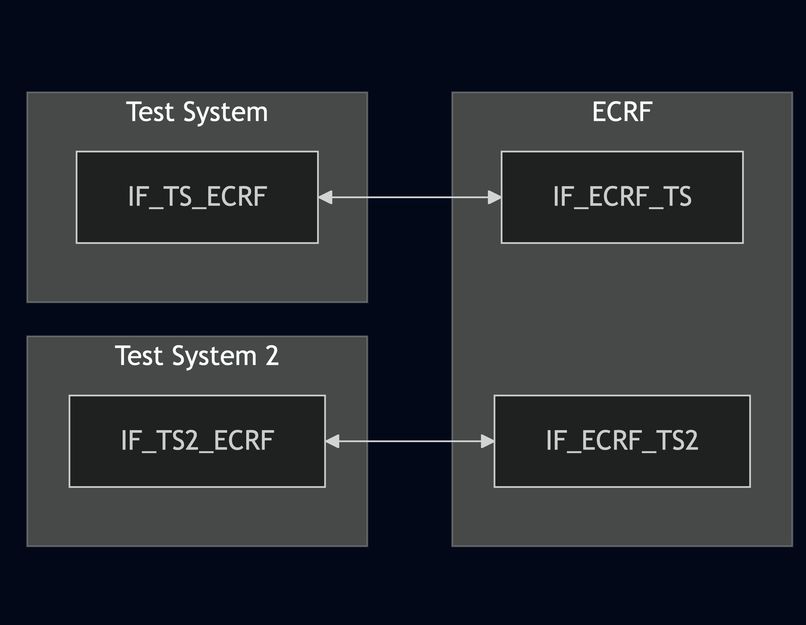

# Test Description: TD_ECRF-LVF_005

## Overview
### Summary
Support of recursive and iterative modes in findService requests


### Description
This test checks if ECRF and LVF support for findService requests:
* recursive mode
* iterative mode


### SIP transport types
Test can be performed with 2 different HTTP transport types. Steps describing actions for specific one are marked as following:
- (TLS transport) - used by default inside ESInet on production environment
- (TCP transport) - used as a fallback if use of TLS is not possible

### References
* Requirements : RQ_ECRF-LVF_043, RQ_ECRF-LVF_050
* Test Case    : TC_ECRF_LVF_005

### Requirements
IXIT config file for ECRF-LVF

## Configuration
### Implementation Under Test Interface Connections
<!-- Identify each of the FEs that are part of the configuration and how they are connected -->
* Test System
  * IF_TS_ECRF - connected to IF_ECRF_TS
* ECRF
  * IF_ECRF_TS - connected to IF_TS_ECRF
  * IF_ECRF_TS2 - connected to IF_TS2_ECRF
* Test System 2
  * IF_TS2_ECRF - connected to IF_ECRF_TS2

### Test System Interfaces
<!-- Identify each of the test system interfaces and whether it will be in active or monitor mode -->
* Test System
  * IF_TS_ECRF - Active
* ECRF
  * IF_ECRF_TS - Active
  * IF_ECRF_TS2 - Active
* Test System 2
  * IF_TS2_ECRF - Active

### Connectivity Diagram
<!--
[](https://mermaid.live/edit#pako:eNp1UU1vgzAM_SvIZ4pCwmc07dKt0qTtUnqakKqMpIBWCApBG0P89wW6rh3q7Ev8np-fIw-QSS6AwuEoP7KCKW09b9PaMtF2b7liTWHtRKutpG-1qE7MFE-b_S7ZP663mxMmar6QXbif_gkwolsY_m_IlbeFF-74lv1lr7vV6n7peqX7S5vZU049YEOuSg5Uq07YUAlVsamEYeJT0IWoRArUPDlT7ymk9Wg0DatfpazOMiW7vAB6YMfWVF3DmRYPJTO_qn5RZbYWai27WgN1g2AeAnSAT6AYuw5CQRwSHBCMEIps6A3s-Q7BbuzFhGAcht5ow9dsixw_DgMSRG4URX6ECLaBdVomfZ2dlxK81FK9nC4-H378BkpElmM)
-->




## Pre-Test Conditions

### Test System
* Interfaces are connected to network
* Interfaces have IP addresses assigned by DHCP
* Device is active
* (TLS transport) Test System has it's own certificate signed by PCA

### ECRF
* Interfaces are connected to network
* Interfaces have IP addresses assigned by DHCP
* Default configuration is loaded
* IUT is configured to use Test System 2 as another ECRF
* IUT is initialized with steps from IXIT config file
* IUT is active
* IUT is in normal operating state
* IUT is provisioned with following service boundaries:
```
Boundary1 - service SIP URI: sip:boundary1@example.com
40.717309464520554, -73.99120141285248
40.71672360940788, -73.9891917501422
40.71556789497267, -73.9898030924558
40.716159065144886, -73.9917916448061
```

```
Boundary2 - service SIP URI: sip:boundary2@example.com
40.71556789497267, -73.9898030924558
40.716159065144886, -73.9917916448061
40.715035291934925, -73.99236780617362
40.71443880503375, -73.99025982895066
```

### Test System 2
* Interfaces are connected to network
* Interfaces have IP addresses assigned by DHCP
* Device is active
* (TLS transport) Test System has it's own certificate signed by PCA

## Test Sequence

### Test Preamble

#### Test System
* (TLS transport) Install Openssl[^1]
* (TCP transport) Install Netcat[^4]
* Install Wireshark[^2]
* Copy following HTTP scenario files to local storage:
  ```
	findService_recursive_mode_polygon_not_covering_boundaries
	findService_iterative_mode_polygon_not_covering_boundaries
  ```
* (TLS transport) Copy to local storage PCA-signed TLS certificate and private key files:
  ```
  PCA-cacert.pem
  PCA-cakey.pem
  ```
* (TLS transport) Copy to local storage TLS certificate and private key files used by ECRF:
  ```
  ECRF-cacert.pem
  ECRF-cakey.pem

  ```
* (TLS transport) Configure Wireshark to decode HTTP over TLS packets from Test System and ECRF as well[^3]
* Using Wireshark on 'Test System' start packet tracing on IF_TS_ECRF interface - run following filter:
   * (TLS transport)
     > (ip.addr == IF_TS_ECRF_IP_ADDRESS) and tls
   * (TCP transport)
     > (ip.addr == IF_TS_ECRF_IP_ADDRESS) and http

#### Test System 2
* (TLS transport) Install Openssl[^1]
* (TCP transport) Install Netcat[^4]
* Install Wireshark[^2]
* (TLS transport) Configure Wireshark to decode HTTP over TLS packets from Test System and ECRF as well[^3]
* Using Wireshark on 'Test System' start packet tracing on IF_TS2_ECRF interface - run following filter:
   * (TLS transport)
     > (ip.addr == IF_TS2_ECRF_IP_ADDRESS) and tls
   * (TCP transport)
     > (ip.addr == IF_TS2_ECRF_IP_ADDRESS) and http
* Start http server responding for HTTPS GET requests:
    * (TCP transport)
      ```
      echo -e "HTTP/1.1 200 OK\r\nContent-Type: application/lost+xml\r\nContent-Length: 1212\r\n\r\n$(cat findServiceResponse | \
      nc -lp 80
      ```
    * (TLS transport)
      ```
      echo -e "HTTP/1.1 200 OK\r\nContent-Type: application/lost+xml\r\nContent-Length: 1212\r\n\r\n$(cat findServiceResponse | \
      openssl s_server -quiet -accept LOCAL_PORT -cert test_system2.pem -key test_system2.key
      ```

### Test Body

**Variations**
1. findService_recursive_mode_polygon_not_covering_boundaries
2. findService_iterative_mode_polygon_not_covering_boundaries

**Stimulus**
From 'Test System' send request with recursion enabled to ECRF:
   * (TLS transport)
     > curl -X GET https://ECRF_URL -d @SCENARIO_FILE
   * (TCP transport)
     > curl -X GET http://ECRF_URL -d @SCENARIO_FILE

**Response**

Variation 1

Using Wireshark verify if ECRF:
- Sends HTTP LoST request to another ECRF to get info about polygon from the request
- Sends back the response received from another ECRF


Variation 2

Using Wireshark verify if ECRF:
- responds HTTP 3XX message
- message contain Location header field with URL to another ECRF


**VERDICT:**
* PASSED - if all checks passed for variation
* FAILED - all other cases

### Test Postamble
#### Test System
* (TLS transport) stop all Openssl processes (if still running)
* (TCP transport) stop all Netcat processes (if still running)
* archive all logs generated
* stop Wireshark (if still running)
* remove all HTTP scenarios
* disconnect interfaces from ECRF
* (TLS transport) remove certificates

#### ECRF
* disconnect IF_ECRF_TS
* disconnect IF_ECRF_ECRF2
* reconnect interfaces back to default
* restore previous configuration

#### Test System 2
* (TLS transport) stop all Openssl processes (if still running)
* (TCP transport) stop all Netcat processes (if still running)
* archive all logs generated
* stop Wireshark (if still running)
* remove all HTTP scenarios
* disconnect interfaces from ECRF
* (TLS transport) remove certificates

## Post-Test Conditions 
### Test System 
* Test tools stopped
* interfaces disconnected from ECRF

### ECRF
* device connected back to default
* device in normal operating state

### Test System 2
* Test tools stopped
* interfaces disconnected from ECRF

## Sequence Diagram
<!--
[](https://mermaid.live/edit#pako:eNqlUl1LwzAU_SvhvtqOLl0_FnAgU_FhirgpQ_oS2rstaJN5m07n2H-37dwHbKhgnpLLOeceTs4KUpMhCHBdN9Gp0RM1FYlmLFdEhi5Sa6gQbCJfC0x0AyrwrUSd4qWSU5J5Dd6cO2ORmQUSG2Fh2XBZWMwddtV_uBbsSZKSVhnN2nvGAc7t9c42yJvR6J4NzHDEqN5UIQjTkgq1wHNLJe7pNb7mHcgwfkrAGia1sbPKWs05aYDxSurYQTE3ujjeeUD8Gf_HUPg_Qvn-nF8d-uPxziB7V3bGHh8GiQYHpqQyEHW4DuRIuayfsKo1E6hiyzEBUV0zSS8JJHpdceZSPxuTb2lkyukMROPFgXKeSbttyG5KqDOkvim1BRFEYSMCYgUfIDhvtzwv7EY-D33ueV7swLIad4KWz9vdTtf3OY-iztqBz2at1wq6UeiHcTuO4yD2fO6ALK0ZLnW6NYWZqvp7u2l4U_T1F1fY6Zg)
-->


## Comments

Version:  010.3d.3.0.10

Date:     20250523


## Footnotes
[^1]: Openssl for Linux https://www.openssl.org/docs/
[^2]: Wireshark - tool for packet tracing and anaylisis. Official website: https://www.wireshark.org/download.html
[^3]: Wireshark configuration to decrypt SIP over TLS packets: https://www.zoiper.com/en/support/home/article/162/How%20to%20decode%20SIP%20over%20TLS%20with%20Wireshark%20and%20Decrypting%20SDES%20Protected%20SRTP%20Stream
[^4]: Netcat for Linux https://linux.die.net/man/1/nc
