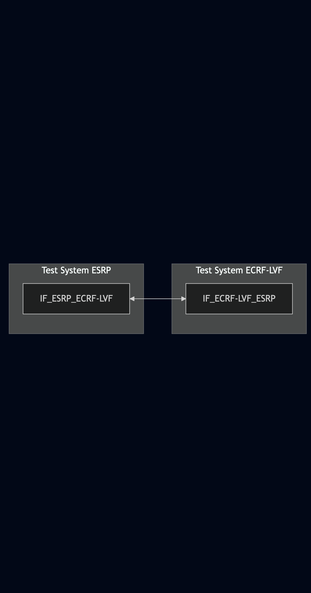
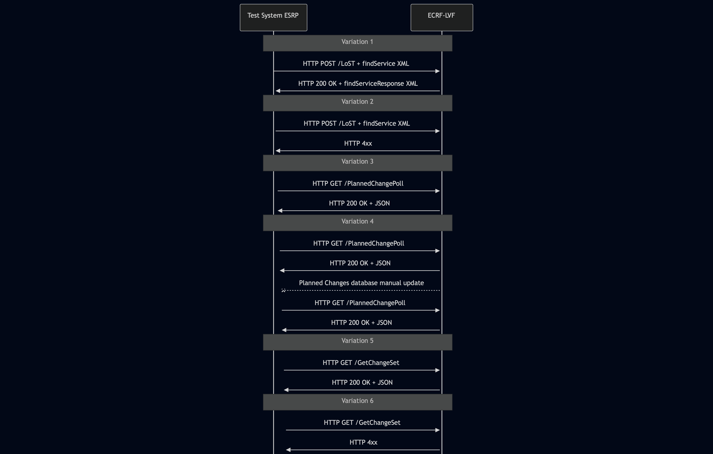

# Test Description: TD_ECRF-LVF_006

## Overview
### Summary
Support of draft-ecrit-lost-planned-changes


### Description
This test checks if ECRF-LVF support planned change polling

### HTTP transport types
Test can be performed with 2 different HTTP transport types. Steps describing actions for specific one are marked as following:
- (TLS transport) - used by default inside ESInet on production environment
- (TCP transport) - used as a fallback if use of TLS is not possible

### References
* Requirements : RQ_ECRF-LVF_003, RQ_ECRF-LVF_004, RQ_ECRF-LVF_015
* Test Case    : TC_ECRF_LVF_006

### Requirements
IXIT config file for ECRF-LVF

## Configuration
### Implementation Under Test Interface Connections
<!-- Identify each of the FEs that are part of the configuration and how they are connected -->
* Test System ESRP
  * IF_ESRP_ECRF-LVF - connected to IF_ECRF-LVF_ESRP
* ECRF-LVF
  * IF_ECRF-LVF_ESRP - connected to IF_ESRP_ECRF-LVF


### Test System Interfaces
<!-- Identify each of the test system interfaces and whether it will be in active or monitor mode -->
* Test System ESRP
  * IF_ESRP_ECRF-LVF - Active
* ECRF-LVF
  * IF_ECRF-LVF_ESRP - Active

### Connectivity Diagram
<!--
https://mermaid.live/edit#pako:eNp9UU1rhDAQ_SsyZxXjatRQetmuUNhC0dJDEZZUsypdE4mR1or_vVk_CttD5zTvzZs3D2aEXBQMCJwv4jOvqFTGMcm4oesxPh3S5Pl02CexdXyN7yzr_sqtcB5mfNF2_XspaVsZL6xTRjp0ijXGIjDW-mu3TBgv_nO40W4utwFWFzChlHUBRMmemdAw2dArhPEqyUBVrGEZEN0WVH5kkPFJ77SUvwnRbGtS9GUF5EwvnUZ9W1DFHmqqkzW_rNTXmNyLnisgrhvNJkBG-AKCPNuNUBAGjh-5GAc4MGHQNPZshFG0w04Y-r6mJxO-57vIdh3HRVGII4x22At8E2ivRDrwfEvFiloJ-bQ8av7X9AM8koNu
-->




## Pre-Test Conditions

### Test System ESRP
* Interfaces are connected to network
* Interfaces have IP addresses assigned by DHCP
* Device is active
* (TLS transport) Test System has it's own certificate signed by PCA

### ECRF-LVF
* Interfaces are connected to network
* Interfaces have IP addresses assigned by DHCP
* Default configuration is loaded
* IUT is configured with planned changes
* IUT is initialized with steps from IXIT config file
* IUT is active
* IUT is in normal operating state

<!--
* IUT is provisioned with following service boundaries:
```
Boundary1 - service SIP URI: sip:boundary1@example.com
40.717309464520554, -73.99120141285248
40.71672360940788, -73.9891917501422
40.71556789497267, -73.9898030924558
40.716159065144886, -73.9917916448061
```

```
Boundary2 - service SIP URI: sip:boundary2@example.com
40.71556789497267, -73.9898030924558
40.716159065144886, -73.9917916448061
40.715035291934925, -73.99236780617362
40.71443880503375, -73.99025982895066
```
-->


## Test Sequence

### Test Preamble

#### Test System ESRP
* Install CuRL[^1]
* Install Wireshark[^2]
* Copy following HTTP scenario files to local storage:
  ```
	plannedChangePoll
  ```
* (TLS transport) Copy to local storage PCA-signed TLS certificate and private key files:
  ```
  PCA-cacert.pem
  PCA-cakey.pem
  ```
* (TLS transport) Copy to local storage TLS certificate and private key files used by ECRF:
  ```
  ECRF-cacert.pem
  ECRF-cakey.pem

  ```
* (TLS transport) Configure Wireshark to decode HTTP over TLS packets from Test System ESRP and ECRF-LVF as well[^3]
* Using Wireshark on 'Test System ESRP' start packet tracing on IF_ESRP_ECRF-LVF interface - run following filter:
   * (TLS transport)
     > (ip.addr == IF_ESRP_ECRF-LVF_IP_ADDRESS) and tls
   * (TCP transport)
     > (ip.addr == IF_ESRP_ECRF-LVF_IP_ADDRESS) and http


### Test Body

**Variations**
1. findService_with_correct_asOf
2. findService_with_inccorrect_asOf
3. HTTP GET to /PlannedChangePoll
4. Updating PlannedChangeIdList
5. HTTP GET to /GetChangeSet with correct changeSetId
6. HTTP GET to /GetChangeSet with incorrect changeSetId

**Stimulus**

Variation 1-2

From 'Test System ESRP' send HTTP POST with findService_with_correct_asOf:
   * (TLS transport)
     > curl -X POST -H "Content-Type: application/lost+plannedChange" --data @SCENARIO_FILE https://ECRF-LVF_FQDN_OR_IP:PORT/LoST
   * (TCP transport)
     > curl -X POST -H "Content-Type: application/lost+plannedChange" --data @SCENARIO_FILE http://ECRF-LVF_FQDN_OR_IP:PORT/LoST

Variation 3

From 'Test System ESRP' send HTTP GET request:
   * (TLS transport)
     > curl -X GET https://ECRF-LVF_FQDN_OR_IP:PORT/PlannedChangePoll
   * (TCP transport)
     > curl -X GET http://ECRF-LVF_FQDN_OR_IP:PORT/PlannedChangePoll

Variation 4

1. From 'Test System ESRP' send HTTP GET request:
   * (TLS transport)
     > curl -X GET https://ECRF-LVF_FQDN_OR_IP:PORT/PlannedChangePoll
   * (TCP transport)
     > curl -X GET http://ECRF-LVF_FQDN_OR_IP:PORT/PlannedChangePoll
2. On ECRF-LVF update manually database of planned changes
3. Send HTTP GET request from Step 1

Variation 5

From 'Test System ESRP' send HTTP GET request using changeSetId from ECRF-LVF received in the response for Variation 3
   * (TLS transport)
     > curl -X GET https://ECRF-LVF_FQDN_OR_IP:PORT/GetChangeSet?changeSetId=CHANGE_SET_ID_RECEIVED_IN_VAR_3
   * (TCP transport)
     > curl -X GET http://ECRF-LVF_FQDN_OR_IP:PORT/GetChangeSet?changeSetId=CHANGE_SET_ID_RECEIVED_IN_VAR_3

Variation 6

From 'Test System ESRP' send HTTP GET request using incorrect changeSetId
   * (TLS transport)
     > curl -X GET https://ECRF-LVF_FQDN_OR_IP:PORT/GetChangeSet?changeSetId=ANY_INCORRECT_CHANGE_SET_ID
   * (TCP transport)
     > curl -X GET http://ECRF-LVF_FQDN_OR_IP:PORT/GetChangeSet?changeSetId=ANY_INCORRECT_CHANGE_SET_ID

**Response**

Variation 1

Using Wireshark verify if ECRF-LVF:
- Responds with 200 OK response containing correct findServiceResponse XML body
- findServiceResponse contains 'asOf' with timestamp the same date and time as requested in the stimulus 'asOf'


Variation 2

Using Wireshark verify if ECRF-LVF returns 4xx error message


Variation 3

Using Wireshark verify if ECRF-LVF:
- responds with 200 OK containing correct JSON body
- JSON body contains PlannedChangeIdList array with string items

Variation 4

Using Wireshark compare JSON responses from ECRF-LVF for HTTP GET to /PlannedChangePoll request:
- initial and latest JSON should be different - updating planned changes database should trigger ECRF-LVF to update PlannedChangeIdList as well

Variation 5

Using Wireshark verify if ECRF-LVF:
- responds with 200 OK containing correct JSON body
- JSON body contains ChangeSet object with:
	- 'changeSetID' string value
	- 'changeSetEffective' with timestamp (containing timezone)
 	- 'partialLocationList' array with: <!-- https://www.iana.org/assignments/civic-address-types-registry/civic-address-types-registry.xhtml -->
		- 'namespace' string value being "Namespace URI" from CAtype IANA registry (f.e. urn:ietf:params:xml:ns:pidf:geopriv10:civicAddr) 
		- 'caType' string value with CAtype from IANA registry (f.e. 16)
		- 'value' string


Variation 6

Using Wireshark verify if ECRF-LVF returns 4xx error message  

**VERDICT:**
* PASSED - if all checks passed for variation
* FAILED - all other cases

### Test Postamble
#### Test System ESRP
* archive all logs generated
* stop Wireshark (if still running)
* remove all HTTP scenarios
* disconnect interfaces from ECRF
* (TLS transport) remove certificates

#### ECRF-LVF
* reconnect interfaces back to default
* restore previous configuration

## Post-Test Conditions 
### Test System ESRP
* Test tools stopped
* interfaces disconnected from ECRF

### ECRF-LVF
* device connected back to default
* device in normal operating state


## Sequence Diagram
<!--
https://mermaid.live/edit#pako:eNrVVV1r2zAU_SsXvdbO_BXH1kNhZGnHljYmDmUMv2j2jSNmS5ksl6Qh_32K3WSseVkK6xgGYV2fc-7RRb53R3JZIKHEtu1M5FIseUkzAVBzpaR6n2upGgpLVjWYiQ7U4I8WRY4fOCsVqw9ggDVTmud8zYSGBTYa0m2jsYZJOk_OEZPx_MaePtz0X-6lRpCPqM6Y1hFI4YEpzjSXAtye9RJrX19fneAfF4sEklm6gHdTadYrWHJRpKgeeY7w5W7aaxzxB-5LPQqdiOc4MPv8u8Acm7U0dfgldOERvDc9QrDZvMql_6cubyfGZFIxIbAYr5goMZFVdXmJP6Wz-1c5Df6d0xPL3pyTnjNBn6qBgmn2jZmLUzPRsgratYngf1Pm4UVOb1H3LlPUb2gy_PsmzQ9FLFIqXhCqVYsWqVHV7LAlu4NKRvQKa8wINa8FU98zkom94Zju91XK-khTsi1XhHbd1SL9bXhuq6eoQlGgGstWaEJ9L-pECN2RDaGu5wyiOApDx3dHXmAei2xNOIoHcTwcumEwin3Pj4d7izx1eZ3ByHedKA5c3zW0IHQtwlot063Ij66w4Kbr3_VzoRsP-5-zuuLJ
-->




## Comments

Version:  010.3d.5.0.3

Date:     20251105


## Footnotes
[^1]: CURL for Linux https://linux.die.net/man/1/curl
[^2]: Wireshark - tool for packet tracing and anaylisis. Official website: https://www.wireshark.org/download.html
[^3]: Wireshark configuration to decrypt SIP over TLS packets: https://www.zoiper.com/en/support/home/article/162/How%20to%20decode%20SIP%20over%20TLS%20with%20Wireshark%20and%20Decrypting%20SDES%20Protected%20SRTP%20Stream
