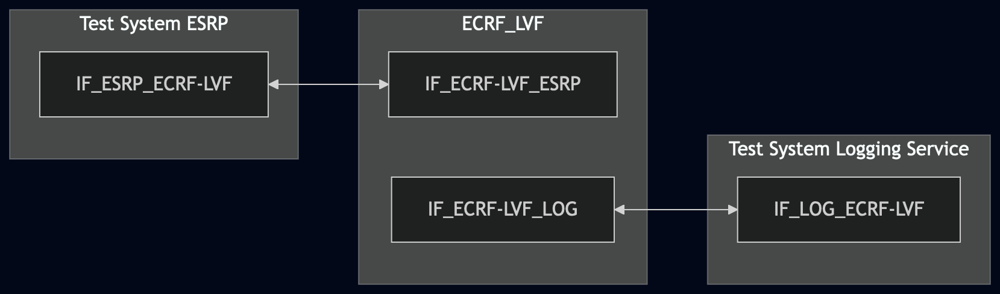
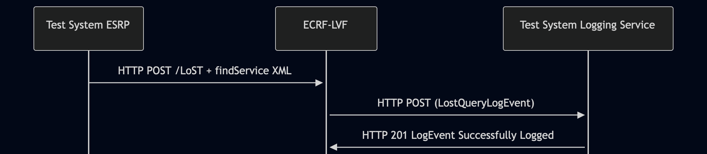

# Test Description: TD_ECRF-LVF_007

## Overview
### Summary
Verification of JSON Web Signature (JWS) format used in LogEvents sent by ECRF-LVF


### Description
Test covers that ECRF-LVF, when sending LogEvents to the Logging Service, uses:
* flat JSON serialization format for JWS 
* EdDSA algorithm with Curve448 for signed LogEvents, OR algorithm "none" for unsigned LogEvents 

### HTTP transport types
Test can be performed with 2 different HTTP transport types. Steps describing actions for specific one are marked as following:
- (TLS transport) - used by default inside ESInet on production environment
- (TCP transport) - used as a fallback if use of TLS is not possible

### References
* Requirements : RQ_ECRF-LVF_103
* Test Case    : TC_ECRF_LVF_007

### Requirements
IXIT config file for ECRF-LVF

## Configuration
### Implementation Under Test Interface Connections
<!-- Identify each of the FEs that are part of the configuration and how they are connected -->
* Test System ESRP
  * IF_ESRP_ECRF-LVF - connected to IF_ECRF-LVF_ESRP
* ECRF-LVF
  * IF_ECRF-LVF_ESRP - connected to IF_ESRP_ECRF-LVF
  * IF_ECRF-LVF_LOG - connected to IF_LOG_ECRF-LVF
* Test System Logging Service
  * IF_LOG_ECRF-LVF - connected to IF_ESRP_LOG


### Test System Interfaces
<!-- Identify each of the test system interfaces and whether it will be in active or monitor mode -->
* Test System ESRP
  * IF_ESRP_ECRF-LVF - Active
* ECRF-LVF
  * IF_ECRF-LVF_ESRP - Active
  * IF_ECRF-LVF_LOG - Active
* Test System Logging Service
  * IF_LOG_ECRF-LVF - Active

### Connectivity Diagram
<!--
https://mermaid.live/edit#pako:eNp1Ul1Pg0AQ_Ctkn2lD-Sh4Mb7UYkwwGjA-GBJywhaI5a45DrWS_ncP6Ae2uk-7M3Ozc8m2kPIMgcBqzT_TggqpBWHMNFX3frKMwqdkuQj9SfDiX08mNx22H3vypDygwePdXqi6Izzo6uYtF3RTaM9YSy3a1hIr7WTz19KBQZadOXR8cuTPQ1x6juL9ZzkOFfA8L1muRSg-yhR_eV3-S3mBDrkoMyBSNKhDhaKi3QhtJ4lBFlhhDES1GRXvMcRsp95sKHvlvDo8E7zJCyAruq7V1GwyKvG2pCpfdUSF2oZiwRsmgVie05sAaeELiGlMHaMrx3Jnc29m67AFMnO9qWuYpmmZjmMb3tzZ6fDdrzWmnmtfjUsH2kgebVl6CIVZKbl4GM6kv5bdDyjDpu8
-->




## Pre-Test Conditions

### Test System ESRP/Test System Logging Service
* Interfaces are connected to network
* Interfaces have IP addresses assigned by DHCP
* Device is active
* No active calls
* (TLS transport) Test System has it's own certificate signed by PCA

### ECRF-LVF
* Interfaces are connected to network
* Interfaces have IP addresses assigned by DHCP
* Default configuration is loaded
* IUT is configured with planned changes
* IUT is initialized with steps from IXIT config file
* IUT is active
* IUT is in normal operating state
* IUT is provisioned with following service boundary:
```
Boundary1 - service SIP URI: sip:boundary1@example.com
40.717309464520554, -73.99120141285248
40.71672360940788, -73.9891917501422
40.71556789497267, -73.9898030924558
40.716159065144886, -73.9917916448061
```


## Test Sequence

### Test Preamble

#### Test System ESRP
* Install CuRL[^1]
* Install Wireshark[^2]
* Copy following HTTP scenario file to local storage:
  ```
	 findService_geodetic_point.xml
  ```
* (TLS transport) Copy to local storage PCA-signed TLS certificate and private key files:
  ```
     PCA-cacert.pem
     PCA-cakey.pem
  ```
* (TLS transport) Copy to local storage TLS certificate and private key files used by ECRF:
  ```
     ECRF-cacert.pem
     ECRF-cakey.pem

  ```
* (TLS transport) Configure Wireshark to decode HTTP over TLS packets from Test System ESRP and ECRF-LVF as well[^3]
* Using Wireshark on 'Test System ESRP' start packet tracing on IF_ESRP_ECRF-LVF interface - run following filter:
   * (TLS transport)
     > (ip.addr == IF_ESRP_ECRF-LVF_IP_ADDRESS) and tls
   * (TCP transport)
     > (ip.addr == IF_ESRP_ECRF-LVF_IP_ADDRESS) and http

#### Test System Logging Service
* Install Wireshark[^2]
* Install OpenSSL v1.1.1 or higher[^5].
* (TLS v1.2) Configure Wireshark to decode HTTP over TLS, use tests system and ECRF-LVF certificate keys [^3]
* (TLS v1.3) Configure logging of session keys and configure Wireshark to decode HTTP over TLS [^4]
* Using Wireshark on 'Test System' start packet tracing on IF_LOG_ECRF-LVF interface - run following filter:
   * (TLS)
     > ip.addr == IF_LOG_ECRF-LVF_IP_ADDRESS and tls
   * (TCP)
     > ip.addr == IF_LOG_ECRF-LVF_IP_ADDRESS and http
* The Logging Service must be configured to accept and process HTTP POST requests. To verify this manually, you can simulate a listening HTTP endpoint on port 8080 using command in the terminal:
    * Step 1 - Prepare logEventId and JSON body
      ```
      ID="urn:emergency:uid:logid:$(date +%s%N):logger.state.pa.us"
      BODY="{\"logEventId\":\"$ID\"}"
      ```
    * Step 2 - Run server:
      * (TLS)
      ```
      python3 http_entry.py --ip IF_LOG_ECRF-LVF --port 443 --role RECEIVER --path /LogEvents --method POST 
      --body "$BODY" --content_type application/json --response_code 201 --server_cert /tmp/cert.crt --server_key /tmp/cert.key
      ```
      * (TCP)
      ```
      python3 http_entry.py --ip IF_LOG_ECRF-LVF --port 8080 --role RECEIVER --path /LogEvents --method POST --body "$BODY" --content_type application/json --response_code 201
      ```
    * Step 3 - In another terminal, send a POST request to verify it is working:
      * (TLS)
      ```
      curl -k -X POST http://localhost:8080 -d '{"log":"test"}'
      ```   
      * (TCP)
      ```
      curl -X POST http://localhost:8080 -d '{"log":"test"}'

### Test Body
#### Stimulus
From 'Test System ESRP' send HTTP POST with findService_geodetic_point:
   * (TLS)
     ```
        curl --cacert cacert.pem --cert client.pem --key client.key \
        -X POST https://IF_ECRF_ESRP_IP:PORT/LoST \
        -H "Content-Type: application/lost+xml" \
        --data-binary @findService_geodetic_point.xml
     ```
   * (TCP)
     ```
        curl -X POST http://IF_ECRF_ESRP_IP:PORT/LoST \
        -H "Content-Type: application/lost+xml" \
        --data-binary @findService_geodetic_point.xml
     ```

#### Response
Using traced packets on Wireshark verify:
* If ECRF-LVF sends HTTP POST to Test System Logging Service with JWS body containing FLat JSON Serialization Format:
  * The body MUST be a JSON object containing exactly the following top-level fields (and no others from the alternative formats):
    * "protected" - a Base64url-encoded string (the JWS Protected Header)
    * "payload" - a Base64url-encoded string (the LogEvent content)
    * "signature" - a Base64url-encoded string (the digital signature or empty string if unsigned)
    
    Correct example:
    ```
    {
       "protected": "eyJhbGciOiJFZERTQSJ9",
       "payload": "eyJsb2dFdmVudFR5cGUiOiAiLi4uIn0",
       "signature": "BASE64URL_SIGNATURE_VALUE"
    }
    ```
  * JWS body does NOT use:
    * JWS Compact Serialization - which would appear as a single dot-delimited string in the 
      format 
      ``` 
      BASE64URL.BASE64URL.BASE64URL
      ```
    * General JWS JSON Serialization - which would contain a "signatures" array field (plural)
  * The "payload" field decoded from Base64url contains a valid LogEvent JSON object (e.g. a CallStartLogEvent, MediaStartLogEvent, or other event type as appropriate for the triggered stimulus). This confirms the JWS wraps actual LogEvent content
  * Decode the "protected" field from Base64url and parsed JSON contains one "alg" field with one of value:
    * "EdDSA" - if the Logging Service policy requires signed LogEvents;
    * "none" - if the Logging Service policy permits unsigned LogEvents.
  * If "protected" contain "alg": "EdDSA":
    * check if "signature" contains string value
    * using PCA-signed key file used by ECRF-LVF verify if JWS object is properly signed, use decode_jws method, example 
      command:
      
    ```
           python3 -m main decode_jws JWS_FILE_PATH --key ECRF-LVF.key --password pass123
    ```

    * verify if method did not return any decoding errors
    * verify if key file used by ECRF-LVF for JWS signing is Edwards-curve Digital Signature Algorithm (ECDSA) with 
      Curve448, run example command:

    ```
    openssl pkey -in ECRF-LVF.key -text -noout
    ```

    Command must return "ED448", example:

    ```
    ED448 Private-Key:
    priv:
        cb:18:b3:9a:3a:09:ba:87:ad:86:79:0c:84:08:79:
        2a:16:31:76:19:a1:0f:92:1e:11:e5:7f:2c:7a:01:
        66:7e:f8:2a:04:47:8a:da:25:c2:c8:99:3a:52:20:
        37:54:a5:ea:d9:1d:a0:70:29:d8:3b:20
    pub:
        07:cc:7b:cc:d0:ff:e6:1c:79:fc:65:df:18:fc:f2:
        89:15:db:68:6a:08:2c:b6:7d:20:45:e8:81:64:b6:
        4c:8f:62:f1:63:df:f5:b3:38:ea:14:d4:28:0a:2b:
        88:62:7d:32:ed:c3:ab:8d:fc:a3:e0:80
    ```
  * If "protected" contain "alg": "none":
    * check that "signature" is empty

VERDICT:
* PASSED - if all checks passed
* FAILED - any other cases

### Test Postamble
#### Test System ESRP/Test System Logging Service
* archive all logs generated
* stop Wireshark (if still running)
* remove all HTTP scenarios
* disconnect interfaces from ECRF
* (TLS transport) remove certificates

#### ECRF-LVF
* reconnect interfaces back to default
* restore previous configuration

## Post-Test Conditions 
### Test System ESRP/Test System Logging Service
* Test tools stopped
* interfaces disconnected from ECRF

### ECRF-LVF
* device connected back to default
* device in normal operating state


## Sequence Diagram
<!--
https://mermaid.live/edit#pako:eNptkk1Pg0AQhv_KZk6aQgVaSt1DE1PbeKCxFmKM4UJgoMSyW_ejEZv-d_koVo1z2Mwk7_vMZHaOkPAUgYJpmhFLOMuKnEaMkLIQgou7RHEhKcnincSItSKJ7xpZgvdFnIu4bMRdXLIQpSJBJRWWZBFs1uZsNljMN0vTf17ShzBck_VjEJIbn9fvgGQFSwMUhyJB8rLyL5ze0_h_Mn2e5wXLydlEyYV55XOpnjSKqhYtDsjU9f9z_WH8GrHjOZZNeggJdJKglJne7arWi-mZCwbkokiBKqHRgBJFGTclHBtBBGqLJUZA6zSNxVsEETvVnn3MXjkve5vgOt8CbRdtgN6nseo3_C1BlqKYc80U0NuWAPQIH0Ada-haTbgjz55M7bEBFVDbmw49y3GckeO6Y2s6cU8GfLY9reHU6xznsA2IteJBxZK-HaZF_fmr7jzaKzl9AfUAq4A
-->




## Comments

Version:  010.3d.5.0.1

Date:     20260602


## Footnotes
[^1]: CURL for Linux https://linux.die.net/man/1/curl
[^2]: Wireshark - tool for packet tracing and anaylisis. Official website: https://www.wireshark.org/download.html
[^3]: Wireshark configuration to decrypt SIP over TLS packets: https://www.zoiper.com/en/support/home/article/162/How%20to%20decode%20SIP%20over%20TLS%20with%20Wireshark%20and%20Decrypting%20SDES%20Protected%20SRTP%20Stream
[^4]: TLS v1.3 session keys logging + Wireshark configuration to decrypt traffic: https://my.f5.com/manage/s/article/K50557518
[^5]: OpenSSL v1.1.1 or higher - toolkit required for TLS operations and certificate/key handling. Official website and downloads: https://www.openssl.org/source/ . Installation documentation: https://github.com/openssl/openssl/blob/master/INSTALL.md