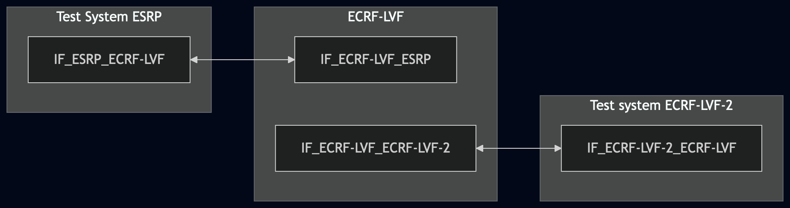
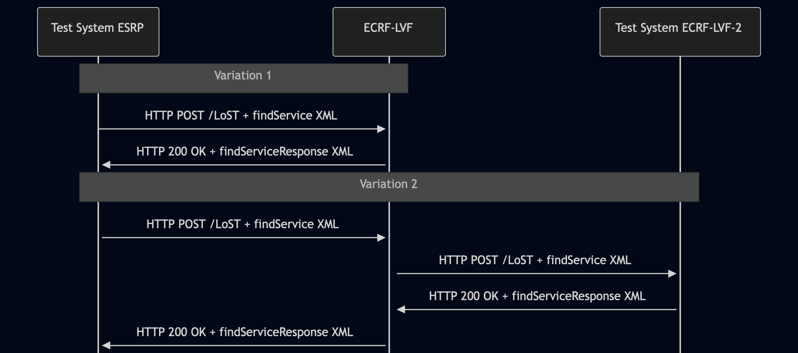

# Test Description: TD_ECRF-LVF_008

## Overview
### Summary
ECRF-LVF implement the Call and Incident ID extension


### Description
ECRF-LVF implement the Call and Incident ID extension

### HTTP transport types
Test can be performed with 2 different HTTP transport types. Steps describing actions for specific one are marked as following:
- (TLS transport) - used by default inside ESInet on production environment
- (TCP transport) - used as a fallback if use of TLS is not possible

### References
* Requirements : RQ_ECRF-LVF_057
* Test Case    : TC_ECRF_LVF_008

### Requirements
IXIT config file for ECRF-LVF

## Configuration
### Implementation Under Test Interface Connections
<!-- Identify each of the FEs that are part of the configuration and how they are connected -->
* Test System ESRP
  * IF_ESRP_ECRF-LVF - connected to IF_ECRF-LVF_ESRP
* ECRF-LVF
  * IF_ECRF-LVF_ESRP - connected to IF_ESRP_ECRF-LVF
  * IF_ECRF-LVF_ECRF-LVF-2 - connected to IF_ECRF-LVF-2_ECRF-LVF
* Test System ECRF-LVF-2
  * IF_ECRF-LVF-2_ECRF-LVF - connected to IF_ECRF-LVF_ECRF-LVF-2


### Test System Interfaces
<!-- Identify each of the test system interfaces and whether it will be in active or monitor mode -->
* Test System ESRP
  * IF_ESRP_ECRF-LVF - Active
* ECRF-LVF
  * IF_ECRF-LVF_ESRP - Active
  * IF_ECRF-LVF_ECRF-LVF-2 - Active
* Test system ECRF-LVF-2
  * IF_ECRF-LVF-2_ECRF-LVF - Active

### Connectivity Diagram
<!--
https://mermaid.live/edit#pako:eNp1kl1rgzAUhv-KnGsVTWuVMHbTVRh0MHTsYggl01RlNZEY2Zz43xe1rZ1uuTpf73PehLQQ84QChuOJf8YZEVLbBxHT1Hn0D7sweD7stoFv7F_9O8O472vndGhOk9fqOTDQbN5A17BXjcqqfk8FKTPthVZSC5tK0kKbwH_ZGDuUJTPC7_7C1oK5NDwj_2tvJpgBZ_e8AYIOqcgTwFLUVIeCioL0KbTDg4DMaEEjwCpMiPiIIGKd0pSEvXFeXGSC12kG-EhOlcrqMiGSPuRE-ZxG1EoqtrxmErAzEAC38AUYWaZj9cdZufbGs9c6NIBt1zNdCyG0Qo6ztryN0-nwPey0TM9VBFJLHjYsvmygSS65eBq_zvCDuh_nhql7
-->




## Pre-Test Conditions

### Test System ESRP
* Interfaces are connected to network
* Interfaces have IP addresses assigned by DHCP
* Device is active
* No active calls
* (TLS transport) Test System has it's own certificate signed by PCA

### ECRF-LVF
* Interfaces are connected to network
* Interfaces have IP addresses assigned by DHCP
* Default configuration is loaded
* IUT is configured with planned changes
* IUT is initialized with steps from IXIT config file
* IUT is active
* IUT is in normal operating state
* IUT is provisioned with GIS data that does NOT include service boundary for coordinates used in Variation 2 
  (`findService_geodetic_point_not_in_ecrf.xml` with 40.837048 -73.865433)
* IUT is configured with Test System ECRF-LVF-2 as downstream LoST server for recursive queries (`IF_ECRF-LVF-2_ECRF-LVF` interface)


* IUT is provisioned with following service boundaries:
```
Boundary1 - service SIP URI: sip:boundary1@example.com
40.717309464520554, -73.99120141285248
40.71672360940788, -73.9891917501422
40.71556789497267, -73.9898030924558
40.716159065144886, -73.9917916448061
```
<!--
```
Boundary2 - service SIP URI: sip:boundary2@example.com
40.71556789497267, -73.9898030924558
40.716159065144886, -73.9917916448061
40.715035291934925, -73.99236780617362
40.71443880503375, -73.99025982895066
```
-->

### Test System ECRF-LVF-2
* Interfaces are connected to network
* Interfaces have IP addresses assigned by DHCP
* Device is active
* (TLS transport) Test System has it's own certificate signed by PCA


## Test Sequence

### Test Preamble

#### Test System ESRP
* Install CuRL[^1]
* Install Wireshark[^2]
* Copy following HTTP scenario files to local storage:
  ```
	 findService_geodetic_point.xml
     findService_geodetic_point_not_in_ecrf.xml
  ```
* (TLS transport) Copy to local storage PCA-signed TLS certificate and private key files:
  ```
  PCA-cacert.pem
  PCA-cakey.pem
  ```
* (TLS transport) Copy to local storage TLS certificate and private key files used by ECRF:
  ```
  ECRF-cacert.pem
  ECRF-cakey.pem

  ```
* (TLS v1.2) Configure Wireshark to decode HTTP over TLS, use tests system and ECRF-LVF certificate keys [^3]
* (TLS v1.3) Configure logging of session keys and configure Wireshark to decode HTTP over TLS [^5]
* Using Wireshark on 'Test System' start packet tracing on IF_LOG_ECRF-LVF interface - run following filter:
   * (TLS transport)
     > (ip.addr == IF_ESRP_ECRF-LVF_IP_ADDRESS) and tls
   * (TCP transport)
     > (ip.addr == IF_ESRP_ECRF-LVF_IP_ADDRESS) and http

#### Test System ECRF-LVF-2
* (TCP transport) Install Netcat[^4]
* Install Wireshark[^2]
* (TLS transport) Configure Wireshark to decode HTTP over TLS packets from Test System ECRF-LVF-2 and ECRF as well[^3]
* Copy following HTTP scenario files to local storage:
  ```
	 findServiceResponse_for_not_in_ecrf.xml
  ```
* Using Wireshark on 'Test System' start packet tracing on IF_ECRF-LVF-2_ECRF-LVF interface - run following filter:
   * (TLS transport)
     > (ip.addr == IF_ECRF-LVF-2_ECRF-LVF_IP_ADDRESS) and tls
   * (TCP transport)
     > (ip.addr == IF_ECRF-LVF-2_ECRF-LVF_IP_ADDRESS) and http
* Start http server responding for HTTPS POST requests:
   * (TLS transport)
    ```
       python3 http_entry.py \ --ip IF_ECRF-LVF-2_ECRF-LVF_IP_ADDRESS \ --port 8080 \ --role RECEIVER \ --path /LoST \ --method POST \ --body file.findServiceResponse_for_not_in_ecrf.xml \ --content_type application/lost+xml \ --response_code 200 \ --server_cert test_system2.pem \ --server_key test_system2.key
    ```
   * (TCP transport)
    ```
       python3 http_entry.py \ --ip IF_ECRF-LVF-2_ECRF-LVF_IP_ADDRESS \ --port 8080 \ --role RECEIVER \ --path /LoST \ --method POST \ --body file.findServiceResponse_for_not_in_ecrf.xml \ --content_type application/lost+xml \ --response_code 200
    ```

### Test Body
### Stimulus
Variation 1

From 'Test System ESRP' send HTTP POST with findService_geodetic_point:
   * (TLS)
     ```
        curl --cacert cacert.pem --cert client.pem --key client.key \
        -X POST https://IF_ECRF_ESRP_IP:PORT/LoST \
        -H "Content-Type: application/lost+xml" \
        --data-binary @findService_geodetic_point.xml
     ```
   * (TCP)
     ```
        curl -X POST http://IF_ECRF_ESRP_IP:PORT/LoST \
        -H "Content-Type: application/lost+xml" \
        --data-binary @findService_geodetic_point.xml
     ```
     
Variation 2

From 'Test System ESRP' send HTTP POST with findService recursive mode when point is not presented in covering 
boundaries:
   * (TLS)
     ```
        curl --cacert cacert.pem --cert client.pem --key client.key \
        -X POST https://IF_ECRF_ESRP_IP:PORT/LoST \
        -H "Content-Type: application/lost+xml" \
        --data-binary @findService_geodetic_point_not_in_ecrf.xml
     ```
   * (TCP)
     ```
        curl -X POST http://IF_ECRF_ESRP_IP:PORT/LoST \
        -H "Content-Type: application/lost+xml" \
        --data-binary @findService_geodetic_point_not_in_ecrf.xml
     ```

#### Response
##### Variation 1

Using traced packets on Wireshark on IF_ESRP_ECRF-LVF interface verify:
* Verify that ECRF-LVF returns HTTP 200 OK with `findServiceResponse` XML:
  * Response MUST NOT contain `<errors>` element
  * Response MUST NOT contain `<redirect>` element
  * Response MUST contain `<mapping>` element with:
    * `<uri>` element with SIP URI value (e.g. sip:boundary1@example.com)
    * `<service>` element matching the service URN from the request
    * `expires` attribute present with future timestamp value
  * Response MUST contain `<path>` element with at least one `<via>` element
  * Response MUST contain `<locationUsed>` element with `id` matching the location `id` from the request

##### Variation 2

Using traced packets on Wireshark on IF_ECRF-LVF-2_ECRF-LVF interface verify:
* Verify that ECRF-LVF forwarded recursive `findService` request to Test System 
  ECRF-LVF-2 containing the same Call and Incident ID extension:
  * The recursive `findService` XML body MUST contain `emergencyCallIncidentId` 
    element in namespace `urn:emergency:xml:ns:lostExt:Ids`
  * The `callId` attribute value MUST match the value sent in original request
  * The `incidentTrackingId` attribute value MUST match the value sent in original request

Using traced packets on Wireshark on IF_ESRP_ECRF-LVF interface verify:
* Verify that ECRF-LVF returns HTTP 200 OK with `findServiceResponse` XML to Test System ESRP:
  * Response MUST NOT contain `<errors>` element
  * Response MUST NOT contain `<redirect>` element
  * Response MUST contain `<mapping>` element with:
    * `<uri>` element with SIP URI value (e.g. sip:boundary1@example.com)
    * `<service>` element matching the service URN from the request
    * `expires` attribute present with future timestamp value
  * Response MUST contain `<path>` element with at least two `<via>` elements
    confirming recursive resolution occurred
  * Response MUST contain `<locationUsed>` element with `id` matching 
    the location `id` from the request


VERDICT:
* PASSED - if all checks passed
* FAILED - all other cases

### Test Postamble
#### Test System ESRP/Test System ECRF-LVF-2
* (TCP transport) stop all Netcat processes (if still running)
* archive all logs generated
* stop Wireshark (if still running)
* remove all HTTP scenarios
* disconnect interfaces from ECRF
* (TLS transport) remove certificates

#### ECRF-LVF
* reconnect interfaces back to default
* restore previous configuration

## Post-Test Conditions 
### Test System ESRP/Test System ECRF-LVF-2
* Test tools stopped
* interfaces disconnected from ECRF

### ECRF-LVF
* device connected back to default
* device in normal operating state


## Sequence Diagram
<!--
https://mermaid.live/edit#pako:eNq9U99LwzAQ_leOe7WdTbZ2ax4E8QeCU8c6RKQvob3NoE1mmopz7H-37eh0IuKDmIeQHN_33X3H3RozkxMK9H0_1ZnRc7UQqQYolLXGHmfO2FLAXD6VlOoWVNJzRTqjUyUXVhYNGODaOALzQhZmVDpIVqWjAs6S6cSDs5PpuT--PRdwK62SThkNDFK9ZX7F-0dHBzvGxWw2gclNMoPDsanvA5grnSdkX1RGcHc13mp0-Ib7VU9AK8KDAG4u9wWmVC5N7Wcr1BX0k5W9SJeUfzbG_8XXR-pfKn3P3qvpt33684Y3Bz1cWJWjcLYiDwuyhWy-uG4wKboHKihFUT9zaR9TTPWm5iylvjem6GjWVIsHFO20elgtc-m6Md1FLemc7ImptEMRDeJWBMUaX1H4nPXCKBgMecQCPmB9PvRwhYIHrNdnIQ9ZHMeM8z7fePjWJg56Q8ajfjwKRlE4GI5C7qGsnElWOuvKolzVa3S1XbR23zbvY1MQHQ
-->




## Comments

Version:  010.3d.5.0.0

Date:     20260527


## Footnotes
[^1]: CURL for Linux https://linux.die.net/man/1/curl
[^2]: Wireshark - tool for packet tracing and anaylisis. Official website: https://www.wireshark.org/download.html
[^3]: Wireshark configuration to decrypt SIP over TLS packets: https://www.zoiper.com/en/support/home/article/162/How%20to%20decode%20SIP%20over%20TLS%20with%20Wireshark%20and%20Decrypting%20SDES%20Protected%20SRTP%20Stream
[^4]: Netcat for Linux https://linux.die.net/man/1/nc
[^5]: TLS v1.3 session keys logging + Wireshark configuration to decrypt traffic: https://my.f5.
com/manage/s/article/K50557518
