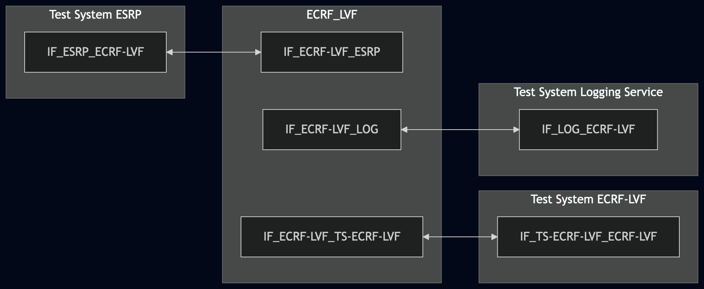
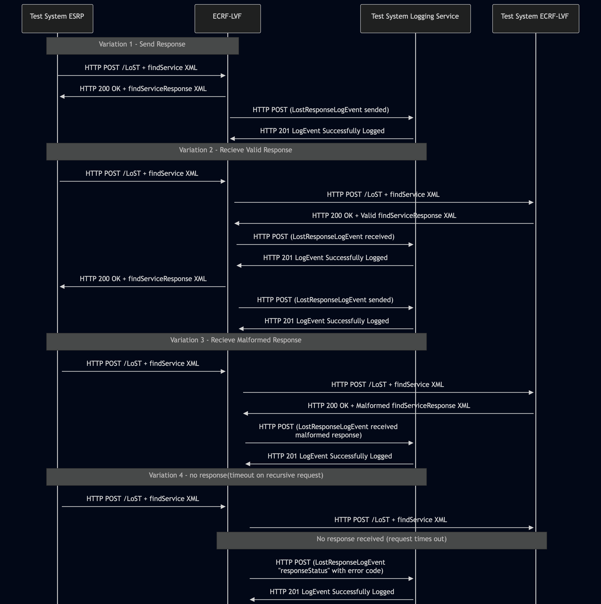

# Test Description: TD_ECRF-LVF_009

<!-- MULTIPLE TDs already exist - review & consolidate
 Existing TD(s) - TD_ECRF-LVF_009 (from RQ_ECRF-LVF_085 / ECRF-LVF); TD_ESRP_014 (from RQ_ESRP_149 / ESRP) -->

## Overview
### Summary
LostResponseLogEvent members


### Description
Verify LostResponseLogEvent members

### HTTP transport types
Test can be performed with 2 different HTTP transport types. Steps describing actions for specific one are marked as following:
- (TLS transport) - used by default inside ESInet on production environment
- (TCP transport) - used as a fallback if use of TLS is not possible

### References
* Requirements : RQ_ECRF-LVF_085
* Test Case    : TC_ECRF_LVF_009

### Requirements
IXIT config file for ECRF-LVF

## Configuration
### Implementation Under Test Interface Connections
<!-- Identify each of the FEs that are part of the configuration and how they are connected -->
* Test System ESRP
  * IF_ESRP_ECRF-LVF - connected to IF_ECRF-LVF_ESRP
* ECRF-LVF(IUT)
  * IF_ECRF-LVF_ESRP - connected to IF_ESRP_ECRF-LVF
  * IF_ECRF-LVF_TS-ECRF-LVF - connected to IF_TS-ECRF-LVF_ECRF-LVF
  * IF_ECRF-LVF_LOG - connected to IF_LOG_ECRF-LVF
* Test System ECRF-LVF
  * IF_TS-ECRF-LVF_ECRF-LVF - connected to IF_ECRF-LVF_TS-ECRF-LVF
* Test System Logging Service
  * IF_LOG_ECRF-LVF - connected to IF_ECRF-LVF_LOG


### Test System Interfaces
<!-- Identify each of the test system interfaces and whether it will be in active or monitor mode -->
* Test System ESRP
  * IF_ESRP_ECRF-LVF - Active
* ECRF-LVF(IUT)
  * IF_ECRF-LVF_ESRP - Active
  * IF_ECRF-LVF_LOG - Active
* Test System ECRF-LVF
  * IF_TS-ECRF-LVF_ECRF-LVF - Acitve
* Test System Logging Service
  * IF_LOG_ECRF-LVF - Active

### Connectivity Diagram
<!--
https://mermaid.live/edit#pako:eNp9Ul1vgkAQ_Ctkn8EgipBL0xcrTROaNmL60JCQK6xAKnfmONpa43_vgYoK1nu6nZmdnfvYQswTBALLFf-OMyqk5s9Dpqn15EWzYP4azaZzz_DfvDvDuK-xQ9mQJ-UR9V8eD0K1a-G-bhEYHeMzpNNXVh-poOtMW2AptWBTSiy00_hrYfcMsqTjUPNRy3dD9T3PjnWdOEt9Evw3_SJ_r-vmHdw283ma5izVAhRfeYwXnv13UF6gQyryBIgUFepQoChoXcK2loQgMywwBKK2CRWfIYRsp3rWlL1zXhzbBK_SDMiSrkpVVeuESnzIqcpXtKhQ01BMecUkEMscNyZAtvBTlwPbrJc9coYTd6jIDZCh4w4c07KskWXbY9Od2Dsdfpux5sB1bB1oJXmwYfExBya55OJ5_5ObD737A_Qb04o
-->




## Pre-Test Conditions

### Test System ESRP/Test System Logging Service/Test System ECRF-LVF
* Interfaces are connected to network
* Interfaces have IP addresses assigned by DHCP
* Device is active
* No active calls
* (TLS transport) Test System has it's own certificate signed by PCA

### ECRF-LVF
* Interfaces are connected to network
* Interfaces have IP addresses assigned by DHCP
* Default configuration is loaded
* IUT is configured with planned changes
* IUT is initialized with steps from IXIT config file
* IUT is active
* IUT is in normal operating state
* IUT is provisioned with following service boundary:
```
Boundary1 - service SIP URI: sip:boundary1@example.com
40.717309464520554, -73.99120141285248
40.71672360940788, -73.9891917501422
40.71556789497267, -73.9898030924558
40.716159065144886, -73.9917916448061
```


## Test Sequence

### Test Preamble

#### Test System ESRP
* Install CuRL[^1]
* Install Wireshark[^2]
* Copy following HTTP scenario file to local storage:
  ```
	 findService_geodetic_point.xml
  ```
* (TLS transport) Copy to local storage PCA-signed TLS certificate and private key files:
  ```
     PCA-cacert.pem
     PCA-cakey.pem
  ```
* (TLS transport) Copy to local storage TLS certificate and private key files used by ECRF:
  ```
     ECRF-cacert.pem
     ECRF-cakey.pem

  ```
* (TLS transport) Configure Wireshark to decode HTTP over TLS packets from Test System ESRP and ECRF-LVF as well[^3]
* Using Wireshark on 'Test System ESRP' start packet tracing on IF_ESRP_ECRF-LVF interface - run following filter:
   * (TLS transport)
     > (ip.addr == IF_ESRP_ECRF-LVF_IP_ADDRESS) and tls
   * (TCP transport)
     > (ip.addr == IF_ESRP_ECRF-LVF_IP_ADDRESS) and http

#### Test System Logging Service
* Install Wireshark[^2]
* (TLS v1.2) Configure Wireshark to decode HTTP over TLS, use tests system and ECRF-LVF certificate keys [^3]
* (TLS v1.3) Configure logging of session keys and configure Wireshark to decode HTTP over TLS [^4]
* Using Wireshark on 'Test System' start packet tracing on IF_LOG_ECRF-LVF interface - run following filter:
   * (TLS)
     > ip.addr == IF_LOG_ECRF-LVF_IP_ADDRESS and tls
   * (TCP)
     > ip.addr == IF_LOG_ECRF-LVF_IP_ADDRESS and http
* The Logging Service must be configured to accept and process HTTP POST requests. To verify this manually, you can simulate a listening HTTP endpoint on port 8080 using command in the terminal:
    * Step 1 - Prepare logEventId and JSON body
      ```
      ID="urn:emergency:uid:logid:$(date +%s%N):logger.state.pa.us"
      BODY="{\"logEventId\":\"$ID\"}"
      ```
    * Step 2 - Run server:
      * (TLS)
      ```
      python3 http_entry.py --ip IF_LOG_ECRF-LVF --port 443 --role RECEIVER --path /LogEvents --method POST 
      --body "$BODY" --content_type application/json --response_code 201 --server_cert /tmp/cert.crt --server_key /tmp/cert.key
      ```
      * (TCP)
      ```
      python3 http_entry.py --ip IF_LOG_ECRF-LVF --port 8080 --role RECEIVER --path /LogEvents --method POST --body "$BODY" --content_type application/json --response_code 201
      ```
    * Step 3 - In another terminal, send a POST request to verify it is working:
      * (TLS)
      ```
      curl -k -X POST https://localhost:443 -d '{"log":"test"}'
      ```   
      * (TCP)
      ```
      curl -X POST http://localhost:8080 -d '{"log":"test"}'
      ```

#### Test System ECRF-LVF
* (TCP transport) Install Netcat[^4]
* Install Wireshark[^2]
* (TLS transport) Configure Wireshark to decode HTTP over TLS packets from Test System ECRF-LVF and ECRF as well[^3]
* Copy following valid and malformed HTTP scenario files to local storage:
  ```
	 findServiceResponse_for_not_in_ecrf.xml
     findServiceResponse_malformed.xml
  ```
* Using Wireshark on 'Test System' start packet tracing on IF_ECRF-LVF_ECRF-LVF interface - run following filter:
   * (TLS transport)
     > (ip.addr == IF_ECRF-LVF_ECRF-LVF_IP_ADDRESS) and tls
   * (TCP transport)
     > (ip.addr == IF_ECRF-LVF_ECRF-LVF_IP_ADDRESS) and http
* Start http server responding for HTTPS POST requests:
    * Variation 2 
      * (TLS transport)
       ```
          python3 http_entry.py \ --ip IF_ECRF-LVF_ECRF-LVF_IP_ADDRESS \ --port 8080 \ --role RECEIVER \ --path /LoST \ --method POST \ --body file.findServiceResponse_for_not_in_ecrf.xml \ --content_type application/lost+xml \ --response_code 200 \ --server_cert test_system2.pem \ --server_key test_system2.key
       ```
      * (TCP transport)
       ```
          python3 http_entry.py \ --ip IF_ECRF-LVF_ECRF-LVF_IP_ADDRESS \ --port 8080 \ --role RECEIVER \ --path /LoST \ --method POST \ --body file.findServiceResponse_for_not_in_ecrf.xml \ --content_type application/lost+xml \ --response_code 200
       ```
    * Variation 3
      * (TLS transport)
       ```
          python3 http_entry.py \ --ip IF_ECRF-LVF_ECRF-LVF_IP_ADDRESS \ --port 8080 \ --role RECEIVER \ --path /LoST \ --method POST \ --body file.findServiceResponse_malformed.xml \ --content_type application/lost+xml \ --response_code 200 \ --server_cert test_system2.pem \ --server_key test_system2.key
       ```
      * (TCP transport)
       ```
          python3 http_entry.py \ --ip IF_ECRF-LVF_ECRF-LVF_IP_ADDRESS \ --port 8080 \ --role RECEIVER \ --path /LoST \ --method POST \ --body file.findServiceResponse_malformed.xml \ --content_type application/lost+xml \ --response_code 200
     ```  
* Variation 4 only - Do NOT start the HTTP server on Test System ECRF-LVF to simulate a timeout of the recursive LoST request.

### Test Body

#### Variations

* Variation 1 – LostResponseLogEvent members after ECRF-LVF sends a valid response.
  Verifies the LogEvent generated when ECRF-LVF sends a valid LoST response.

* Variation 2 – LostResponseLogEvent members after ECRF-LVF receives a valid response.
  Verifies the LogEvent generated when ECRF-LVF receives a `valid` LoST response during recursive processing.

* Variation 3 – LostResponseLogEvent members after ECRF-LVF receives a malformed response.
  Verifies the LogEvent generated when ECRF-LVF receives a `malformed` LoST response during recursive processing.

* Variation 4 – LostResponseLogEvent members after ECRF-LVF does not receive a response
  Verifies the LogEvent generated when ECRF-LVF does not receive a response(timeout on recursive request).

#### Stimulus
Variation 1
From 'Test System ESRP' send HTTP POST with findService_geodetic_point:
   * (TLS)
     ```
        curl --cacert cacert.pem --cert client.pem --key client.key \
        -X POST https://IF_ECRF-LVF_ESRP_IP:PORT/LoST \
        -H "Content-Type: application/lost+xml" \
        --data-binary @findService_geodetic_point.xml
     ```
   * (TCP)
     ```
        curl -X POST http://IF_ECRF-LVF_ESRP_IP:PORT/LoST \
        -H "Content-Type: application/lost+xml" \
        --data-binary @findService_geodetic_point.xml
     ```
     
Variation 2, 3 and 4

From 'Test System ESRP' send HTTP POST with findService recursive mode when point is not presented in covering 
boundaries:
   * (TLS)
     ```
        curl --cacert cacert.pem --cert client.pem --key client.key \
        -X POST https://IF_ECRF_ESRP_IP:PORT/LoST \
        -H "Content-Type: application/lost+xml" \
        --data-binary @findService_geodetic_point_not_in_ecrf.xml
     ```
   * (TCP)
     ```
        curl -X POST http://IF_ECRF_ESRP_IP:PORT/LoST \
        -H "Content-Type: application/lost+xml" \
        --data-binary @findService_geodetic_point_not_in_ecrf.xml
     ```


#### Response
*Variation 1 - ECRF-LVF sends valid response*

Using traced packets on Wireshark on IF_LOG_ECRF-LVF interface verify:
* If ECRF-LVF sends an HTTP POST to the Test System Logging Service with a JWS body containing a JSON payload with a LogEvent:
  * "logEventType": "LostResponseLogEvent"
  * "timestamp" with correct date-time format (f.e. 2020-03-10T11:00:01-05:00);
  * "elementId" which has value with FQDN of ECRF-LVF
  * "agencyId" which has value with FQDN of the agency operating the ECRF-LVF
  * "direction" which has value: `outgoing` (ECRF-LVF sent the response)
  * "responseAdapter" field is a string consisting of the entire LoST response;
  * "responseId" field is a string (e.g. `urn:emergency:uid:responseid:globally_unique_id`);
  * (optional) "clientAssignedIdentifier" field with string value
  * (optional) "agencyAgentId" field with string value
  * (optional) "agencyPositionId" field with string value
  * (optional) field "ipAddressPort" with string value representing normalized IP address and port number, or FQDN of 
   another element that participated in the transaction that triggered this LogEvent element 
  * (optional) "extension" field with string value


*Variation 2 - ECRF-LVF receives valid response*

Using traced packets on Wireshark on IF_LOG_ECRF-LVF interface verify:
* If ECRF-LVF sends an HTTP POST to the Test System Logging Service with a JWS body containing a JSON payload with a LogEvent:
  * "logEventType": "LostResponseLogEvent"
  * "timestamp" with correct date-time format (f.e. 2020-03-10T11:00:01-05:00);
  * "elementId" which has value with FQDN of ECRF-LVF
  * "agencyId" which has value with FQDN of the agency operating the ECRF-LVF
  * "direction" which has value: 
      * `incoming` (ECRF-LVF receive the response)
      * `outgoing` (ECRF-LVF send the response)
  * "responseAdapter" field is a string consisting of the entire LoST response;
  * "responseId" field is a string (e.g. `urn:emergency:uid:responseid:globally_unique_id`);
  * (optional) "clientAssignedIdentifier" field with string value
  * (optional) "agencyAgentId" field with string value
  * (optional) "agencyPositionId" field with string value
  * (optional) field "ipAddressPort" with string value representing normalized IP address and port number, or FQDN of 
   another element that participated in the transaction that triggered this LogEvent element 
  * (optional) "extension" field with string value


*Variation 3 - ECRF-LVF receives malformed response*

Using traced packets on Wireshark on IF_LOG_ECRF-LVF interface verify:
* If ECRF-LVF sends an HTTP POST to the Test System Logging Service with a JWS body containing a JSON payload with a LogEvent:
  * "logEventType": "LostResponseLogEvent"
  * "timestamp" with correct date-time format (f.e. 2020-03-10T11:00:01-05:00);
  * "elementId" which has value with FQDN of ECRF-LVF
  * "agencyId" which has value with FQDN of the agency operating the ECRF-LVF
  * "direction" which has value: `incoming` (ECRF-LVF receive the response)
  * "responseAdapter" field is a string consisting of the entire LoST response;
  * "responseId" field is a string (e.g. `urn:emergency:uid:responseid:globally_unique_id`);
  * "malformedResponse" is a string consisting the malformed LoST response received by the ECRF-LVF.
  * “responseStatus” contains a status code from the Status Codes Registry (Section 10.29) when logging malformed or invalid responses, or when no response is received from the server.
  * (optional) "clientAssignedIdentifier" field with string value
  * (optional) "agencyAgentId" field with string value
  * (optional) "agencyPositionId" field with string value
  * (optional) field "ipAddressPort" with string value representing normalized IP address and port number, or FQDN of 
   another element that participated in the transaction that triggered this LogEvent element 
  * (optional) "extension" field with string value

*Variation 4 - ECRF-LVF does not receive a response(timeout on recursive request)*

Using traced packets on Wireshark on IF_LOG_ECRF-LVF interface verify:
* If ECRF-LVF sends an HTTP POST to the Test System Logging Service with a JWS body containing a JSON payload with a LogEvent:
  * "logEventType": "LostResponseLogEvent"
  * "timestamp" with correct date-time format (f.e. 2020-03-10T11:00:01-05:00);
  * "elementId" which has value with FQDN of ECRF-LVF
  * "agencyId" which has value with FQDN of the agency operating the ECRF-LVF
  * "direction" which has value: `incoming` (ECRF-LVF receive the response)
  * "responseAdapter" field is an empty string;
  * "responseId" field is a string (e.g. `urn:emergency:uid:responseid:globally_unique_id`);
  * “responseStatus” contains a status code from the Status Codes Registry (Section 10.29) (most likely 454 Unspecified Error).
  * (optional) "clientAssignedIdentifier" field with string value
  * (optional) "agencyAgentId" field with string value
  * (optional) "agencyPositionId" field with string value
  * (optional) field "ipAddressPort" with string value representing normalized IP address and port number, or FQDN of 
   another element that participated in the transaction that triggered this LogEvent element 
  * (optional) "extension" field with string value

VERDICT:
* PASSED - if all checks passed
* FAILED - any other cases

### Test Postamble
#### Test System ESRP/Test System Logging Service/Test System ECRF-LVF
* archive all logs generated
* stop Wireshark (if still running)
* remove all HTTP scenarios
* disconnect interfaces from ECRF
* (TLS transport) remove certificates

#### ECRF-LVF
* reconnect interfaces back to default
* restore previous configuration

## Post-Test Conditions 
### Test System ESRP/Test System Logging Service/Test System ECRF-LVF
* Test tools stopped
* interfaces disconnected from ECRF

### ECRF-LVF
* device connected back to default
* device in normal operating state


## Sequence Diagram
<!--
https://mermaid.live/edit#pako:eNrlVl1v2jAU_StXfgI1oeSjNI0mpKmjmjRYEUHVNOUlSy7BGrGZ7bAyxH-fk5DQMtRpElTTlofIse89vsfnJLkbEvMEiU9M0wxZzNmMpn7IADIqBBdvY8WF9GEWLSSGrAyS-C1HFuM7GqUiyopggOr-kSsEvkIBU5QKgrVUmMEgmIwNGNxO7szhw50PD5GgkaKcgQUmBMgSmKBcclZsUQEdppv9_kUD8H46HcP4PpjC5ZDr-wXMKEsCFCsaI3waDSuMOr7IPcTzoQSxu124__AcoC7l90BDnqaUpbBL3GGWhbWGXKoaSccNVsgUSE0Vk_avFA-QnrGtK7WgwQnyOEYpZ_lisS5zMakwoT6_l4R4kcJeG1trM8GY4gr17II-FensEv0hzrHco4e4k7vi8zqiC4yRrs4t-39o-BN63Xni9VG0mHGR4b_k9z2n1_X8my_isp81m4td3BlfhZNZwtWWYLwpuaVohjxXoJc0u1xIzU-P9K9Qqvbf55D9CdSZxlHX-DqyIdnoBq0dMyhoS9DE2_XrdjKTlOaAkNS7BypSuQwJfKdqDli0H1A0J2d1S82quIhBUkET4iuRo0EyFFlUPJJNERMSNccMQ-LrYRKJryEJ2VbnLCP2mfOsThM8T-fELzsmg-TLJFJ1q9TMiuK7KG55zhTx7Z7nlSjE35BH4pu27Xa8K_vK6dqOde04tl5e6_me63S63Z6e9tzejedsDfKj3Njq3FiW5djuletd25ZjOQaJcsWDNYvrsjChupUbVc1e2fNtfwKT8DIc
-->




## Comments

Version:  010.3d.5.0.3

Date:     20260626


## Footnotes
[^1]: CURL for Linux https://linux.die.net/man/1/curl
[^2]: Wireshark - tool for packet tracing and anaylisis. Official website: https://www.wireshark.org/download.html
[^3]: Wireshark configuration to decrypt SIP over TLS packets: https://www.zoiper.com/en/support/home/article/162/How%20to%20decode%20SIP%20over%20TLS%20with%20Wireshark%20and%20Decrypting%20SDES%20Protected%20SRTP%20Stream
[^4]: Netcat for Linux https://linux.die.net/man/1/nc
[^5]: TLS v1.3 session keys logging + Wireshark configuration to decrypt traffic: https://my.f5.com/manage/s/article/K50557518
