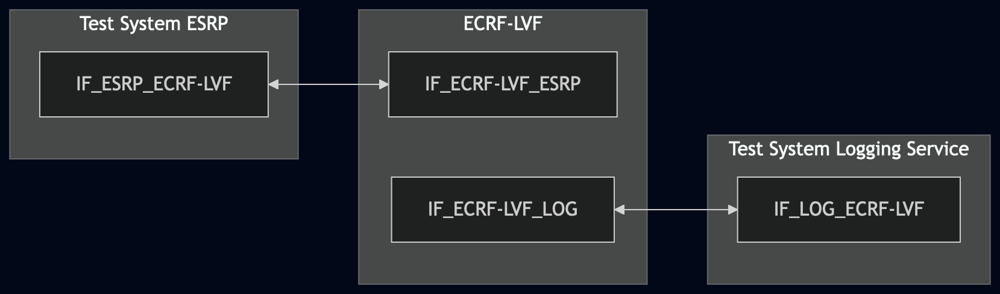
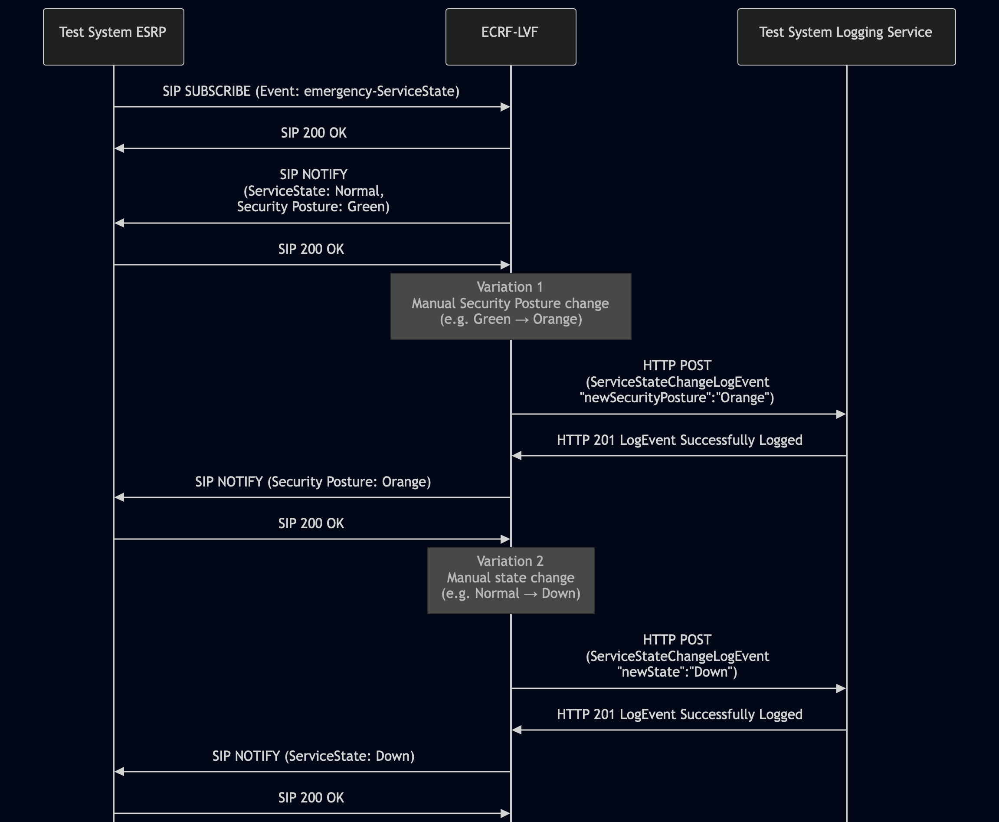

# Test Description: TD_ECRF-LVF_010

<!-- MULTIPLE TDs already exist - review & consolidate
Existing TD(s) TD_ECRF-LVF_010 (from RQ_ECRF-LVF_065 / ECRF-LVF); TD_ESRP_018 (from RQ_ESRP_122 / ESRP)
TD_ECRF-LVF_010 (from RQ_ECRF-LVF_064 / ECRF-LVF); TD_ESRP_018 (from RQ_ESRP_121 / ESRP) -->

## Overview
### Summary
Logging of ServiceStateChangeLogEvent on ECRF-LVF service state change

### Description
Verify that ECRF/LVF acts as a ServiceState notification server and logs a valid ServiceStateChangeLogEvent when reporting service state changes(including Security Posture).

### HTTP transport types
Test can be performed with 2 different HTTP transport types. Steps describing actions for specific one are marked as following:
- (TLS transport) - used by default inside ESInet on production environment
- (TCP transport) - used as a fallback if use of TLS is not possible

### References
* Requirements : RQ_ECRF-LVF_021, RQ_ECRF-LVF_064, RQ_ECRF-LVF_065
* Test Case    : TC_ECRF_LVF_010

### Requirements
IXIT config file for ECRF-LVF

## Configuration
### Implementation Under Test Interface Connections
<!-- Identify each of the FEs that are part of the configuration and how they are connected -->
* Test System ESRP
  * IF_ESRP_ECRF-LVF - connected to IF_ECRF-LVF_ESRP
* ECRF-LVF
  * IF_ECRF-LVF_ESRP - connected to IF_ESRP_ECRF-LVF
  * IF_ECRF-LVF_LOG - connected to IF_LOG_ECRF-LVF
* Test System Logging Service
  * IF_LOG_ECRF-LVF - connected to IF_ESRP_LOG


### Test System Interfaces
<!-- Identify each of the test system interfaces and whether it will be in active or monitor mode -->
* Test System ESRP
  * IF_ESRP_ECRF-LVF - Active
* ECRF-LVF
  * IF_ECRF-LVF_ESRP - Active
  * IF_ECRF-LVF_LOG - Active
* Test System Logging Service
  * IF_LOG_ECRF-LVF - Active

### Connectivity Diagram
<!--
https://mermaid.live/edit#pako:eNp1Ul1Pg0AQ_Ctkn2lTOKBwMb7U1phgNMX0wZA0J2yBWO6a41Br0__uFYr0Q-9pd3Z2Zi7ZHSQiRaCwWovPJGdSGeE85oZ-D7PlNJo_L6eT-WwQLmY3g8HtATu2zbBndmj4dH8k6uoXbnlV_ZZJtsmNF6yUEW0rhaXRy_xl2k6QpxcK5_PLENeaJ_H-kzwNFYosK3hmRCg_igTPtK7_1WiBCZksUqBK1mhCibJkhxZ2B1IMKscSY6C6TJl8jyHme72zYfxViLJbk6LOcqArtq50V29SpvCuYDphT9F2KCei5gqo2ygA3cEXUOIMLc_yiW05ju0ErmfCFqhnDx3iB443sggh_pjsTfhuLEdD3w805Lp24Fq-ZY9NYLUS0ZYnnRumhRLysT2S5lb2P9CopoU
-->




## Pre-Test Conditions

### Test System ESRP/Test System Logging Service
* Interfaces are connected to network
* Interfaces have IP addresses assigned by DHCP
* Device is active
* No active calls
* (TLS transport) Test System has it's own certificate signed by PCA

### ECRF-LVF
* Interfaces are connected to network
* Interfaces have IP addresses assigned by DHCP
* Default configuration is loaded
* IUT is configured with planned changes
* IUT is initialized with steps from IXIT config file
* IUT is active
* IUT is in normal operating state(serviceState: Normal)
* IUT is provisioned with policy allowing ServiceState subscriptions from Test System ESRP
* Optionally, if Security Posture is supported by the IUT, the "newSecurityPosture" field shall contain one of the following values `Green`, `Yellow`, `Orange`, `Red`.

## Test Sequence

### Test Preamble

#### Test System ESRP
* Install SIPp by following steps from documentation[^1]
* Copy following XML scenario files to local storage:
  ```
  SIP_SUBSCRIBE_ServiceState.xml
  ```
* Install Wireshark[^2]
* (TLS transport) Copy to local storage PCA-signed TLS certificate and private key files:
  ```
  PCA-cacert.pem
  PCA-cakey.pem
  ```
* (TLS transport) Copy to local storage TLS certificate and private key files used by ESRP:
  ```
  ESRP-cacert.pem
  ESRP-cakey.pem
  ```
* (TLS transport) Configure Wireshark to decode HTTP over TLS packets from Test System ESRP as well[^3]
* Using Wireshark on Test System ESRP start packet tracing on IF_ESRP_ECRF-LVF interface - run following filter:
   * (TLS transport)
     > ip.addr == IF_ESRP_ECRF-LVF_IP_ADDRESS and tls
   * (TCP transport)
     > ip.addr == IF_ESRP_ECRF-LVF_IP_ADDRESS and sip
* On Test System start subscription for ServiceState - run SIPp tool with following command:
   * (TCP transport)
     > sudo sipp -t t1 -sf SIP_SUBSCRIBE_ServiceState.xml -i IF_ESRP_ECRF-LVF_IP_ADDRESS:5060 IF_ECRF-LVF_ESRP_IP_ADDRESS:5060 -timeout 10 -max_recv_loops 1
   * (TLS transport)
     > sudo sipp -t l1 -tls_cert PCA-cacert.pem -tls_key PCA-cakey.pem -sf SIP_SUBSCRIBE_ServiceState.xml -i IF_ESRP_ECRF-LVF_IP_ADDRESS:5061 IF_ECRF-LVF_ESRP_IP_ADDRESS:5061 -timeout 10 -max_recv_loops 1
* Verify if ECRF-LVF sends SIP NOTIFY messages with ServiceState="Normal" status

#### Test System Logging Service
* Install Wireshark[^2]
* (TLS v1.2) Configure Wireshark to decode HTTP over TLS, use tests system and ECRF-LVF certificate keys [^3]
* (TLS v1.3) Configure logging of session keys and configure Wireshark to decode HTTP over TLS [^4]
* Using Wireshark on 'Test System' start packet tracing on IF_LOG_ECRF-LVF interface - run following filter:
   * (TLS)
     > ip.addr == IF_LOG_ECRF-LVF_IP_ADDRESS and tls
   * (TCP)
     > ip.addr == IF_LOG_ECRF-LVF_IP_ADDRESS and http
* The Logging Service must be configured to accept and process HTTP POST requests. To verify this manually, you can simulate a listening HTTP endpoint on port 8080 using command in the terminal:
    * Step 1 - Prepare logEventId and JSON body
      ```
      ID="urn:emergency:uid:logid:$(date +%s%N):logger.state.pa.us"
      BODY="{\"logEventId\":\"$ID\"}"
      ```
    * Step 2 - Run server:
      * (TLS)
      ```
      python3 http_entry.py --ip IF_LOG_ECRF-LVF --port 443 --role RECEIVER --path /LogEvents --method POST 
      --body "$BODY" --content_type application/json --response_code 201 --server_cert /tmp/cert.crt --server_key /tmp/cert.key
      ```
      * (TCP)
      ```
      python3 http_entry.py --ip IF_LOG_ECRF-LVF --port 8080 --role RECEIVER --path /LogEvents --method POST --body "$BODY" --content_type application/json --response_code 201
      ```
    * Step 3 - In another terminal, send a POST request to verify it is working:
      * (TLS)
      ```
      curl -k -X POST http://localhost:8080 -d '{"log":"test"}'
      ```   
      * (TCP)
      ```
      curl -X POST http://localhost:8080 -d '{"log":"test"}'


### Test Body
### Stimulus
#### Variation 1
Trigger a Security Posture change on ECRF-LVF to "Orange"
#### Variation 2
Trigger a ServiceState change on ECRF-LVF to "Down"

### Response
**Variation 1** (Security Posture change on ECRF-LVF to "Orange")

Using traced packets on Wireshark on IF_LOG_ECRF-LVF interface verify:
* If ECRF-LVF sends an HTTP POST to the Test System Logging Service with a JWS body containing a JSON payload with a LogEvent:
  * "logEventType": "ServiceStateChangeLogEvent"
  * "timestamp" with correct date-time format (e.g. 2020-03-10T11:00:01-05:00)
  * "elementId" which has value with FQDN of ECRF-LVF
  * "agencyId" which has value with FQDN of an agency
  * "direction" which has value: `outgoing` or `incoming`
  * "newState" with the new serviceState value - `Normal`
  * “affectedServiceIdentifier” with the FQDN of the ECRF-LVF service whose state changed
  * “newSecurityPosture”  with one of the following values `Orange`
  * (optional) "clientAssignedIdentifier" field with string value
  * (optional) "agencyAgentId" field with string value
  * (optional) "agencyPositionId" field with string value
  * (optional) "extension" field with string value


* ECRF-LVF sent SIP NOTIFY to the subscriber(to Test System ESRP) with the updated SecurityPosture value matching "newSecurityPosture" logged in the ServiceStateChangeLogEvent.


**Variation 2** (ServiceState change on ECRF-LVF to "Down")

Using traced packets on Wireshark on IF_LOG_ECRF-LVF interface verify:
* If ECRF-LVF sends an HTTP POST to the Test System Logging Service with a JWS body containing a JSON payload with a LogEvent:
  * "logEventType": "ServiceStateChangeLogEvent"
  * "timestamp" with correct date-time format (e.g. 2020-03-10T11:00:01-05:00)
  * "elementId" which has value with FQDN of ECRF-LVF
  * "agencyId" which has value with FQDN of an agency
  * "direction" which has value: `outgoing` or `incoming`
  * "newState" with the new serviceState value - `Down`
  * “affectedServiceIdentifier” with the FQDN of the ECRF-LVF service whose state changed
  * (optional) “newSecurityPosture”  with one of the following values `Green`, `Yellow`, `Orange`, `Red`
  * (optional) "clientAssignedIdentifier" field with string value
  * (optional) "agencyAgentId" field with string value
  * (optional) "agencyPositionId" field with string value
  * (optional) "extension" field with string value


* ECRF-LVF sent SIP NOTIFY to the subscriber(to Test System ESRP) with the updated serviceState value matching "newState" logged in the ServiceStateChangeLogEvent.


VERDICT:
* PASSED - if all checks passed
* FAILED - all other cases

### Test Postamble
#### Test System ESRP/Test System Logging Service
* (TCP transport) stop all Netcat processes (if still running)
* archive all logs generated
* stop Wireshark (if still running)
* remove all HTTP scenarios
* disconnect interfaces from ECRF
* (TLS transport) remove certificates

#### ECRF-LVF
* reconnect interfaces back to default
* restore previous configuration

## Post-Test Conditions 
### Test System ESRP/Test System Logging Service
* Test tools stopped
* interfaces disconnected from ECRF

### ECRF-LVF
* device connected back to default
* device in normal operating state


## Sequence Diagram
<!--
https://mermaid.live/edit#pako:eNq1VNtu2kAQ_ZXRPhEJqC9AYFUhNQRSVAIIO5FaWaq29mCs4l26XidxEa_9gH5iv6TrNdCUNO1D2zd7Z845c469syWhiJBQ0mg0Ah4KvkxiGnCANJFSyFehEjKjsGTrDANumjL8lCMP8TJhsWRp2QywYVIlYbJhXIHvvR96izmwDHzMFHhFpjCF8uxp8_jGLxuHg8WoMbkd_ZJtMrs6JZuIOE54DB7KuyTUo1XAvXSj39e8FLzxHLybC2-wGF8MoTa8Q64oYIoy1g6Kxh7tKabwrGLQOI3e81QMjmXB7M2z5enMH4_evvwg-1B7TEhhKmTK1nUoax6GuUxUAXORqVzq6pVE5GfPzn1QrRqmQiGIO5RgGm6ZTJhKBAfbsF8znrM1nIpAuGI8Rt3xol_DZtysROHbl68wk2Xp7CBwNKbDpvDa9-cwn3m-Yf_J1sBQ6vxNmqYeEI73B-29dEBoQCqNgPxwqdkPJo2GY9lw5PLyMMQsW-brdWG-MEZ_SL1M_DTXo7G_C9Z5HGxWOn-aZvWBTZyX4p7_wzDLoomw5P3PAT7-Zfc2fhsdqZNYJhGhSuZYJ_o2pax8JdsSGBC10jdMD68fIyY_BiTgO43Rt_mdEOkBJkUerwg1m6VO8k2k9fcr5XgqkUcoByLnilDb6p4bFkK35IHQjtvs2K513uq0ey2n5ditOin0ca_pdp1222q7va7ttnd18tnIWs1up-107POea7sa09FsLFfCK3h4GAqjRC-862olms24-w6fGp9Y
-->




## Comments

Version:  010.3d.5.0.0

Date:     20260610


## Footnotes
[^1]: SIPp - tool for SIP packet simulations. Official documentation: https://sipp.sourceforge.net/doc/reference.html#Getting+SIPp
[^2]: Wireshark - tool for packet tracing and anaylisis. Official website: https://www.wireshark.org/download.html
[^3]: Wireshark configuration to decrypt SIP over TLS packets: https://www.zoiper.com/en/support/home/article/162/How%20to%20decode%20SIP%20over%20TLS%20with%20Wireshark%20and%20Decrypting%20SDES%20Protected%20SRTP%20Stream
[^4]: TLS v1.3 session keys logging + Wireshark configuration to decrypt traffic: https://my.f5.com/manage/s/article/K50557518
