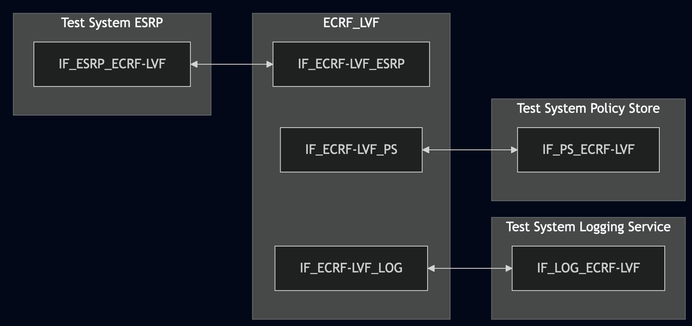
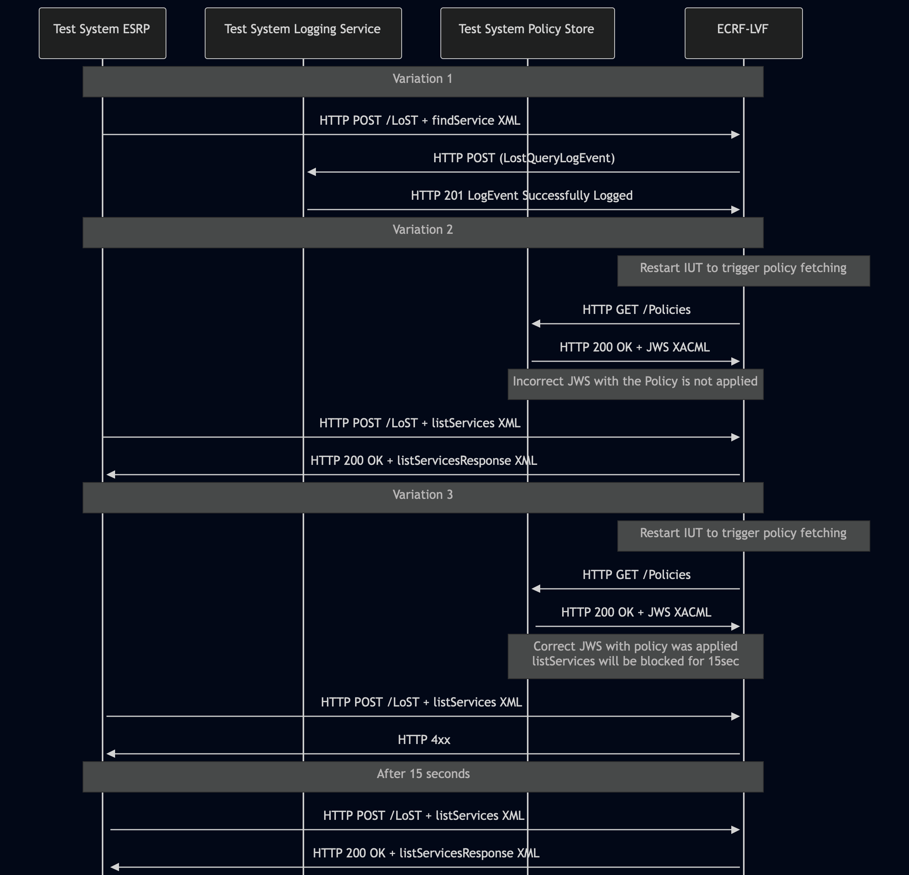

# Test Description: TD_ECRF-LVF_011

## Overview

<!-- Single TD exists - reuse for the rest of the group - TD_ECRF-LVF_011 (from RQ_ECRF-LVF_093 / ECRF-LVF)
 Req IDs in Group - RQ_BCF_203, RQ_BRG_144, RQ_CHFE_390, RQ_ECRF-LVF_093, RQ_ESRP_177, RQ_LOG_219, RQ_PS_142 -->
 <!-- Single TD exists - reuse for the rest of the group - TD_ECRF-LVF_011 (from RQ_ECRF-LVF_095 / ECRF-LVF)
 Req IDs in Group - RQ_BCF_205, RQ_BRG_146, RQ_CHFE_392, RQ_ECRF-LVF_095, RQ_ESRP_179, RQ_LOG_221, RQ_PS_144 -->

### Summary
Verification of JWS Protected Header algorithm and certificate chain in LogEvents sent by ECRF-LVF

### Description
Test covers that ECRF-LVF, when sending LogEvents to the Logging Service, forms a JWS Protected Header that:
* contains exactly one "alg" field set to "EdDSA" (signed) or "none" (unsigned)
* for signed LogEvents — includes the signing entity's X.509 certificate with all intermediate certificates up to the 
  trusted root, either by value (x5c) or by reference (x5u + x5t#256)

### HTTP transport types
Test can be performed with 2 different HTTP transport types. Steps describing actions for specific one are marked as following:
- (TLS transport) - used by default inside ESInet on production environment
- (TCP transport) - used as a fallback if use of TLS is not possible

### References
* Requirements : RQ_ECRF-LVF_093, RQ_ECRF-LVF_095
* Test Case    : TC_ECRF_LVF_011

### Requirements
IXIT config file for ECRF-LVF

## Configuration
### Implementation Under Test Interface Connections
<!-- Identify each of the FEs that are part of the configuration and how they are connected -->
* Test System ESRP
  * IF_ESRP_ECRF-LVF - connected to IF_ECRF-LVF_ESRP
* ECRF-LVF
  * IF_ECRF-LVF_ESRP - connected to IF_ESRP_ECRF-LVF
  * IF_ECRF-LVF_LOG - connected to IF_LOG_ECRF-LVF
  * IF_ECRF-LVF_PS - connected to IF_PS_ECRF-LVF
* Test System Logging Service
  * IF_LOG_ECRF-LVF - connected to IF_ECRF-LVF_LOG
* Test System Policy Store
  * IF_PS_ECRF-LVF - connected to IF_ECRF-LVF_PS


### Test System Interfaces
<!-- Identify each of the test system interfaces and whether it will be in active or monitor mode -->
* Test System ESRP
  * IF_ESRP_ECRF-LVF - Active
* ECRF-LVF
  * IF_ECRF-LVF_ESRP - Active
  * IF_ECRF-LVF_LOG - Active
  * IF_ECRF-LVF_PS - Active
* Test System Logging Service
  * IF_LOG_ECRF-LVF - Active
* Test System Policy Store
  * IF_PS_ECRF-LVF - Active

### Connectivity Diagram
<!--
https://mermaid.live/edit#pako:eNp9UstugzAQ_BW0ZxLhmEexql7SpKpEVRRXPVRIkQsOoAYcGdOWRvn3GvIOaX3a3ZmdHa92DbFIOBBYLMVXnDGpjGAWlYZ-j9P5hM7C-WQ8mw6C1-ntYHDX1nZpBx6Z-2rw_LAj6uhQ7vNCuqOF9IJV1e-pZKvMeOGVMmhTKV4Yx2HXrG0RXiYXCi0-P-CXFvqaJ5-4DoT0r1GnZgORpnmZGpTLzzzmZ1L9rfyvFYplHjcGVUKeC_X2pnXAhFTmCRAla25CwWXB2hTWLSUClfGCR0B0mDD5EUFUbnTPipVvQhT7NinqNAOyYMtKZ_UqYYrf50x7Kw5VqadxORZ1qYAgB3UiQNbwDeTGH9ou8j3LskeejWxsQgME4yH2MR65yEW2hbC7MeGnm2oNb2zPcZyR53sYeY7lmMBqJWhTxntPPMn1Bp62t9qd7OYX6OjNGw
-->




## Pre-Test Conditions

### Test System ESRP/Test System Logging Service/Test System Policy Store
* Interfaces are connected to network
* Interfaces have IP addresses assigned by DHCP
* Device is active
* No active calls
* ng911 repository cloned to local storage
* (TLS transport) Test System has its own certificate signed by PCA
* Available PCA certificate and key for signing new generated ones 

### ECRF-LVF
* Interfaces are connected to network
* Interfaces have IP addresses assigned by DHCP
* Default configuration is loaded
* IUT is configured with planned changes
* IUT is initialized with steps from IXIT config file
* IUT is active
* IUT is in normal operating state
* IUT is provisioned with following service boundary:
```
Boundary1 - service SIP URI: sip:boundary1@example.com
40.717309464520554, -73.99120141285248
40.71672360940788, -73.9891917501422
40.71556789497267, -73.9898030924558
40.716159065144886, -73.9917916448061
```

## Test Sequence

### Test Preamble

#### Test System ESRP
* Install CuRL[^1]
* Install Wireshark[^2]
* Copy following HTTP scenario file to local storage:
  ```
     findService_geodetic_point.xml
     listServices_urn-service-sos.xml
  ```
* (TLS transport) Copy to local storage PCA-signed TLS certificate and private key files:
  ```
     PCA-cacert.pem
     PCA-cakey.pem
  ```
* (TLS transport) Copy to local storage TLS certificate and private key files used by ECRF:
  ```
     ECRF-cacert.pem
     ECRF-cakey.pem

  ```
* (TLS transport) Configure Wireshark to decode HTTP over TLS packets from Test System ESRP and ECRF-LVF as well[^3]
* Using Wireshark on 'Test System ESRP' start packet tracing on IF_ESRP_ECRF-LVF interface - run following filter:
   * (TLS transport)
     > (ip.addr == IF_ESRP_ECRF-LVF_IP_ADDRESS) and tls
   * (TCP transport)
     > (ip.addr == IF_ESRP_ECRF-LVF_IP_ADDRESS) and http

#### Test System Logging Service
* Install Wireshark[^2]
* Install OpenSSL v1.1.1 or higher[^5].
* (TLS v1.2) Configure Wireshark to decode HTTP over TLS, use tests system and ECRF-LVF certificate keys [^3]
* (TLS v1.3) Configure logging of session keys and configure Wireshark to decode HTTP over TLS [^4]
* Using Wireshark on 'Test System' start packet tracing on IF_LOG_ECRF-LVF interface - run following filter:
   * (TLS)
     > ip.addr == IF_LOG_ECRF-LVF_IP_ADDRESS and tls
   * (TCP)
     > ip.addr == IF_LOG_ECRF-LVF_IP_ADDRESS and http
* The Logging Service must be configured to accept and process HTTP POST requests. To verify this manually, you can simulate a listening HTTP endpoint on port 8080 using command in the terminal:
    * Step 1 - Prepare logEventId and JSON body
      ```
      ID="urn:emergency:uid:logid:$(date +%s%N):logger.state.pa.us"
      BODY="{\"logEventId\":\"$ID\"}"
      ```
    * Step 2 - Run server:
      * (TLS)
      ```
      python3 http_entry.py --ip IF_LOG_ECRF-LVF --port 443 --role RECEIVER --path /LogEvents --method POST 
      --body "$BODY" --content_type application/json --response_code 201 --server_cert /tmp/cert.crt --server_key /tmp/cert.key
      ```
      * (TCP)
      ```
      python3 http_entry.py --ip IF_LOG_ECRF-LVF --port 8080 --role RECEIVER --path /LogEvents --method POST --body "$BODY" --content_type application/json --response_code 201
      ```
    * Step 3 - In another terminal, send a POST request to verify it is working:
      * (TLS)
      ```
      curl -k -X POST http://localhost:8080 -d '{"log":"test"}'
      ```   
      * (TCP)
      ```
      curl -X POST http://localhost:8080 -d '{"log":"test"}'

#### Test System Policy Store
* Install Wireshark[^2]
* Copy following XML file to local storage:
  ```
     XACML_ECRF_LVF_policy_temporary_block_all_services.xml
  ```
* (TLS v1.2) Configure Wireshark to decode HTTP over TLS, use tests system and ECRF-LVF certificate keys [^3]
* (TLS v1.3) Configure logging of session keys and configure Wireshark to decode HTTP over TLS [^4]
* Using Wireshark on 'Test System' start packet tracing on IF_PS_ECRF-LVF interface - run following filter:
   * (TLS)
     > ip.addr == IF_IF_PS_ECRF-LVF_IP_ADDRESS and tls
   * (TCP)
     > ip.addr == IF_IF_PS_ECRF-LVF_IP_ADDRESS and http
* Prepare certificate files to be used for JWS generation:
  * Variation 2 (unsupported algorithm for JWS):
    ```
    openssl genrsa -out test_system.key 2048
    ```
    ```
    openssl req -new -key test_system.key -out test_system.csr -sha256 -subj "/C=US/ST=Texas/L=College Station/O=TAMU/CN=ps.ng911.dev.lab"
    ```
    ```
    openssl req -new -in test_system.csr -CA PCA.crt -CAkey PCA.key -CAcreateserial -out test_system.crt -days 1 -sha256
    ```
  * Variation 3 (correct):
    ```
    openssl genpkey -algorithm Ed448 -out test_system.key
    ```
    ```
    openssl req -new -key test_system.key -out test_system.csr -subj "/C=US/ST=Texas/L=College Station/O=TAMU/CN=ps.ng911.dev.lab"
    ```
    ```
    openssl req -new -in test_system.csr -CA PCA.crt -CAkey PCA.key -CAcreateserial -out test_system.crt -days 1
    ```
* The Policy Store must be configured to accept and process HTTP GET requests.
  * generate JWS object and save to file jws.json:
  ```
  python3 -m main generate_jws XACML_ECRF_LVF_policy_temporary_block_all_services.xml --cert test_system.crt --key test_system.key --output_file jws.json
  ```
  * simulate a listening HTTP endpoint on port 8080 using command in the terminal:
  * (TLS):
    * `python3 http_entry.py --ip IF_PS_ECRF-LVF --port 8080 --role RECEIVER --path /Policies --method GET --body jws.json --server_cert test_system.crt --server_key test_system.key`
  * (TCP):
    * `while true; do cat jws.json | nc -l -p 8080 -q 1; done`


### Test Body

#### Variations
1. JWS with LogEvents sent by the ECRF-LVF
2. Rejecting policy JWS signed by a certificate using unsupported algorithm
3. Applying XACML policies from correct JWS
<!-- 4. Rejecting JWS signed by revoked certificate -->

#### Stimulus

##### Variation 1

From 'Test System ESRP' send HTTP POST with findService_geodetic_point:
   * (TLS)
     ```
        curl --cacert cacert.pem --cert client.pem --key client.key \
        -X POST https://IF_ECRF_ESRP_IP:PORT/LoST \
        -H "Content-Type: application/lost+xml" \
        --data-binary @findService_geodetic_point.xml
     ```
   * (TCP)
     ```
        curl -X POST http://IF_ECRF_ESRP_IP:PORT/LoST \
        -H "Content-Type: application/lost+xml" \
        --data-binary @findService_geodetic_point.xml
     ```
     
##### Variations 2-3
1. Restart ECRF-LVF to trigger fetching policies from the Test System Policy Store
2. From 'Test System ESRP' send HTTP POST with listServices_urn-service-sos.xml:
   * (TLS)
     ```
        curl --cacert cacert.pem --cert client.pem --key client.key \
        -X POST https://IF_ECRF_ESRP_IP:PORT/LoST \
        -H "Content-Type: application/lost+xml" \
        --data-binary @listServices_urn-service-sos.xml
     ```
   * (TCP)
     ```
        curl -X POST http://IF_ECRF_ESRP_IP:PORT/LoST \
        -H "Content-Type: application/lost+xml" \
        --data-binary @listServices_urn-service-sos.xml
     ```

#### Response

##### Variation 1

Using traced packets on Wireshark check:
* If ECRF-LVF sends HTTP POST to Test System Logging Service with JWS body. Then decode JWS fields from Base64url and verify the following:
  * The "payload" field decoded from Base64url contains a valid LogEvent JSON object (e.g. a LostQueryLogEvent or LostResponseLogEvent). This confirms the JWS wraps actual LogEvent content
  * Decode the "protected" field from Base64url and parsed JSON contains one "alg" field with one of value:
    * "EdDSA";
    * "none";
    *  no other values are permitted.
    

  * If "protected" contain "alg": "EdDSA":
    * check if "signature" contains non-empty string value
    * using PCA-signed key file used by ECRF-LVF verify if JWS object is properly signed, use decode_jws method, example command: 
    ```
           python3 -m main decode_jws JWS_FILE_PATH --key ECRF-LVF.key --password pass123
    ```
    * verify if method did not return any decoding errors
    * verify if key file used by ECRF-LVF for JWS signing is Edwards-curve Digital Signature Algorithm (ECDSA) with Curve448, run example command:
    ```
       openssl pkey -in ECRF-LVF.key -text -noout
    ```
      Command must return "ED448", example:
    ```
    ED448 Private-Key:
    priv:
        cb:18:b3:9a:3a:09:ba:87:ad:86:79:0c:84:08:79:
        2a:16:31:76:19:a1:0f:92:1e:11:e5:7f:2c:7a:01:
        66:7e:f8:2a:04:47:8a:da:25:c2:c8:99:3a:52:20:
        37:54:a5:ea:d9:1d:a0:70:29:d8:3b:20
    pub:
        07:cc:7b:cc:d0:ff:e6:1c:79:fc:65:df:18:fc:f2:
        89:15:db:68:6a:08:2c:b6:7d:20:45:e8:81:64:b6:
        4c:8f:62:f1:63:df:f5:b3:38:ea:14:d4:28:0a:2b:
        88:62:7d:32:ed:c3:ab:8d:fc:a3:e0:80
    ```
    * The Protected Header shall contain one of the following keys:
      * `x5c` - with value being an array with X.509 certificate and all intermediate certificates up to one signed 
        by the trusted root. Example:
      ```
        {
            "alg": "EdDSA",
            "x5c": ["BASE64_CERT", "BASE64_INTERMEDIATE_CERT"]
        }
      ```
      * `x5u` with string value containing a valid URL pointing to a certificate chain.
        `x5u` field MUST be used with `x5t#256` field - the SHA-256 thumbprint of the certificate, to allow detection of when the certificate chain needs to be retrieved. Example:
          ```
          {
          "alg": "EdDSA",
          "x5u": "https://certs.example.agency.gov/esrp-signing.crt",
          "x5t#256": "BASE64URL_SHA256_THUMBPRINT"
          }
          ```
        * Verify the `x5u` URL is resolvable and download the certificate chain(respons 200):
            ```
            curl -o cert_chain.pem <x5u_URL_value>
            ```
        * Verify the downloaded chain is complete up to the PCA root — inspect certificates in the chain
        * Extract the leaf certificate (first in chain) and compute its SHA-256 thumbprint:
           ```
          openssl x509 -in cert_chain.pem -outform DER | openssl dgst -sha256 -binary | base64 | tr '+/' '-_' | tr -d '='
          ```
          Output MUST match the value in "x5t#256" field of the Protected Header

    
  * If "protected" contain "alg": "none":
    * check that "signature" is empty

##### Variation 2

Using traced packets on Wireshark check:
* If ECRF-LVF did not apply provided XACML policy - listServices request was handled and ECRF-LVF responded with 200 OK containing XML with listServicesResponse

##### Variation 3

Using traced packets on Wireshark check:
* If ECRF-LVF applied provided XACML policy - listServices requests are temporarily blocked. ECRF-LVF responds with error

VERDICT:
* PASSED - if all checks passed
* FAILED - any other cases

### Test Postamble
#### Test System ESRP/Test System Logging Service
* archive all logs generated
* stop Wireshark (if still running)
* remove all HTTP scenarios
* disconnect interfaces from ECRF
* (TLS transport) remove certificates

#### ECRF-LVF
* reconnect interfaces back to default
* restore previous configuration

## Post-Test Conditions 
### Test System ESRP/Test System Logging Service
* Test tools stopped
* interfaces disconnected from ECRF

### ECRF-LVF
* device connected back to default
* device in normal operating state


## Sequence Diagram
<!--
https://mermaid.live/edit#pako:eNrVVV1vmzAU_StXftpU0iWQTzRVqrK065aurGRdNfHimguxCjazTdus6n-fIdCk6ab1ZZrGA8JwzvW552D7njAZI_FJp9OJBJMi4akfCYCcKyXVITNSaR8SmmmMRA3S-L1EwfAdp6mieQUGKKgynPGCCgOz8DwAqmGB2kC40gbz-t1z5PzseBc4l2nKRQohqhvO8DknCHcpgcw4W0FopTb4T9IgyBtU9bwOzKbnR535xZEPF1RxargU0FtDq6sCdQ4O9h5h7xeLAIKzcAFv5tLe9yDhIm4kweXpfIvbcCq-bceHDffVXGrzuUS1sk3NblCY1xuexT6Zcs1zuz1owRCWjKHWSZllq9oXjF_enruZagv-CDy3_llT4eTLAowEo7gtr6BYW5mgYUubwq_bDMK1Qccz609tPke9gQbhcy_dbhfOPlofP3wN4fJwuu3gRl4QbvdyYn9HpZCZmnTLzRLMEtu0uQYhDdCiyHjrywuzzLg2TZb692FWhXbEbxOtgYW0a2FT4CWpeP99KtPdTBpxt3ZRNmG8vVIHT02-5VkGVwhXmWTXGEMiFfQGGtlfza1_d_enZA4Tg5UUsFqkiPW__o-IQ1LFY-IbVaJDclQ5rYbkvioeEbsAcoyIbx9jqq4jEokHy7Eb4zcp85amZJkuiV9v2g4pi5iadrd-fKtQxKimshSG-F5vUBch_j25s8Pxvjf2-iPPG49G3YE7HDpkRXy3v28Hbm888EaeO3In7oNDftTzdvcnXn84GrruZGK_DgcTh9DSyHAlWKsKY2536NP1cVOfOq22Wf2lkfbwEzYT-mE
-->




## Comments

Version:  010.3d.5.1.3

Date:     20260730


## Footnotes
[^1]: CURL for Linux https://linux.die.net/man/1/curl
[^2]: Wireshark - tool for packet tracing and anaylisis. Official website: https://www.wireshark.org/download.html
[^3]: Wireshark configuration to decrypt SIP over TLS packets: https://www.zoiper.com/en/support/home/article/162/How%20to%20decode%20SIP%20over%20TLS%20with%20Wireshark%20and%20Decrypting%20SDES%20Protected%20SRTP%20Stream
[^4]: TLS v1.3 session keys logging + Wireshark configuration to decrypt traffic: https://my.f5.com/manage/s/article/K50557518
[^5]: OpenSSL v1.1.1 or higher - toolkit required for TLS operations and certificate/key handling. Official website and downloads: https://www.openssl.org/source/ . Installation documentation: https://github.com/openssl/openssl/blob/master/INSTALL.md
