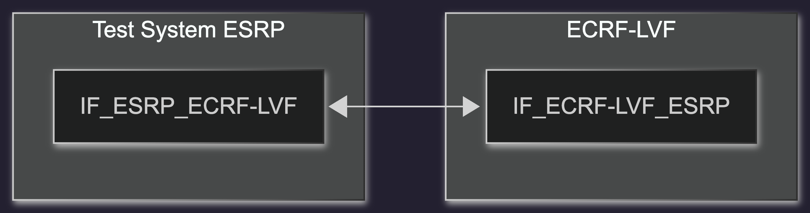
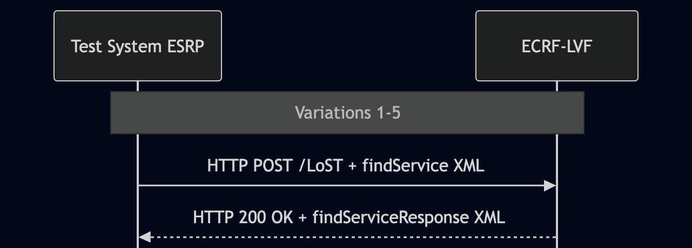

# Test Description: TD_ECRF-LVF_012

## Overview
### Summary
Support for the urn:emergency:service namespace in LoST findService requests


### Description
Verify that the ECRF processes LoST findService requests sent by a Test System ESRP and containing Service URNs from the urn:emergency:service namespace, and returns valid mappings for the supplied location.

### HTTP transport types
Test can be performed with 2 different HTTP transport types. Steps describing actions for specific one are marked as following:
- (TLS transport) - used by default inside ESInet on production environment
- (TCP transport) - used as a fallback if use of TLS is not possible

### References
* Requirements : RQ_ECRF-LVF_048
* Test Case    : TC_ECRF_LVF_012

### Requirements
IXIT config file for ECRF-LVF

## Configuration
### Implementation Under Test Interface Connections
<!-- Identify each of the FEs that are part of the configuration and how they are connected -->
* Test System ESRP
  * IF_ESRP_ECRF-LVF - connected to IF_ECRF-LVF_ESRP
* ECRF-LVF
  * IF_ECRF-LVF_ESRP - connected to IF_ESRP_ECRF-LVF


### Test System Interfaces
<!-- Identify each of the test system interfaces and whether it will be in active or monitor mode -->
* Test System ESRP
  * IF_ESRP_ECRF-LVF - Active
* ECRF-LVF
  * IF_ECRF-LVF_ESRP - Active

### Connectivity Diagram
<!--
https://mermaid.live/edit#pako:eNplkVtrg0AQhf-KzLOReMmaLKUvaQQhhRJtH9ItYavrBXQ3rLu0NuS_d9Wk13maYb5zzsCcIBM5AwxFI96yikplbXeEW6Y6_VpKeqysNHkmkLJOWUnfKdZam2T3QOBlwoaKI9cgcXQYNofNehfNtk_RF8J4Tvgf0_gxNZJ_6OTmXdwu28OvwB9uJte6mc1uBwnYUMo6B6ykZja0TLZ0GOE0sARUxVpGAJs2ZwXVjSJA-NnIjpTvhWivSil0WQEuaNOZSR9zqthdTc3Z34i5gcm10FwBXowOgE_wDtj1kRMGrhuEvhd6KxSGNvSAQ-QsvVWwCOZB4Pvu3D_b8DFmzh2EvAVyvZWRIbQ0PNVKJD3Prmksr5WQ99OfxnedPwGLdYIe
-->




## Pre-Test Conditions

### Test System ESRP
* Interfaces are connected to the network
* Interfaces have IP addresses assigned by DHCP
* Device is active
* No active calls
* (TLS transport) Test System has its own certificate signed by PCA

### ECRF-LVF
* Interfaces are connected to the network
* Interfaces have IP addresses assigned by DHCP
* Default configuration is loaded
* IUT is initialized with steps from the IXIT config file
* IUT is active
* IUT is in normal operating state
* IUT is provisioned with a service boundary layer using the common Boundary1 geometry for each of the following Service URNs:
  * `urn:emergency:service:additionalData`
  * `urn:emergency:service:serviceAgencyLocator`
  * `urn:emergency:service:psap`
  * `urn:emergency:service:responder`
  * `urn:emergency:service:sos`

  ```
  Boundary1
  40.717309464520554, -73.99120141285248
  40.71672360940788, -73.9891917501422
  40.71556789497267, -73.9898030924558
  40.716159065144886, -73.9917916448061
  ```

* Each provisioned Service URN is mapped to an expected URI specified in the IXIT.
* The location used in all test requests is inside Boundary1.

## Test Sequence

### Test Preamble

#### Test System ESRP
* Install CuRL[^1]
* Install Wireshark[^2]
* Copy the following HTTP scenario files to local storage:
  ```
  findService_geodetic_point_urn_emergency_service_additionalData.xml
  findService_geodetic_point_urn_emergency_service_serviceAgencyLocator.xml
  findService_geodetic_point_urn_emergency_service_psap.xml
  findService_geodetic_point_urn_emergency_service_responder.xml
  findService_geodetic_point_urn_emergency_service_sos.xml
  ```
* (TLS transport) Copy to local storage the PCA-signed TLS certificate and private key files:
  ```
  PCA-cacert.pem
  PCA-cakey.pem
  ```
* (TLS transport) Copy to local storage the TLS certificate and private key files used by ECRF-LVF:
  ```
  ECRF-cacert.pem
  ECRF-cakey.pem
  ```
* (TLS v1.2) Configure Wireshark to decode HTTP over TLS using the Test System ESRP and ECRF-LVF certificate keys[^3]
* (TLS v1.3) Configure session key logging and configure Wireshark to decode HTTP over TLS[^4]
* Using Wireshark on Test System ESRP, start packet tracing on the `IF_ESRP_ECRF-LVF` interface with the following filter:
  * (TLS transport)
    > (ip.addr == IF_ESRP_ECRF-LVF_IP_ADDRESS) and tls
  * (TCP transport)
    > (ip.addr == IF_ESRP_ECRF-LVF_IP_ADDRESS) and http

### Test Body

#### Variations

1. `urn:emergency:service:additionalData`
   * XML file: `findService_geodetic_point_urn_emergency_service_additionalData.xml`
2. `urn:emergency:service:serviceAgencyLocator`
   * XML file: `findService_geodetic_point_urn_emergency_service_serviceAgencyLocator.xml`
3. `urn:emergency:service:psap`
   * XML file: `findService_geodetic_point_urn_emergency_service_psap.xml`
4. `urn:emergency:service:responder`
   * XML file: `findService_geodetic_point_urn_emergency_service_responder.xml`
5. `urn:emergency:service:sos`
   * XML file: `findService_geodetic_point_urn_emergency_service_sos.xml`

### Stimulus

For each variation, from `Test System ESRP`, send an HTTP POST request containing the LoST
`<findService>` XML file assigned to the variation.

Each XML request contains:
* the Service URN specified for the variation;
* a location inside Boundary1.

Replace `SCENARIO_FILE` in the commands below with the XML file assigned to the selected variation.

* (TLS transport)
  ```
  curl --cacert cacert.pem --cert client.pem --key client.key \
  -X POST https://IF_ECRF_ESRP_IP:PORT/LoST \
  -H "Content-Type: application/lost+xml" \
  --data-binary @SCENARIO_FILE
  ```

* (TCP transport)
  ```
  curl -X POST http://IF_ECRF_ESRP_IP:PORT/LoST \
  -H "Content-Type: application/lost+xml" \
  --data-binary @SCENARIO_FILE
  ```

### Response

Using the packets captured in Wireshark on the `IF_ESRP_ECRF-LVF` interface, verify the following for each variation:

| Variation | Expected Service URN |
|---|---|
| 1 | `urn:emergency:service:additionalData` |
| 2 | `urn:emergency:service:serviceAgencyLocator` |
| 3 | `urn:emergency:service:psap` |
| 4 | `urn:emergency:service:responder` |
| 5 | `urn:emergency:service:sos` |

For each variation, verify:

* ECRF-LVF returns `HTTP 200 OK` with a LoST `<findServiceResponse>` XML body.
* The response MUST NOT contain an `<errors>` element.
* The response MUST NOT contain a `<redirect>` element.
* The response MUST NOT contain a `serviceSubstitution` warning.
* The response MUST contain a `<mapping>` element corresponding to the requested Service URN and supplied location, with:
  * a `<service>` element matching the Service URN sent in the request;
  * one or more `<uri>` elements matching the expected URI or URIs specified in the IXIT for the requested Service URN;
  * an `expires` attribute containing a future timestamp.
* The response MUST contain a `<path>` element with at least one `<via>` element.
* The response MUST contain a `<locationUsed>` element whose `id` matches the location `id` from the request.

VERDICT:
* PASSED - if all checks passed
* FAILED - all other cases

### Test Postamble

#### Test System ESRP
* Archive all generated logs and packet captures
* Stop Wireshark if it is still running
* Remove the HTTP scenario files
* Disconnect interfaces from ECRF-LVF
* (TLS transport) Remove the certificates and private key files used for the test

#### ECRF-LVF
* Reconnect interfaces to the default network configuration
* Restore the previous configuration

## Post-Test Conditions

### Test System ESRP
* Test tools are stopped
* Test interfaces are disconnected from ECRF-LVF
* Test scenario files and test certificates are removed

### ECRF-LVF
* The device is connected to the default network configuration
* The previous configuration is restored
* The device is in its normal operating state


## Sequence Diagram
<!--
https://mermaid.live/edit#pako:eNptkm9PwjAQxr_K5d66Ydkog74wMf6JiaCEEWLM3jTbgY2uxa4jIuG7uxYwMfFN27s-v7v2afdYmopQYBzHhS6NXqm1KDSAe6OaBFTSvvuwVtYae106YxsBK_nRUKED09BnS7qkWyXXVtZeDLCR1qlSbaR2cJfPZyAbWFDjIN81juqQ-0d5M7_3Sj_Hk-V9oY-aJ-MIzJZs4CK_LWAprZJOGd1AP-ZnqRfEV1dHycNiMYPZc76Ay4npxgtYKV3lZLeqJHiZTk6Mb-ehjj1BCWPw_PgXmFOz6boFECNcW1WhcLalCGuytfQh7n3JAoN7BYpuGRzEQh86prvlqzH1GbOmXb-hCG5G2G4q6c42_mYt6YrsjWm1Q9FPWCiCYo9fXTge97KUDxOWMJ4MB8kgwh2KNM16LB3xNMtYnyfZ6BDhd2jLepyPB3ycjkYJH7IsjVC2zuQ7XZ7PRJXq3nh6_BThbxx-AKffqh0
-->




## Comments

Version:  010.3d.5.0.0

Date:     20260716


## Footnotes
[^1]: CURL for Linux https://linux.die.net/man/1/curl
[^2]: Wireshark - tool for packet tracing and analysis. Official website: https://www.wireshark.org/download.html
[^3]: Wireshark configuration to decrypt SIP over TLS packets: https://www.zoiper.com/en/support/home/article/162/How%20to%20decode%20SIP%20over%20TLS%20with%20Wireshark%20and%20Decrypting%20SDES%20Protected%20SRTP%20Stream
[^4]: TLS v1.3 session keys logging + Wireshark configuration to decrypt traffic: https://my.f5.com/manage/s/article/K50557518
