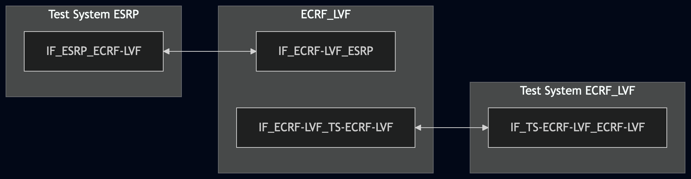
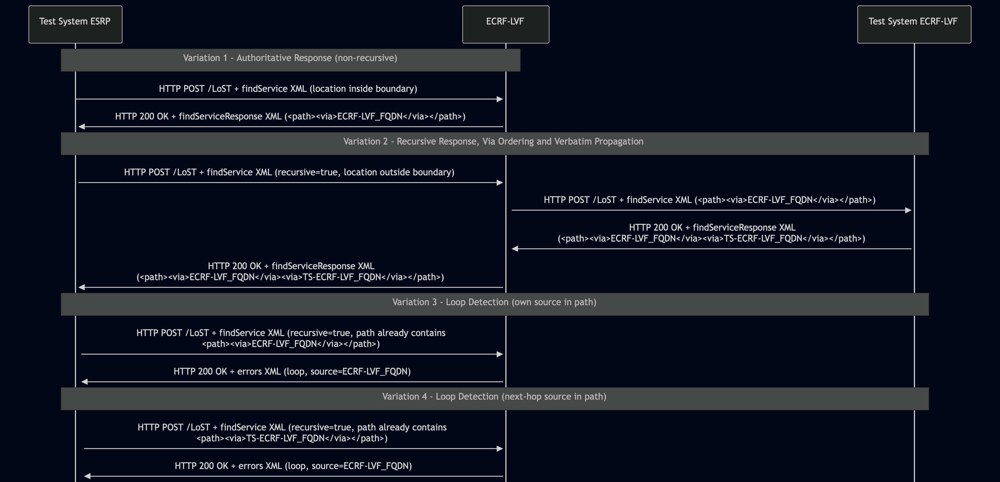

# Test Description: TD_ECRF-LVF_013

## Overview

### Summary
Vias in <path> element as per RFC 5222

### Description
Verify that ECRF-LVF returns `<via>` elements within the `<path>` element of a LoST `<findServiceResponse>` in compliance with RFC 5222

### HTTP transport types
Test can be performed with 2 different HTTP transport types. Steps describing actions for specific one are marked as following:
- (TLS transport) - used by default inside ESInet on production environment
- (TCP transport) - used as a fallback if use of TLS is not possible

### References
* Requirements : RQ_ECRF-LVF_056
* Test Case    : TC_ECRF_LVF_013

### Requirements
IXIT config file for ECRF-LVF

## Configuration
### Implementation Under Test Interface Connections
<!-- Identify each of the FEs that are part of the configuration and how they are connected -->
* Test System ESRP
  * IF_ESRP_ECRF-LVF - connected to IF_ECRF-LVF_ESRP
* ECRF-LVF(IUT)
  * IF_ECRF-LVF_ESRP - connected to IF_ESRP_ECRF-LVF
  * IF_ECRF-LVF_TS-ECRF-LVF - connected to IF_TS-ECRF-LVF_ECRF-LVF
* Test System ECRF-LVF
  * IF_TS-ECRF-LVF_ECRF-LVF - connected to IF_ECRF-LVF_TS-ECRF-LVF


### Test System Interfaces
<!-- Identify each of the test system interfaces and whether it will be in active or monitor mode -->
* Test System ESRP
  * IF_ESRP_ECRF-LVF - Active
* ECRF-LVF(IUT)
  * IF_ECRF-LVF_ESRP - Active
  * IF_ECRF-LVF_TS-ECRF-LVF - Active
* Test System ECRF-LVF
  * IF_TS-ECRF-LVF_ECRF-LVF - Active

### Connectivity Diagram
<!--
https://mermaid.live/edit#pako:eNp1UtFqgzAU_RW5z1psjLUJYy9dC4MOhpY9DEEyTWtZNSVGNif--6KddnM2T7nn3HPuuXBriEXCgcL-JD7ilEllbP0wN_R73ETrwH-O1it_Y21fNneWdd9iP2VHXjt7dBdYI8EvZGi76Iry7SDZOTV2vFBGUBWKZ8bVdirEheF5MnJo-Wjgx6H-e07EvWX9J9zUmNsLDmZgwkEeE6BKltyEjMuMtSXULR-CSnnGQ6D6mzD5HkKYN1pzZvmrEFkvk6I8pED37FToqjwnTPGHI9MxswGVeiaXK1HmCigiuDMBWsMnUIxnhBCEFo5je9h15yZUQN3FjLjIQ0syR7a78HBjwlc31Z4RPPccb0lshB3XsbUbK5UIqjzuM_HkqIR8uhxRd0vNN_tBrTo
-->




## Pre-Test Conditions

### Test System ESRP/Test System ECFR-LVF
* Interfaces are connected to network
* Interfaces have IP addresses assigned by DHCP
* Device is active
* No active calls
* ng911 repository cloned to local storage
* (TLS transport) Test System has its own certificate signed by PCA
* Available PCA certificate and key for signing new generated ones 

### ECRF-LVF
* Interfaces are connected to network
* Interfaces have IP addresses assigned by DHCP
* Default configuration is loaded
* IUT is configured with planned changes
* The FQDN of the downstream authoritative server ECRF-LVF is configured to recurse to TS-ECRF-LVF
* IUT is initialized with steps from IXIT config file
* IUT is active
* IUT is in normal operating state
* IUT is provisioned with following service boundary:
```
Boundary1 - service SIP URI: sip:boundary1@example.com
40.717309464520554, -73.99120141285248
40.71672360940788, -73.9891917501422
40.71556789497267, -73.9898030924558
40.716159065144886, -73.9917916448061
```

## Test Sequence

### Test Preamble

#### Test System ESRP
* Install CuRL[^1]
* Install Wireshark[^2]
* Copy following HTTP scenario file to local storage:
  ```
     findService_geodetic_point.xml
     findService_geodetic_point_not_in_ecrf.xml
     findService_with_own_via_loop.xml
     findService_downstream_via_loop.xml
  
  ```
* (TLS transport) Copy to local storage PCA-signed TLS certificate and private key files:
  ```
     PCA-cacert.pem
     PCA-cakey.pem
  ```
* (TLS transport) Copy to local storage TLS certificate and private key files used by ECRF:
  ```
     ECRF-LVF-cacert.pem
     ECRF-LVF-cakey.pem

  ```
* (TLS transport) Configure Wireshark to decode HTTP over TLS packets from Test System ESRP and ECRF-LVF as well[^3]
* Using Wireshark on 'Test System ESRP' start packet tracing on IF_ESRP_ECRF-LVF interface - run following filter:
   * (TLS transport)
     > (ip.addr == IF_ESRP_ECRF-LVF_IP_ADDRESS) and tls
   * (TCP transport)
     > (ip.addr == IF_ESRP_ECRF-LVF_IP_ADDRESS) and http


#### Test System ECRF-LVF
* Install Wireshark[^2]
* (TLS transport) Configure Wireshark to decode HTTP over TLS packets from Test System ECRF-LVF and ECRF as well[^3]
* Copy following HTTP scenario files to local storage:
   ```
	 findServiceResponse_for_not_in_ecrf.xml
   ```
  
* Using Wireshark on 'Test System' start packet tracing on IF_TS-ECRF-LVF_ECRF-LVF interface - run following filter:
   * (TLS transport)
     > (ip.addr == IF_TS-ECRF-LVF_ECRF-LVF_IP_ADDRESS) and tls
   * (TCP transport)
     > (ip.addr == IF_TS-ECRF-LVF_ECRF-LVF_IP_ADDRESS) and http

For Variation 1 do not start the server.

* Start http server responding for HTTP(S) POST requests:
    * Variation 2, 3 and 4 
      * (TLS transport)
       ```
          python3 http_entry.py \ --ip IF_TS-ECRF-LVF_ECRF-LVF_IP_ADDRESS \ --port 8080 \ --role RECEIVER \ --path /LoST \ --method POST \ --body file.findServiceResponse_for_not_in_ecrf.xml \ --content_type application/lost+xml \ --response_code 200 \ --server_cert test_system2.pem \ --server_key test_system2.key
       ```
      * (TCP transport)
       ```
          python3 http_entry.py \ --ip IF_TS-ECRF-LVF_ECRF-LVF_IP_ADDRESS \ --port 8080 \ --role RECEIVER \ --path /LoST \ --method POST \ --body file.findServiceResponse_for_not_in_ecrf.xml \ --content_type application/lost+xml \ --response_code 200
       ```


### Test Body

#### Variations
* Variation 1 – `<path>`/`<via>` in an authoritative (non-recursive) response.

  Verifies that when ECRF-LVF answers a `<findService>` query authoritatively (location falls within its own provisioned boundary, no recursion needed), the `<findServiceResponse>` contains a `<path>` element with exactly one `<via>` element identifying ECRF-LVF itself. 

  Stimulus file: `findService_geodetic_point.xml`


* Variation 2 – `<path>`/`<via>` ordering and verbatim propagation in a recursive response.

  Verifies that when ECRF-LVF must recurse to a downstream authoritative LoST server for a location outside its own boundary, it adds its own `<via>` to the `<path>` before forwarding the recursive query, and returns the `<path>` received from the downstream server to the ESRP unmodified (verbatim), containing both `<via>` elements in the correct order.

  Stimulus file: `findService_geodetic_point_not_in_ecrf.xml`(location outside ECRF-LVF's own boundary, requiring recursion to Test System ECRF-LVF)


* Variation 3 – Loop detection - ECRF-LVF's own source already in the incoming `<path>`.

  Verifies that when ECRF-LVF receives a recursive `<findService>` request whose `<path>` already contains a `<via>` element with ECRF-LVF's own `source` value, ECRF-LVF detects the duplication and returns an `<errors>` response containing a `<loop>` element instead of forwarding the request again, demonstrating the "error resolution" use of `<path>`.

  Stimulus file: `findService_with_own_via_loop.xml`, a `<findService>` request contains `<path>` element already contains (e.g. `<via source="ecrf-lvf.example.com"/>`):


* Variation 4 – Loop detection: the next-hop's source already in the incoming `<path>`.

  Verifies that when ECRF-LVF receives a recursive `<findService>` request whose `<path>` already 
  contains a `<via>` element with the `source` of the downstream server ECRF-LVF is about to
  recurse to (`ts-ecrf-lvf-2.example.com`), ECRF-LVF detects that its intended next hop is already
  present in the path and returns an `<errors>` response containing a `<loop>` element instead of
  forwarding the request to that server, without ECRF-LVF's own source needing to appear in the path at all.

  Stimulus file: `findService_downstream_via_loop.xml`, a `<findService>` request contains `<path>` element already contains (e.g. `<via source="ts-ecrf-lvf-2.example.com"/>`):
 


#### Stimulus

From 'Test System ESRP' send HTTP POST with LoST request(XML_FILE according to the variation):
   * (TLS)
     ```
        curl --cacert cacert.pem --cert client.pem --key client.key \
        -X POST https://IF_ECRF-LVF_ESRP_IP:PORT/LoST \
        -H "Content-Type: application/lost+xml" \
        --data-binary @STIMULUS_FILE
     ```
   * (TCP)
     ```
        curl -X POST http://IF_ECRF-LVF_ESRP_IP:PORT/LoST \
        -H "Content-Type: application/lost+xml" \
        --data-binary @STIMULUS_FILE
     ```

#### Response

##### Variation 1 - Authoritative response

Using traced packets on Wireshark on IF_ESRP_ECRF-LVF interface verify that the `<findServiceResponse>` returned to Test System ESRP contains:
* a `<path>` element that is present and contains exactly one `<via>` element;
* the `<via>` element's `source` attribute equals ECRF-LVF's own provisioned FQDN
  (e.g. `ecrf-lvf.example.com`) and conforms to the `appUniqueString` token pattern (`([a-zA-Z0-9\-]+\.)+[a-zA-Z0-9]+`), e.g.:
  * valid: 
    * `<via source="ecrf-lvf.example.com"/>`
    * `<via source="ecrf-1.state.pa.us"/>`
    * `<via source="esgw.ueber-110.de.example"/>`
  
  * not valid:
    * `<via source="ecrf-lvf"/>`
    * `<via source="ecrf_lvf.example.com"/>` (underscore not in `[a-zA-Z0-9\-]`)
    * `<via source="ecrf-lvf.example.com."/>` (trailing dot)


##### Variation 2 - Recursive response, ordering and verbatim propagation

* Using traced packets on Wireshark on IF_TS-ECRF-LVF_ECRF-LVF interface verify that:
    * the recursive `<findService>` request was forwarded by the ECRF-LVF to Test System ECRF-LVF
    * request to the Test System ECRF-LVF contains a `<path>` element with one e.g. `<via source="ecrf-lvf.example.com"/>` element (where `ecrf-lvf.example.com` is example FQDN of the ECRF-LVF).

* Using traced packets on Wireshark on IF_ESRP_ECRF-LVF interface verify if `<findServiceResponse>` returned to Test System ESRP contains:
    * a `<path>` element with exactly two `<via>` elements;
    * the first `<via>` element's `source` equals FQDN of the ECRF-LVF
    * the second `<via>` element's `source` equals FQDN of the Test System ECRF-LVF
    * the `<path>` element is byte-for-byte identical to the `<path>` received from Test System
      ECRF-LVF in its `findServiceResponse` (i.e. not modified while traversing back to the ESRP).


##### Variation 3 - Loop detection - own source in path

* Using traced packets on Wireshark on IF_ESRP_ECRF-LVF interface verify that ECRF-LVF returns an
`<errors>` response (instead of `<findServiceResponse>`) containing:
  * a `<loop>` element;
  * the `<errors>` element's `source` attribute equals FQDN of ECRF-LVF e.g. `ecrf-lvf.example.com`.
  * Example error message:
      ```
          <?xml version="1.0" encoding="UTF-8"?>
          <errors xmlns="urn:ietf:params:xml:ns:lost1"
            source="ecrf-lvf.example.com">
             <loop message="Server already present in path." xml:lang="en"/>
          </errors>
      ```

* Using traced packets on Wireshark on IF_TS-ECRF-LVF_ECRF-LVF interface verify that:
  * ECRF-LVF does NOT forward the `<findService>` request to Test System ECRF-LVF (no recursive query observed).


##### Variation 4 - Loop detection - next-hop source in path
 
* Using traced packets on Wireshark on IF_ESRP_ECRF-LVF interface verify that ECRF-LVF returns an
`<errors>` response (rather than a `<findServiceResponse>`) containing:
  * a `<loop>` element;
  * the `<errors>` element's `source` attribute equals FQDN of ECRF-LVF e.g. `ecrf-lvf.example.com` (ECRF-LVF is the one
    reporting the error, even though it is the downstream server's FQDN that was found in the path).
* Using traced packets on Wireshark on IF_TS-ECRF-LVF_ECRF-LVF interface verify that:
  * ECRF-LVF does NOT forward the `<findService>` request to Test System ECRF-LVF (no recursive query observed).


VERDICT:
* PASSED - if all checks passed
* FAILED - any other cases

### Test Postamble
#### Test System ESRP/Test System ECRF-LVF
* archive all logs generated
* stop Wireshark (if still running)
* remove all HTTP scenarios
* disconnect interfaces from ECRF-LVF
* (TLS transport) remove certificates

#### ECRF-LVF
* reconnect interfaces back to default
* restore previous configuration

## Post-Test Conditions
### Test System ESRP/Test System ECRF-LVF
* Test tools stopped
* interfaces disconnected from ECRF

### ECRF-LVF
* device connected back to default
* device in normal operating state


## Sequence Diagram
<!--
https://mermaid.live/edit#pako:eNrNVe-L2kAQ_VeG_eRxicYYfwVPOE6lUO-0KlJKoKzJqEvNbrrZ2LPi_95NNBYPufM4C82HJXnJvDf7djKzJb4IkLjENE2P-4LP2cL1OOgrZFIKee8rIWMX5nQVo8ezz2L8mSD3scPoQtLQ409CIYg1SphgrGC8iRWG0B2PhgZ0H0Y9sz_tuTClklHFBIcymHCfqKWQTGlkjTDCOBKaGApccFOin8hY4zc6FY-_JDXb7du_tJ8mkyEMB-MJlPpCr7cwZzwYo1wzH-HrYx8KK-HvhRmPWYAwEwkPqNxo-pwn5Xypc-C2LQsGn095j_lm_K2IqmW7tWa0nfN9733pPLVKKdQqZa_3e3nNqhPkjG22tm2UW3O0zIApozCQAUrGF0B5AFOUMx0SwlCKiC6y6CvYeDyWOyUTrXu0VSTqYl_fI3ipr-cEzuzuzYNszWT7LdF0mYzNV_O5RlFdLZkPFl1FF11fiAg6qNDPoIL4xSEWidTnxDikQjf_oLxSXqAriTTYgG5NiurfN7MFLi2M9xwEpu0uzhuGiIzDFu9OFD5uqHPGUI7Pylxq7H9x9ZoVfrGxxCALyQLiZpmSEGVI00eyTSeSR9QSQ_SIq291l_nhEY_vdExE-TchwjxMimSxJG42sAySRAFV-aQ6ohK5bpcPul0p4tasekZC3C15Jm7Zsor1hmNXK027UmtajmOQjYZtp1iul51qs15tOE6jYu8M8jvTtYoNy7Yb1abVrFXtetkgNFFivOF-nhMGTI_Rx_2ozSZunlk3e3NIbPcH7e1u4Q
-->




## Comments

Version:  010.3d.5.0.0

Date:     20260831


## Footnotes
[^1]: CURL for Linux https://linux.die.net/man/1/curl
[^2]: Wireshark - tool for packet tracing and anaylisis. Official website: https://www.wireshark.org/download.html
[^3]: Wireshark configuration to decrypt SIP over TLS packets: https://www.zoiper.com/en/support/home/article/162/How%20to%20decode%20SIP%20over%20TLS%20with%20Wireshark%20and%20Decrypting%20SDES%20Protected%20SRTP%20Stream
[^4]: TLS v1.3 session keys logging + Wireshark configuration to decrypt traffic: https://my.f5.com/manage/s/article/K50557518
[^5]: OpenSSL v1.1.1 or higher - toolkit required for TLS operations and certificate/key handling. Official website and downloads: https://www.openssl.org/source/ . Installation documentation: https://github.com/openssl/openssl/blob/master/INSTALL.md
