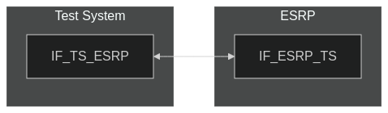
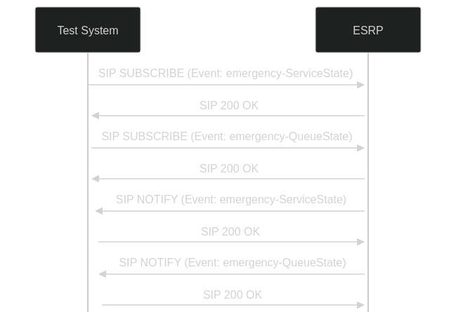

# Test Description: TD_ESRP_001
## Overview
### Summary
QueueState update after changing ServiceState

### Description
Test verifies relation between ServiceState and QueueState. When service changes it's status then all related queues shall change theirs appropriately

### SIP transport types
Test can be performed with 2 different SIP transport types. Steps describing actions for specific one are marked as following:
- (TLS transport) - used by default inside ESInet on production environment
- (TCP transport) - used in lab for testing purposes only if default TLS is not possible

### References
* Requirements : RQ_ESRP_005, RQ_ESRP_006, RQ_ESRP_007, RQ_ESRP_008
* Test Case    : TC_ESRP_001

### Requirements
IXIT config file for ESRP

## Configuration
### Implementation Under Test Interface Connections
<!-- Identify each of the FEs that are part of the configuration and how they are connected -->
* ESRP
  * IF_ESRP_TS - connected to Test System IF_TS_ESRP
* Test System
  * IF_TS_ESRP - connected to Test System IF_ESRP_TS

### Test System Interfaces
<!-- Identify each of the test system interfaces and whether it will be in active or monitor mode -->
* Test System 
  * IF_TS_ESRP - Active
* ESRP
  * IF_ESRP_TS - Active
 
### Connectivity Diagram
<!--
[](https://mermaid.live/edit#pako:eNpdUMsKgzAQ_BXZs_6AlJ7aQqGFop5KQLZmfVCTSEwoIv571yqI3dPszOxzhMJIghjK1nyKGq0LbonQAcf1kmdpfk6TxyGKjpzNkKlF7f2rstjVQUa9C9Khd6QWZV-7cKTlX9mmrf5dd_ZDCIqswkbyduNMC3A1KRIQM5Ro3wKEntiH3pl00AXEznoKwXcSHZ0a5FEK4hLbntkO9dOYLSfZOGPvy_m_L4Rgja_q1TF9AXBGWao)
-->




## Pre-Test Conditions
### Test System
* Interfaces are connected to network
* Interfaces have IP addresses assigned by DHCP
* Device is active
* No active calls
* (TLS transport) Test System has it's own certificate signed by PCA

### ESRP
* Interfaces are connected to network
* Interfaces have IP addresses assigned by DHCP
* Default configuration is loaded
* Device is initialized with steps from IXIT config file
* Queue length and number of permitted dequeuers must be higher than 1
* Device is provisioned with policy allowing to subscribe for Queue and Service states from Test System
* Device is active
* Device is in normal operating state
* No active calls


## Test Sequence

### Test Preamble

#### ESRP
* Set ServiceState to "Normal"

#### Test System
* Install SIPp by following steps from documentation[^1]
* Copy following XML scenario files to local storage:
  ```
  SIP_SUBSCRIBE_ServiceState.xml
  SIP_SUBSCRIBE_QueueState.xml
  ```
* Install Wireshark[^2]
* (TLS transport) Copy to local storage PCA-signed TLS certificate and private key files:
  ```
  PCA-cacert.pem
  PCA-cakey.pem
  ```
* (TLS transport) Copy to local storage TLS certificate and private key files used by ESRP:
  ```
  ESRP-cacert.pem
  ESRP-cakey.pem
  ```
* (TLS transport) Configure Wireshark to decode HTTP over TLS packets from Test System and ESRP as well[^3]
* Using Wireshark on 'Test System' start packet tracing on IF_TS_ESRP interface - run following filter:
   * (TLS transport)
     > ip.addr == IF_TS_ESRP_IP_ADDRESS and tls
   * (TCP transport)
     > ip.addr == IF_TS_ESRP_IP_ADDRESS and sip
* On Test System start subscription for ServiceState - run SIPp tool with following command:
   * (TCP transport)
     > sudo sipp -t t1 -sf SIP_SUBSCRIBE_ServiceState.xml -i IF_TS_ESRP_IP_ADDRESS:5060 IF_ESRP_TS_IP_ADDRESS:5060 -timeout 10 -max_recv_loops 1 -m 1
   * (TLS transport)
     > sudo sipp -t l1 -tls_cert PCA-cacert.pem -tls_key PCA-cakey.pem -sf SIP_SUBSCRIBE_ServiceState.xml -i IF_TS_ESRP_IP_ADDRESS:5060 IF_ESRP_TS_IP_ADDRESS:5060 -timeout 10 -max_recv_loops 1 -m 1
* On Test System start subscription for QueueState - run SIPp tool with following command:
   * (TCP transport)
     > sudo sipp -t t1 -sf SIP_SUBSCRIBE_QueueState.xml -i IF_TS_ESRP_IP_ADDRESS:5060 IF_ESRP_TS_IP_ADDRESS:5060 -timeout 10 -max_recv_loops 1 -m 1
   * (TLS transport)
     > sudo sipp -t l1 -tls_cert PCA-cacert.pem -tls_key PCA-cakey.pem -sf SIP_SUBSCRIBE_QueueState.xml -i IF_TS_ESRP_IP_ADDRESS:5060 IF_ESRP_TS_IP_ADDRESS:5060 -timeout 10 -max_recv_loops 1 -m 1
 * Verify if ESRP sends SIP NOTIFY messages with ServiceState="Normal" status and QueueState="Active"


### Test Body

#### Stimulus
On ESRP simulate change of ServiceState to "Down"

#### Response
1. Verify if ESRP sends SIP NOTIFY messages with updated ServiceState="Down"
2. Verify if ESRP sends SIP NOTIFY messages with updated QueueState="Inactive"
3. Verify if ESRP did not send SIP NOTIFY with `"state": "unreachable"` for any queue

VERDICT:
* PASSED - if Response steps 1-3 have passed
* FAILED - if ESRP did not change ServiceState and/or QueueState or did not send SIP NOTIFY messages
<!--
* INCONCLUSIVE - if ESRP did not send SIP NOTIFY
* ERROR - if changing ServiceState to "Down" failed
-->

### Test Postamble
#### Test System
* stop Sipp process (if still running)
* archive all logs generated
* stop Wireshark (if still running)
* remove all scenario files
* disconnect interfaces from ESRP
* (TLS transport) remove certificates

#### ESRP
* disconnect IF_ESRP_TS
* reconnect interfaces back to default
* restore previous configuration

## Post-Test Conditions
### Test System 
* Test tools stopped
* interfaces disconnected from ESRP

### ESRP
* device connected back to default
* device in normal operating state

## Sequence Diagram
<!--
[](https://mermaid.live/edit#pako:eNqlks1KAzEURl8l3JXFGSgusyhYHWEQbW3qQskmJLfTUJPU_BSG0nc3M1OoC4tis0rgu-fLhbMH6RQChbIsuZXOrnRDuSXEaO-dv5XR-UDJSnwE5LYPBfxMaCXea9F4YbrwcJYYImFtiGjKyeS6Yos5JayeE_Y6ZXeLelqRq2qHNlKCBn2TIW3J0O-0RBZFxNGJ1Q13kG_MgXUzHpPZ44WlLwnT_yvPBp9ny_rh7e9Lnv375Y0_bvhLHxSQ543QKvuw78Y4xHVmcqD5qoTfcOD2kHMiRcdaK4FGn7CAtFW56mgE0F6XArbCvjt3eqPSWaenQbjeuwK8S836mDh8Acidyh0)
-->




## Comments

Version:  010.3d.3.0.8

Date:     20250425

## Footnotes
[^1]: SIPp - tool for SIP packet simulations. Official documentation: https://sipp.sourceforge.net/doc/reference.html#Getting+SIPp
[^2]: Wireshark - tool for packet tracing and anaylisis. Official website: https://www.wireshark.org/download.html
[^3]: Wireshark configuration to decrypt SIP over TLS packets: https://www.zoiper.com/en/support/home/article/162/How%20to%20decode%20SIP%20over%20TLS%20with%20Wireshark%20and%20Decrypting%20SDES%20Protected%20SRTP%20Stream
