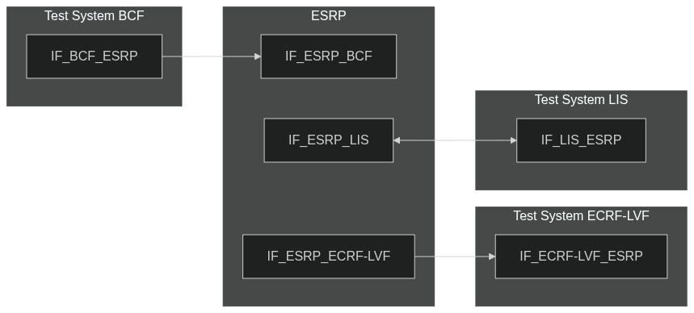
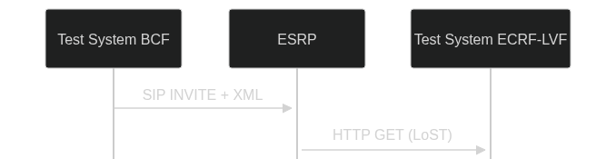
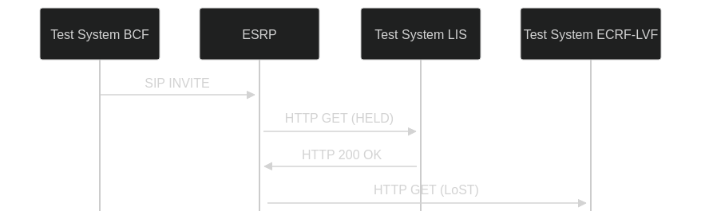

# Test Description: TD_ESRP_002
## Overview
### Summary
Receiving location and dereferencing

### Description
Test verifies:
- receiving location as a value
- receiving location as a reference
- location dereferencing using credentials provisoned

### SIP transport types
Test can be performed with 2 different SIP transport types. Steps describing actions for specific one are marked as following:
- (TLS transport) - used by default inside ESInet on production environment
- (TCP transport) - used in lab for testing purposes only if default TLS is not possible

### References
* Requirements : RQ_ESRP_017, RQ_ESRP_018
* Test Case    : TC_ESRP_002

### Requirements
IXIT config file for ESRP

## Configuration
### Implementation Under Test Interface Connections
<!-- Identify each of the FEs that are part of the configuration and how they are connected -->
* Test System BCF
  * IF_BCF_ESRP - connected to IF_ESRP_BCF
* ESRP
  * IF_ESRP_BCF - connected to Test System BCF IF_BCF_ESRP
  * IF_ESRP_LIS - connected to Test System LIS IF_LIS_ESRP
  * IF_ESRP_ECRF-LVF - connected to Test System ECRF-LVF IF_ECRF-LVF_ESRP
* Test System LIS
  * IF_LIS_ESRP - connected to IF_ESRP_LIS
* Test System ECRF-LVF
  * IF_ECRF-LVF_ESRP - connected to IF_ESRP_ECRF-LVF

### Test System Interfaces
<!-- Identify each of the test system interfaces and whether it will be in active or monitor mode -->
* Test System BCF
  * IF_BCF_ESRP - Active
* Test System LIS
  * IF_LIS_ESRP - Active
* Test System ECRF-LVF
  * IF_ECRF-LVF_ESRP - Monitor
* ESRP
  * IF_ESRP_BCF - Active
  * IF_ESRP_LIS - Active
  * IF_ESRP_ECRF-LVF - Monitor
 
 
### Connectivity Diagram
<!--
[](https://mermaid.live/edit#pako:eNp9UlFrgzAQ_ityz1o0aa0JYw_rKhQcjDr2UISS1VRl1ZQY2Vzpf1_U2tV2NE93391933fhDrARMQcK25342qRMKiNYRoWh38JfP8389TxcvlrW46KLGuhcboFgET50dR210LA-ny19K3j3Txyn7KKxrD4Syfap8cZLZYR1qXhunGWunHQgL-I7s73GgOAf4fssepsBwXC729m_2uX213v0X3YLDl1rfjAhkVkMVMmKm5BzmbMmhUPTEoFKec4joDqMmfyMICqOembPipUQeT8mRZWkQLdsV-qs2sdM8eeMac_5GZVajcuZqAoFFJGWA-gBvoFOyAiTMbGxPXHGLjah1h3IGyEHOZ5ruxg7tjc-mvDTatojl7hThB0XO2jqEYJMYJUSYV1sekc8zpSQL93Ztdd3_AWtgLxP)
-->




## Pre-Test Conditions
### Test System BCF
* Interfaces are connected to network
* Interfaces have IP addresses assigned by DHCP
* Device is active
* No active calls
* (TLS transport) Test System has it's own certificate signed by PCA

### Test System LIS
* Interfaces are connected to network
* Interfaces have IP addresses assigned by DHCP
* Device is active
* (TLS transport) Test System has it's own certificate signed by PCA

### Test System ECRF-LVF
* Interfaces are connected to network
* Interfaces have IP addresses assigned by DHCP
* Device is active
* (TLS transport) Test System has it's own certificate signed by PCA

### ESRP
* Interfaces are connected to network
* Interfaces have IP addresses assigned by DHCP
* Default configuration is loaded
* Device is initialized with steps from IXIT config file
* Device configured to use `Test System LIS` for location dereference by default
* Device configured to use `Test System ECRF-LVF` by default as ECRF server
* Device is active
* Device is in normal operating state
* No active calls


## Test Sequence

### Test Preamble

#### Test System BCF
* Install SIPp by following steps from documentation[^1]
* Copy following XML scenario files to local storage:
  ```
  SIP_INVITE_location_PIDF-LO.xml
  SIP_INVITE_geolocation_HELD.xml
  SIP_INVITE_geolocation_SIP.xml
  ```
* Install Wireshark[^2]
* (TLS transport) Copy to local storage PCA-signed TLS certificate and private key files:
  ```
  PCA-cacert.pem
  PCA-cakey.pem
  ```
* (TLS transport) Copy to local storage TLS certificate and private key files used by ESRP:
  ```
  ESRP-cacert.pem
  ESRP-cakey.pem
  ```
* (TLS transport) Configure Wireshark to decode HTTP over TLS packets from Test System and ESRP as well[^3]
* Using Wireshark on 'Test System' start packet tracing on IF_BCF_ESRP interface - run following filter:
   * (TLS transport)
     > ip.addr == IF_BCF_ESRP_IP_ADDRESS and tls
   * (TCP transport)
     > ip.addr == IF_BCF_ESRP_IP_ADDRESS and sip

#### Test System LIS
* Copy following HTTP scenario files and scripts to local storage:
  ```
  Location_response
  ```
* Install Wireshark[^2]
* (TLS transport) Copy to local storage PCA-signed TLS certificate and private key files:
  ```
  PCA-cacert.pem
  PCA-cakey.pem
  ```
* (TLS transport) Copy to local storage TLS certificate and private key files used by ESRP:
  ```
  ESRP-cacert.pem
  ESRP-cakey.pem
  ```
* (TLS transport) Configure Wireshark to decode HTTP over TLS packets from Test System and ESRP as well[^3]
* Using Wireshark on 'Test System' start packet tracing on IF_LIS_ESRP interface - run following filter:
   * (TLS transport)
     > ip.addr == IF_LIS_ESRP_IP_ADDRESS and tls
   * (TCP transport)
     > ip.addr == IF_LIS_ESRP_IP_ADDRESS and sip
* Start http server responding for HTTP GET requests:
    * (TCP transport)
      ```
      echo -e "HTTP/1.1 200 OK\r\nContent-Type: application/held+xml\r\nContent-Length: 750\r\n\r\n$(cat Location_response | \
      nc -lp 80
      ```
    * (TLS transport)
      ```
      echo -e "HTTP/1.1 200 OK\r\nContent-Type: application/held+xml\r\nContent-Length: 750\r\n\r\n$(cat Location_response | \
      openssl s_server -quiet -accept LOCAL_PORT -cert PCA-cacert.pem -key PCA-cakey.pem
      ```

#### Test System ECRF-LVF
* Install Wireshark[^2]
* (TLS transport) Copy to local storage PCA-signed TLS certificate and private key files:
  ```
  PCA-cacert.pem
  PCA-cakey.pem
  ```
* (TLS transport) Copy to local storage TLS certificate and private key files used by ESRP:
  ```
  ESRP-cacert.pem
  ESRP-cakey.pem
  ```
* (TLS transport) Configure Wireshark to decode HTTP over TLS packets from Test System and ESRP as well[^3]
* Using Wireshark on 'Test System' start packet tracing on IF_LIS_ESRP interface - run following filter:
   * (TLS transport)
     > ip.addr == IF_ECRF-LVF_ESRP_IP_ADDRESS and tls
   * (TCP transport)
     > ip.addr == IF_ECRF-LVF_ESRP_IP_ADDRESS and sip
* Start http server responding for HTTP GET requests:
    * (TCP transport)
      ```
      echo -e "HTTP/1.1 200 OK\r\n | nc -lp 80
      ```
    * (TLS transport)
      ```
      echo -e "HTTP/1.1 200 OK\r\n | openssl s_server -quiet -accept LOCAL_PORT -cert PCA-cacert.pem -key PCA-cakey.pem
      ```


### Test Body

#### Variations
1. SIP_INVITE_location_PIDF-LO.xml
2. SIP_INVITE_geolocation_HELD.xml
3. SIP_INVITE_geolocation_SIP.xml


#### Stimulus
Send SIP packet to ESRP - run following SIPp command on Test System BCF, example:

* (TCP transport)
   ```
   sudo sipp -t t1 -sf SIP_INVITE_location_PIDF-LO.xml IF_ESRP_BCF_IP_ADDRESS:5060
   ```
* (TLS transport)
   ```
   sudo sipp -t l1 -sf SIP_INVITE_location_PIDF-LO.xml IF_ESRP_BCF_IP_ADDRESS:5061
   ```

#### Response
Variation 1 
* verify if ESRP sends HTTP LoST query to 'Test System ECRF-LVF' with location received in SIP INVITE

Variation 2
* verify if ESRP sends HTTP HELD request to 'Test System LIS' for location dereference
* verify if ESRP uses provisioned certificate (PCA traceable) for HTTP HELD request
* verify if ESRP sends HTTP LoST query to 'Test System ECRF-LVF' with dereferenced location

Variation 3
* verify if ESRP sends SIP SUBSCRIBE to 'Test System LIS' for location dereference
* verify if ESRP uses provisioned certificate (PCA traceable) for SIP over TLS
* verify if ESRP sends HTTP LoST query to 'Test System ECRF-LVF' with dereferenced location


VERDICT:
* PASSED - if all checks passed for variation
* FAILED - all other cases
<!--
* INCONCLUSIVE - 
* ERROR - 
-->

### Test Postamble
#### Test System BCF
* stop Sipp process (if still running)
* archive all logs generated
* stop Wireshark (if still running)
* remove all scenario files
* disconnect interfaces from ESRP
* (TLS transport) remove certificates

#### Test System LIS
* stop simple_http_server.py
* archive all logs generated
* stop Wireshark (if still running)
* remove all scenario files
* disconnect interfaces from ESRP
* (TLS transport) remove certificates

#### Test System ECRF-LVF
* stop simple_http_server.py
* archive all logs generated
* stop Wireshark (if still running)
* remove all scenario files
* disconnect interfaces from ESRP
* (TLS transport) remove certificates

#### ESRP
* disconnect interfaces from Test Systems
* reconnect interfaces back to default
* restore previous configuration

## Post-Test Conditions
### Test System BCF/LIS/ECRF-LVF
* Test tools stopped
* interfaces disconnected from ESRP

### ESRP
* device connected back to default
* device in normal operating state

## Sequence Diagram

Variation 1
<!--
[](https://mermaid.live/edit#pako:eNpNUV1PwjAU_SvNfdKwkcG6MvpAojiUBA1hCzGmL812GYu2xa5LRMJ_dxtBvU_345xzv06QmwKBg-_7QudG76qSC02Iqqw19i53xtac7ORHjUL3oBo_G9Q5PlSytFJ14ItlWDuSHmuHitzPF_5sNkjSzZqTdLkmy5ftMkvIgLw-r_4oXb3D_acm883CX20XnDxl2Zo8Jhm5WZk0uwUPSlsVwJ1t0AOFVskuhFMnKMDtUaEA3rqFtO8ChD63nIPUb8aoK82aptwD7zfyoDkU0l1X-c1a1AXauWm0Az4K4l4E-Am-gDM2nIRRGLNgHEZxxMYeHIHHdDiNQsaCaTQah3RCzx58912DYRzQSZum0TSOKaPUA9k4kx51fp0Ji6q98_PlE_1Dzj-3OHtk)
-->




Variation 2
<!--
[](https://mermaid.live/edit#pako:eNp9kMFqwzAMhl9F6LSyBMqOPhS21lnDsi3Upofhi0nUNGy2O8c5lNJ3n5NupIcynST06Rd8J6xcTcgwTVNlK2d3bcOUBTCt984_VsH5jsFOf3Wk7Ah19N2TrWjV6sZrM8CXktQFEMcukIGnZZYuFvdcbEoGIi8hf9vmkk_wsBmI66MiFwzWUpbwzCXcrXmxmt2Oj-QUP148zOfw_vJ_Pl9usrTYZtdPCifkDBM05I1u62jiNIQoDHsypJDFttb-U6Gy58jpPjhxtBWy4HtKsD_UOvy5QDaKSvCg7Ydz00x1G0W-XlSPxhP0rm_2v8T5B3mKd98)
-->




Variation 3
<!--
[](https://mermaid.live/edit#pako:eNqN0U9LwzAYBvCvEt6TwxbGjjkMbG01WLfSxIGSS2jfdUWTzDQ9jLHvbv8oU9lhOSXkl4fwvEcobYVAIQxDaUprtk1NpSFEN85Zd1d661pKtuqjRWlG1OJnh6bE-0bVTukBT0tg6wk_tB41ieI0XC5vE17klHCWE7baMJGc8XAziN-PMsYnzF8iHhcsSi6H9-5v-GI-J-unK_FqLVj6euVP_idfwklcpGG2SSl5FCInD4kgN5nlYgYBaHRaNVVf8HEIkeB3qFEC7beVcu8SpDn1TnXe8oMpgXrXYQDdvlL-p2KgY_8B7JV5s_Z8xqrp5_M8TXAcZADOdvXuW5y-AKDZj6Y)
-->


## Comments

Version:  010.3d.3.0.10

Date:     20250709

## Footnotes
[^1]: SIPp - tool for SIP packet simulations. Official documentation: https://sipp.sourceforge.net/doc/reference.html#Getting+SIPp
[^2]: Wireshark - tool for packet tracing and anaylisis. Official website: https://www.wireshark.org/download.html
[^3]: Wireshark configuration to decrypt SIP over TLS packets: https://www.zoiper.com/en/support/home/article/162/How%20to%20decode%20SIP%20over%20TLS%20with%20Wireshark%20and%20Decrypting%20SDES%20Protected%20SRTP%20Stream
