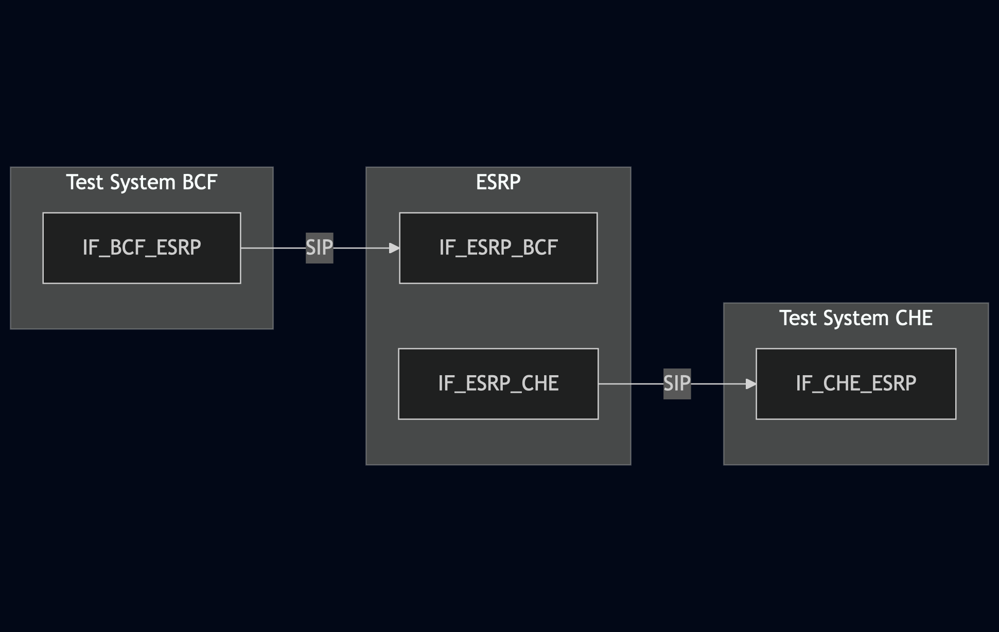
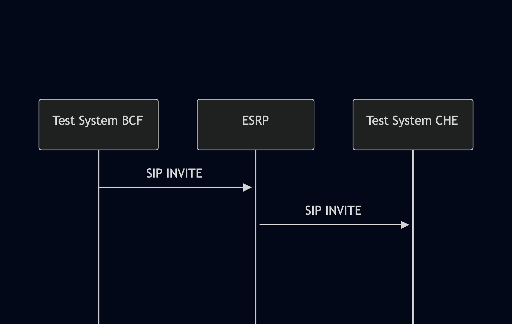

# Test Description: TD_ESRP_003
## Overview
### Summary
Default location handling

### Description
Test verifies for handling a default location:
- if original Geolocation header fields are preserved in SIP INVITE
- if original PIDF-LO body is preserved in SIP INVITE
- adding PIDF-LO default body and Geolocation header field when missing/garbled or unable to dereference
- if added Geolocation header field is the top-most entry in Geolocation field sequence


### SIP transport types
Test can be performed with 2 different SIP transport types. Steps describing actions for specific one are marked as following:
- (TLS transport) - used by default inside ESInet on production environment
- (TCP transport) - used in lab for testing purposes only if default TLS is not possible

### References
* Requirements : RQ_ESRP_024, RQ_ESRP_025, RQ_ESRP_026, RQ_ESRP_027
* Test Case    : TC_ESRP_003

### Requirements
IXIT config file for ESRP

## Configuration
### Implementation Under Test Interface Connections
<!-- Identify each of the FEs that are part of the configuration and how they are connected -->
* Test System O-BCF
  * IF_O-BCF_ESRP - connected to IF_ESRP_O-BCF
* ESRP
  * IF_ESRP_O-BCF - connected to Test System O-BCF IF_O-BCF_ESRP
  * IF_ESRP_T-BCF - connected to Test System CHE IF_CHE_ESRP
* Test System CHE
  * IF_CHE_ESRP - connected to IF_ESRP_CHE

### Test System Interfaces
<!-- Identify each of the test system interfaces and whether it will be in active or monitor mode -->
* Test System O-BCF
  * IF_O-BCF_ESRP - Active
* ESRP
  * IF_ESRP_O-BCF - Active
  * IF_ESRP_T-BCF - Active
* Test System CHE
  * IF_CHE_ESRP - Active
 
### Connectivity Diagram
<!--
[](https://mermaid.live/edit#pako:eNp1Ul1rgzAU_SvhPmsxZiaahz2sa1lhg1L3NISS1bSWVVNiZHPif1_U6drC8pR77vmCpIGdSiVw2J_U5y4T2qDnTVIge1bL7cN8uV3Em7Xroni1Rq57vxqAbjOxemD-tLhi2blfDKyyej9occ7QqywNiuvSyBxNHjdpAyiL9Eb7t7sMvnUZ2_znctlgov1qr0tbLThw0McUuNGVdCCXOhfdCE1HScBkMpcJcHtNhf5IIClaqzmL4k2pfJRpVR0y4HtxKu1UnVNh5ONR2D75hGqbJvVcVYUB7mPSmwBv4As4JmyGg4iFOApC4t0FDtTAaTCjOAgpowwTzELaOvDdp3oz5nke8XzKfBJSTCMHRGVUXBe7sZNMj0bpl-Hx-z_Q_gCsD5jP)
-->




## Pre-Test Conditions
### Test System BCF
* Interfaces are connected to network
* Interfaces have IP addresses assigned by DHCP
* Device is active
* No active calls
* (TLS transport) Test System has it's own certificate signed by PCA


### Test System CHE
* Interfaces are connected to network
* Interfaces have IP addresses assigned by DHCP
* Device is active
* No active calls
* (TLS transport) Test System has it's own certificate signed by PCA

### ESRP
* Interfaces are connected to network
* Interfaces have IP addresses assigned by DHCP
* Default configuration is loaded
* Device is initialized with steps from IXIT config file
* Device configured to use Test System CHE as a next hop host
* Queue length and number of permitted dequeuers must be higher than 1
* Device is provisioned with policy allowing to subscribe for Queue and Service states from Test System
* Device is active
* Device is in normal operating state
* No active calls

## Test Sequence

### Test Preamble

#### Test System BCF
* Install SIPp by following steps from documentation[^1]
* Copy following XML scenario files to local storage:
  ```
  SIP_INVITE_from_OSP.xml
  SIP_INVITE_location_garbled_PIDF-LO_body.xml
  SIP_INVITE_incorrect_geolocation_for_dereference.xml
  ```
* Install Wireshark[^2]
* (TLS transport) Copy to local storage PCA-signed TLS certificate and private key files:
  ```
  PCA-cacert.pem
  PCA-cakey.pem
  ```
* (TLS transport) Copy to local storage TLS certificate and private key files used by ESRP:
  ```
  ESRP-cacert.pem
  ESRP-cakey.pem
  ```
* (TLS transport) Configure Wireshark to decode SIP over TLS packets from Test System and ESRP as well[^3]
* Using Wireshark on 'Test System' start packet tracing on IF_BCF_ESRP interface - run following filter:
   * (TLS transport)
     > ip.addr == IF_BCF_ESRP_IP_ADDRESS and tls
   * (TCP transport)
     > ip.addr == IF_BCF_ESRP_IP_ADDRESS and sip


#### Test System CHE
* Install SIPp by following steps from documentation[^1]
* Copy following XML scenario files to local storage:
  ```
  SIP_INVITE_RECEIVE.xml
  ```
* Install Wireshark[^2]
* (TLS transport) Copy to local storage PCA-signed TLS certificate and private key files:
  ```
  PCA-cacert.pem
  PCA-cakey.pem
  ```
* (TLS transport) Copy to local storage TLS certificate and private key files used by ESRP:
  ```
  ESRP-cacert.pem
  ESRP-cakey.pem
  ```
* (TLS transport) Configure Wireshark to decode SIP over TLS packets from Test System and ESRP as well[^3]
* Using Wireshark on 'Test System' start packet tracing on IF_CHE_ESRP interface - run following filter:
   * (TLS transport)
     > ip.addr == IF_CHE_ESRP_IP_ADDRESS and tls
   * (TCP transport)
     > ip.addr == IF_CHE_ESRP_IP_ADDRESS and sip

### Test Body

#### Variations
1. SIP_INVITE_EMERGENCY_SINGLE.xml (SIP INVITE without "Geolocation" header fields and PIDF-LO body)
2. SIP_INVITE_location_garbled_PIDF-LO_body.xml
3. SIP_INVITE_incorrect_geolocation_for_dereference.xml - with `Geolocation` configured to any incorrect address, for example: `<https://192.168.0.1/incorrect>`

#### Stimulus
Send SIP packet to ESRP using scenario file for tested variation - run following SIPp command on Test System BCF, example:
* (TCP transport)
 ```
 sudo sipp -t t1 -sf SIP_INVITE_EMERGENCY_SINGLE.xml -i IF_BCF_ESRP_IP_ADDRESS:5060 IF_ESRP_BCF_IP_ADDRESS:5060 -max_recv_loops 1 -m 1
 ```
* (TLS transport)
 ```
 sudo sipp -t l1 -tls_cert PCA-cacert.pem -tls_key PCA-cakey.pem -sf SIP_INVITE_EMERGENCY_SINGLE.xml -i IF_BCF_ESRP_IP_ADDRESS:5060 IF_ESRP_BCF_IP_ADDRESS:5060 -max_recv_loops 1 -m 1
 ```

#### Response
Variation 1
* verify if ESRP sends SIP INVITE to Test System CHE
* verify if SIP INVITE has added Geolocation header field pointing to PIDF-LO xml body, for example:
```
Geolocation: <cid:default@test.com>
```
* verify if SIP INVITE has added PIDF-LO xml body with default location properly placed in message, for example:
```
Content-Type: application/pidf+xml
Content-ID: <default@test.com>

PIDF-LO xml body
```

Variation 2
* verify if ESRP sends SIP INVITE to Test System CHE
* verify if SIP INVITE has added Geolocation header field pointing to PIDF-LO xml body, for example:
```
Geolocation: <cid:default@test.com>
```
* verify if added Geolocation header field is the top-most entry in Geolocation field sequence
* verify if original Geolocation header field was not removed
* verify if SIP INVITE has added PIDF-LO xml body with default location properly placed in message, for example:
```
Content-Type: application/pidf+xml
Content-ID: <default@test.com>

PIDF-LO xml body
```
* verify if original PIDF-LO body was not removed

Variation 3
* verify if ESRP sends SIP INVITE to Test System CHE
* verify if SIP INVITE has added Geolocation header field pointing to PIDF-LO xml body, for example:
```
Geolocation: <cid:default@test.com>
```
* verify if added Geolocation header field is the top-most entry in Geolocation field sequence
* verify if original Geolocation header field was not removed
* verify if SIP INVITE has added PIDF-LO xml body with default location properly placed in message, for example:
```
Content-Type: application/pidf+xml
Content-ID: <default@test.com>

PIDF-LO xml body
```

VERDICT:
* PASSED - if all checks passed for variation
* FAILED - all other cases
<!--
* INCONCLUSIVE - 
* ERROR - 
-->

### Test Postamble
#### Test System BCF
* stop Sipp process (if still running)
* archive all logs generated
* stop Wireshark (if still running)
* remove all scenario files
* disconnect interfaces from ESRP
* (TLS transport) remove certificates

#### Test System ECRF-LVF
* stop simple_http_server.py
* archive all logs generated
* stop Wireshark (if still running)
* remove all scenario files
* disconnect interfaces from ESRP
* (TLS transport) remove certificates

#### Test System CHE
* stop Sipp process (if still running)
* archive all logs generated
* stop Wireshark (if still running)
* remove all scenario files
* disconnect interfaces from ESRP
* (TLS transport) remove certificates

#### ESRP
* disconnect interfaces from Test Systems
* reconnect interfaces back to default
* restore previous configuration

## Post-Test Conditions
### Test System BCF/ECRF-LVF/CHE
* Test tools stopped
* interfaces disconnected from ESRP

### ESRP
* device connected back to default
* device in normal operating state

## Sequence Diagram
<!--
[](https://mermaid.live/edit#pako:eNpNkFFPgzAUhf9Kc18FQoe00IclOmfcg2aRxQfTlwbuGNG2s5REJPx3B8t0fbrt_c7pvWeA0lYIAsIwlKa0Zt_UQhpCdOOcdXelt64VZK8-W5Rmhlr86tCU-NCo2ik9weezw9aTom89anK_egyXy5t18boVpNhsyeblbbNb_8NTZyKuRaun9TUMAdSuqUB412EAGp1W0xWGyUaCP6BGCeJUVsp9SJBmPGmOyrxbqy8yZ7v6AGLeIIDuWCl_Gf3v1aGp0K1sZzyI23T2ADHANwia8IimOc9onmZJPDV7ECyNGE0zxhmnCeUZGwP4mT-NIx7HcRIvGF8kGaMsD0B13ha9KS8jYdWcYn0-Bz_nP_4Chrt3KQ)
-->



## Comments

Version:  010.3d.3.0.9

Date:     20250827

## Footnotes
[^1]: SIPp - tool for SIP packet simulations. Official documentation: https://sipp.sourceforge.net/doc/reference.html#Getting+SIPp
[^2]: Wireshark - tool for packet tracing and anaylisis. Official website: https://www.wireshark.org/download.html
[^3]: Wireshark configuration to decrypt SIP over TLS packets: https://www.zoiper.com/en/support/home/article/162/How%20to%20decode%20SIP%20over%20TLS%20with%20Wireshark%20and%20Decrypting%20SDES%20Protected%20SRTP%20Stream
