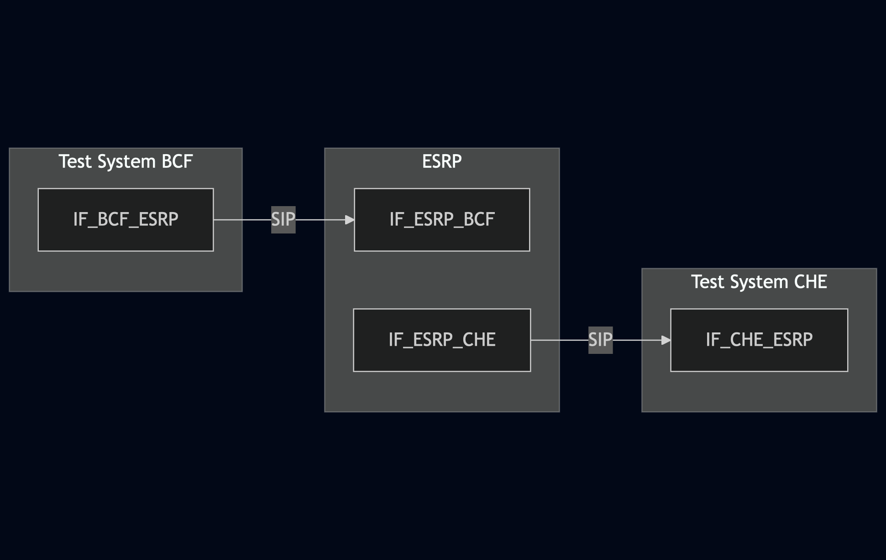

# Test Description: TD_ESRP_004
## Overview
### Summary
Processing of SIP OPTIONS and SIP CANCEL

### Description
Test verifies processing of SIP OPTIONS, and SIP CANCEL as per RFC 3261


### SIP transport types
Test can be performed with 2 different SIP transport types. Steps describing actions for specific one are marked as following:
- (TLS transport) - used by default inside ESInet on production environment
- (TCP transport) - used in lab for testing purposes only if default TLS is not possible

### References
* Requirements : RQ_ESRP_033, RQ_ESRP_034
* Test Case    : TC_ESRP_004

### Requirements
IXIT config file for ESRP

## Configuration
### Implementation Under Test Interface Connections
<!-- Identify each of the FEs that are part of the configuration and how they are connected -->
* Test System BCF (as upstream ESRP)
  * IF_BCF_ESRP - connected to IF_ESRP_BCF
* ESRP
  * IF_ESRP_BCF - connected to Test System BCF IF_BCF_ESRP
  * IF_ESRP_CHE - connected to Test System CHE IF_CHE_ESRP
* Test System CHE
  * IF_CHE_ESRP - connected to IF_ESRP_CHE


### Test System Interfaces
<!-- Identify each of the test system interfaces and whether it will be in active or monitor mode -->
* Test System BCF
  * IF_BCF_ESRP - Active
* ESRP
  * IF_ESRP_BCF - Active
  * IF_ESRP_CHE - Monitor
* Test System CHE
  * IF_CHE_ESRP - Monitor
 
 
### Connectivity Diagram
<!--
[](https://mermaid.live/edit#pako:eNp1UltrgzAU_ivhPKsYnYnNwx7mWiZsUOqehlCymqqsGomRrSv-96Vae4PlKec73w2SA2xkJoDBdie_NwVXGr2u0hqZEy_WT9FiPU9WS9tGSbxEtv0Yj8Bxc2YNQPQyv2GZeViMrLb7zBVvCvQuWo2SfatFhc4ed2kjKOrsTnvZXQffu0xt_nO5bnCmnbS3pY0WLMhVmQHTqhMWVEJV_DjC4UhJQReiEikwc824-kohrXujaXj9IWU1yZTs8gLYlu9aM3VNxrV4Lrnpc6GYMKEi2dUamEcGC2AH-AGGfergYEZDPAtC330ILNgDI4FDcBASSij2MQ1Jb8HvkOk61HVd3_UI9fyQYDKzgHdaJvt6M8WJrNRSvY1PP_yA_g-C6ZhW)
-->




## Pre-Test Conditions
### Test System BCF
* Interfaces are connected to network
* Interfaces have IP addresses assigned by DHCP
* Device is active
* No active calls
* (TLS transport) Test System has it's own certificate signed by PCA

### ESRP
* Interfaces are connected to network
* Interfaces have IP addresses assigned by DHCP
* Device is active
* Device is in normal operating state
* No active calls
* Logging enabled

### Test System CHE
* Interfaces are connected to network
* Interfaces have IP addresses assigned by DHCP
* Device is active
* No active calls
* (TLS transport) Test System has it's own certificate signed by PCA

## Test Sequence

### Test Preamble

#### Test System BCF
* Install SIPp by following steps from documentation[^1]
* Copy following XML scenario files to local storage:
  ```
  SIP_OPTIONS.xml
  SIP_INVITE_with_CANCEL.xml
  ```
* Install Wireshark[^2]
* (TLS transport) Copy to local storage PCA-signed TLS certificate and private key files:
  ```
  PCA-cacert.pem
  PCA-cakey.pem
  ```
* (TLS transport) Copy to local storage TLS certificate and private key files used by ESRP:
  ```
  ESRP-cacert.pem
  ESRP-cakey.pem
  ```
* (TLS transport) Configure Wireshark to decode SIP over TLS packets from Test System and ESRP as well[^3]
* Using Wireshark on 'Test System' start packet tracing on IF_U-ESRP_ESRP interface - run following filter:
   * (TLS transport)
     > ip.addr == IF_BCF_ESRP_IP_ADDRESS and tls
   * (TCP transport)
     > ip.addr == IF_BCF_ESRP_IP_ADDRESS and sip

#### Test System CHE
* Install SIPp by following steps from documentation[^1]
* Copy following XML scenario files to local storage:
  ```
  SIP_RECEIVE.xml
  ```
* Install Wireshark[^2]
* (TLS transport) Copy to local storage PCA-signed TLS certificate and private key files:
  ```
  PCA-cacert.pem
  PCA-cakey.pem
  ```
* (TLS transport) Copy to local storage TLS certificate and private key files used by ESRP:
  ```
  ESRP-cacert.pem
  ESRP-cakey.pem
  ```
* (TLS transport) Configure Wireshark to decode SIP over TLS packets from Test System and ESRP as well[^3]
* Using Wireshark on 'Test System' start packet tracing on IF_U-ESRP_ESRP interface - run following filter:
   * (TLS transport)
     > ip.addr == IF_CHE_ESRP_IP_ADDRESS and tls
   * (TCP transport)
     > ip.addr == IF_CHE_ESRP_IP_ADDRESS and sip

### Test Body

#### Variations
1. SIP_OPTIONS.xml
2. SIP_INVITE_with_CANCEL.xml

#### Stimulus
Send SIP packet to ESRP using scenario file for tested variation - run following SIPp command on Test System U-ESRP, example:
* (TCP transport
  ```
  sudo sipp -t t1 -sf SIP_OPTIONS.xml IF_BCF_ESRP_IP_ADDRESS:5060
  ```
* (TLS transport)
  ```
  sudo sipp -t l1 -sf SIP_OPTIONS.xml IF_BCF_ESRP_IP_ADDRESS:5060
  ```

#### Response
Variation 1
* verify if ESRP responds with SIP 200 OK including it's capabilities (allowed methods, accepted content types etc.)

Variation 2
* verify if ESRP responds with 200 OK to Test System BCF
* verify if ESRP stops processing SIP INVITE which must not be sent further to Test System CHE

VERDICT:
* PASSED - if all checks passed for variation
* FAILED - all other cases
<!--
* INCONCLUSIVE - 
* ERROR - 
-->

### Test Postamble
#### Test System BCF
* stop Sipp process (if still running)
* archive all logs generated
* stop Wireshark (if still running)
* remove all scenario files
* disconnect interfaces from ESRP
* (TLS transport) remove certificates


#### ESRP
* disconnect interfaces from Test Systems
* reconnect interfaces back to default
* restore previous configuration

#### Test System CHE
* stop Sipp process (if still running)
* archive all logs generated
* stop Wireshark (if still running)
* remove all scenario files
* disconnect interfaces from ESRP
* (TLS transport) remove certificates

## Post-Test Conditions
### Test System BCF
* Test tools stopped
* interfaces disconnected from ESRP

### ESRP
* device connected back to default
* device in normal operating state

### Test System CHE
* Test tools stopped
* interfaces disconnected from ESRP

## Sequence Diagram
Variation 1
<!--
[](https://mermaid.live/edit#pako:eNpdkV1LwzAUhv9KOLe2I1lt0uVioFNhiG7YXUluQnvWFU0y0xScpf_dtmMTzFVyzvO-5yMdFK5EkBDHsbKFs_u6ksoSYmrvnb8rgvONJHv92aCyE9TgV4u2wIdaV16bET6fHTaB5KcmoCH3q6d4ubx5zN-2kuTrLdlsd-vNa_5Hj6kR-ac603NKyeYZIqh8XYIMvsUIDHqjxyd0o42CcECDCuRwLbX_UKBsP2iO2r47Zy4y79rqAHIaIYL2WOpw6f0a9WhL9CvX2gCSp5MHyA6-QbJEzFi6EBlbpFlCb4fkaWRmnKUZF1ywhImM9xH8TEXpTFBKEzrnYp5knPFFBLoNLj_Z4tISlvWw15fz5qcP6H8BkfF3AA)
-->


Variation 2
<!--
[](https://mermaid.live/edit#pako:eNqNkd9LwzAQx_-VcK-2I21Ym-VhMOuEoc5hhw-Sl9DeuqJJZpqCc-x_tz_YBJ-83MMl-XwvOb4nKGyJICAMQ2kKa3Z1JaQhRNfOWbcovHWNIDv10aA0A9TgZ4umwLtaVU7pHh5ji40n-bHxqMltdh_O5zfL_GUjSL7akNX6dbVd_hPOFuts-fgL9zc98Uc0wjGl5PkBAqhcXYLwrsUANDqt-i2c-jYS_B41ShBdWSr3LkGac6c5KPNmrb7InG2rPYhh3ADaQ6n8Zc7rqUNTostsazyIGRt6gDjBF4iI8Uk0naWcpd2KeQBHEAmfJNGUp4xSzniX5wC-hzfpJKWUMhonacx4EiWzAFTrbX40xeVHWNadBU-jSYNX5x8jM4KG)
-->


## Comments

Version:  010.3d.3.0.5

Date:     20250827

## Footnotes
[^1]: SIPp - tool for SIP packet simulations. Official documentation: https://sipp.sourceforge.net/doc/reference.html#Getting+SIPp
[^2]: Wireshark - tool for packet tracing and anaylisis. Official website: https://www.wireshark.org/download.html
[^3]: Wireshark configuration to decrypt SIP over TLS packets: https://www.zoiper.com/en/support/home/article/162/How%20to%20decode%20SIP%20over%20TLS%20with%20Wireshark%20and%20Decrypting%20SDES%20Protected%20SRTP%20Stream
