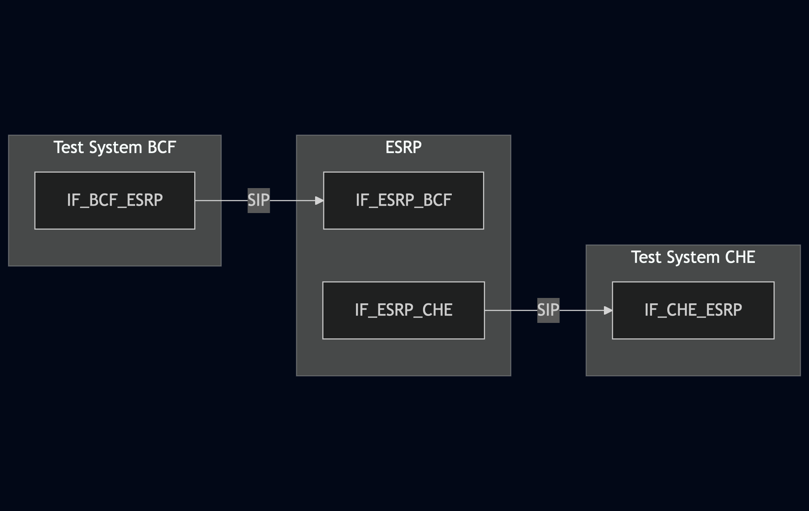
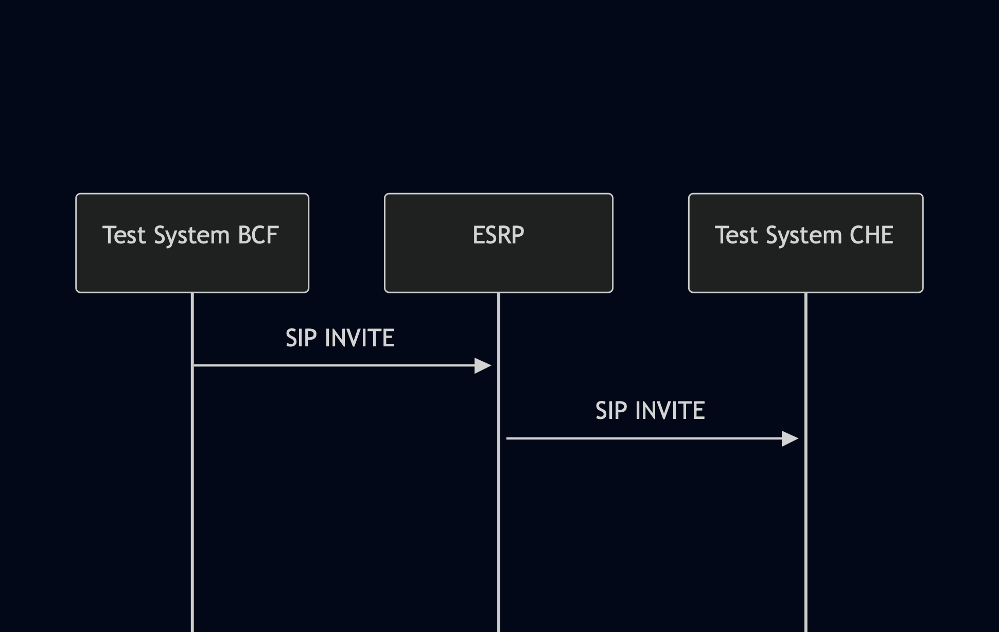

# Test Description: TD_ESRP_005
## Overview
### Summary
Supported transport types

### Description
Test verifies for upstream and downstream interfaces:
- support of TCP/TLS, TCP, UDP
- fallback to UDP

### References
* Requirements : RQ_ESRP_039, RQ_ESRP_040, RQ_ESRP_047
* Test Case    : 

### Requirements
IXIT config file for ESRP

## Configuration
### Implementation Under Test Interface Connections
<!-- Identify each of the FEs that are part of the configuration and how they are connected -->
* Test System BCF (Upstream ESRP)
  * IF_BCF_ESRP - connected to IF_ESRP_BCF
* ESRP
  * IF_ESRP_BCF - connected to Test System BCF IF_BCF_ESRP
  * IF_ESRP_CHE - connected to Test System CHE IF_CHE_ESRP
* Test System CHE (Downstream ESRP)
  * IF_CHE_ESRP - connected to IF_ESRP_CHE

### Test System Interfaces
<!-- Identify each of the test system interfaces and whether it will be in active or monitor mode -->
* Test System BCF (Upstream ESRP)
  * IF_BCF_ESRP - Active
* ESRP
  * IF_ESRP_BCF - Active
  * IF_ESRP_CHE - Monitor
* Test System CHE (Downstream ESRP)
  * IF_CHE_ESRP - Monitor
 
### Connectivity Diagram
<!--
[](https://mermaid.live/edit#pako:eNp9kdEKgjAUhl9lnGt9AS-6WkFQEJk3MZCTO6XUNpkbIdG7NzVSLDoXY_v4z7ex84DCSIIEzjdzL0q0jm32QrNQ61Wexct0v8u7JQ61CKgHA__EesbjaYyPnUOs8aeLxbpkI5p2T43f1oGTljPXgRrH0rZxpNgPQzZ_xH8D_zbwHwaIQJFVWMnwbY8OC3AlKRKQhK1EexUg9DPk0DuTtrqAxFlPEfhaoiNeYbhcQXLGWxNojfpozHgmWTljt8Nc-vFEYI2_lO_E8wW03IPn)
-->




## Pre-Test Conditions
### Test System BCF
* Interfaces are connected to network
* Interfaces have IP addresses assigned by DHCP
* Device is active
* No active calls
* Test System has it's own certificate signed by PCA

### ESRP
* Interfaces are connected to network
* Interfaces have IP addresses assigned by DHCP
* Device is provisioned with `Test System BCF` as upstream ESRP
* Device is provisioned with `Test System CHE` as downstream ESRP
* Device is initialized with steps from IXIT config file
* Device is active
* Device is in normal operating state
* No active calls
* Logging enabled

### Test System CHE
* Interfaces are connected to network
* Interfaces have IP addresses assigned by DHCP
* Device is active
* No active calls
* Test System has it's own certificate signed by PCA


## Test Sequence

### Test Preamble

#### Test System BCF
* Install SIPp by following steps from documentation[^1]
* Copy following XML scenario files to local storage:
  ```
  SIP_INVITE_from_OSP.xml
  ```
* Install Wireshark[^2]
* Copy to local storage PCA-signed TLS certificate and private key files:
  ```
  PCA-cacert.pem
  PCA-cakey.pem
  ```
* Copy to local storage TLS certificate and private key files used by ESRP:
  ```
  ESRP-cacert.pem
  ESRP-cakey.pem
  ```
* Configure Wireshark to decode SIP over TLS packets from Test System and ESRP as well[^3]
* Using Wireshark on 'Test System' start packet tracing on IF_BCF_ESRP interface - run following filter:
  > ip.addr == IF_BCF_ESRP_IP_ADDRESS and (tls or sip)

#### Test System CHE
* Install SIPp by following steps from documentation[^1]
* Copy following XML scenario files to local storage:
  ```
  SIP_INVITE_RECEIVE.xml
  ```
* Install Wireshark[^2]
* (TLS transport) Copy to local storage PCA-signed TLS certificate and private key files:
  ```
  PCA-cacert.pem
  PCA-cakey.pem
  ```
* (TLS transport) Copy to local storage TLS certificate and private key files used by ESRP:
  ```
  ESRP-cacert.pem
  ESRP-cakey.pem
  ```
* Configure Wireshark to decode SIP over TLS packets from Test System and ESRP as well[^3]
* Using Wireshark on 'Test System' start packet tracing on IF_BCF_ESRP interface - run following filter:
  > ip.addr == IF_CHE_ESRP_IP_ADDRESS and (tls or sip)


### Test Body

#### Variations
1. Upstream and downstream interface TCP/TLS, commands used:
- BCF `sudo sipp -t l1 -sf SIP_INVITE_from_OSP.xml -i IF_BCF_ESRP_IP_ADDRESS:5061 IF_ESRP_BCF_IP_ADDRESS:5061`
- CHE `sudo sipp -t l1 -sf SIP_INVITE_RECEIVE.xml -i IF_CHE_ESRP_IP_ADDRESS:5061`
2. Upstream and downstream interface TCP, commands used:
- BCF `sudo sipp -t t1 -sf SIP_INVITE_from_OSP.xml -i IF_BCF_ESRP_IP_ADDRESS:5060 IF_ESRP_BCF_IP_ADDRESS:5060`
- CHE `sudo sipp -t t1 -sf SIP_INVITE_RECEIVE.xml -i IF_CHE_ESRP_IP_ADDRESS:5060`
3. Upstream and downstream interface UDP, commands used:
- BCF `sudo sipp -t u1 -sf SIP_INVITE_from_OSP.xml -i IF_BCF_ESRP_IP_ADDRESS:5060 IF_ESRP_BCF_IP_ADDRESS:5060`
- CHE `sudo sipp -t u1 -sf SIP_INVITE_RECEIVE.xml -i IF_CHE_ESRP_IP_ADDRESS:5060`
4. Upstream interface TCP/TLS fallback to UDP (use incorrect certificate files cacert.pem and cakey.pem on BCF):
- BCF `sudo sipp -t l1 -sf SIP_INVITE_from_OSP.xml -i IF_BCF_ESRP_IP_ADDRESS:5061 IF_ESRP_BCF_IP_ADDRESS:5061`
- CHE `sudo sipp -t u1 -sf SIP_INVITE_RECEIVE.xml -i IF_CHE_ESRP_IP_ADDRESS:5061`
5. Downstream interface TCP/TLS fallback to UDP (accept only UDP transport on CHE):
- BCF `sudo sipp -t l1 -sf SIP_INVITE_from_OSP.xml -i IF_BCF_ESRP_IP_ADDRESS:5061 IF_ESRP_BCF_IP_ADDRESS:5061`
- CHE `sudo sipp -t u1 -sf SIP_INVITE_RECEIVE.xml -i IF_CHE_ESRP_IP_ADDRESS:5061`

#### Stimulus
Run receiving SIPp scenario on CHE and sending one on BCF. Use commands set for tested variation

#### Response
Variations 1-3
* verify if SIP INVITE messages have been sent properly
* verify if messages have been sent using requested transport

Variation 4
* verify if SIP INVITE messages have been sent properly
* verify if SIP INVITE from BCF to ESRP has been sent using UDP transport after failure of TCP/TLS handshake

Variation 5
* verify if SIP INVITE messages have been sent properly
* verify if SIP INVITE from ESRP to CHE has been sent using UDP transport after failure of TCP/TLS

VERDICT:
* PASSED - if all checks passed for variation
* FAILED - all other cases
<!--
* INCONCLUSIVE - 
* ERROR - 
-->

### Test Postamble
#### Test System BCF
* stop Sipp process (if still running)
* archive all logs generated
* stop Wireshark (if still running)
* remove all scenario files
* disconnect interfaces from ESRP
* (TLS transport) remove certificates


#### ESRP
* disconnect interfaces from Test Systems
* reconnect interfaces back to default
* restore previous configuration

#### Test System CHE
* stop Sipp process (if still running)
* archive all logs generated
* stop Wireshark (if still running)
* remove all scenario files
* disconnect interfaces from ESRP
* (TLS transport) remove certificates

## Post-Test Conditions
### Test System BCF
* Test tools stopped
* interfaces disconnected from ESRP

### ESRP
* device connected back to default
* device in normal operating state

### Test System CHE
* Test tools stopped
* interfaces disconnected from ESRP

## Sequence Diagram
<!--
[](https://mermaid.live/edit#pako:eNpdkM0KwjAQhF8l7NXmBXIQBHvoQRGrHiSXkKw1aJK6SQ5FfHf7Y1Hcy-7CNzAzT9DBIAjgnEuvg7_YRkjPmLNEgVY6BYqCXdQ9ovQjFPGR0WtcW9WQcgM8zQFjYnUXEzp25GW93_HlcjFswepqx6rtqTqUX34mfnVr_s9DAQ7JKWt6l89BLSFd0aEE0Z9G0U2C9K-eUzmFuvMaRKKMBeTWqDT7BDGGKKBV_hzC90dj-5CbqYaxjQIo5Ob6IV5vv-Rdlg)
-->




## Comments

Version:  010.3d.3.0.7

Date:     20250827

## Footnotes
[^1]: SIPp - tool for SIP packet simulations. Official documentation: https://sipp.sourceforge.net/doc/reference.html#Getting+SIPp
[^2]: Wireshark - tool for packet tracing and anaylisis. Official website: https://www.wireshark.org/download.html
[^3]: Wireshark configuration to decrypt SIP over TLS packets: https://www.zoiper.com/en/support/home/article/162/How%20to%20decode%20SIP%20over%20TLS%20with%20Wireshark%20and%20Decrypting%20SDES%20Protected%20SRTP%20Stream
